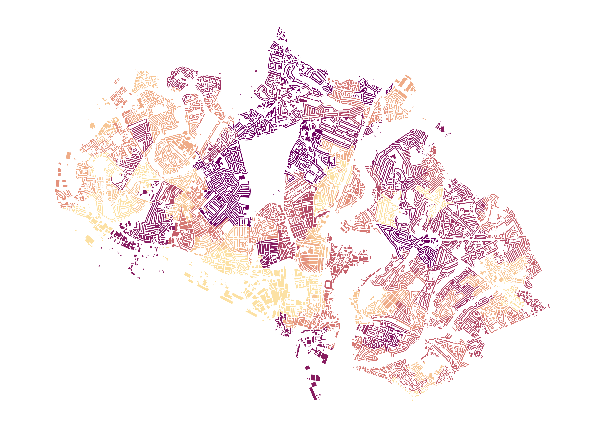
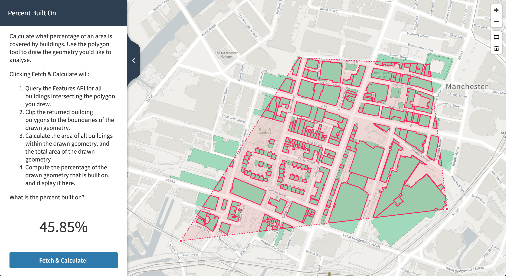
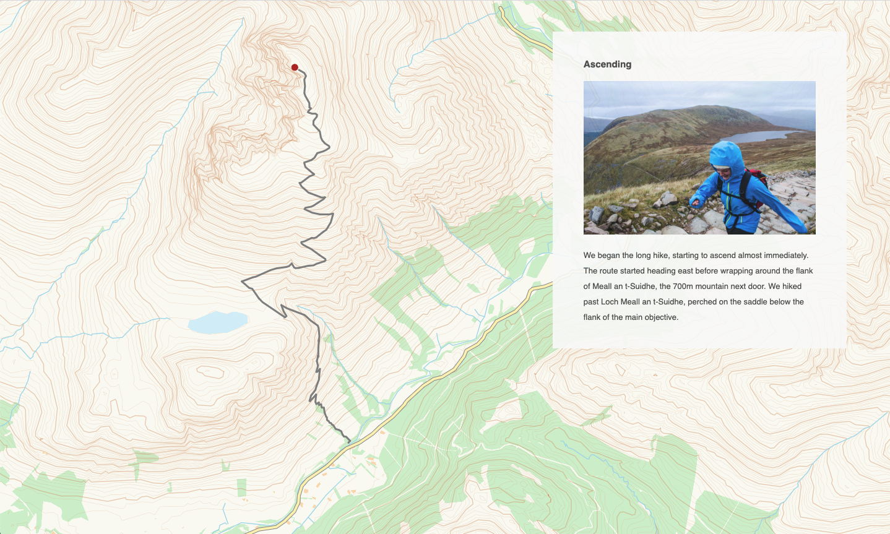

# OS Data Hub API Tutorials

## Data Science: Proptech

Visualising the spatial distribution of Lower Layer Super Output Area (LSOA) median price paid deciles for residential property sold between 1995 and 2019 for a local authority district (LAD) in England or Wales.

See [Proptech Tutorial IPython Notebook](./data-science/proptech/os-data-hub-api-tutorial-01-proptech.ipynb).

A Jupyter Notebook providing a data science pipeline in Python to leverage data insights through the integration of OS Data Hub APIs with other government data services from the Office for National Statistics and HM Land Registry.

  

## Web Development: Automated Open Data Download

Collecting Ordnance Survey data from the Downloads API with an automated download and extract process.

See [Automated Open Data Download](./web-development/automated-open-data-download/).

## Web Development: D3 Overlay

Using D3.js to add an overlay of geographic features to an interactive OS Vector Tile map, made with Mapbox GL.

See [D3 Overlay](./web-development/d3-overlay/).

## Web Development: Find My Nearest

How to create a web application that will let users find nearby parks, woodland areas or buildings represented in our OS Open Zoomstack layer.

See [Find My Nearest](./web-development/find-my-nearest/).

  

## Web Development: National Parks Locator

How to build an interactive locator, to help users find features on a map. At Ordnance Survey we love helping people explore the natural beauty of Great Britain, so this project will help users location national parks - but it could just as easily be built to locate stores, offices, railway stations, hospitals and so on.

See [National Parks Locator](./web-development/national-parks-locator/).

  

## Web Development: Percent Built On

We'll develop a web app that lets users draw a polygon, then calculates what percentage of the geometry is built on. This technique is useful for determining land cover of any number of layers - green space, buildings, road surface and so on.

See [Percent Built On](./web-development/percent-built-on/).

  

## Web Development: Scroll Story

Building a map-based scroll story - a powerful way to add location context to other content. With the OS Vector Tile API, OS Features API data, Scrollama and Mapbox GL JS.

See [Scroll Story](./web-development/scroll-story/).

  

