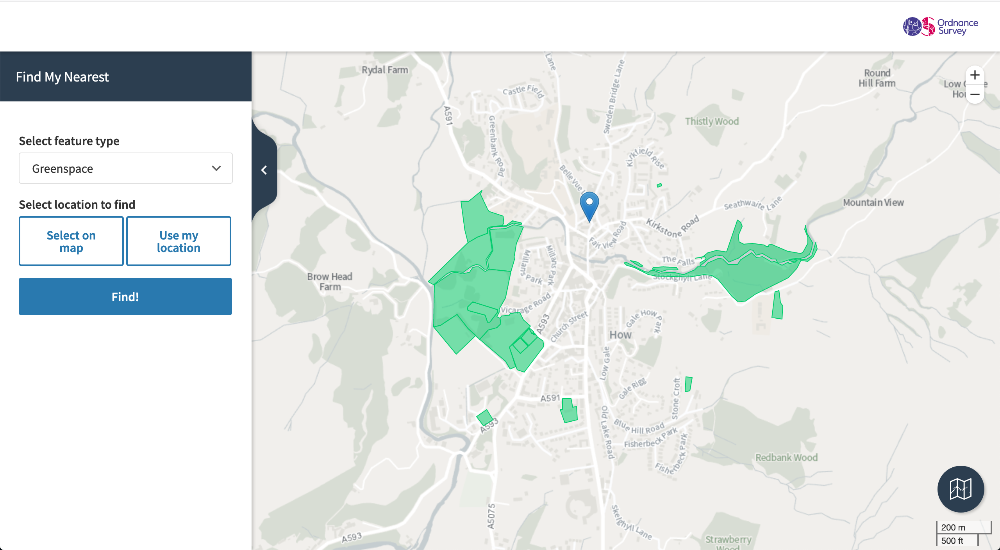

# OS Data Hub API Tutorials

## Tutorials

### Data Science` - Proptech

Visualising the spatial distribution of Lower Layer Super Output Area (LSOA) median price paid deciles for residential property sold between 1995 and 2019 for a local authority district (LAD) in England or Wales.

See [Price Paid Spatial Distribution IPython Notebook](./data-science/price-paid-spatial-distribution/code/price-paid-spatial-distribution.ipynb).

A Jupyter Notebook providing a data science pipeline in Python to leverage data insights through the integration of OS Data Hub APIs with other government data services from the Office for National Statistics and HM Land Registry.

  

### Web Development - Find My Nearest

Building a web application that will let users find nearby parks, woodland areas or buildings represented in our OS  Open Zoomstack layer using Leaflet, Turf.js, the OS Maps API, the OS Features API, and other tools. 

See the [codebase](./web-development/find-my-nearest/code). 

  

 

See [./LICENSE](./LICENSE).

Contains OS data © Crown copyright and database right 2020.

Contains National Statistics data © Crown copyright and database right 2020.

Contains HM Land Registry data © Crown copyright and database right 2020.

