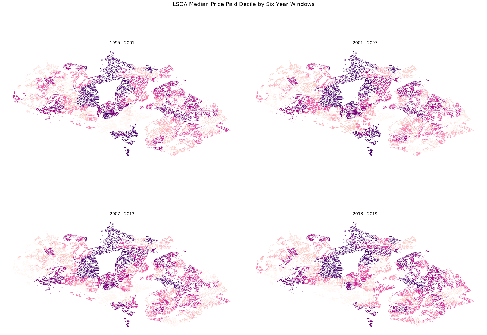

# OS Data Hub API Tutorial 01 - PropTech

*Visualising the spatial distribution of Lower Layer Super Output Area (LSOA) median price paid deciles for residential property sold between 1995 and 2019 for a local authority district (LAD) in England or Wales.*

---

## License

This notebook is licensed under the terms of the [MIT License](https://github.com/OrdnanceSurvey/os-data-hub-api-tutorials/blob/master/LICENSE). 

The datasets sourced via the APIs in this notebook, all of which are set out below, are licensed under the terms of the [Open Government Licence (OGL) v3.0](http://www.nationalarchives.gov.uk/doc/open-government-licence/version/3/). See [LICENSE](https://github.com/OrdnanceSurvey/os-data-hub-api-tutorials/blob/master/LICENSE).

Contains OS data © Crown copyright and database right 2020.

Contains National Statistics data © Crown copyright and database right 2020.

Contains HM Land Registry data © Crown copyright and database right 2020.


<br>
<br>

---

## Data Services

This tutorial sources data from data services (APIs) only. In addition to the APIs made available by Ordnance Survey (OS) through the OS Data Hub, data is sourced from APIs published by HM Land Registry (LR) and the Office for National Statistics (ONS).

**The cells in this notebook that use the OS Data Hub APIs require an API key. Please sign up to the [OS Data Hub](https://osdatahub.os.uk/) and acquire a project API key before attempting to run this notebook locally.**

---

### Which APIs are used in this notebook?

#### OS Features API

An Open Geospatial Consortium (OGC)-compliant web feature service (WFS) that allows users to query features within a number of OS's premium and open data products.

#### OS Maps API

A web map tile service (WMTS) that allows access to OS base mapping in a number of different styles and two projections, Web Mercator (EPSG: 3857) and British National Grid (EPSG:27700).

#### OS Downloads API

An API enabling users to bulk download OS open data products.

#### ONS Open Geography Portal WFS API

An OGC-compliant WFS that allows users to query features within a number of ONS's open data products.

The [ONS Open Geography Portal](http://geoportal.statistics.gov.uk/) provides access to ONS's open data products.

#### ONS Open Geography Portal ArcGIS REST API

An ESRI API specification that allows users to query features within ONS's open data products.

The [ONS Open Geography Portal](http://geoportal.statistics.gov.uk/) provides access to ONS's open data products.

Please refer to the [ESRI ArcGIS REST API documentation](https://developers.arcgis.com/rest/services-reference/query-feature-service-layer-.htm) for information regarding the ESRI specification.

#### HM LR Linked Data API 

An API enabling users to query HM LR Price Paid Data, Transaction Data and the UK House Price Index.

Please refer to the section **Via the API** within **How to query the dataset** at http://landregistry.data.gov.uk/app/root/doc/ppd for information regarding access to the Price Paid Data through the Linked Data API.

---

## Python Environment Setup

* The Python geospatial stack used in this tutorial requires the library [**GeoPandas**](http://geopandas.org/)
* If using the [conda](https://www.anaconda.com/) package manager to create and configure your Python envionment, the library **GeoPandas** and its dependencies can be installed via: `conda install -n <environment-name> -c conda-forge geopandas`
* The library **fiona** (Python wrapper around the OGR (vector) component of the [Geospatial Data Abstraction Library (GDAL)](https://gdal.org/) is a dependency of GeoPandas.
* The libraries **descartes** and **mapclassify** are not hard GeoPandas dependencies or required imports but are both required for the GeoPandas plot functionality used in this notebook.

---


## Notebook Steps

* Step 1 ~ Import Python Libraries
* Step 2 ~ Request LAD boundary from the ONS Open Geography Portal WFS
* Step 3 ~ Construct a URL path for the OS Maps API
* Step 4 ~ Plot LAD boundary returned by the ONS Open Geography Portal WFS on an OS Maps API backed slippy map
* Step 5 ~ Download the OS Open Data product Code-Point Open using the OS Downloads API
* Step 6 ~ Extract the Code-Point Open GPKG from the zipped download
* Step 7 ~ Obtain the data layer name from the Code-Point Open GPKG
* Step 8 ~ Load Code-Point Open layer from GPKG into a GeoDataFrame and reproject from British National Grid to WGS-84
* Step 9 ~ Obtain ESRI JSON geometry representation of LAD boundary to pass to ONS ESRI ArcGIS REST API
* Step 10 ~ Request LSOA Boundaries from the ONS Open Geography Portal ArcGIS REST API
* Step 11 ~ Plot LSOA boundaries returned by the ONS Open Geography Portal ESRI ArcGIS REST API on an OS Maps API backed slippy map
* Step 12 ~ Spatially join postcode and LSOA GeoDataFrames
* Step 13 ~ Transform the postcode strings such that each string has a single space between the outward and inward codes
* Step 14 ~ Request the historical HM LR Price Paid Data for the LAD boundary using the transformed postcode strings associated with the postcode geometries returned from the containment query
* Step 15 ~ Join Price Paid and postcode-LSOA DataFrames and compute median price paid by LSOA by 6 year time windows
* Step 16 ~ Request OS Open ZoomStack district building geometires from the OS Features API for the LAD boundary BBOX
* Step 17 ~ Spatially join and compute the intersection between building polygon geometries and LSOA polygon geometries and, dissolve the resultant buidling features by LSOA code to form an aggregate building geometry per LSOA
* Step 18 ~ Join buidling-LSOA and LSOA-median price paid by 6 year time window DataFrames together on LSOA code
* Step 19 ~ Visualise the spatial distribution in LSOA median price paid decile by 6 year time window
* Step 20 ~ Visualise the change in LSOA median price paid decile between 1995 - 2001 and 2013 - 2019 for LSOAs where the decile position has increased or decreased by two or more places

---

## Step 1 ~ Import Python Libraries

---


```python
import fiona
import folium
import geopandas as gpd
import matplotlib.pyplot as plt
import numpy as np
import pandas as pd
import requests
from datetime import datetime
from mpl_toolkits.axes_grid1 import make_axes_locatable
from zipfile import ZipFile

print('=> Imported libraries')
```

    => Imported libraries


## Step 2 ~ Request LAD boundary from the ONS Open Geography Portal WFS

---

The example below returns the polygon geometry for a LAD boundary from the ONS Open Geography Portal - Administrative Boundaries - Local Authority Districts open data product. The request is made against the ONS WFS using the OGC WFS filter encoding specification. The Government Statistcal Service (GSS) code for the Southampton boundary **E06000045** is used below. This pipeline can be run for any LAD in England or Wales by changing the GSS code referenced in the filter object.

The request parameters below look to return the feature representing the boundary in **GeoJSON** format using the **WGS-84 (EPSG: 4326)** coordinate reference system.

The ONS Open Geography Portal base path is **https://ons-inspire.esriuk.com**

A [**GetCapabilities**](https://ons-inspire.esriuk.com/arcgis/services/Administrative_Boundaries/Local_Authority_Districts_December_2019_Boundaries_UK_BFE/MapServer/WFSServer?service=wfs&request=GetCapabilities&version=2.0.0) request to the WFS API will return the response codes, content, and parameters of the WFS.

More information regarding the ONS Local Authority Districts product can be found at https://geoportal.statistics.gov.uk/datasets/local-authority-districts-december-2019-boundaries-uk-bfe


```python
# ONS Open Geography Portal WFS base path: https://ons-inspire.esriuk.com
# ONS WFS endpoint path: /arcgis/services/Administrative_Boundaries
#                        /Local_Authority_Districts_December_2019_Boundaries_UK_BFE
#                        /MapServer/WFSServer?
wfs_endpoint = ('https://ons-inspire.esriuk.com/arcgis/services/Administrative_Boundaries'
                '/Local_Authority_Districts_December_2019_Boundaries_UK_BFE/MapServer/WFSServer?')

# Define WFS parameters 
service = 'wfs'
request = 'GetFeature'
version = '2.0.0'
typeNames = ('Administrative_Boundaries_Wards_December_2019_Boundaries_UK_BFC:'
             'Local_Authority_Districts__December_2019__Full_Extent_Boundaries_UK')
outputFormat = 'GEOJSON'
srsName = 'EPSG:4326'
# Define attribute-based filter using OGC WFS filter encoding specification
# Filter specifies the Government Statistical Service (GSS) Code for the Southampton local authority district area
filter = ('<ogc:Filter>'
              '<ogc:PropertyIsEqualTo>'
                  '<ogc:PropertyName>lad19cd</ogc:PropertyName>'
                  '<ogc:Literal>E06000045</ogc:Literal>'
              '</ogc:PropertyIsEqualTo>'
          '</ogc:Filter>')

# Represent WFS parameters in a dictionary and collapse OGC filter into a single line
params_wfs = {'service':service, 
              'request':request,
              'version':version,
              'typeNames':typeNames,
              'outputFormat':outputFormat,
              'srsName':srsName,
              'filter':filter}

# Make HTTP GET request and raise exception if request was unsuccessful
try:
    r = requests.get(wfs_endpoint, params=params_wfs)
    r.raise_for_status()
except requests.exceptions.RequestException as e:  
    print(e)
    
# Decode JSON payload returned by request    
payload = r.json()

payload
# Define coordinate reference system (CRS) codes
# WGS 84
WGS84 = {'init':'epsg:4326'}
# British National Grid
BNG = {'init':'epsg:27700'}

# Transform GeoJSON features into a GeoPandas GeoDataFrame
gdf_boundary = gpd.GeoDataFrame.from_features(payload['features'], crs=WGS84)

# Obtain polygon centroid point geometry
boundary_centroid = gdf_boundary['geometry'].centroid

# Obtain x and y coordinates of centroid point geometry
x = boundary_centroid.x
y = boundary_centroid.y

# Obtain bounds of polygon geometry
bounds = gdf_boundary['geometry'][0].bounds

# Define a OGC WFS filter compliant bounding box for the polygon geometry
# bottom-left x, bottom-left y, top-right x, top-right y
bbox = str(bounds[0]) + ',' + str(bounds[1]) + ',' + str(bounds[2]) + ',' + str(bounds[3])

# Plot boundary geometry
ax = gdf_boundary.plot(color='#ff1f5b')
# Turn plot axis off
ax.axis('off')

print('=> Transformed ONS WFS GeoJSON payload into a GeoDataFrame')
```

    => Transformed ONS WFS GeoJSON payload into a GeoDataFrame


## Step 3 ~ Construct a URL path for the OS Maps API

---

The OS Data Hub API base path is **https://osdatahubapi.os.uk**

The [technical specification](https://osdatahub.os.uk/docs/wmts/technicalSpecification) for the OS Maps API outlines the response codes, content, and parameters of the WMTS.

The example below constructs a URL path for the OS Data Hub WMTS providing OS base mapping designed for the Leaflet web mapping library. Note, this request will result in an `Execution of Construct-Backend-URL-WMTS failed` exception outside of a Leaflet application. The WMTS path specified below returns the **Light** style in a **Web Mercator (EPSG: 3857)** projection. 

The z, y and x variables in the URL within Step 3 represent for an individual tile within the WMTS tile cache, the zoom level (z), tile row (y) and tile column (x) respectively.

Leaflet is able to interpret the tiling scheme for the service and will trigger multiple requests with the required values for the z, y and x variables in order to get the collection of tiles necessary to fill the map extent. 


```python
# OS Maps API (WMTS) endpoint path: /OSMapsAPI/wmts/v1?
wmts_endpoint = 'https://osdatahubapi.os.uk/OSMapsAPI/wmts/v1?'

# Define WMTS parameters 
key = 'INSERT_API_KEY_HERE'
service = 'wmts'
request = 'GetTile'
version = version
style = 'default'
# Light style base map in Web Mercator projection (EPSG:3857)
layer = 'Light_3857'
tileMatrixSet = 'EPSG:3857'
tileMatrix = 'EPSG:3857:{z}'
tileRow = '{y}'
tileCol ='{x}'

# Represent WMTS parameters in a dictionary
params_wmts = {'key':key, 
              'service':service, 
              'request':request,
              'version':version,
              'style':style,
              'layer':layer,
              'tileMatrixSet':tileMatrixSet,
              'tileMatrix':tileMatrix,
              'tileRow':tileRow,
              'tileCol':tileCol}

# Construct WMTS API path
wmts_path = wmts_endpoint + \
           ('key={key}&'
            'service={service}&'
            'request={request}&'
            'version={version}&'
            'style={style}&'
            'layer={layer}&'
            'tileMatrixSet={tileMatrixSet}&'
            'tileMatrix={tileMatrix}&'
            'tileRow={tileRow}&'
            'tileCol={tileCol}').format(**params_wmts)

print('=> Constructed OS Maps API URL: {}'.format(wmts_path))
```

    => Constructed OS Maps API URL: https://osdatahubapi.os.uk/OSMapsAPI/wmts/v1?key=INSERT_API_KEY_HERE&service=wmts&request=GetTile&version=2.0.0&style=default&layer=Light_3857&tileMatrixSet=EPSG:3857&tileMatrix=EPSG:3857:{z}&tileRow={y}&tileCol={x}


## Step 4 ~ Plot LAD boundary returned by the ONS Open Geography Portal WFS on an OS Maps API backed slippy map

---

The example below overlays the LAD boundary GeoJSON feature returned by the ONS Open Geography Portal WFS ontop of a Leaflet slippy map using Folium and OS base mapping returned via the OS Data Hub WMTS. The map is centred on the feature using the x and y coordinates of the LAD boundary centroid point geometry. [Folium](https://python-visualization.github.io/folium/#) provides a Python wrapper around the Javascript web mapping library Leaflet.js.

Further WMTS examples can be found at https://labs.os.uk/public/os-data-hub-examples/

<br>


```python
# Obtain current date-time
date = datetime.now()

# Create a new Folium map
# Ordnance Survey basemap using the OS Data Hub WMTS centred on the boundary centroid location
# Zoom levels 7 - 16 correspond to the open data zoom scales only
m = folium.Map(location=[y, x],
               min_zoom=7, 
               max_zoom=16,
               tiles=wmts_path,
               attr='Contains OS data © Crown copyright and database right {}'.format(date.year))

# Define feature style function
def style(feature):
    """
    Defines how GeoJSON features in a Leaflet overlay will be styled
    """
    return {'fillColor': '#ff1f5b',
            'color': '#ff1f5b',
            'weight': 1,
            'fillOpacity':.3}

# Define feature highlight function
def highlight(feature):
    """
    Defines how GeoJSON features in a Leaflet overlay will be highlighted on-hover
    """
    return {'weight':3, 
            'color':'#bf1747'}

# Obtain subset of boundary DataFrame
gdf_boundary_subset = gdf_boundary[['lad19cd', 'lad19nm']]

# Transform DataFrame subset to HTML table
html = gdf_boundary_subset.to_html(classes='table table-striped table-hover table-condensed table-responsive')

# Pass HTML table to Folium popup
popup = folium.Popup(html)

# Define feature layer using boundary GeoJSON returned by WFS
overlay = folium.GeoJson(payload, 
                         name=gdf_boundary['lad19nm'],
                         style_function=style,
                         highlight_function=highlight)

# Add popup to map
popup.add_to(overlay)

# Add feature layer to map
overlay.add_to(m)

# Return map object
m
```


<div style="width:100%;"><div style="position:relative;width:100%;height:0;padding-bottom:60%;"><iframe src="data:text/html;charset=utf-8;base64,PCFET0NUWVBFIGh0bWw+CjxoZWFkPiAgICAKICAgIDxtZXRhIGh0dHAtZXF1aXY9ImNvbnRlbnQtdHlwZSIgY29udGVudD0idGV4dC9odG1sOyBjaGFyc2V0PVVURi04IiAvPgogICAgCiAgICAgICAgPHNjcmlwdD4KICAgICAgICAgICAgTF9OT19UT1VDSCA9IGZhbHNlOwogICAgICAgICAgICBMX0RJU0FCTEVfM0QgPSBmYWxzZTsKICAgICAgICA8L3NjcmlwdD4KICAgIAogICAgPHNjcmlwdCBzcmM9Imh0dHBzOi8vY2RuLmpzZGVsaXZyLm5ldC9ucG0vbGVhZmxldEAxLjUuMS9kaXN0L2xlYWZsZXQuanMiPjwvc2NyaXB0PgogICAgPHNjcmlwdCBzcmM9Imh0dHBzOi8vY29kZS5qcXVlcnkuY29tL2pxdWVyeS0xLjEyLjQubWluLmpzIj48L3NjcmlwdD4KICAgIDxzY3JpcHQgc3JjPSJodHRwczovL21heGNkbi5ib290c3RyYXBjZG4uY29tL2Jvb3RzdHJhcC8zLjIuMC9qcy9ib290c3RyYXAubWluLmpzIj48L3NjcmlwdD4KICAgIDxzY3JpcHQgc3JjPSJodHRwczovL2NkbmpzLmNsb3VkZmxhcmUuY29tL2FqYXgvbGlicy9MZWFmbGV0LmF3ZXNvbWUtbWFya2Vycy8yLjAuMi9sZWFmbGV0LmF3ZXNvbWUtbWFya2Vycy5qcyI+PC9zY3JpcHQ+CiAgICA8bGluayByZWw9InN0eWxlc2hlZXQiIGhyZWY9Imh0dHBzOi8vY2RuLmpzZGVsaXZyLm5ldC9ucG0vbGVhZmxldEAxLjUuMS9kaXN0L2xlYWZsZXQuY3NzIi8+CiAgICA8bGluayByZWw9InN0eWxlc2hlZXQiIGhyZWY9Imh0dHBzOi8vbWF4Y2RuLmJvb3RzdHJhcGNkbi5jb20vYm9vdHN0cmFwLzMuMi4wL2Nzcy9ib290c3RyYXAubWluLmNzcyIvPgogICAgPGxpbmsgcmVsPSJzdHlsZXNoZWV0IiBocmVmPSJodHRwczovL21heGNkbi5ib290c3RyYXBjZG4uY29tL2Jvb3RzdHJhcC8zLjIuMC9jc3MvYm9vdHN0cmFwLXRoZW1lLm1pbi5jc3MiLz4KICAgIDxsaW5rIHJlbD0ic3R5bGVzaGVldCIgaHJlZj0iaHR0cHM6Ly9tYXhjZG4uYm9vdHN0cmFwY2RuLmNvbS9mb250LWF3ZXNvbWUvNC42LjMvY3NzL2ZvbnQtYXdlc29tZS5taW4uY3NzIi8+CiAgICA8bGluayByZWw9InN0eWxlc2hlZXQiIGhyZWY9Imh0dHBzOi8vY2RuanMuY2xvdWRmbGFyZS5jb20vYWpheC9saWJzL0xlYWZsZXQuYXdlc29tZS1tYXJrZXJzLzIuMC4yL2xlYWZsZXQuYXdlc29tZS1tYXJrZXJzLmNzcyIvPgogICAgPGxpbmsgcmVsPSJzdHlsZXNoZWV0IiBocmVmPSJodHRwczovL3Jhd2Nkbi5naXRoYWNrLmNvbS9weXRob24tdmlzdWFsaXphdGlvbi9mb2xpdW0vbWFzdGVyL2ZvbGl1bS90ZW1wbGF0ZXMvbGVhZmxldC5hd2Vzb21lLnJvdGF0ZS5jc3MiLz4KICAgIDxzdHlsZT5odG1sLCBib2R5IHt3aWR0aDogMTAwJTtoZWlnaHQ6IDEwMCU7bWFyZ2luOiAwO3BhZGRpbmc6IDA7fTwvc3R5bGU+CiAgICA8c3R5bGU+I21hcCB7cG9zaXRpb246YWJzb2x1dGU7dG9wOjA7Ym90dG9tOjA7cmlnaHQ6MDtsZWZ0OjA7fTwvc3R5bGU+CiAgICAKICAgICAgICAgICAgPG1ldGEgbmFtZT0idmlld3BvcnQiIGNvbnRlbnQ9IndpZHRoPWRldmljZS13aWR0aCwKICAgICAgICAgICAgICAgIGluaXRpYWwtc2NhbGU9MS4wLCBtYXhpbXVtLXNjYWxlPTEuMCwgdXNlci1zY2FsYWJsZT1ubyIgLz4KICAgICAgICAgICAgPHN0eWxlPgogICAgICAgICAgICAgICAgI21hcF9jZGM3YTEyNTBkMWM0MjU3OWZkMGRlOTMwZWM2ZTYwMSB7CiAgICAgICAgICAgICAgICAgICAgcG9zaXRpb246IHJlbGF0aXZlOwogICAgICAgICAgICAgICAgICAgIHdpZHRoOiAxMDAuMCU7CiAgICAgICAgICAgICAgICAgICAgaGVpZ2h0OiAxMDAuMCU7CiAgICAgICAgICAgICAgICAgICAgbGVmdDogMC4wJTsKICAgICAgICAgICAgICAgICAgICB0b3A6IDAuMCU7CiAgICAgICAgICAgICAgICB9CiAgICAgICAgICAgIDwvc3R5bGU+CiAgICAgICAgCjwvaGVhZD4KPGJvZHk+ICAgIAogICAgCiAgICAgICAgICAgIDxkaXYgY2xhc3M9ImZvbGl1bS1tYXAiIGlkPSJtYXBfY2RjN2ExMjUwZDFjNDI1NzlmZDBkZTkzMGVjNmU2MDEiID48L2Rpdj4KICAgICAgICAKPC9ib2R5Pgo8c2NyaXB0PiAgICAKICAgIAogICAgICAgICAgICB2YXIgbWFwX2NkYzdhMTI1MGQxYzQyNTc5ZmQwZGU5MzBlYzZlNjAxID0gTC5tYXAoCiAgICAgICAgICAgICAgICAibWFwX2NkYzdhMTI1MGQxYzQyNTc5ZmQwZGU5MzBlYzZlNjAxIiwKICAgICAgICAgICAgICAgIHsKICAgICAgICAgICAgICAgICAgICBjZW50ZXI6IFs1MC45MTY0Mzc5MTEyOTE2MiwgLTEuMzk3MjgzODkwOTI2MzAxN10sCiAgICAgICAgICAgICAgICAgICAgY3JzOiBMLkNSUy5FUFNHMzg1NywKICAgICAgICAgICAgICAgICAgICB6b29tOiAxMCwKICAgICAgICAgICAgICAgICAgICB6b29tQ29udHJvbDogdHJ1ZSwKICAgICAgICAgICAgICAgICAgICBwcmVmZXJDYW52YXM6IGZhbHNlLAogICAgICAgICAgICAgICAgfQogICAgICAgICAgICApOwoKICAgICAgICAgICAgCgogICAgICAgIAogICAgCiAgICAgICAgICAgIHZhciB0aWxlX2xheWVyX2NmZjBmOGI0ZDBhZDQzZjdhZGM4YWI4ZTAzZTVmNTE0ID0gTC50aWxlTGF5ZXIoCiAgICAgICAgICAgICAgICAiaHR0cHM6Ly9vc2RhdGFodWJhcGkub3MudWsvT1NNYXBzQVBJL3dtdHMvdjE/a2V5PUs2NFJ1OGtFSklGMXU3Nkw3ZUVKelBPMU5SZjhsUjlHXHUwMDI2c2VydmljZT13bXRzXHUwMDI2cmVxdWVzdD1HZXRUaWxlXHUwMDI2dmVyc2lvbj0yLjAuMFx1MDAyNnN0eWxlPWRlZmF1bHRcdTAwMjZsYXllcj1MaWdodF8zODU3XHUwMDI2dGlsZU1hdHJpeFNldD1FUFNHOjM4NTdcdTAwMjZ0aWxlTWF0cml4PUVQU0c6Mzg1Nzp7en1cdTAwMjZ0aWxlUm93PXt5fVx1MDAyNnRpbGVDb2w9e3h9IiwKICAgICAgICAgICAgICAgIHsiYXR0cmlidXRpb24iOiAiQ29udGFpbnMgT1MgZGF0YSBcdTAwYTkgQ3Jvd24gY29weXJpZ2h0IGFuZCBkYXRhYmFzZSByaWdodCAyMDE5IiwgImRldGVjdFJldGluYSI6IGZhbHNlLCAibWF4TmF0aXZlWm9vbSI6IDE2LCAibWF4Wm9vbSI6IDE2LCAibWluWm9vbSI6IDcsICJub1dyYXAiOiBmYWxzZSwgIm9wYWNpdHkiOiAxLCAic3ViZG9tYWlucyI6ICJhYmMiLCAidG1zIjogZmFsc2V9CiAgICAgICAgICAgICkuYWRkVG8obWFwX2NkYzdhMTI1MGQxYzQyNTc5ZmQwZGU5MzBlYzZlNjAxKTsKICAgICAgICAKICAgIAogICAgICAgIGZ1bmN0aW9uIGdlb19qc29uX2NhN2E3ZTkxYjE4YjRhZjZhZjdkNzNjOThjMzlkZTBlX3N0eWxlcihmZWF0dXJlKSB7CiAgICAgICAgICAgIHN3aXRjaChmZWF0dXJlLnByb3BlcnRpZXMuT0JKRUNUSUQpIHsKICAgICAgICAgICAgICAgIGRlZmF1bHQ6CiAgICAgICAgICAgICAgICAgICAgcmV0dXJuIHsiY29sb3IiOiAiI2ZmMWY1YiIsICJmaWxsQ29sb3IiOiAiI2ZmMWY1YiIsICJmaWxsT3BhY2l0eSI6IDAuMywgIndlaWdodCI6IDF9OwogICAgICAgICAgICB9CiAgICAgICAgfQogICAgICAgIGZ1bmN0aW9uIGdlb19qc29uX2NhN2E3ZTkxYjE4YjRhZjZhZjdkNzNjOThjMzlkZTBlX2hpZ2hsaWdodGVyKGZlYXR1cmUpIHsKICAgICAgICAgICAgc3dpdGNoKGZlYXR1cmUucHJvcGVydGllcy5PQkpFQ1RJRCkgewogICAgICAgICAgICAgICAgZGVmYXVsdDoKICAgICAgICAgICAgICAgICAgICByZXR1cm4geyJjb2xvciI6ICIjYmYxNzQ3IiwgIndlaWdodCI6IDN9OwogICAgICAgICAgICB9CiAgICAgICAgfQogICAgICAgIGZ1bmN0aW9uIGdlb19qc29uX2NhN2E3ZTkxYjE4YjRhZjZhZjdkNzNjOThjMzlkZTBlX29uRWFjaEZlYXR1cmUoZmVhdHVyZSwgbGF5ZXIpIHsKICAgICAgICAgICAgbGF5ZXIub24oewogICAgICAgICAgICAgICAgbW91c2VvdXQ6IGZ1bmN0aW9uKGUpIHsKICAgICAgICAgICAgICAgICAgICBnZW9fanNvbl9jYTdhN2U5MWIxOGI0YWY2YWY3ZDczYzk4YzM5ZGUwZS5yZXNldFN0eWxlKGUudGFyZ2V0KTsKICAgICAgICAgICAgICAgIH0sCiAgICAgICAgICAgICAgICBtb3VzZW92ZXI6IGZ1bmN0aW9uKGUpIHsKICAgICAgICAgICAgICAgICAgICBlLnRhcmdldC5zZXRTdHlsZShnZW9fanNvbl9jYTdhN2U5MWIxOGI0YWY2YWY3ZDczYzk4YzM5ZGUwZV9oaWdobGlnaHRlcihlLnRhcmdldC5mZWF0dXJlKSk7CiAgICAgICAgICAgICAgICB9LAogICAgICAgICAgICAgICAgY2xpY2s6IGZ1bmN0aW9uKGUpIHsKICAgICAgICAgICAgICAgICAgICBtYXBfY2RjN2ExMjUwZDFjNDI1NzlmZDBkZTkzMGVjNmU2MDEuZml0Qm91bmRzKGUudGFyZ2V0LmdldEJvdW5kcygpKTsKICAgICAgICAgICAgICAgIH0KICAgICAgICAgICAgfSk7CiAgICAgICAgfTsKICAgICAgICB2YXIgZ2VvX2pzb25fY2E3YTdlOTFiMThiNGFmNmFmN2Q3M2M5OGMzOWRlMGUgPSBMLmdlb0pzb24obnVsbCwgewogICAgICAgICAgICAgICAgb25FYWNoRmVhdHVyZTogZ2VvX2pzb25fY2E3YTdlOTFiMThiNGFmNmFmN2Q3M2M5OGMzOWRlMGVfb25FYWNoRmVhdHVyZSwKICAgICAgICAgICAgCiAgICAgICAgICAgICAgICBzdHlsZTogZ2VvX2pzb25fY2E3YTdlOTFiMThiNGFmNmFmN2Q3M2M5OGMzOWRlMGVfc3R5bGVyLAogICAgICAgIH0pLmFkZFRvKG1hcF9jZGM3YTEyNTBkMWM0MjU3OWZkMGRlOTMwZWM2ZTYwMSk7CiAgICAgICAgICAgIGdlb19qc29uX2NhN2E3ZTkxYjE4YjRhZjZhZjdkNzNjOThjMzlkZTBlLmFkZERhdGEoeyJmZWF0dXJlcyI6IFt7Imdlb21ldHJ5IjogeyJjb29yZGluYXRlcyI6IFtbWy0xLjQwMzUyMjM1NDgxNDAzLCA1MC45NTQ4ODI0MTU5MjcwMl0sIFstMS40MDMyNTY2NDY0MjIxMTcsIDUwLjk1NDcyOTAyMzU0NzgzXSwgWy0xLjQwMzA5MDAwNzkzODUyNywgNTAuOTU0NzMyNjY2OTU3OTNdLCBbLTEuNDAyODIzNjY5MzUwOTgsIDUwLjk1NDczODQ5ODQ0NTc0XSwgWy0xLjQwMjUwMDI2OTczMjMyNSwgNTAuOTU0ODYzNzA2MDM1OTJdLCBbLTEuNDAyMDIzOTcyNDk5NjA2LCA1MC45NTQ4MDkwMzA5Mjg0MV0sIFstMS40MDE2NDU4MDcwNDc3NzUsIDUwLjk1NDc2NDgzNzU3NzE0XSwgWy0xLjQwMTE3MjM1MDA2NDY0MSwgNTAuOTU0NzA4NDY1Njg3MV0sIFstMS40MDExMDEzMTQzMTMwNzgsIDUwLjk1NDcwMDAxMDA1NDMxXSwgWy0xLjQwMTQzMzc0Nzg3Mjg4NywgNTAuOTU0NDIwMjA5Mzk0MjFdLCBbLTEuNDAxNjMyMTEwMDI0NzA4LCA1MC45NTQxNjc1OTM0ODI0N10sIFstMS40MDE5NTg2Nzg0NjIyNzIsIDUwLjk1MzY4NTQ2NzEyOTE4XSwgWy0xLjQwMTk3NDY5NTI2MjczOSwgNTAuOTUzNjU0MDgxMDYyODldLCBbLTEuNDAyMDYzNDQ0MTAxMjQ1LCA1MC45NTMzOTgyMDUwNjA5OF0sIFstMS40MDIyMDMxODczNjU5MzMsIDUwLjk1MjkzNzUwODc2NzU4XSwgWy0xLjQwMjMzNDc0OTMzMTE4NSwgNTAuOTUyNDQ2MjkxNjA2NTldLCBbLTEuNDAyNDg4Mjk2MDk1OTczLCA1MC45NTE4MDU4NDc3NzczMl0sIFstMS40MDIwMTI3ODYxOTg3NDYsIDUwLjk1MTQ2MzQ2ODg0NTc1XSwgWy0xLjQwMTc3ODc0MzM0NjE3OSwgNTAuOTUxMjg2ODU4NDE1MzJdLCBbLTEuNDAxNTUxNzY3MTYyMzA0LCA1MC45NTExMDg1NzQ5NjEwOF0sIFstMS40MDExMjkyMjMzNzgwOCwgNTAuOTUwNzU2NDg0NjE2NzZdLCBbLTEuNDAwNjM2MDM0NzU0NzMxLCA1MC45NTAzNTczNjY3NTc1Nl0sIFstMS40MDAxNzM1NzEyNjk4NzIsIDUwLjk1MDAwNjk1NTc0MzkyXSwgWy0xLjM5OTkyNjQ2NzAyNTg4MiwgNTAuOTQ5ODQyOTUxNjI1ODldLCBbLTEuMzk5NzIwMTM5NjQ5NTkyLCA1MC45NDk3MjEzMjMyODIxNl0sIFstMS4zOTk1MDY3MTE1NDI3MywgNTAuOTQ5NjA0MjQzODI0Ml0sIFstMS4zOTkzMTAzODYzMDAyNDMsIDUwLjk0OTQ4MDg2ODM4MjAxXSwgWy0xLjM5OTA1Mjg2MTIxNzcyNywgNTAuOTQ5MzYwODY0MTM5MTJdLCBbLTEuMzk4NzE3MzQ0Njg0Njk0LCA1MC45NDkyMDgwOTAzNzQxNV0sIFstMS4zOTg5NDA2Njg5MzM2NDUsIDUwLjk0OTg4NjQzMjc2NDExXSwgWy0xLjM5ODkzMDMwOTM4MTQyNiwgNTAuOTQ5OTE2MDQ5NzU4OV0sIFstMS4zOTg5MTU4OTY5NTI5NTQsIDUwLjk0OTkzMjE1OTMwODI1XSwgWy0xLjM5ODg5NDM3MTM4NzQzMSwgNTAuOTQ5OTQ0NjM1NzYzNDJdLCBbLTEuMzk4ODY0MzM0ODc1MDgxLCA1MC45NDk5NTI1NzI1ODAzOF0sIFstMS4zOTg3Nzc1Njc1Mjc0MTgsIDUwLjk0OTk1MzkyMzc0NTY2XSwgWy0xLjM5ODY5NzkzNTAwMjM1NSwgNTAuOTQ5OTM5MTI4NzU1OTZdLCBbLTEuMzk4NjY1MzM2MjcyMTYzLCA1MC45NDk5MjcyNzMwMjMyOF0sIFstMS4zOTgzOTM1NDYxOTU3OCwgNTAuOTQ5NzAyODA5NTQzMzVdLCBbLTEuMzk4MTQ2NTQyNzM5MDQyLCA1MC45NDk1MzE2MDkxODk3XSwgWy0xLjM5NzY4MTM4NzI3NTkzNCwgNTAuOTQ5MzkxNTYwOTc1OTFdLCBbLTEuMzk3Mjk1OTQzODIzNTcxLCA1MC45NDkyNTExMTI4NzAxNV0sIFstMS4zOTY5ODA5NDgyOTUzOTYsIDUwLjk0OTA1NTE5MzE1OTc3XSwgWy0xLjM5NjY3Mzk5OTU2MjgxMiwgNTAuOTQ4OTA4ODU1NTE5NjZdLCBbLTEuMzk1MzgzOTQxMjQ1NTQ4LCA1MC45NDg4MDg1ODgzNTQ4Nl0sIFstMS4zOTQ1MjA2MjYzNTk2MjUsIDUwLjk0ODc0MTE3OTY2MzM3XSwgWy0xLjM5NDA4NDAzOTIxMjU3NSwgNTAuOTQ4NzA3NDQ3MzQ3MjJdLCBbLTEuMzkzNjk2NjQ4ODQ5Mzc4LCA1MC45NDg3MTgwMjQxNjQyMV0sIFstMS4zOTMyODkxMzk3Njk5NjcsIDUwLjk0ODc0MTA4MjQzMDc4XSwgWy0xLjM5MjcxMjI1MzcxMzkxMywgNTAuOTQ4NzYzMjU4Njc5NzhdLCBbLTEuMzkxOTQ5OTIzNzI4NzAxLCA1MC45NDg4MTA1NDA1OTE4Nl0sIFstMS4zOTE0Mjk5NDE0ODAwMjYsIDUwLjk0ODgzNDgwNDU0NTAzXSwgWy0xLjM5MTQzOTQzOTc3MDQ0LCA1MC45NDgzMjMxODI4MTE5NF0sIFstMS4zOTEwNzMzMDAwODcxNDMsIDUwLjk0ODEyNjk4MTQ3NDMxXSwgWy0xLjM5MDcyMzA3NjQ1MTMxOCwgNTAuOTQ4MDE1NDY2MTk4MDZdLCBbLTEuMzkwNTc3MzQ0MjQ0ODg2LCA1MC45NDc5NDgxNzMxMjA1NV0sIFstMS4zOTA0MzMwNjg1ODEzNTksIDUwLjk0Nzg3NzIwMTk0MTI3XSwgWy0xLjM4OTkyNzQyOTM1MTg0NywgNTAuOTQ3NTY4NzgxMzUzNDVdLCBbLTEuMzg5ODU2MzU5NTAzMjM2LCA1MC45NDc1NjM5MTQyNTYwNl0sIFstMS4zODk2NDQ4MjY1MTM3MzIsIDUwLjk0Njc1Nzk0NTI4ODkxXSwgWy0xLjM4OTQwMDA4NTU1NjgxMywgNTAuOTQ1OTg3Njc0NDM0Nl0sIFstMS4zODkzOTQ1NDY1MzAxMjQsIDUwLjk0NTk3MTQ2MTczNTE5XSwgWy0xLjM4OTM3ODA1ODM0Mzg2NCwgNTAuOTQ1OTMwOTE2NjI4N10sIFstMS4zODkzNTQxOTc1MDA3NTEsIDUwLjk0NTg5NzUyNTk0NDI1XSwgWy0xLjM4OTMyMDM4NDYwMTk5NSwgNTAuOTQ1ODcxMjc1MjkwNjZdLCBbLTEuMzg5MjM1NTg3NjE0Njc5LCA1MC45NDU4MzAzNzI5NjIyNl0sIFstMS4zODg4NDQwMTk5NzM3MzUsIDUwLjk0NTYxNTE1MDYzNzQ4XSwgWy0xLjM4ODM5MDAwMjIyNTE0OCwgNTAuOTQ1MzkxNTk3NTcxMTVdLCBbLTEuMzg3OTg5NjI0MDYzNDMxLCA1MC45NDU1MjYxNjIxNTc4M10sIFstMS4zODc3NDIzOTIyOTcxODksIDUwLjk0NTYwMDM4OTg1MjRdLCBbLTEuMzg3NTM2ODk4MTg2NDY4LCA1MC45NDU2MzM0Nzc2NTk4Ml0sIFstMS4zODcyOTU5OTY2NzI3MDYsIDUwLjk0NTY1NDY5MTQ0NjU0XSwgWy0xLjM4Njk5NjUyMzE4ODgyMSwgNTAuOTQ1NjkzNjY4Nzg4MzddLCBbLTEuMzg2Nzc2ODg2MTgzNDU0LCA1MC45NDU3MzExNzY4NTg5N10sIFstMS4zODY2NjU0NjMxNTM4LCA1MC45NDU3NjAyNjEyMDE3OF0sIFstMS4zODY0ODExNDA5MzQ5NTgsIDUwLjk0NTgwNzg0NDI4NzA3XSwgWy0xLjM4NjIxMzE3MTQ2MDc5MSwgNTAuOTQ1ODM0MzA3OTI1NjRdLCBbLTEuMzg1ODMxNjQ5NTIwMTI2LCA1MC45NDU4Mjg3MDU3MTgwMV0sIFstMS4zODU2NDU5NDExNDQ1NzMsIDUwLjk0NTc3NjQ4MDZdLCBbLTEuMzg1NTcyNDAyODMwNTI4LCA1MC45NDU3MzY1MzQxNzYwN10sIFstMS4zODU1MDg2NzQ2OTA2NywgNTAuOTQ1NzA5MjI1Njc5MTFdLCBbLTEuMzg1NDMwNzIwNTM0MDkxLCA1MC45NDU2ODM2NDA5ODA3NV0sIFstMS4zODUzNDcwMzg3ODEwMTEsIDUwLjk0NTY2NTIxOTA2MDldLCBbLTEuMzg1MTc5MTU3MTY3Njk4LCA1MC45NDU2NDk4NjA0MDM1M10sIFstMS4zODQ4NTY4NTM2MDE2NTQsIDUwLjk0NTY5MzIwNzAwNzgxXSwgWy0xLjM4NDgwOTA5MTM4ODIyMSwgNTAuOTQ1NjQ3OTExNjQ4NjZdLCBbLTEuMzg0Njk5NDQ0NTM3MTI0LCA1MC45NDU2NDkxMzE4MjA1OV0sIFstMS4zODQ1ODk5ODc2MDE4NCwgNTAuOTQ1NjM1OTY3ODM5ODVdLCBbLTEuMzg0NDA5OTc1MDA5NTMsIDUwLjk0NTU3OTI3NTgyOTMzXSwgWy0xLjM4NDMxNDgzOTQxNTA2LCA1MC45NDU1NTcxOTYzMDc0NF0sIFstMS4zODM3ODI4MzM2NTM1MjIsIDUwLjk0NTUyNTYxOTQ3MTU5XSwgWy0xLjM4MzM1NTY0MzU4Nzc0NSwgNTAuOTQ1NTM4NjQ5MDg1NzldLCBbLTEuMzgzMzA4NDgzMDE5MzMyLCA1MC45NDU1NDU1OTMwNDM3XSwgWy0xLjM4MzI3OTk3MjcyOTI4MSwgNTAuOTQ1NTUzNTMzOTE3MDldLCBbLTEuMzgzMjQ2NDc2OTA2MTgyLCA1MC45NDU2MDk5OTk2OTAwMl0sIFstMS4zODI4NzcwMTAyMjUwNzMsIDUwLjk0NTY2OTI3NjQwMjY2XSwgWy0xLjM4Mjc5NTY4MzI2MjQ5OSwgNTAuOTQ1Njc2OTM4MDU3NTddLCBbLTEuMzgyNTUyMTUyODcyNDA1LCA1MC45NDU2ODM3NDMxMTgwN10sIFstMS4zODE2OTQzNTU4OTIyMzMsIDUwLjk0NTYzOTU1NDQ5NzU0XSwgWy0xLjM4MTYyNzgzNjkwMTU3MywgNTAuOTQ1NjEwNDMxMzA4MzJdLCBbLTEuMzgxNjQwNTA5ODE4NTE1LCA1MC45NDU0MDczMDQ0ODMzM10sIFstMS4zODA0MTIxNDI0MTYwMTQsIDUwLjk0NTQ5Njk5NjQyN10sIFstMS4zODAxMjE0MjQ5MjE3MzksIDUwLjk0NTUyMTUyNzYxMjE2XSwgWy0xLjM3OTg2MjQ3OTc3Mjc3NiwgNTAuOTQ1NzI1MjM1NDg1MzRdLCBbLTEuMzc5MzgyNjQ3Nzc1NTQ1LCA1MC45NDYyNjIzMTk5MTQ4MV0sIFstMS4zNzkyMjM1NjkxMjgzNjMsIDUwLjk0NjU1NTQ3NjMxODhdLCBbLTEuMzc5MTY2MDM0MzMwODcxLCA1MC45NDY4MTI0MDA3NDAwNl0sIFstMS4zNzkwNTMwODk1ODU5MDMsIDUwLjk0NzA2MDkzNzMxMjQ3XSwgWy0xLjM3ODQ1OTI5MDM2NDcwOSwgNTAuOTQ2OTcwNTY3MjUwMl0sIFstMS4zNzczMzQ5MjU3MzkzMTMsIDUwLjk0NjgzNjgxNzgwNzYyXSwgWy0xLjM3Njg1NDUxNjY2NDQ3OSwgNTAuOTQ2NzczMTE3MDIwMDRdLCBbLTEuMzc2MDkwODA0Nzk3Nzg3LCA1MC45NDY3MjMxODY0NDQ3NF0sIFstMS4zNzUzODU0NDI3ODM5ODUsIDUwLjk0NjY2MzY3MjgzNTk5XSwgWy0xLjM3NTE1NTkwNDkyMDYzMiwgNTAuOTQ2NTgwNjI3ODEwNzddLCBbLTEuMzczNDYxNzA3NTYzNzUyLCA1MC45NDYyNzAyNjU1MzE5MV0sIFstMS4zNzAyNTEwMjU1NDQ0NzEsIDUwLjk0NTY2MzAxNDUyOTY0XSwgWy0xLjM2OTg2MzUyMzk1MTQxOSwgNTAuOTQ1NTc5MDE3MjQ1NzZdLCBbLTEuMzY5NTM5OTg0MTQ1MDU0LCA1MC45NDU1MDQ0NDQ2ODQ2Nl0sIFstMS4zNjk1MTEzODk4ODM0NywgNTAuOTQ1NTA5Njg1NTA0NjFdLCBbLTEuMzY5Mzg2Nzg4MDkyNDY2LCA1MC45NDU1NjY1NTM5MDQ4Nl0sIFstMS4zNjkzMTgxNzQ0OTYwNywgNTAuOTQ1NTg4NzUwNzE3OF0sIFstMS4zNjkyNjUwMTI2MzIyNzIsIDUwLjk0NTYyMjYyODkyMzA5XSwgWy0xLjM2OTIxMjMzMTc0NzI1MiwgNTAuOTQ1NzMzODMxOTc5Nl0sIFstMS4zNjkwODMyMTU0NzYyNjEsIDUwLjk0NTgwMzI2MzgzNTM1XSwgWy0xLjM2OTA4MjM3NTc4MTQ3MiwgNTAuOTQ1ODY1Mjk2MjcwMDhdLCBbLTEuMzY5MTExMzA2MDcxMjkyLCA1MC45NDU5MzkyNjczNzUyOV0sIFstMS4zNjkwMzM5NTQ0ODI5NzcsIDUwLjk0NTk3MzkxNDE0NzA4XSwgWy0xLjM2ODk3MjUwMzc2NjU3NCwgNTAuOTQ1OTg3MDY4NzQ2MzFdLCBbLTEuMzY4OTIwNDkxMjc2Nzg1LCA1MC45NDYwNDg4MjQ2NzI4MV0sIFstMS4zNjg4OTgzNjMwNDc0OCwgNTAuOTQ2MTA1MzQ3NzgzMTddLCBbLTEuMzY4ODQ2MjU2NTE3MzAxLCA1MC45NDYxNjUzMDUzNzI2M10sIFstMS4zNjg3NDI5MTQ5MjY0MTcsIDUwLjk0NjIyOTU3MDg5MDU1XSwgWy0xLjM2ODY1NTYyMTYyODM1NywgNTAuOTQ2MjYxNDY2NTMyOV0sIFstMS4zNjg0NzU1MzcyMDA4NTcsIDUwLjk0NjMxNTMzNzc3MjRdLCBbLTEuMzY4NDM2NDU0NjA3ODc1LCA1MC45NDYzNTgyODI1MDM4NF0sIFstMS4zNjgzODU3MDgyMzgxMTksIDUwLjk0NjUzNDMxOTY4MjQ2XSwgWy0xLjM2ODEyMDc3MjAxODI3OSwgNTAuOTQ2NTQzNjc1MTM0NDldLCBbLTEuMzY3OTYxMzQ2Njg5OTc3LCA1MC45NDY1NDU1MDk2MDk0N10sIFstMS4zNjc3NjMxMjkxOTMxNjYsIDUwLjk0NjU2ODcxMjgwODA3XSwgWy0xLjM2NzY0NzM1MDY3MzkwOCwgNTAuOTQ2NTk3NzU1NDQ4MTVdLCBbLTEuMzY3NTkxNTc4MDY2MjQ4LCA1MC45NDY2MTYzMzQzNDk2XSwgWy0xLjM2NzQ4NDMwMTI5MTM4MywgNTAuOTQ2NjU4OTEwMzczNTldLCBbLTEuMzY3NDM2MDgzMjU0NzUzLCA1MC45NDY2Mzk3NjgzMjcwOF0sIFstMS4zNjczOTg1NDUyNzAzMjIsIDUwLjk0NjU3NzUyNzEzODVdLCBbLTEuMzY3MzQ3NjU2NjEzMDE3LCA1MC45NDY1NDc1ODIwMjA2M10sIFstMS4zNjcyNDU0ODM2MTUyOTEsIDUwLjk0NjUyNTQ1MDQ2Mzc3XSwgWy0xLjM2NzA2OTgxNDI5MjI5NywgNTAuOTQ2NDYxNDcyMzE4ODVdLCBbLTEuMzY3MDA5NjE5ODA0ODcxLCA1MC45NDY0OTQ0MTIwMzcxXSwgWy0xLjM2Njg3Nzc4NzQ0OTQxMSwgNTAuOTQ2NDUyMzM5MTU5ODVdLCBbLTEuMzY2ODE3MDMzMDk5ODM1LCA1MC45NDY0MTQyNDgwMDAwN10sIFstMS4zNjY3NjYyNjE3MjUwNjMsIDUwLjk0NjM4NDMwMzI2Mjg3XSwgWy0xLjM2Njc1MjAwMzUzNDY1MywgNTAuOTQ2Mzc5NzMwMTE2OTddLCBbLTEuMzY2NjA4Nzg2MzcxNjQ2LCA1MC45NDYzMzc1OTUyMDM1Ml0sIFstMS4zNjY0NDExOTY3NzY3NTEsIDUwLjk0NjMwOTcxMzg1ODddLCBbLTEuMzY2MDM5MTI2MjM2OTYsIDUwLjk0NjI1MjY4NzExNTAyXSwgWy0xLjM2NTg5MDk5MjA3MzI3MywgNTAuOTQ2MjUyNzgyMjU3NzJdLCBbLTEuMzY1ODI5NzA4NjIzOTYzLCA1MC45NDYyNjIzMzk2MjMzNl0sIFstMS4zNjU2OTY4OTc3NzY2NTEsIDUwLjk0NjI5MjE4NzE5MTY5XSwgWy0xLjM2NTQ4NDQwNTc0MjEyLCA1MC45NDYzMjA3MDMyOF0sIFstMS4zNjQ2Nzg4MTk0Mzc5NjQsIDUwLjk0NTk5NDM1OTIwMjY1XSwgWy0xLjM2MzY2MTE2ODg5NzkyNiwgNTAuOTQ1NTU0NDY4MjA1MV0sIFstMS4zNjI5NTgyMTQxMTczNTMsIDUwLjk0NTIyNjc4NDQ5NjU2XSwgWy0xLjM2MjQ0NDQ0NDUwODgyNSwgNTAuOTQ1MDA0NjAyMTY1OF0sIFstMS4zNjIwODUwNjM1Mzk1ODMsIDUwLjk0NDgzOTgxNDYzNDA0XSwgWy0xLjM2MTcyMDEwMDQ0MTk3NiwgNTAuOTQ0NjcxNDg4OTIyNTldLCBbLTEuMzYwNTA2ODA2NDg2NjkxLCA1MC45NDQwODAyNjI5Njk0N10sIFstMS4zNTk5NTgyMzAxOTk1NzMsIDUwLjk0MzgwNDc0Mzc0NTY5XSwgWy0xLjM1OTYwOTA5MTI0NDEyNCwgNTAuOTQzNjIyMDIyMTk2NTNdLCBbLTEuMzU5NDA5NjA5NTcyOTgzLCA1MC45NDM1MzI4MTcyNjk3Nl0sIFstMS4zNTkzNTE2MjU4NjQxMiwgNTAuOTQzNTA3MzI0NjU5NzNdLCBbLTEuMzU4NjcxNjc5MDAxNzk1LCA1MC45NDMxNTgyNTIxMTEzNV0sIFstMS4zNTgxMDkyMzI0OTEzODQsIDUwLjk0Mjg2MDE3MDU0MzMzXSwgWy0xLjM1NzA1MzExODY5MTY2MywgNTAuOTQyMzMzNjA3ODk0OTldLCBbLTEuMzU1OTQ4ODQ5MDM3MjA0LCA1MC45NDE3OTQyNzI2OTc2MV0sIFstMS4zNTUzMDcwNjcxOTc5NywgNTAuOTQxNDY0MjcxNzUxMzhdLCBbLTEuMzU0Mzk5NTcwNDkwMTU5LCA1MC45NDEwMDc3MzQzMzgxNF0sIFstMS4zNTMyNTUzODYxODQ3ODQsIDUwLjk0MDQ3MzU0NzA2NDM2XSwgWy0xLjM1MzMwMzk4Nzg1MDQzMiwgNTAuOTQwNDU1NzQ0Njk3OTFdLCBbLTEuMzUzMzA4NjI5NzgyNzcxLCA1MC45NDA0MzQxOTIzMzE3M10sIFstMS4zNTMzMTc3MjcyNDYxOTMsIDUwLjk0MDM4NzQ5MDA3MTMyXSwgWy0xLjM1MzI1Njc0ODYwOTAzMywgNTAuOTQwMjczODY2ODQwMl0sIFstMS4zNTMyMjg5NTQwMzM0NzQsIDUwLjk0MDIyMTU2NTk3OTU4XSwgWy0xLjM1MzA4ODQwMTA2NTUyLCA1MC45NDAwOTEyMjgyMTYxMV0sIFstMS4zNTMwODQzMzg3OTQ0NDIsIDUwLjk0MDA3OTUxNzc3ODE3XSwgWy0xLjM1MzA5NDkzNzI3NDc2NSwgNTAuOTQwMDM0NjIxNjQ0ODNdLCBbLTEuMzUzMTMzODYwNTc1MzUzLCA1MC45Mzk5OTUyNzY2OTg5OF0sIFstMS4zNTMxNzU0NDQyNzM5NzcsIDUwLjkzOTk3NTcyNzY0OTM2XSwgWy0xLjM1MzQ2OTgwNjM0ODU2OSwgNTAuOTM5Nzg4NDU4NDU2MTRdLCBbLTEuMzUzNjMwNDM2NDcwNDA2LCA1MC45Mzk3MDY2MzA5MjI1Ml0sIFstMS4zNTM3NDQ5MDQ5NzExNzksIDUwLjkzOTY2MTQxMTEzMTU3XSwgWy0xLjM1Mzg2MzYxNjExOTYzMSwgNTAuOTM5NjIzNDA2NzkzODhdLCBbLTEuMzU0MDI1MDAxNjkxOTY0LCA1MC45Mzk1ODAyNDQwOTk3N10sIFstMS4zNTQ1MDc2ODIwNDUwMjgsIDUwLjkzOTQ3MjIzNDY1OTA5XSwgWy0xLjM1NDUzNDgzNTU3Njg3MSwgNTAuOTM5NDYwNjk2ODA1NDNdLCBbLTEuMzU0NTkyMTM2ODYwNjU5LCA1MC45Mzk0MzMxNDE3ODI3NV0sIFstMS4zNTQ2NzU0OTk3MTE3NjgsIDUwLjkzOTM3OTY1NjgyOTI1XSwgWy0xLjM1NTI4Mzc1NDY2NTUxMiwgNTAuOTM5MDM0MDc4OTYwOTZdLCBbLTEuMzU1NTE4NzU4MjEyNDUsIDUwLjkzODkyMDI5MjczNDY5XSwgWy0xLjM1NTc3MzkwNTY5NjY1NywgNTAuOTM4NjkwNTQzNjEwNjddLCBbLTEuMzU1OTA2OTA3OTQ1MDE1LCA1MC45Mzg1NDM3MzYzNzE2OF0sIFstMS4zNTYwMDY0MjE4Mzg4NjIsIDUwLjkzODQ1MDc3OTg4NzMyXSwgWy0xLjM1NjE1MzQ0NzY1NTQ3OSwgNTAuOTM4MzE2NzI2OTE3MzRdLCBbLTEuMzU2Mjg1OTAxNDY5NjksIDUwLjkzODIwOTQ3NTg3NTMzXSwgWy0xLjM1NjU3NzY1Nzc0MzQ4MSwgNTAuOTM4MDA1MTkyMTc1NTRdLCBbLTEuMzU3MDQ0MTI1NTg0NjIyLCA1MC45Mzc3MTgxNjM3NzU0Nl0sIFstMS4zNTc1NjM3MDI4ODgwNDgsIDUwLjkzNzQwODk0ODI1OTJdLCBbLTEuMzU2MzkwMDU0MjQ2MTcxLCA1MC45MzczNjM4MjU1NzMyNl0sIFstMS4zNTUzMzI4MDgxNDMxNCwgNTAuOTM3MTMzMTMwNzAyODNdLCBbLTEuMzU1MTkzMzI1NTExNjE3LCA1MC45MzcxMzc3NTU4MjY0XSwgWy0xLjM1NDkzNjgyMzY4OTU3NCwgNTAuOTM2OTQ4MzM4NDQwMjVdLCBbLTEuMzU0NTE2MjE5NDgwNjc4LCA1MC45MzY3OTU4NjYyNTQxXSwgWy0xLjM1MzY1MzI2MzQ3NDA0MSwgNTAuOTM2NTE5NDc4MDg5NzVdLCBbLTEuMzUzMTQyNDIwNDA0ODc3LCA1MC45MzYzMDc5Njk5OTk2N10sIFstMS4zNTI4Mzc2NzExMDgyMjgsIDUwLjkzNjExMjA3Nzg4MTQ4XSwgWy0xLjM1MjYxMDM4NjM5MTk3NCwgNTAuOTM1ODczMzY3NDEwMjldLCBbLTEuMzUyMzUxMzYyMzc2NTQsIDUwLjkzNTU2MjU1NDA5ODA0XSwgWy0xLjM1MjMwOTMzNjM1MDc2LCA1MC45MzU1MTI4NzExOTExNl0sIFstMS4zNTIyNDc2OTcwNDMwMywgNTAuOTM1MzQ2MTA3Mzk2OTVdLCBbLTEuMzUyMjA0NjM3MDg2MjU1LCA1MC45MzUyNjk0NDU0MjY4N10sIFstMS4zNTIxNTAwMjEyMDEwOCwgNTAuOTM1MjA1MzA2NjI2NzldLCBbLTEuMzUyMDY1NjQ1NDk1NDk2LCA1MC45MzUxMjkzMTQ3Mzk3Nl0sIFstMS4zNTE5Nzk2NzYzNjgxNTUsIDUwLjkzNTA2NjcxMDY1Nzg5XSwgWy0xLjM1MTg4NTA2MzcyMzc3MywgNTAuOTM1MDA5NTQyNzc0MjJdLCBbLTEuMzUxNjExMjg5ODM1OTE3LCA1MC45MzQ4NDg4ODQwMzIzMV0sIFstMS4zNTEzMzU3MjIzNzU0NzgsIDUwLjkzNDgwODY5MjQ0Ml0sIFstMS4zNTE0NDIyMjg5NDY4NDMsIDUwLjkzNDcxOTI4NTE5MTc2XSwgWy0xLjM1MjEwNTk1MDk3MDU0NCwgNTAuOTM0MjcyNDMzOTg2MTZdLCBbLTEuMzUyNjEzMDgwMzU2ODExLCA1MC45MzQwMzk1OTQzOTc0MV0sIFstMS4zNTI3MjMzOTkzMzM2MSwgNTAuOTMzOTg4MDU4OTM2MjNdLCBbLTEuMzUyOTA2ODA2ODc5NzAyLCA1MC45MzM4OTU1NjkxMDM3NV0sIFstMS4zNTMxODk0NjgyMjE4MDksIDUwLjkzMzczNzAwNjc1MTQ3XSwgWy0xLjM1MzM3OTA2MTA4MTUzNCwgNTAuOTMzNjEzMDgzMDkxNTRdLCBbLTEuMzUzNTA0MTYyNDY2MDYyLCA1MC45MzM1MTkyODEwNjc3NV0sIFstMS4zNTM4ODk3ODU5OTM4MjgsIDUwLjkzMzIxMjkzNjU1ODQzXSwgWy0xLjM1NDIyNTQyODMwMjg4NywgNTAuOTMyOTIyNDk4MTgzMzZdLCBbLTEuMzU0MzE0NzQ4NjUxMDMzLCA1MC45MzI4NDQ3NzExNDY0XSwgWy0xLjM1NDM3MzYxMjU5MDgyOSwgNTAuOTMyODA1NTM2OTA2MjhdLCBbLTEuMzU0NDk3MTUxNzU5MTMyLCA1MC45MzI3MjI2MDQ2MTAzN10sIFstMS4zNTQ1MTg2Njg3MDE1MDMsIDUwLjkzMjcxMTAzNDY5ODA0XSwgWy0xLjM1NDY2OTI0OTYxMzg5NiwgNTAuOTMyNjMyNzQ2NjM5MDZdLCBbLTEuMzU0Nzg2NTY3MDEzNzA2LCA1MC45MzI1ODM4NTUxMTYyMl0sIFstMS4zNTUyMjcyMzI0MzkzMjgsIDUwLjkzMjQxOTk1NzAwMzM5XSwgWy0xLjM1NTUzMDU2ODUwMDIxNCwgNTAuOTMyMzAxMDYzNzI1NTddLCBbLTEuMzU1Njg4MTcwMjQ0OTQzLCA1MC45MzIxMjIxMTQ3MDM1NF0sIFstMS4zNTU2ODgxODI2NzAzMTksIDUwLjkzMjEyMTIxNTQyMjMxXSwgWy0xLjM1NTc0MzAwNTcwNzE3NCwgNTAuOTMyMDY4NDcxNTQ1ODFdLCBbLTEuMzU1ODEzODQ2Njk0ODMzLCA1MC45MzE5ODYwNTU2MjE3NV0sIFstMS4zNTU4NTc0ODc3MTc5NTIsIDUwLjkzMTkxODg2NDkwNTU4XSwgWy0xLjM1NTkxMDQ3NjQ1MTQyMSwgNTAuOTMxNzk1MDgxOTgxMTddLCBbLTEuMzU1OTMyMjM2NDUyMjI4LCA1MC45MzE2NjM4NDQ3NjAwMV0sIFstMS4zNTU5NDM3MjczMzg3NjksIDUwLjkzMTQ0MzYzMDM3NDU5XSwgWy0xLjM1NTk1NjI0MDE3NDYzNywgNTAuOTMxMzYxNzkxOTk0NzddLCBbLTEuMzU1OTg1MTQ0MTc2NzAzLCA1MC45MzEyMzE1ODM0NDAxM10sIFstMS4zNTU5OTI3NTUxODQ1MjEsIDUwLjkzMTE5MDI2NzAwOTk0XSwgWy0xLjM1NjA1MjM4NjkzNDc0NiwgNTAuOTMxMDAxNjk2Mzk5MzhdLCBbLTEuMzU2MDg5MzAzMTk2NDQxLCA1MC45MzA5MDMwMDAyNDk2XSwgWy0xLjM1NjMzMTM0NTc2NDEyNiwgNTAuOTMwMzc4MTg1MjIyNjRdLCBbLTEuMzU2NDk5MTQ2MTc3MDU0LCA1MC45MzAxODIyMDkwMjU5Ml0sIFstMS4zNTYxMTk5NTAyNzI0MTcsIDUwLjkyOTkxNTY5NTQ5NDExXSwgWy0xLjM1NTczOTkzODU1MDMzNCwgNTAuOTI5NjE1MDEwNzk2NDVdLCBbLTEuMzU1NTM1OTQ1NTM4NTI4LCA1MC45Mjk0NDExNjk0NTQ0Nl0sIFstMS4zNTQ5MTg4ODU2MzY0NDIsIDUwLjkyOTE5NDEwNzY3MjM2XSwgWy0xLjM1NDc1NzU2ODkyODI2LCA1MC45MjkxMjQ3OTU2NDc1N10sIFstMS4zNTQzOTA5ODQyODI1OTMsIDUwLjkyODg4MDkxMzUwMDE2XSwgWy0xLjM1Mzk3MTM2MzIyMTYzNCwgNTAuOTI4NTYxMTIyOTk5MTldLCBbLTEuMzUzNjA0NTA5Njk1NzIzLCA1MC45MjgzMjg4MzQ4NzkwOV0sIFstMS4zNTM0NzIxOTE5NzE0MSwgNTAuOTI4MjI0NzA2NzM4OTJdLCBbLTEuMzUzNDE2MDg5MTcwNjE4LCA1MC45MjgxNjY3NjQ4Mjg2Ml0sIFstMS4zNTMzMzc3MjIxMjEzNTYsIDUwLjkyODA3MjgyNDUwNzUxXSwgWy0xLjM1MzI1MTIyNjkwNjI5MiwgNTAuOTI3OTQ3MzcxNzM5MTJdLCBbLTEuMzUzMDk4MjQ3MDEwNzUyLCA1MC45Mjc2OTE5OTEwNjc5MV0sIFstMS4zNTMwNzM1MjU0MDY0MjMsIDUwLjkyNzYyMTcyNTQ1Mjk1XSwgWy0xLjM1MzA0MTAzMzgzMzMxNSwgNTAuOTI3NDAxMTc3NTY5OTRdLCBbLTEuMzUyOTkwNTI2MzE1ODczLCA1MC45MjcyNDQzNjU3NTU3N10sIFstMS4zNTI5NTYxMzgzNjA2NDYsIDUwLjkyNzE2MDU1ODk4ODc5XSwgWy0xLjM1Mjg1MjE2MTU0MDk0MSwgNTAuOTI2OTY3NTc2NjE4Ml0sIFstMS4zNTI1NjM3NDc3MTgwMDMsIDUwLjkyNjUyMDc0NzExMTVdLCBbLTEuMzUyMzQyNDIwMTIxMjcyLCA1MC45MjYyNzAzODA3MDYyOF0sIFstMS4zNTIwNTI5ODYwNjM1NiwgNTAuOTI1OTk4OTU3MTk4OTVdLCBbLTEuMzUxODg1ODU2MDgwMTkxLCA1MC45MjU4NDI0ODY5NjU1Ml0sIFstMS4zNTE2OTg1MDExODI5NzQsIDUwLjkyNTYwNDg5NTE2NzddLCBbLTEuMzUwNjk5MTUyMjczODQsIDUwLjkyNTgzNzY5MjE3NDk3XSwgWy0xLjM0OTcwMzM3ODc5MDAxLCA1MC45MjYxMTYzNTQ4NTYyOF0sIFstMS4zNDk0MzMzNDUzODE2NzMsIDUwLjkyNTg5MzU4MzQyMDQ5XSwgWy0xLjM0OTE5Njc5NDE3MDk4MiwgNTAuOTI1NjA4OTYwNzI2NzhdLCBbLTEuMzQ5MDgyODI5MTgxMjYsIDUwLjkyNTUxOTMxNTgzNTMyXSwgWy0xLjM0ODY5ODA5MDY0ODI5NywgNTAuOTI1MjQzNzU2MTMwMTZdLCBbLTEuMzQ4MzMxMDc5NTc1NDg4LCA1MC45MjUwMzQ4MjcxNjc5OV0sIFstMS4zNDc5MDY4ODM5NDQwNjEsIDUwLjkyNDg0NjM0NjQyNjc0XSwgWy0xLjM0Nzc0OTc1MTY3MzYxOCwgNTAuOTI0NzgxNjMyODgxMjZdLCBbLTEuMzQ2ODk4Mzg3NTE5MTQ4LCA1MC45MjQ1MDg4NTQwOTM3NV0sIFstMS4zNDY2MDQ0ODE1OTI2OTksIDUwLjkyNDM1ODc3MDE1ODYzXSwgWy0xLjM0NjMxMzU3MDM3NDU5NiwgNTAuOTI0MjA0Mjk1NDE5NDZdLCBbLTEuMzQ1NzIzNTAyOTk2NDE3LCA1MC45MjM4NjQ2Mzk1NTYyNF0sIFstMS4zNDUwNzYwODc4MjU1NDcsIDUwLjkyMzQ1NzIyNzQ2NTldLCBbLTEuMzQ1MDczMjk3MzEyNTc5LCA1MC45MjM0NTU0MTMxMTE2Nl0sIFstMS4zNDQ5NDIyMzI5MjE5MDksIDUwLjkyMzM2NDY3ODkyNjk0XSwgWy0xLjM0NDgxNTQyODU3ODA1OCwgNTAuOTIzMjcxMzYxMjc1N10sIFstMS4zNDQ2ODc2NjI2NDM4NTQsIDUwLjkyMzE1NDY2MDM0MzYzXSwgWy0xLjM0NDU5NDkzNDk2MTE5OSwgNTAuOTIzMDY1OTM5NjA2MzVdLCBbLTEuMzQ0NTYxMjUyMjQwNTk4LCA1MC45MjMwMzMzODI4ODIwNV0sIFstMS4zNDQzMjU4NjYwNjA1OTMsIDUwLjkyMjc3NzUyNzc5NThdLCBbLTEuMzQzNjI1MzM4Nzg5MzkxLCA1MC45MjI1MDI5NjQ2MDIyN10sIFstMS4zNDM0MzgwMDc5ODI4NiwgNTAuOTIyNDY3NjU2MDIzNjFdLCBbLTEuMzQzMDY4OTU4Nzk0OTYzLCA1MC45MjIyOTgzNDg1OTcyN10sIFstMS4zNDIxMjc1NTI3MTAzMTMsIDUwLjkyMjQ2NzQ3MzI2NTgxXSwgWy0xLjM0MDU1Mjk1OTAwNzIwNCwgNTAuOTIyNzI4NDA5NDg4MjldLCBbLTEuMzM4Nzk5ODY1NjE3Njc5LCA1MC45MjMwMzMyNjg4Nzk5M10sIFstMS4zMzgwNTI0NDkzNjYwNjMsIDUwLjkyMzE2MzA4ODkyOTddLCBbLTEuMzM3ODQ2NTkzMjI4NzE0LCA1MC45MjMwMjc4NjcwODkzM10sIFstMS4zMzc1MjA4NzU0OTM4NTksIDUwLjkyMjgxNTYzMTUyNDMzXSwgWy0xLjMzNjU5Mjc2NTI2MzA1NCwgNTAuOTIyMTQ2NjUwMzkzMzFdLCBbLTEuMzM2Mjk3MTE1MTcyOTEyLCA1MC45MjE5MjQ2MDIwNzQwNl0sIFstMS4zMzY2NTMwMjk0NDcwMTcsIDUwLjkyMTQwNjc2NzU2MzQ0XSwgWy0xLjMzNzA2MjM4ODMwNDY1MiwgNTAuOTIwOTMzMzgxODc5ODhdLCBbLTEuMzM2MTQ2MTQ5NjQyMTAzLCA1MC45MjA0MzA3OTY4MDk2OF0sIFstMS4zMzUxOTg0OTU4NTA5MDksIDUwLjkxOTkzNjExNzk4NDY5XSwgWy0xLjMzNDgyNzgyMTUwODY5NSwgNTAuOTIwMjg3NTMwNzAxODNdLCBbLTEuMzM0NzE1ODUwNTQyMjk5LCA1MC45MjAzNTcwMjI0ODg2NF0sIFstMS4zMzQ1NTY4OTUwMjE1MjQsIDUwLjkyMDQzMDc0MTM3ODAzXSwgWy0xLjMzNDM5ODEyODc1Nzg2NywgNTAuOTIwNDgyODgyOTY5MjddLCBbLTEuMzM0MzM5Njc0MjQ2NjUyLCA1MC45MjA0OTMzMzkyNzYzMV0sIFstMS4zMzQyNjEzNDE0Njg4NTIsIDUwLjkyMDQ5OTE4NjM1ODA3XSwgWy0xLjMzNDE3MzEyODAwNTE4MSwgNTAuOTIwNDk4NjgzMzc4MTJdLCBbLTEuMzM0MDg2NDI1NzEyOTgxLCA1MC45MjA0OTA5OTU5Mjk2XSwgWy0xLjMzMzk3NzExOTQ5OTU5NCwgNTAuOTIwNDcyMzkwODU3MzJdLCBbLTEuMzMzODczNjM4MjI0NzE2LCA1MC45MjA0NDg0MjM2OTc4NV0sIFstMS4zMzM3OTk5NTMyMDY1NTcsIDUwLjkyMDQyNDYyNzM0OTkyXSwgWy0xLjMzMzY3MjcxODA0MjIxNCwgNTAuOTIwMzcxNzUzMzAxMjddLCBbLTEuMzMzMjA2OTE1NDIwMTIsIDUwLjkyMDEwNTU2OTYxMTYxXSwgWy0xLjMzMjc0MTI0NjIxODQyOSwgNTAuOTE5ODM4NDg1NDUxM10sIFstMS4zMzE5MjAzODgxODE5MjYsIDUwLjkxOTMzMjAwNjk4NDIyXSwgWy0xLjMzMTY5ODgwNDM4MTA1MywgNTAuOTE5MDExNDcwNTc4MTNdLCBbLTEuMzMxMjI1MTYzODI5NDE1LCA1MC45MTg0MDE2ODkzNTY4N10sIFstMS4zMzE0NDA1MDAzNDUxNDYsIDUwLjkxODE2NzI2OTU5OTM2XSwgWy0xLjMzMTI1MjE5NDA4MjgwNCwgNTAuOTE3OTA3MTYxNDUzNDFdLCBbLTEuMzMwOTcxMDMxNjMxNzE1LCA1MC45MTc1NzAwOTg0NjcwNV0sIFstMS4zMzA5MjYyODA2NTMxNzksIDUwLjkxNzUxNjc5NTUxMjI1XSwgWy0xLjMzMDYyMjEwODU5Mjc2NCwgNTAuOTE3MTk3NTgxNDY2MzFdLCBbLTEuMzMwMjE3NDM5MTI5OTQ4LCA1MC45MTY3NDU1MzMxMDUwNF0sIFstMS4zMzAxNTkwMjcxMTEwMywgNTAuOTE2NzUzMjkwNDAyM10sIFstMS4zMjk4NTgxMTk2MTYyNzMsIDUwLjkxNjQwMzUyMzEyMDgxXSwgWy0xLjMyOTM5ODY1Njg4MDM3NCwgNTAuOTE1OTA0NDk0Mzk5MTNdLCBbLTEuMzI5MDc2ODc4Njg5MjU5LCA1MC45MTU1MjIyMzkyMzY3OV0sIFstMS4zMjg3OTY4MTcxNTUxOTIsIDUwLjkxNTIxNjY0NDYyMDQ5XSwgWy0xLjMyODY3NjgyNDYyNTA3NSwgNTAuOTE1MDUzMTI4NjUzMzFdLCBbLTEuMzI4Mzg0OTUzMTEwNDE4LCA1MC45MTUwNjMxMzgxNTkzM10sIFstMS4zMjgzNjI4NTMzOTM2MTYsIDUwLjkxNDgyMTk2MzY0MDUxXSwgWy0xLjMyODM3OTA0ODIxODMwMywgNTAuOTE0Mzg5NTAxOTU3ODFdLCBbLTEuMzI4MTM2NTI4NzMxMzI0LCA1MC45MTQzMzY4NTc5NDU4N10sIFstMS4zMjcxMzY2MTU1NjQ1MTEsIDUwLjkxNDAyMzUxOTI0OTQyXSwgWy0xLjMyNzI4NTI0ODk0MTQzNiwgNTAuOTEzODc1OTM0Njg1NTFdLCBbLTEuMzI3NTY5MzQxMzUwNDQxLCA1MC45MTM4MTEwMzc4NTk1M10sIFstMS4zMjc0MjM3NjY1NzI2OTYsIDUwLjkxMzU0MzA3Nzg3MjYyXSwgWy0xLjMyNzM0OTMwMjI5OTIwNSwgNTAuOTEzMzg3MTA1NjkyNDldLCBbLTEuMzI3NDQ0OTkyODcxODE3LCA1MC45MTMzNTYxODg1MzkyNF0sIFstMS4zMjczNTQyMjI0NDQ0ODEsIDUwLjkxMzE0MzM4OTM5ODU0XSwgWy0xLjMyNzE5OTA2NDk1MDgwOCwgNTAuOTEyOTQ2NDAyMTUwNjVdLCBbLTEuMzI3MTUxNDMxMjA5MDYyLCA1MC45MTI4OTg0NzU0MDI4XSwgWy0xLjMyNzYwNTkwMDM4MjUxMSwgNTAuOTEyNzU1NDM5NTQ2M10sIFstMS4zMjcyMTQwNDMyNTg1NjksIDUwLjkxMjMwNjE1MjE0ODM1XSwgWy0xLjMyNjg3MjExMDg1NjkxMSwgNTAuOTExOTQ5ODQ3NjI4NzJdLCBbLTEuMzI2MjQwOTMyMzAyNjYzLCA1MC45MTEyMjg1NDc3ODk1OV0sIFstMS4zMjU2NTk0Nzg4NDI2LCA1MC45MTA2MDY0MzI2OTMwOV0sIFstMS4zMjUzMzczMjUyODE4MTcsIDUwLjkxMDI2MjgyNTEyMzA2XSwgWy0xLjMyNTA0MDgyMjE4MDE3NSwgNTAuOTA5OTEzOTY5NjkzOTddLCBbLTEuMzI0ODY1NjgyMzA3NjcyLCA1MC45MDk3MjEzNTk1NTE2OV0sIFstMS4zMjM3NTM1MTQwMTY5ODksIDUwLjkwODUyNjg1NjIwNTc2XSwgWy0xLjMyMzQ2MTA4NTE1Nzc5LCA1MC45MDgxOTc4MDA2MjA4NF0sIFstMS4zMjMyNDI0ODc4MTE3NTMsIDUwLjkwNzk2OTk2MjAzNTIyXSwgWy0xLjMyMzIwMjQyMjI5MDQwOSwgNTAuOTA3ODg2MDIzMjU2NTRdLCBbLTEuMzIzMjAzOTMzMjg0MTIxLCA1MC45MDc4Nzg4Mzg5NzY2Nl0sIFstMS4zMjQxMjE0OTg2OTg3MjUsIDUwLjkwNzQ3NzY3MjkxMDQzXSwgWy0xLjMyNTE3MjExMDU0NDQyNCwgNTAuOTA3MDMxNDE0MjA2NjFdLCBbLTEuMzI3MjgzMzA2MTYyNDMsIDUwLjkwNjExODE1NjIwOTY2XSwgWy0xLjMyNjg2ODczMjA2MDQ0LCA1MC45MDU2NzA1MzM5NDkxM10sIFstMS4zMjY1Mjg4MTQ4MzQ0MTIsIDUwLjkwNTI3NTU3ODA3MTldLCBbLTEuMzI2MjY2ODc4NjAyNzQ1LCA1MC45MDQ5OTUyNTY5MDA5NV0sIFstMS4zMjYzMTU4ODAyNzg2MTcsIDUwLjkwNDk0Nzg4NzMzNTM0XSwgWy0xLjMyNjU5NTEwMTUzNjYwNiwgNTAuOTA0NzIxMDM3NzA1NTRdLCBbLTEuMzI2NTgzNjQyNzgwMzEyLCA1MC45MDQ2MjkyNjM0ODA1M10sIFstMS4zMjYwOTM1NDAwMjQzNDUsIDUwLjkwNDA5Mzk4OTQ4MTM1XSwgWy0xLjMyNjQzOTExNTk3ODMxOSwgNTAuOTAzOTAwODgwMjcyNTRdLCBbLTEuMzI1ODMxNjY5MzA5NzQ5LCA1MC45MDM5MDcyNjM1MzI1OV0sIFstMS4zMjQ2ODUzOTc1NTI5NDgsIDUwLjkwMzkwMjQzNzYwMzE4XSwgWy0xLjMyMzc5NzkzODI3MjcwOSwgNTAuOTAzODkwMTA3OTQyNjFdLCBbLTEuMzIyNjYyMDEzOTkzNzY2LCA1MC45MDM4NTkyNDc5NjYwM10sIFstMS4zMjI1ODY2MjY3MTQ5MjcsIDUwLjkwMzg1NzkxMTIyNDM1XSwgWy0xLjMyMDU0MDQ2Njc4OTk2OSwgNTAuOTAwNDAwNTg2ODkxMjhdLCBbLTEuMzIwNjUwMjE4ODcwMTMsIDUwLjkwMDM3Njk0OTI2NzA5XSwgWy0xLjMyMjU1OTU3MDMyNzUzMiwgNTAuODk5ODM5NDE0NDQxNjddLCBbLTEuMzIzMzM5MTQ2MzM0MTU4LCA1MC44OTk2MjgwNjIwOTcxMV0sIFstMS4zMjQxMTg4NDQ5NTI3ODcsIDUwLjg5OTQxNTgwNTkwNjgyXSwgWy0xLjMyNTkzMTgxODc2MzM0MSwgNTAuODk4OTQ1MTc5ODQzMzRdLCBbLTEuMzI2MDkwMzAwNDc0NDIsIDUwLjg5ODkwMDI0MDIwNjAxXSwgWy0xLjMyNzQ5NDAwMjg2NTI2NCwgNTAuODk4NTAyNjYyMDAxMDRdLCBbLTEuMzI5NTE1NjUxNzE3NjE3LCA1MC44OTc5NTY3NTg1MzYxNV0sIFstMS4zMjk3MjU5MjgwNzM4NzksIDUwLjg5Nzg5Nzk4OTczMTE1XSwgWy0xLjMzMDQwODA0MTgwODYzOCwgNTAuODk3NzA3MzQ1Mzc0NTNdLCBbLTEuMzMxMjkxOTU1NTExNjExLCA1MC44OTc0NTk2NzU1NTk2XSwgWy0xLjMzMjk4NTUyODM0ODU1MywgNTAuODk2OTcyODgxNjE0NzhdLCBbLTEuMzMzNjE1MDQ5MTU4NzAyLCA1MC44OTY4MTAxNDI1MzM0XSwgWy0xLjMzMzYzOTI4NzUzMTA0NSwgNTAuODk1ODEwMjE0MDQ2NzVdLCBbLTEuMzMzNjU3MzAwODMxNzU5LCA1MC44OTU3MzkyODc1MTQxOV0sIFstMS4zMzM3NDk4ODc1MjY3MjIsIDUwLjg5NTYzNTQzMTI2NDQ4XSwgWy0xLjMzMzc2MTQ3ODUzNjQzOCwgNTAuODk1NjIwMjExOTU1NjNdLCBbLTEuMzM0MzAzOTIwMjg2OTYyLCA1MC44OTUxNzM2Njc3OTYzNF0sIFstMS4zMzQ0NTM0NTY2NTA1NTUsIDUwLjg5NTA2Mzg0MTExMzA0XSwgWy0xLjMzNDUzNzEzMTU4NTYwNywgNTAuODk0OTc2MjA2Mzc5MDJdLCBbLTEuMzM0NjA0MDY0NDUzODgyLCA1MC44OTQ4NzA0OTQ0MzM2N10sIFstMS4zMzQ2MzQ0NzMzNDU5NTQsIDUwLjg5NDgzNDcwMzM5MjQ3XSwgWy0xLjMzNDcwNzg1MDc3NzQ0LCA1MC44OTQ3NzAyOTY4NzU2Nl0sIFstMS4zMzUxNjMwNTQ1MTM5NjcsIDUwLjg5NDU2MTYwMTYxMzk2XSwgWy0xLjMzNTM3NzMyMzY3OTUwNCwgNTAuODk0NTkwNjkzNTk2NF0sIFstMS4zMzU1NDU5NjY5MDA5NzYsIDUwLjg5NDUzODYwNjgzMjUzXSwgWy0xLjMzNTkxODg5ODI0NDQ4OCwgNTAuODk0NDA5MzcwNjI1ODldLCBbLTEuMzM2MjgyNjY4NjQzNzY2LCA1MC44OTQzMzA1MjA2NDMxN10sIFstMS4zMzY3Mjc0Mzk1MTU4NDEsIDUwLjg5NDI1MzAyODIxMzgzXSwgWy0xLjMzNzIxOTU3NjA5MjcxMSwgNTAuODk0MTQyNDQ2Nzg0MjldLCBbLTEuMzM3NjI0OTU1MDgyMTE1LCA1MC44OTQwMzk1NTM0MTQ1NV0sIFstMS4zMzc5MDU3MjY4Njc0OTUsIDUwLjg5Mzk5MjU5NDM2NjczXSwgWy0xLjMzODAzMjYwOTEwNjQ3MiwgNTAuODkzOTY2MzQxMzAxMzRdLCBbLTEuMzM4MjEzMTU4MTA3NDIxLCA1MC44OTM5NzU0NTY0MzQ1XSwgWy0xLjMzODM4ODQ3MzU1MTM3OCwgNTAuODkzOTQ4NTc4MTcxN10sIFstMS4zMzg1MTk0ODY1Mjc5ODIsIDUwLjg5MzkyODY0MDc4MzAyXSwgWy0xLjMzODkyNzAzOTY5OTQ5MiwgNTAuODkzODcwNjIwNTAwODNdLCBbLTEuMzM5MjA1MDcxNTQyMzU0LCA1MC44OTM4MTgyNDg0NzcwM10sIFstMS4zMzk4MDY2MDc2OTk2NTksIDUwLjg5MzcxNDY1ODk2MTVdLCBbLTEuMzQwMDIzNTMxMTE0OTAyLCA1MC44OTM2NjM3MzgxMTI2XSwgWy0xLjM0MDE0ODA4MTUwOTc3MSwgNTAuODkzNjAzMzAzMDI1MTldLCBbLTEuMzQwMjMyNjcxNjk0ODg3LCA1MC44OTM1NTc4Mzc1MDEwNV0sIFstMS4zNDAyODg3OTc5MjA2NTcsIDUwLjg5MzUxMDUwMjI5Mjk4XSwgWy0xLjM0MDM3NDk2OTcxODc2NCwgNTAuODkzNDQ0NDU1NzQxNjRdLCBbLTEuMzQwMzk5NTY3NTc1MDQyLCA1MC44OTM0MjEyMTc3NTYyOF0sIFstMS4zNDA1MzU4MDk1MDQwNDQsIDUwLjg5MzIzODQ4MTkwMDMzXSwgWy0xLjM0MDY3MDY0MTQyODg4MSwgNTAuODkzMDU1ODI2OTU0NzFdLCBbLTEuMzQwODU3MTI0MzY4NjM2LCA1MC44OTI3MzU4MTE2MDk2OF0sIFstMS4zNDExMjc0MTcxOTk5ODEsIDUwLjg5MjMyNTQ2MDA4MTkxXSwgWy0xLjM0MTI4NDg2Mjc2MDg5LCA1MC44OTIwNTIwMzQwODE4XSwgWy0xLjM0MTMzNTcxMjIxMjU2MiwgNTAuODkxOTcxMzEyMzU5MDhdLCBbLTEuMzQxNDg2ODgwMTA4NzI2LCA1MC44OTE0MzYyMTE2NjY4Nl0sIFstMS4zNDE1MzcxMjQ4NjI5MDksIDUwLjg5MTMwNjkzNDY3NzUyXSwgWy0xLjM0MTU5ODQ4MTA2NDY3MiwgNTAuODkxMTg3NzAwNDkxMjRdLCBbLTEuMzQxNjcxMzI0MTA1NTIyLCA1MC44OTEwNjAzNDk2MDE5MV0sIFstMS4zNDE3Mjk1NzgzMjgzOSwgNTAuODkwOTY5ODY5MTY2XSwgWy0xLjM0MTc4MzA0ODI4OTE4MiwgNTAuODkwOTAyNzM3ODAxMTVdLCBbLTEuMzQxODIwNjUwMTI5ODc1LCA1MC44OTA4NjMzODk4MDc1M10sIFstMS4zNDE4ODk2NTIyMjUwMTQsIDUwLjg5MDgwODkzMzM1NjVdLCBbLTEuMzQyMDEwMjYzNzYzNjE4LCA1MC44OTA3Mjc3MDYxMjQ4OV0sIFstMS4zNDIxMDYyNjU0NDg2NzYsIDUwLjg5MDY3MDcwNDU1MDk4XSwgWy0xLjM0MjI2MzcyNjUzOTAxLCA1MC44OTA1OTUxNjgwOTUxNV0sIFstMS4zNDM0MzgwNTYzMDU0MTksIDUwLjg5MDEwNzA5NDY3Nl0sIFstMS4zNDM0ODUzODk3ODkyMTcsIDUwLjg5MDA3NTg5MjM4ODA4XSwgWy0xLjM0MzUxMTMzNzA3MTAzMiwgNTAuODkwMDQ4MTY2MzQ0NDJdLCBbLTEuMzQzNTI2MDY4Njc0Mjc3LCA1MC44OTAwMTc2NzkxNTUzOF0sIFstMS4zNDM1MTAxMTcwODYwNzYsIDUwLjg4OTkzNDg3MjkyMzIxXSwgWy0xLjM0MzUyMjA2ODU0NDMxOCwgNTAuODg5ODkzNTgxNDE3MzldLCBbLTEuMzQzNTY1NDk3NzcxOTM1LCA1MC44ODk4Mzk4Nzk1MTk4NV0sIFstMS4zNDM2NDE5MzgzOTMzNjMsIDUwLjg4OTc2NDY5NTAxMzcxXSwgWy0xLjM0MzY4NTExNDY4MzI2NSwgNTAuODg5NzI4OTczMzg2MzVdLCBbLTEuMzQ0NjIxMTczNzE2OTc5LCA1MC44ODkyOTE3ODU1ODMyNV0sIFstMS4zNDU1MDg1NzU2OTQ3MTIsIDUwLjg4ODg3MDQxMTQ4MDI5XSwgWy0xLjM0NzEzNDE3MTYyOTMwOSwgNTAuODg4NDQxNTYyMzQ1NzVdLCBbLTEuMzQ3NDU4MTk2NjcwMzY0LCA1MC44ODgzNDk4Njc5MDA0NF0sIFstMS4zNDc2Nzk0NTczNDUyNDcsIDUwLjg4ODI4ODE2NzUwMjc3XSwgWy0xLjM0Nzk0ODg1MDIxNzgzOSwgNTAuODg4MDM2OTM2MTg5MjFdLCBbLTEuMzQ3OTUxNzAxNTEzNDM1LCA1MC44ODgwMzQyNTQwNDQ5OV0sIFstMS4zNDgwODQyNjg3ODgzNCwgNTAuODg3OTA5OTI5ODc3MzRdLCBbLTEuMzQ4MzA2NTg3MDMwMzg4LCA1MC44ODc2Njc4Nzg5ODEzOF0sIFstMS4zNDg0MTYyNzMzMzcyMjUsIDUwLjg4NzU0ODQ1NzY5ODddLCBbLTEuMzQ4NjM1NzU1Mzk3MjY0LCA1MC44ODczMTEzMzE0MDM2NV0sIFstMS4zNDg4MTA1Njg4NjA5NTgsIDUwLjg4NzExNjMwMjY0NTYzXSwgWy0xLjM0ODgxMDU4MTM5ODg1MywgNTAuODg3MTE1NDAzMzU4NjldLCBbLTEuMzQ4OTcyNjEzOTMyODE0LCA1MC44ODY5MTIxMjE2MDg1MV0sIFstMS4zNDkyMDYxNzQyNzA2MTIsIDUwLjg4NjY4MjI2NTc5NTAyXSwgWy0xLjM0OTU5NTY1MDQ0Mjc5MSwgNTAuODg2Mjc1MjU1OTg3NjVdLCBbLTEuMzQ5NzUyOTg4NDI5MTM2LCA1MC44ODYyMTQ5OTQyMDk3M10sIFstMS4zNTAxMjI0Mzc5NzAxNzgsIDUwLjg4NjEyNjI0MjU1OTczXSwgWy0xLjM1MTYyMjI0NjE2MTQyOCwgNTAuODg1NzI5ODA3MDI4OThdLCBbLTEuMzUxOTUwNDAyMjE3NDEyLCA1MC44ODU2NDI2MTg5NTM5Ml0sIFstMS4zNTIyNjYyOTYwNDk2ODksIDUwLjg4NTUyNjU4OTY4OTIxXSwgWy0xLjM1MjUzNjExNzUxMzY1OCwgNTAuODg1NDQ0MzgwNjgxMl0sIFstMS4zNTI4MzQ3NTg5ODY5NTQsIDUwLjg4NTMzODE0NDQxODg4XSwgWy0xLjM1MzI5NjAyNjM3MTU5NywgNTAuODg1MTg2OTU0NzE4NTFdLCBbLTEuMzUzNTAwMTIwNDI5MzA5LCA1MC44ODUxMzU4NDc4NDUzNl0sIFstMS4zNTM2MTgyODg2MDcwMywgNTAuODg1MTE4NTE5NTc0NTNdLCBbLTEuMzU0MTc4OTUwMTk2MjI5LCA1MC44ODUwODY1NTg1NTU2XSwgWy0xLjM1NDUzNjEzMDA5MTQ5OCwgNTAuODg1MDYxNTYwNTMxOTZdLCBbLTEuMzU0NjU3MTU0NjI0MTAyLCA1MC44ODUwNDk2NDIyNDY0NF0sIFstMS4zNTQ4ODY1NzQ2NzAxMywgNTAuODg1MDE0OTQ2ODIyMDVdLCBbLTEuMzU1MTk3NDQ5Mzk5NzQxLCA1MC44ODQ5NDc0MzM2ODQ1N10sIFstMS4zNTU1MDI2NTQyMDc4NDYsIDUwLjg4NDg3NDQ5MzE3Mzk4XSwgWy0xLjM1NTYzMTAyNzE2MDUxMywgNTAuODg0ODQ4MTM5Mjk5MzhdLCBbLTEuMzU1OTYzMDQ4NDM4MzYyLCA1MC44ODQ3OTQyMjc2MDc1M10sIFstMS4zNTY4MDQzODEwNDc0MSwgNTAuODg0NjE0NTUwMjQxMjldLCBbLTEuMzU3MDA4NjM2ODY5OTI3LCA1MC44ODQ1NDI3NTkyMTY2NF0sIFstMS4zNTcxODczMjQ1MjQ5MDcsIDUwLjg4NDQ3MTgxNTQzNzczXSwgWy0xLjM1NzQ0NTE5NjIyMzQxNiwgNTAuODg0MzI4NDgwMDM5NDFdLCBbLTEuMzU3NzE3ODIzNzEwNTAyLCA1MC44ODQxNTE4NjgxMDcwMV0sIFstMS4zNTgxMjc2ODQxNDg5OSwgNTAuODgzOTA5NDc3NTYzOThdLCBbLTEuMzU4MTgwNzA3ODQ0OTkzLCA1MC44ODM4ODA5OTc3NzQxOV0sIFstMS4zNTg0ODM3NDM0ODQ5MjIsIDUwLjg4Mzc2MDM4NjAxNzEyXSwgWy0xLjM1ODcwMjk0NDUxOTM0NCwgNTAuODgzNjQxMTExNjYxMzldLCBbLTEuMzU4ODYwOTczMzc0MDY3LCA1MC44ODM1MjA1MTA3NDI1OF0sIFstMS4zNTg5ODE5Nzk1MjA2ODEsIDUwLjg4MzQwNjk5MDIwNjc1XSwgWy0xLjM1OTQ0MjExOTk3NDU5NiwgNTAuODgyODIyMjI0MTU2NThdLCBbLTEuMzU5NjI2MDM5Nzg3NjEzLCA1MC44ODI1NzQwOTI0MTY3N10sIFstMS4zNTk3Njg3OTQxNTcwODMsIDUwLjg4MjQzMDEyMDMwNzkzXSwgWy0xLjM2MDIxMDQ2MjU0NjYxLCA1MC44ODIwNDU3NDg5Njc2N10sIFstMS4zNjAyNTM2MDY3MTczMDUsIDUwLjg4MjAxMDkyMDM4MzQ4XSwgWy0xLjM2MDU1MjcwODg3NDYwOSwgNTAuODgxNzY1MzA3MDA0OTVdLCBbLTEuMzYwODM1MDc3ODI3NzczLCA1MC44ODE0OTE2Mzg0MTcyNV0sIFstMS4zNjExNjQ3NjM0NjQ5MzYsIDUwLjg4MTE5NDg1Mjg5OTgyXSwgWy0xLjM2MTI2MjU5NjQ0NTU0MSwgNTAuODgxMTAzNTg5OTU5MTNdLCBbLTEuMzYxNDkzMTE3MDA4NzA0LCA1MC44ODEwODk1NjY1MTczNF0sIFstMS4zNjE2NjMxOTE1OTQ1NTEsIDUwLjg4MTAyMTI2NTk0MjU1XSwgWy0xLjM2MTk1NjY3MzQzNDc0NCwgNTAuODgwODc3MjE1OTIxNDNdLCBbLTEuMzYyMTgzMzUyMDEyMDkyLCA1MC44ODA3MjM3MTkzNjEyMl0sIFstMS4zNjIyNjAwNjU1Nzk3NzcsIDUwLjg4MDYyNTIzNzk2MDI3XSwgWy0xLjM2MzA3MjgwMTAxNDY2MywgNTAuODc5NzE1OTIwMDgwMTNdLCBbLTEuMzYzMjA2NjcyMjc2MTY5LCA1MC44Nzk1OTQzNzIwMDYxN10sIFstMS4zNjM1ODk4MDM4NzA5MTEsIDUwLjg3OTU0NTEyMzQxNjcxXSwgWy0xLjM2MzY3ODc3MzE1NzI3NCwgNTAuODc5NDg0NDY5MjEzODldLCBbLTEuMzYzNzAzMTM3NTMwMzY0LCA1MC44Nzk0Njg0MTgwODcwOV0sIFstMS4zNjU1OTgxMzU4NjkyODQsIDUwLjg3Nzk4ODQzMTEyNjAyXSwgWy0xLjM2OTUxMzIzNDUwMTk4OSwgNTAuODc0OTMwMzU3MjgzOV0sIFstMS4zNzE5NjIyMjA4MTE1MjcsIDUwLjg3MzAzOTYyMzgyODY2XSwgWy0xLjM3NDEyMzg4MTgwMzMwNywgNTAuODcxMzY4NDc2NzY3NTZdLCBbLTEuMzc0Nzg5MDA0ODk5OTY3LCA1MC44NzA5NDMwODA1ODM5OF0sIFstMS4zNzU1Mzc4NjE2Mzk3MDQsIDUwLjg3MTI3NTM1MDYxNDUzXSwgWy0xLjM3NjY5OTI0Njc1MzMxMiwgNTAuODcxODAwNTE5MzI4NzldLCBbLTEuMzc4MjYzNDczMTY2ODMsIDUwLjg3MjQ5MTQ1OTIyOTExXSwgWy0xLjM3OTI3MzA4ODA3NzU3LCA1MC44NzI5OTUwMjM4NDM3OV0sIFstMS4zNzk2NjE1MDU3NjE0NzksIDUwLjg3MzE3Nzg5ODM1M10sIFstMS4zNzk5NjkzNTU3NzM5NjMsIDUwLjg3MzMyOTY4MzYxMzUzXSwgWy0xLjM4MDUzNTY0ODQwODIyMSwgNTAuODczNjEyNDAwNDgzNzhdLCBbLTEuMzgxMzE2NTMzNzU3MjMsIDUwLjg3NDAwMTQ0NzM1ODA0XSwgWy0xLjM4MTkxOTEzODA1ODA4NiwgNTAuODc0MzMxMTkyOTU1MTVdLCBbLTEuMzgzNDk5MjY3MDg3Mzc1LCA1MC44NzUyMzI1MzQ4MDQyNV0sIFstMS4zODM4MjUwOTEwNDgzOSwgNTAuODc1NDE4NjYxMjQ5NTJdLCBbLTEuMzg0MTI3MTU1NDExODc3LCA1MC44NzU1ODQ3OTAxMTY0OV0sIFstMS4zODQ4NjAzNzI5OTg3MzIsIDUwLjg3NjAzODM4NjMwNTE5XSwgWy0xLjM4NTE0OTUxNzUwODkxNiwgNTAuODc2MjA3MTQyNDgwOTZdLCBbLTEuMzg1OTczNTEwMjk0MzI0LCA1MC44NzY2NzU1OTQ5MjA0NV0sIFstMS4zODY0NDc5MTg2Mzc2MDEsIDUwLjg3NjkxOTEzODc3Mjg2XSwgWy0xLjM4NzAyNzY0ODU3MjMwMSwgNTAuODc3MjY0ODMxNDYxOV0sIFstMS4zODczNzcyNjc4ODMyNjEsIDUwLjg3NzQ4ODc0NDE5NjI1XSwgWy0xLjM4OTM3NTg2NTU1NDUzNywgNTAuODc4NTgyOTkwNjI5MzNdLCBbLTEuMzg5OTk4NjA0NDE2NTc4LCA1MC44Nzg5MDU1MTYzODUwM10sIFstMS4zOTA0NzQ4MDM4NDA2NjYsIDUwLjg3OTEyMjk3ODkxMzIxXSwgWy0xLjM5MDYxMzM1OTUxODA3OSwgNTAuODc5MTc1ODQ5NzExNTJdLCBbLTEuMzkwODkyMDkwMTg3NDg1LCA1MC44NzkyODMzOTc5NzQ1M10sIFstMS4zOTEyNDMwOTk0MDg2MDEsIDUwLjg3OTQwMzEwMTM5NzUxXSwgWy0xLjM5MTc1NjA0MDA4MTkxNiwgNTAuODc5NTI3MTUzMzI3MjVdLCBbLTEuMzkyNDc5ODIzMDA3Mjc0LCA1MC44Nzk3MzQyMDkzODk3NF0sIFstMS4zOTI4ODA5MjIzMTYwMzksIDUwLjg3OTgyNDQwNzkzOTI5XSwgWy0xLjM5MzYyMzExNjExOTU2MiwgNTAuODgwMDMxNDYxODAzMl0sIFstMS4zOTQwOTc3OTAwNTI5MTcsIDUwLjg4MDE1MTc5ODAyODY0XSwgWy0xLjM5NDY0NDkxMjg5MDI3NSwgNTAuODgwMjgwNTEwNTIwOTFdLCBbLTEuMzk0Nzc1MzE4MTA1MDgsIDUwLjg4MDMxMTc1NjczMDA0XSwgWy0xLjM5NTM5Nzg3NTMxOTk3NSwgNTAuODgwNDI2NTYwNTk3MjZdLCBbLTEuMzk2MDUzODQ3OTQwMDgsIDUwLjg4MDYwNDM4MTkzODE2XSwgWy0xLjM5NjMyOTM3Njk0NjUwMSwgNTAuODgwNzM0NDY4MTM1MTldLCBbLTEuMzk3NDgxNDc4Nzc3NDE1LCA1MC44ODEyMzQxMTQ3NzU5OV0sIFstMS4zOTc2MjY4MTYwMjU0NTYsIDUwLjg4MTMyNTc2NDU2MjM0XSwgWy0xLjM5NzY2ODkxMTY5Mjk5LCA1MC44ODEzNzAwMzc2MzU2MV0sIFstMS4zOTgzNTU4OTYyODEwOTUsIDUwLjg4MjIyNzAwNDQ1MDQ4XSwgWy0xLjM5OTg0NTI4MTc4NjA3OSwgNTAuODg0MDMyNTA4NDc5NTRdLCBbLTEuNDAwMzY3MTM5MjA2NDI3LCA1MC44ODQzNjI1NTIwNzk4NF0sIFstMS40MDA3NDI0ODQ5MzgxNywgNTAuODg0NTgyMTUwNTEwN10sIFstMS40MDEyNTE0OTQ5MjQ5MTQsIDUwLjg4NDkwOTQyNjk4Nl0sIFstMS40MDE1NjQ3MDc2NzU3MzEsIDUwLjg4NTEwMjU0MDg5MDY0XSwgWy0xLjQwMTY3ODkyNjY1ODUwOCwgNTAuODg1MTcyNDQ2ODc2NTZdLCBbLTEuNDAyMjEyMDA3ODAwNzY5LCA1MC44ODU1MTYwMjU0Nzg2MV0sIFstMS40MDI0ODM1NTI5MTk2MzIsIDUwLjg4NTc0MTI5MTI5OTY1XSwgWy0xLjQwMjYyNjc5MzQ3MTAxNiwgNTAuODg1ODc5Njc2MDk4NzldLCBbLTEuNDAyNzE2NDY3MjMwODE1LCA1MC44ODU5ODA4MzM5NTA0Nl0sIFstMS40MDI5NTUwNTI2NTE3LCA1MC44ODYzMzYzODg2NjQxM10sIFstMS40MDMwMzQ0NzYyMzg4NjIsIDUwLjg4NjQ2MDA2MTM1NDYzXSwgWy0xLjQwMzMwNzI1NDgxMjQxMiwgNTAuODg2OTI5MDc2NTE4MjddLCBbLTEuNDAzNjg0OTQyNDIzMjk3LCA1MC44ODc0MDg2MDcwNzUzN10sIFstMS40MDM2ODQ5MzA5NDE3ODUsIDUwLjg4NzQwOTUwNjM3MTY2XSwgWy0xLjQwMzY1MzE5NjU2NjgxOSwgNTAuODg3NDQzNTA5ODU5XSwgWy0xLjQwNDAxMjgyMDgxNjgxNCwgNTAuODg3OTY1NDQxNTQwODNdLCBbLTEuNDA0ODMyODgwNjc3OTE0LCA1MC44ODkxNTU1Njc1MTYzXSwgWy0xLjQwNTE0Nzc2NDA1NTU4MywgNTAuODg5NjYyNjQ0NzkyMThdLCBbLTEuNDA1ODI4ODg1NjAxOTQxLCA1MC44OTA2Njg4NzY1OTEzOF0sIFstMS40MDYwMDQ4MzYwMTA0NzEsIDUwLjg5MDkxOTgxMTM3ODAxXSwgWy0xLjQwNjA2MzUyMzM2Njg3NiwgNTAuODkwOTk3NDMxOTU5NDRdLCBbLTEuNDA2MzAwMzQwMTM1MTc4LCA1MC44OTEyNzQ3NDkxMTAwOV0sIFstMS40MDY0NDc2ODA0MDE2ODEsIDUwLjg5MTQyNDgzODc5ODRdLCBbLTEuNDA2NjgyNjQ4MzMzOTkzLCA1MC44OTE2MjY1MzE2NDI1MV0sIFstMS40MDY3ODgzMzc2MDc1NzQsIDUwLjg5MTcwNTI5MDA2ODYxXSwgWy0xLjQwNjkzOTA5ODM4ODk5NiwgNTAuODkxODA3NzQ0MjIxNF0sIFstMS40MDcxNTIxMzc3MzM4NDUsIDUwLjg5MTk0NTQ4ODU0MzMxXSwgWy0xLjQwNzI2MjE3NDE4OTA2MywgNTAuODkyMDE0Mzc4NDEyMzFdLCBbLTEuNDA3NDE2MTc2OTUzODI3LCA1MC44OTIwOTI1NzMwMzQ2Nl0sIFstMS40MDc2Nzc4NTcyMTU5NzQsIDUwLjg5MjE5NDU5OTkwNTI2XSwgWy0xLjQwODM2NTcyNTA0OTE3MiwgNTAuODkyNDUzNTIwNjc2NjNdLCBbLTEuNDA5NDkzMTQwNTgyNDM1LCA1MC44OTI5MTY5NTk0NzkxMl0sIFstMS40MDk3ODQ0MzM1NDc4MDQsIDUwLjg5MzA1MTU4ODE2MTkyXSwgWy0xLjQxMDQ2MTI4OTQ3ODE3NCwgNTAuODkzMzg1OTY1ODY4M10sIFstMS40MTE0NjQ4NzMyNDE1NzgsIDUwLjg5Mzg3MzAzNDU0MTI3XSwgWy0xLjQxMTg3MTQ0NjM5NDAzNiwgNTAuODk0MTA4OTM4ODAxNl0sIFstMS40MTI1OTE5Mzk2OTQ3NjcsIDUwLjg5NDQ4MTI4NTkyNTc5XSwgWy0xLjQxMjc4MjcyMDgxMjQ3MywgNTAuODk0NTczMDU0MzI0MzNdLCBbLTEuNDEyOTU1MTA2OTY2MTk5LCA1MC44OTQ2NjM5MjA0OTM2NF0sIFstMS40MTMxMjAyNzYwNDk4MzMsIDUwLjg5NDc2MDA1NTQxMjA2XSwgWy0xLjQxMzIzODc4NTEwOTcwOSwgNTAuODk0ODM3MDczNjYzMzRdLCBbLTEuNDEzNTMzMzk1MzYxODYxLCA1MC44OTUwNDU0MzY3NzkyNl0sIFstMS40MTQzMjgwNzA5MjE4NDQsIDUwLjg5NTYyODYyMzE3NDEzXSwgWy0xLjQxNDU0MjQ2NTY3MzY0MiwgNTAuODk1NzczNTU0NTc5N10sIFstMS40MTQ2OTQ4MDQ5NjQ4MjQsIDUwLjg5NTg3NDIwNzgwMzZdLCBbLTEuNDE1MjkxNzY1NTE2MjAxLCA1MC44OTYyMzY5MjY5NDEyNl0sIFstMS40MTU1OTY4MjMxNjY0NjYsIDUwLjg5NjQwODM4MzU3MTFdLCBbLTEuNDE3MTYxNzY0NzkwMDYxLCA1MC44OTcxNTM3MzQ3NTc4Nl0sIFstMS40MTc0NTMwNTY3MzU3NDEsIDUwLjg5NzI4Mjg2MDc2NjE5XSwgWy0xLjQxNzYzNDE2ODE5MjgwOCwgNTAuODk3MzYxOTg1NTYyODldLCBbLTEuNDE3ODI5Mzg3MDMzMzM0LCA1MC44OTc0NDc1NjQwMzIyMV0sIFstMS40MTg3MTIyNDg5NjMwNzgsIDUwLjg5NzgxMTY5MDgyNDU2XSwgWy0xLjQxOTI1NDMzNTQ4NDkxLCA1MC44OTgwMTg0ODMyNTMyMl0sIFstMS40MjA1MzczNDU1MTkxNTUsIDUwLjg5ODQ1NDgwNjUxOTc0XSwgWy0xLjQyMTIxNDQ4MzcxNjg0NiwgNTAuODk4Njc0ODQ3MzY3MjddLCBbLTEuNDIxMzYzMDg2MDY0OTIzLCA1MC44OTg3Mjg3MjA0MjcxMl0sIFstMS40MjE2NzQ0NzMyOTc0MTEsIDUwLjg5ODg1NjEzNjcyMjMyXSwgWy0xLjQyMjAyNzg2NzY5MjA1NywgNTAuODk5MDI4NzE0Mjg2MzJdLCBbLTEuNDIyMTk2MTgzMTQ2NDY1LCA1MC44OTkxMDA2NjY0MjI2XSwgWy0xLjQyMjQ1Mzc4MjQ4MzY1OCwgNTAuODk5MTk3MjQ0NTE2NjhdLCBbLTEuNDIzMDMxMTQ1ODQ3NDA2LCA1MC44OTk0MzY2NTE0NDExNF0sIFstMS40MjM3NTkwNTQwMTc3ODIsIDUwLjg5OTY4NzU4NzI2NDU3XSwgWy0xLjQyNDExNDM5MTU2MTAwNCwgNTAuODk5ODE3OTExMDg0N10sIFstMS40MjQ0MjczODEzMTIzNTUsIDUwLjg5OTkyMTA1MjU3NDg1XSwgWy0xLjQyNDg1MTIyNTc1NzcyMywgNTAuOTAwMDQwMTEzODEwMzhdLCBbLTEuNDI1NDUzNzg5NTk3NjcxLCA1MC45MDAxODY5MzU2ODYzMV0sIFstMS40MjYwMDU2MzIxMTk5NDYsIDUwLjkwMDMwMTEzODI5Njk5XSwgWy0xLjQyNjY5MjY2MjU0NTQyNiwgNTAuOTAwNDE2OTkwNjA2MTZdLCBbLTEuNDI3Nzg4NzU1NTk4NTI4LCA1MC45MDA2ODIyOTU5NDM5OV0sIFstMS40MjgyOTYwOTIyMDk0MDEsIDUwLjkwMDgzMTMzMzQ5OTg3XSwgWy0xLjQyOTQ4OTUxNDA5MzEyMSwgNTAuOTAxMTY1NDMxMjQ0NTldLCBbLTEuNDMwNzA2NTE4MTg0OTg0LCA1MC45MDE1NDgxODIzNDgyN10sIFstMS40MzEwOTU4MDk1OTgyNzQsIDUwLjkwMTcwNDgxNDMyNTIxXSwgWy0xLjQzMTA5NzIwNjYxMDE2LCA1MC45MDE3MDU3MTk1ODUwN10sIFstMS40MzE1NTE1MDkxNTYxOTgsIDUwLjkwMTg4Nzc1MTUyMTQ5XSwgWy0xLjQzMTk5NzI4NDUwNDQ3OCwgNTAuOTAyMDc3MDIzMTQ0MzZdLCBbLTEuNDMyMDczMjgyOTY1NTE3LCA1MC45MDIxMzQwMzU4Mjk5XSwgWy0xLjQzMjEyNTE1NzU3MzU2NCwgNTAuOTAyMTk4MTIzMjQ2MzFdLCBbLTEuNDMyMjQ4ODE2Mzg2OTI0LCA1MC45MDIzMjgyODQzNjUwNl0sIFstMS40MzIzNzUxNzM0ODI4MTEsIDUwLjkwMjQ1ODM2ODUzMjIxXSwgWy0xLjQzMjUyODI1Njg3MjI2MywgNTAuOTAyNTk4NjkxMTc3NDFdLCBbLTEuNDMyNjMyNjQyMzY0NDAzLCA1MC45MDI2OTQzNzMyODU2NV0sIFstMS40MzI3MTY2Njc1NjcyNTUsIDUwLjkwMjc5NTQ4MDE4OTk5XSwgWy0xLjQzMjc3NTg5Mjc0OTE5NCwgNTAuOTAyODQzNDIwMDg5MTZdLCBbLTEuNDMyODEyNTY3MzE2MzM5LCA1MC45MDI4NjUyNjYzNDA2XSwgWy0xLjQzMzAzOTA4Mjg4MDQyMSwgNTAuOTAyOTU2Mjc1NjI0MjVdLCBbLTEuNDMzNTg4NDM3Nzk3MDA5LCA1MC45MDMxNTQwNDU1ODc0NF0sIFstMS40MzQxOTI3NTg4NTg2MjEsIDUwLjkwMzQwMzQxNzkyMzMxXSwgWy0xLjQzNDYyNTk5NDExMTIzNCwgNTAuOTAzNTc0NjM2MTEzODNdLCBbLTEuNDM1NjcwOTI0Mjc3ODI5LCA1MC45MDM5NTkxOTg5MDMxMl0sIFstMS40MzYxOTYyMTg2ODQ0MzYsIDUwLjkwNDE2MDUyNjY2Nl0sIFstMS40MzcxODYzODgxNzAwMzcsIDUwLjkwNDQ5ODA1ODU4MzkzXSwgWy0xLjQzNzY5MTk2NjA0OTY0NSwgNTAuOTA0NjgyMTExNDIxMjNdLCBbLTEuNDM3ODU2MjAzMzU4ODk3LCA1MC45MDQ3NDU4Mzg4OTkyMV0sIFstMS40Mzc5ODA5NDgxNzQzMzgsIDUwLjkwNDc3Nzk5NzY4MzYzXSwgWy0xLjQzODIzMjA5NTAwNTI5MywgNTAuOTA0ODMxMzU0MzM4MTNdLCBbLTEuNDM4NjY2ODIxMzU4NzU2LCA1MC45MDQ4NzEyMDcxOTI1Nl0sIFstMS40Mzg4MzczNjAxOTI2MzksIDUwLjkwNDg3OTIxOTA5OTk5XSwgWy0xLjQzOTAwNjYyOTI1MDY0NywgNTAuOTA0ODg1NDI3NzUzNDhdLCBbLTEuNDM5Mzc1MjM4NjgzOTI5LCA1MC45MDQ4NjQ3MjA4MjU2MV0sIFstMS40Mzk2NTAyMTYyNzUxODgsIDUwLjkwNDgyODI3ODkyMjY3XSwgWy0xLjQzOTc4MTQwOTU5Njk0MSwgNTAuOTA0ODAxOTM1MTU5ODVdLCBbLTEuNDM5OTIyNTYzODMwNTQxLCA1MC45MDQ3NjY1NTkxODQ0M10sIFstMS40NDAxMDk2MDMwNTI2MDYsIDUwLjkwNDcwOTAxNDY0MDc4XSwgWy0xLjQ0MDI1MTA1NTU4MzE5OCwgNTAuOTA0NjU4NDQ1MTYxNjZdLCBbLTEuNDQwMzc1NDMxMDM3NTQzLCA1MC45MDQ2MDQxOTYyNTQwOV0sIFstMS40NDA1MzE0MTYzNjE1NDMsIDUwLjkwNDUyNDkyNDk1MDc4XSwgWy0xLjQ0MDY3NDgwNDg4MTA0NCwgNTAuOTA0NDMwMjE3Nzg1NDhdLCBbLTEuNDQxNDI2MjQ0NzEwNzU0LCA1MC45MDM5MTQ5NDgwODA0XSwgWy0xLjQ0MTYwMDk4MTk0MDY1NSwgNTAuOTAzODE2Nzk0MTQyNjldLCBbLTEuNDQxODU5MDc4MDY1NTMyLCA1MC45MDM2NDE4MDU3ODU3M10sIFstMS40NDIzMzE0NTY2MTg3OTMsIDUwLjkwMzM4NTkzMzA1MzYyXSwgWy0xLjQ0MjcwNjIyNzA4NzM3NywgNTAuOTAzMjExNDEwMTIwMjJdLCBbLTEuNDQzMTI0NTQ3ODQzODUzLCA1MC45MDMwODIxMzg2MjE4Ml0sIFstMS40NDU3NTc3NzA3OTg2ODUsIDUwLjkwMjE5OTgwMDYyMzA4XSwgWy0xLjQ1MDE0NTAwNzYzODk4NSwgNTAuOTAyNDc3Nzc1ODE5NzRdLCBbLTEuNDU1NDI4MTg0MjYwNTQ2LCA1MC45MDQ3MzAyMjE3NzE3OF0sIFstMS40NTY1MTY4NDgyMzY3OTQsIDUwLjkwNTA1MTg2NTAxNzE2XSwgWy0xLjQ1Njk0NTYxNjYwMDY2MiwgNTAuOTA1MTExNDAyMzYwOTJdLCBbLTEuNDU3MTMwMzYxOTIxOTQsIDUwLjkwNTEyODQ0NTMyNDI3XSwgWy0xLjQ1NzM5NzYxOTUwNzQwMSwgNTAuOTA1MTM5NTc2OTM1MzhdLCBbLTEuNDU3NDQzMDk5MTc4NDMyLCA1MC45MDUxNDE1ODY5ODg3NV0sIFstMS40NTgwNTA1Mjk0MDg1MTUsIDUwLjkwNTEzNjMxNTc3MzFdLCBbLTEuNDU4NzI4NTEzNTQ4NTMyLCA1MC45MDUxNzU0MjQ5ODcyMV0sIFstMS40NTk1MTgwNTMwNjE3NjksIDUwLjkwNTI5MzM1NzY2OTA0XSwgWy0xLjQ1OTkyMzg3MjAyOTU5MSwgNTAuOTA1MzgwNjQ4NjkyOF0sIFstMS40NjAyNTE0Mzk0NjQwMTcsIDUwLjkwNTQ2MDM4NDQ3MjczXSwgWy0xLjQ2MDc0NzUxNDM4MTQ0NywgNTAuOTA1NjEyOTE1OTEwOTRdLCBbLTEuNDYwOTM4Njg5MTE1MzUyLCA1MC45MDU2OTI5MTgxNzM5N10sIFstMS40NjEwNzk4MzQ1MDQzMzEsIDUwLjkwNTc3ODk4Mzc1OTI1XSwgWy0xLjQ2MTI2NjMwNjc3MDY0MSwgNTAuOTA1ODkwNTIyODc3MTZdLCBbLTEuNDYxMzM0MDg0NzE2ODIxLCA1MC45MDU5NDIwODQxNzY0Ml0sIFstMS40NjE0MDU3MjkwMjg2NjcsIDUwLjkwNjAxNDM0MjAzMjJdLCBbLTEuNDYxNDgyODM4MjY1NjU2LCA1MC45MDYxMTA5MDAzMTEyOF0sIFstMS40NjE1Mzg1NDI1MzYwNCwgNTAuOTA2MjEyODQ0OTU5NDZdLCBbLTEuNDYxNjIwNTA2NzUzMjg5LCA1MC45MDYzODY3NDgwNjgwMl0sIFstMS40NjE3ODA5NTA0MTAzMDUsIDUwLjkwNzAyNjkyMjE1MzddLCBbLTEuNDYxNzkxMjk5MDAwODM2LCA1MC45MDcxMTYwNzAyNzEwMV0sIFstMS40NjE4MDUwMjE5MDI0MTgsIDUwLjkwNzE1NjU5MjU5MDg1XSwgWy0xLjQ2MTkxMjUzNDk1NTgyNSwgNTAuOTA3MzMyNDExMDI4OTddLCBbLTEuNDYyMDEyNDA4ODUyMzM2LCA1MC45MDc0MjgyNjUzMjc1XSwgWy0xLjQ2MjA1Mjg3MTUxMzQyMSwgNTAuOTA3NDk5NDc5NzMwNjldLCBbLTEuNDYyMTY0MDA5MjM1MjI5LCA1MC45MDc2MDUxODYwMDk0Nl0sIFstMS40NjIyMzAyNzQ4MTA0NDcsIDUwLjkwNzY1NTg0MDQ1MTI4XSwgWy0xLjQ2MjMwMjI4ODMzNjMwMSwgNTAuOTA3NzA2NTIxMzI1ODldLCBbLTEuNDYyNDQ5MjYxNTg4MTE3LCA1MC45MDc3ODY0MDc0MzYwNV0sIFstMS40NjI1OTYzNjE5MzU5MiwgNTAuOTA3ODY1MzA1NTU4NjldLCBbLTEuNDYyNzU0Nzg0NDI5NjMsIDUwLjkwNzkzODg2MTI5MTQ0XSwgWy0xLjQ2MzA3MDcxMjEyMzUsIDUwLjkwODA1MzY5MDIyMDM2XSwgWy0xLjQ2MzcxNjg1Mzk4OTc5NCwgNTAuOTA4MjY1MjQ5NjQ5MTldLCBbLTEuNDY0MTMwMzU4Njg3ODc1LCA1MC45MDg0MzE3NzE0OTIzOV0sIFstMS40NjQyNTA2MzIzNTc3NjYsIDUwLjkwODQ4ODA2NzgzNzQ5XSwgWy0xLjQ2NDcyMzIyNjUyNDcwMywgNTAuOTA4NzA3OTA1MDM2MzZdLCBbLTEuNDY1MTk0Mzk1NDg0NDgxLCA1MC45MDg5MTk1NTMyOTQwMl0sIFstMS40NjUzNjEyMzAyMzUwOTEsIDUwLjkwOTAwNjcxOTY4MDM4XSwgWy0xLjQ2NTcwNjg5Nzc3Nzc3NywgNTAuOTA5MzgzMzEzNzExODFdLCBbLTEuNDY2MzQxNjcwNzQ5NDkzLCA1MC45MTAwOTkzNzY2NjA2MV0sIFstMS40NjY3MDkxOTIxMjI2MTksIDUwLjkxMDU1NjA4NjIyODQ1XSwgWy0xLjQ2NjcyODMzODY4MTQyOSwgNTAuOTEwNjI1NDkzNzMxNzRdLCBbLTEuNDY2NzUzNDYzNTc0MTQzLCA1MC45MTA5MTA3MTAzMzA5Ml0sIFstMS40NjY3MjA3NDE4MjE3LCA1MC45MTEwMzM3MzY2NzE4Nl0sIFstMS40NjY3MDA2NzM3Nzg0MzUsIDUwLjkxMTE3ODM5ODg4NjA4XSwgWy0xLjQ2NjczMDc3NTczOTkyMiwgNTAuOTExNDA3ODk0NzI4MjRdLCBbLTEuNDY2ODQyNDU1NDY4OTM0LCA1MC45MTE3MTQxODYxODgyOF0sIFstMS40NjY5NjQ5NTkzMzg0MzYsIDUwLjkxMTk0NTkwMTYzOTkyXSwgWy0xLjQ2NzI4OTMyNjI5MDUyMywgNTAuOTEyNDQ0NjY5OTA3NDldLCBbLTEuNDY3Mzg1NDIxODc4NDc5LCA1MC45MTI2MjY4MTQ1ODUwMl0sIFstMS40Njc2NDc2MjQ4MzI4NywgNTAuOTEyOTYxNjYzNDUwMDFdLCBbLTEuNDY4NDUxMTQ1NDgwMTgxLCA1MC45MTM5ODY5NjIwODEwOF0sIFstMS40Njg4MDQ2NTI3NjI2MjksIDUwLjkxNDQyMjExMjczMzMxXSwgWy0xLjQ2OTA4NzAyMDkzODgyOCwgNTAuOTE0NzM5MDY3NDkxNjldLCBbLTEuNDY5NTE0NjY1NTQ0OTA3LCA1MC45MTUxNjQ1NzI5MjEzXSwgWy0xLjQ2OTcwMjIyMjY1MTYyOCwgNTAuOTE1NDMzNDQ0MjY0MzRdLCBbLTEuNDY5Nzk5NzMxOTExMDU2LCA1MC45MTU2MTY0OTI2MDcwOV0sIFstMS40Njk4NjkxMzE3NjgxNjMsIDUwLjkxNTc3NTA0ODA5MjU2XSwgWy0xLjQ2OTk3MTE3MTEyODAxMywgNTAuOTE1OTMxMTQzNTg2NjNdLCBbLTEuNDcwMDQ0NjEyMDIwMzcsIDUwLjkxNjEwNTkwMDE3NzU2XSwgWy0xLjQ3MDA5NDQwNDk1MDEyOSwgNTAuOTE2MjI0ODA2ODgyMTZdLCBbLTEuNDcwMTE3NjIzNjA1NjQzLCA1MC45MTYzMTg1MDc0NDQ1M10sIFstMS40NzAxOTUyMzQxODkwMywgNTAuOTE2NjIxOTQyNzMyMTFdLCBbLTEuNDcwMjMzMzQ0ODgwMjQ3LCA1MC45MTY3Njc3Njg3MTUyOF0sIFstMS40NzAzMzg1NjMyMTQ3NTYsIDUwLjkxNzAyNjM3NTIxMDMzXSwgWy0xLjQ3MDQ3MjI3NzA1MDk5NCwgNTAuOTE3Mjg2MDA5Mjc2MjRdLCBbLTEuNDcwNTQwOTg0MzQzMDIzLCA1MC45MTczNzE3MzQ2NDUzMV0sIFstMS40NzA1OTcyNzIxNjA5MjIsIDUwLjkxNzQyNTAzNjEyMDc1XSwgWy0xLjQ3MDk0MjQzNjMzNzM4NiwgNTAuOTE3NzIwNjkzNzE0ODZdLCBbLTEuNDcxMzk0NTgxMDcwMjUsIDUwLjkxODI1NTE4MjU1OTk3XSwgWy0xLjQ3MTUyMzc3OTU5Nzc2MiwgNTAuOTE4NDA2ODE0Njg2MTZdLCBbLTEuNDcxNjQ2MjU5NTM4NzkyLCA1MC45MTg1MTk4NDUwMjQzMV0sIFstMS40NzE2OTI3NTQxNjYwMTYsIDUwLjkxODU1NzgxNzIyMzY5XSwgWy0xLjQ3MTc4NzUwMDA1MDI0MSwgNTAuOTE4NjEzMDkwODAyODVdLCBbLTEuNDcxOTY0NjM5NDAyNDY5LCA1MC45MTg2NzUwMzA1NjYzOF0sIFstMS40NzIwNjk1MTQyMjgzMTMsIDUwLjkxODcwNjA3MzYxNzk2XSwgWy0xLjQ3MjIzMzcwOTY3MDk0NywgNTAuOTE4OTA2NTAzNTAyMzVdLCBbLTEuNDcyMzEzMzU4ODYzMjk1LCA1MC45MTkwNDE3MjY5OTk1XSwgWy0xLjQ3MjM3OTM2MTE2MTQxLCA1MC45MTkyNDI2MTIyMjE5Nl0sIFstMS40NzI0MDgxMjkwMjU0MzcsIDUwLjkxOTMzMzU1MTE2NTk3XSwgWy0xLjQ3MjY4NTk1NjI5NjE5NiwgNTAuOTE5ODA3OTA3MTk0NzddLCBbLTEuNDcyNzQ2MzkzNDE2MTQ0LCA1MC45MjAwMDMyODI4MjQ1Ml0sIFstMS40NzI3NjA2MTI0NTI1NzYsIDUwLjkyMDEyNTcxMzE4NzU1XSwgWy0xLjQ3Mjg3NDA4MDE5OTU3OCwgNTAuOTIwMjc5MDcwNTIyODhdLCBbLTEuNDczMjIxOTU4MzYzNjI5LCA1MC45MjA1OTcyMTA4Mjg5OF0sIFstMS40NzMzNDI0MTE3NTY2ODEsIDUwLjkyMDc2NTk3MzU1NTMzXSwgWy0xLjQ3MzU1MTE1MDQ0NjQwOSwgNTAuOTIxMDUzODE0ODI3NjRdLCBbLTEuNDczNzE1ODkxNzIyMzAxLCA1MC45MjEzNDIzNTU4NjYyNF0sIFstMS40NzM3NTUyMDIzNDYwOSwgNTAuOTIxMzgyOTkxOTgzNjFdLCBbLTEuNDczODkxOTI4NjkxMzY3LCA1MC45MjE1MDMxODcxMzkxN10sIFstMS40NzM5NjY3ODUzMzk3ODIsIDUwLjkyMTU0Mzk4MzMzMjZdLCBbLTEuNDc0MDkyOTUzMDkzMzg3LCA1MC45MjE1OTEzOTQxNTM2NF0sIFstMS40NzQyNjQxNDU5MjUyNjYsIDUwLjkyMTY3MjE4NDQ5NDM5XSwgWy0xLjQ3NDUwOTA3MzU2MDgyNywgNTAuOTIxOTE0MzMyNzk1NV0sIFstMS40NzQ1OTUyMzY3MzkyMjYsIDUwLjkyMTk3MjI2MjU2NzY0XSwgWy0xLjQ3NDY0NTk2ODgwNDQ2NiwgNTAuOTIyMDA5MzUzMjc4N10sIFstMS40NzQ3MTUzNjQxMzc5MjcsIDUwLjkyMjA0NTYyOTQ3NzA1XSwgWy0xLjQ3NDk3NDQ0NDYwNDY3NSwgNTAuOTIyMTU2NDgzNTY0MDddLCBbLTEuNDc1MTE1ODQzMzc1MjA5LCA1MC45MjIyMzcyMjc3MTI4M10sIFstMS40NzU0MTk1MDg1NzE3NDksIDUwLjkyMjQ0MTc4NzI1MDYxXSwgWy0xLjQ3NTQ5OTgzMzI0MDY5NywgNTAuOTIyNTA3NzgxNTQ1NTFdLCBbLTEuNDc1NTE0MTg1MDcwOTg4LCA1MC45MjI3NDQzOTU5MzcwN10sIFstMS40NzU0ODY2NjEwNjQ5OTIsIDUwLjkyMzA0Mjg2MDA5ODAzXSwgWy0xLjQ3NTQ5Nzc2OTA3ODE5NSwgNTAuOTIzMTkyMjQ5Mjk5ODddLCBbLTEuNDc1NjI2MTI2Nzc4NDExLCA1MC45MjM1NDYyNTc1MzUwN10sIFstMS40NzU3MTAxMzc5NTMyNTksIDUwLjkyMzY3MDcwOTYwMDg2XSwgWy0xLjQ3NTc0NTIwMDMxOTA4NywgNTAuOTIzNzE0MDIzMDk0MjZdLCBbLTEuNDc1NzkwMDIwNTkyMjQ1LCA1MC45MjM3NzYyNjEyNzYxNF0sIFstMS40NzU4NTM0OTk3MzM5NTcsIDUwLjkyMzgyNzg4NDU2MTY0XSwgWy0xLjQ3NTk3OTEzOTg3NTk0NywgNTAuOTIzOTIyODUyOTE3MjFdLCBbLTEuNDc2Mjc3ODA4MjU0NTIzLCA1MC45MjQwNjE3NTMzNjkwOV0sIFstMS40NzY0ODMyMDI0NTc1NzUsIDUwLjkyNDEzODI4Nzg5MDc0XSwgWy0xLjQ3NjUzNTcxNzM0MjE3MiwgNTAuOTI0MTUyOTA5MjcyNjJdLCBbLTEuNDc2NTk2ODE1MzE4OTMyLCA1MC45MjQxNjU3NzA0MDg5OF0sIFstMS40NzY3NjE1NTIwNDEwMjQsIDUwLjkyNDE4NTM4OTU4MjgyXSwgWy0xLjQ3NzA5Mzk3MDA5MzgxMywgNTAuOTI0MjQ0NDE5NzU3NjFdLCBbLTEuNDc3MzU0NjM2ODI5MTQ3LCA1MC45MjQzNDA4OTA1NDI5NF0sIFstMS40Nzc0MTU1NTM5Nzc3OTQsIDUwLjkyNDM2OTkzNDE4OTUxXSwgWy0xLjQ3NzU0OTU1NjIzNTc4NSwgNTAuOTI0NDczMTE5NjIxMzVdLCBbLTEuNDc3NTY3NDQ3NzQwMzkxLCA1MC45MjQ1MzA3NDE2ODYzNl0sIFstMS40Nzc1NjY1OTE4NDMzNzMsIDUwLjkyNDYwNzE1OTg2NDY2XSwgWy0xLjQ3NzU1NDU1NzAyMTk2LCA1MC45MjQ2NjU1NDczODM3OV0sIFstMS40Nzc0Nzc3NDAxNjExOTQsIDUwLjkyNDc4ODQ2OTA2NDNdLCBbLTEuNDc3NDE5NzgzNzY3MTAxLCA1MC45MjQ4ODI2MTQxNTY5MV0sIFstMS40NzczNDMzMTk3OTUzMTUsIDUwLjkyNDk3Mzk3ODM0Mjc4XSwgWy0xLjQ3NzIzODM5Njk3NTE3NiwgNTAuOTI1MDYwODEwOTc1NjldLCBbLTEuNDc3MDEwODMzOTYzOTE0LCA1MC45MjUxODIwNjgxMDkwN10sIFstMS40NzY4NTY2NjE2MDc0MTgsIDUwLjkyNTIyNDUzMzU3Mjc3XSwgWy0xLjQ3Njc2MjYyMzUxNDY2LCA1MC45MjUyNDAyOTU5ODgyMl0sIFstMS40NzY2MDQ0MzIyNjQ0ODMsIDUwLjkyNTI1Mzk3MjEwNTExXSwgWy0xLjQ3NjQ1MDg1NDY4NTAzNiwgNTAuOTI1MjQzMzkzNTIyMjRdLCBbLTEuNDc2MjU3OTY5Nzc3MjY2LCA1MC45MjUxOTEyODEwNzc4Nl0sIFstMS40NzYxMjA0MTU3MTA0NDEsIDUwLjkyNTE1MzgwMDcxNDM3XSwgWy0xLjQ3NTkzNTc2NTc5MjI1MiwgNTAuOTI1MTIwNjA1NTY5NzhdLCBbLTEuNDc1Nzc0NzE4MzYzMTQ0LCA1MC45MjUxMzc4NjQyMzI2Ml0sIFstMS40NzU2NzU5ODY1MDQyMTYsIDUwLjkyNTE4NTA3Mjg1MDM4XSwgWy0xLjQ3NTYxODQ4MDgwNzEwNywgNTAuOTI1MjM4NzYwMTUzMjJdLCBbLTEuNDc1NTQ3NzcxMzk1OTA2LCA1MC45MjUzMjkyNTA1NTc5Nl0sIFstMS40NzU1Mjk5NDM4NDI1MTYsIDUwLjkyNTM5MTI5NzM3MjI0XSwgWy0xLjQ3NTUyMzMzMjc4NDIzNCwgNTAuOTI1NDc4NDc5MTQ1MTZdLCBbLTEuNDc1NTM0MDc0OTg4NjkzLCA1MC45MjU1MzUxNzAwNTczNF0sIFstMS40NzU1NDQ4MTg2NDE2NjUsIDUwLjkyNTU5MTg2MDk3NDQ2XSwgWy0xLjQ3NTYwNzU3MDc5OTg4NiwgNTAuOTI1NzA4MjE1MTk1NzVdLCBbLTEuNDc1Njc5OTI2ODIwMzY0LCA1MC45MjU4NDY5OTk5NDM0Nl0sIFstMS40NzU3MDI5NzkwMjk5NTEsIDUwLjkyNTk1Njc5MjI4MDg5XSwgWy0xLjQ3NTcxMTA5MzQ4MzQ3MiwgNTAuOTI1OTg2NDk5MDYzNzNdLCBbLTEuNDc1NzExOTkxMzA0MzY4LCA1MC45MjYwNDIzMzYzNDIxMl0sIFstMS40NzU2ODg0OTIyOTE3MTQsIDUwLjkyNjEwNzg2NDI2MjM1XSwgWy0xLjQ3NTYxNTc0MjIyMTU2MywgNTAuOTI2MjQ0MTk5NjI3OTddLCBbLTEuNDc1NTcxMDQxOTIzMTUxLCA1MC45MjYyOTYxNDU3MDk5MV0sIFstMS40NzU1MzM3MDAxMDQxNTgsIDUwLjkyNjMzMDIzMzIxOTg3XSwgWy0xLjQ3NTIxMjc2MDM2ODY0NCwgNTAuOTI2NTIyMDk2MDIyOTFdLCBbLTEuNDc1MDM4MDU5Njc3NTYzLCA1MC45MjY2MTU3MTUyMDEwMV0sIFstMS40NzQ3MzcwOTk2MTMyNTUsIDUwLjkyNjgwNDE1OTA1OTM3XSwgWy0xLjQ3NDU5MDUzMjYxNzE2MSwgNTAuOTI2OTMxMTcwOTQ1OTRdLCBbLTEuNDc0NDQ1MjE5MTcwMjQzLCA1MC45MjcwNzE3NjM5MjY2OF0sIFstMS40NzQzMTY3NzIxMTc0NjIsIDUwLjkyNzIzNTcxODUzNjg2XSwgWy0xLjQ3NDI0NjI3OTEyMzMzNiwgNTAuOTI3NDMxNDkyOTE2NTVdLCBbLTEuNDc0MjQ0MDE4MTA2NzE2LCA1MC45Mjc2MzIwNjk0MDQ5NF0sIFstMS40NzQ1MjYxMTE4ODczMDcsIDUwLjkyNzcyMzI0NzcxODU1XSwgWy0xLjQ3NDU3MjgzOTM3ODY1MSwgNTAuOTI3NzQxNDQwNDEzMDldLCBbLTEuNDc0ODg1MDUxOTAxMjM1LCA1MC45Mjc4MjU1NjAzOTc4Ml0sIFstMS40NzUwMTEzNjMzMjA1NCwgNTAuOTI3ODUxMzAyODM4NjhdLCBbLTEuNDc1MTM2MzY4NzE2MjE2LCA1MC45Mjc4NjgwNDg1MDUyNV0sIFstMS40NzUzNDExNTQ1ODcxMzYsIDUwLjkyNzg4NTI0MjQ0NzI0XSwgWy0xLjQ3NTkwNTc5OTA2NDkxNSwgNTAuOTI3OTEyOTUyNDkzMTldLCBbLTEuNDc1ODk4ODk4NDYxMDk3LCA1MC45MjgwMTU0MTczNDMzM10sIFstMS40NzU4ODIzNzQ1MTEwMjUsIDUwLjkyODA5NzE2MDMyNjIyXSwgWy0xLjQ3NTc0NDAzNDAzNTI0NywgNTAuOTI4MTI4OTA2ODEyN10sIFstMS40NzU2NDQyMTA0NzMxNiwgNTAuOTI4MTQ3MzM5NDk1MzldLCBbLTEuNDc1NTMxNjAwODA5NTM0LCA1MC45MjgyOTA3Nzc3ODU1OV0sIFstMS40NzU0ODM2MzE5NTk5NjMsIDUwLjkyODM3MjM3OTQ3NzM4XSwgWy0xLjQ3NTQwODMwOTczMDQ1MiwgNTAuOTI4NDk3MDE0MzA4OF0sIFstMS40NzUwMjQ2MjgwMjUxNTIsIDUwLjkyODU3MDAwNTA1NzQ1XSwgWy0xLjQ3NDk2NjE4NDI4ODU5LCA1MC45Mjg1ODE0MzAyMDg2XSwgWy0xLjQ3NDc1OTYxMTA5MDY5MywgNTAuOTI4NTk3NTgzNDM1ODRdLCBbLTEuNDc0NTAzNTQ1MzEzMTI4LCA1MC45Mjg1OTEwMzcxMjIyXSwgWy0xLjQ3Mzc5ODM5MDYxNTcyMSwgNTAuOTI4NDAxNjYwMTU0MTJdLCBbLTEuNDczNjA1MjYyMjg4MjA0LCA1MC45MjgzNzAyMjA5NDgzXSwgWy0xLjQ3MzMzNzc5NjQ0NjUyLCA1MC45MjgzNjU0MTg0ODAwN10sIFstMS40NzI2OTg1MDUwMjg2MTMsIDUwLjkyODM5MTMwNDQ3OTVdLCBbLTEuNDcyOTM2NzU2MjU2MzEyLCA1MC45Mjg5NjcwNzc3NDcyOV0sIFstMS40NzIxNzYzMjQ4MjMxMTUsIDUwLjkyOTE0MTc1MjM0NTQxXSwgWy0xLjQ3MDQ1MTk2NDkzMzkxOCwgNTAuOTI5NDcyMDkzNDk5OTVdLCBbLTEuNDcwMjE1MzkwMDM4ODc5LCA1MC45MzA2MzExMTUxNjk2N10sIFstMS40NzAxMzc4MDU4MTA5ODksIDUwLjkzMTA2NzAwMDkzOTA5XSwgWy0xLjQ2OTEzNTUyOTExOTQ1OSwgNTAuOTMwOTgwNTQxODczMTNdLCBbLTEuNDY4OTY3ODU5MjExODI2LCA1MC45MzA5NTkwOTk5NjQzMl0sIFstMS40Njg4OTc5NTM0NDg5NDQsIDUwLjkzMDk2Njg3NDM3MTM2XSwgWy0xLjQ2ODcyNjQwMTIwMjgxNSwgNTAuOTMxMDM5MDEwMzIwNDhdLCBbLTEuNDY4NjAwMzc1NDU3MjAzLCA1MC45MzExMTEyNjIzNjI2N10sIFstMS40Njg0NjgxNzEwNjcxMjEsIDUwLjkzMTIyMTI0ODc5MzUyXSwgWy0xLjQ2ODQ0NzY4MDQ3NDUxNywgNTAuOTMxMjY4ODA3MzgzOV0sIFstMS40Njg0Mjg4ODMyMjM3MjksIDUwLjkzMTQyNTI1MzAyNDI5XSwgWy0xLjQ2ODM5NzY1MDc2NzE5MiwgNTAuOTMxNTQwMTk0NzgzMDVdLCBbLTEuNDY4MzQyNjg3NDg2NzY2LCA1MC45MzE2MTYzNjY1MDIzNV0sIFstMS40NjgyODUxODM0Mzc5MTQsIDUwLjkzMTY2ODM0MjMwOTMzXSwgWy0xLjQ2ODE4NjE2MzYwMTExNSwgNTAuOTMxNzM4OTE5MDY4MjFdLCBbLTEuNDY3NjkwMzIyMjg3MTcyLCA1MC45MzIwNDMzMzg3NDg2Ml0sIFstMS40Njc1NDY5MTQzNDcxMzYsIDUwLjkzMjEzNzA4OTMyMzg2XSwgWy0xLjQ2NzQ0NDIzODM1OTI3NywgNTAuOTMyMTQ3NDEwNTc5NzNdLCBbLTEuNDY3MzcyODU0OTY5MjY1LCA1MC45MzIxNzEzNjAxNzAzNl0sIFstMS40NjczMDc4NzM5MDg5NzMsIDUwLjkzMjI1MTE3MzAyNTQyXSwgWy0xLjQ2NzI2MzMwMzc4Nzg2MiwgNTAuOTMyMjkwNTI5MjQzMjFdLCBbLTEuNDY3MjA4NzM4MzYyMjU2LCA1MC45MzIzMzE2Mzg1MzM2NV0sIFstMS40NjcwMjI0Mjc1MjY2OSwgNTAuOTMyNDUyMTY1MDAyMTJdLCBbLTEuNDY2OTg0OTk4NTIxMjMsIDUwLjkzMjQ4MjU2Mzg0MTcyXSwgWy0xLjQ2NjkzNDY1MTI3NDE2OCwgNTAuOTMyNTM0NDgwODExNzhdLCBbLTEuNDY2ODQ2MTI0NzM3NTA0LCA1MC45MzI2ODI1MTY0MzgzM10sIFstMS40NjYxNzY4NzE4ODY2MzIsIDUwLjkzMzMzMTQ3NzY5NTQzXSwgWy0xLjQ2NTkwNzUxOTcxNjQ0NiwgNTAuOTMzMjQzMDM0NzM5NTNdLCBbLTEuNDY1ODM2NTczMjkwMTA3LCA1MC45MzMyMTg0MzUwOTU3NV0sIFstMS40NjQ3ODY4OTUwNzA3OTgsIDUwLjkzNDE2MDYzODQ3OTMzXSwgWy0xLjQ2Mzk3NjU4MzIyMTEyNywgNTAuOTM0MzI1OTUxMjkxMDddLCBbLTEuNDYyODE3MDM1MjM5OTQ5LCA1MC45MzQ1MzE5OTgyMzcwM10sIFstMS40NjI2ODQzNjA1OTAzMSwgNTAuOTM0NTU4MzYxMDQ2MDJdLCBbLTEuNDYzMDM4MjQxMzQxODIsIDUwLjkzNTEwMjMxODU1NTcyXSwgWy0xLjQ2MzI3NTYyNzAzNzI1LCA1MC45MzUzNjg3MzEyMDc5NF0sIFstMS40NjMyOTg4OTI1ODExNzgsIDUwLjkzNTQ1Nzg0NzI3OTJdLCBbLTEuNDYzNDIyNjI5MjA1OTk2LCA1MC45MzU0NjM4MTEwNTY1NV0sIFstMS40NjM0NzY3NDA0NjY1NTIsIDUwLjkzNTk1MjM1NDAwNTg5XSwgWy0xLjQ2MzQ4NjcxNDExMTE3LCA1MC45MzYwNzQ3NjU2OTE2M10sIFstMS40NjM1NDY4MzcyMjU2NzgsIDUwLjkzNjc4NTUwMTQ5ODQxXSwgWy0xLjQ2MzY5MDc1Mzk3NzQ2NSwgNTAuOTM3Mzk0MTI2MzI5ODldLCBbLTEuNDYzNjYwNzE2ODY5MTQ2LCA1MC45Mzc1MjYxNTQzODUxMl0sIFstMS40NjM2NDg3OTYwMzg1MSwgNTAuOTM3NTcyOTQyMDQwODRdLCBbLTEuNDYzMzI3Nzk1ODcxNTEzLCA1MC45MzgxMzYxODQyNjM1M10sIFstMS40NjMxOTUwMDc5NjQ1NzEsIDUwLjkzODI5MzkwMjgwNjk2XSwgWy0xLjQ2MzA1MjI4MDkxOTg1OCwgNTAuOTM4NDU4Njc5NDI3MDJdLCBbLTEuNDYyNzE0NTAyNTkwMTE3LCA1MC45Mzg4NTczOTkyODU1XSwgWy0xLjQ2MjIzNTkxNjg1ODU4OCwgNTAuOTM5Mzg1NzQ4OTg3N10sIFstMS40NjEzNzc3NzMxMzI5NTksIDUwLjk0MDEwNjcyODUwNDhdLCBbLTEuNDYwMjE2NzAwMzI4NDIzLCA1MC45NDEwNDkyNzU2MjEzOF0sIFstMS40NjAwODI5MTM3NjkyNzgsIDUwLjk0MTE3MDAzMzY3NzA2XSwgWy0xLjQ1OTkyNzE0OTQ0MzgxOSwgNTAuOTQxMjIyMzYwNDE1MTNdLCBbLTEuNDU5NjY3MjQwOTk0OTMzLCA1MC45NDE0MTk5NDU3OTIzM10sIFstMS40NTkwMzI2OTg1MTYzOTcsIDUwLjk0MTg4MDEyODU5MDAyXSwgWy0xLjQ1ODg0NTk1MTUyNDg2OSwgNTAuOTQyMDMzMDk3MjQ1NDVdLCBbLTEuNDU4NTY2NjY2MDY4OTU4LCA1MC45NDIzMDE2MTg4MjYzOF0sIFstMS40NTg0MDE1MzQ4MDg0MDEsIDUwLjk0MjQyMjIyOTYyMTgyXSwgWy0xLjQ1ODMxMTAwMjk0NzYwNSwgNTAuOTQyNDk2NDM0Njc4ODddLCBbLTEuNDU4MDIwNDk3NTU4MDAxLCA1MC45NDI2MjkxNDA1MTI0OV0sIFstMS40NTc5OTg4OTcwNDQ0OTMsIDUwLjk0MjY0OTcxODkwMjM4XSwgWy0xLjQ1NzkzODM2MTk1NTU3OCwgNTAuOTQyNzA3ODc5MTY5MzZdLCBbLTEuNDU3OTMxOTgyNDgzMjUsIDUwLjk0Mjg5MzE1MTQ1MTMxXSwgWy0xLjQ1NzkwNjU0MDE5NzE2OSwgNTAuOTQzMDAxODIyNTkzNTldLCBbLTEuNDU2OTI1Nzc3NzU4NDAxLCA1MC45NDM3Mjg0MDQ1MTk1NV0sIFstMS40NTYxOTMyOTA4NzgyNzEsIDUwLjk0NDI4ODkwMzE2MTI5XSwgWy0xLjQ1NDU3MzM5MjEyNzkzOCwgNTAuOTQ1NDk0NTc3NTAyMTJdLCBbLTEuNDU0NTMwMzUzNzA5MTA0LCA1MC45NDU1MjEzNDg3MzY4XSwgWy0xLjQ1NDQ2MTE1MDc5NzAzOCwgNTAuOTQ1NDc2OTcwMjE0ODFdLCBbLTEuNDU0MzkwNDg2NTY2MDYzLCA1MC45NDU0MjcxOTA1NTYzXSwgWy0xLjQ1NDEwMTg0MzQxODc4NiwgNTAuOTQ1MTU3ODIzNTg3ODldLCBbLTEuNDUzOTgxODc3NDg1MTMzLCA1MC45NDUwNjgyNTM3NTMyN10sIFstMS40NTMxMDI4NTk5MjM2NDIsIDUwLjk0NDUxNzMxNTkyNTFdLCBbLTEuNDUyOTY4NTkxMzE3NzIxLCA1MC45NDQ0MzY2Njc5MDU5N10sIFstMS40NTI4MTcxNjcxNjcxNDksIDUwLjk0NDM1NzY0ODEwODgzXSwgWy0xLjQ1MjczNjQ5ODExODM1NywgNTAuOTQ0MzIwNDA3Nzg3MjVdLCBbLTEuNDUyNDg2OTUzNzQ4NDY5LCA1MC45NDQyMzExMjc1NzM0NV0sIFstMS40NTIzMjY2NjQ0Njg3OSwgNTAuOTQ0MDU3NjYxMzU4NzRdLCBbLTEuNDUyMjE2MTI4NDg0OTI3LCA1MC45NDM4OTUzMDY3NjUwMl0sIFstMS40NTE5MzY3NTM2MjkzODksIDUwLjk0MzY4ODAxNTUxNTg4XSwgWy0xLjQ1MTQxODQxMjk4NDAwMywgNTAuOTQzMzQxMTQxODEyMDRdLCBbLTEuNDUxMDEwNDY5Mjk4NDU2LCA1MC45NDMwNDg3MjkyODQ0Nl0sIFstMS40NTA1NDM0NjU0MDg4NDcsIDUwLjk0MzI5NjU2ODk1MjVdLCBbLTEuNDUwMDIzNjk0ODg5NTU0LCA1MC45NDM1NDk1NTM0NDQxNF0sIFstMS40NDk5MDc3MTk5MDIxNzEsIDUwLjk0MzYxMDE0NTYwMjI0XSwgWy0xLjQ0OTU4MjQ3ODE1OTcwOSwgNTAuOTQzNzc5NDM5MjYyNjddLCBbLTEuNDQ5NjE2NDY1ODg5MzQsIDUwLjk0NDA0MjIyMzQyMjA1XSwgWy0xLjQ0OTYxODMyNTA3NDkyNCwgNTAuOTQ0MTIzMjM5NzY4MjhdLCBbLTEuNDQ5NjEyMTkzNDIzMzQzLCA1MC45NDQxNjU0NjgzODYwNF0sIFstMS40NDk1ODI2MzIxNjUwMywgNTAuOTQ0MjUzNDM4Nzc3ODNdLCBbLTEuNDQ5NTY3NTkyNzcxNTAzLCA1MC45NDQzMjQzOTYzNDkxNl0sIFstMS40NDk1MTE0MDM5MjQ0NjgsIDUwLjk0NDUwMDQ0MjY1ODU2XSwgWy0xLjQ0OTIxOTA4Mjc0NzA2NSwgNTAuOTQ1MTQxMTkyMDUwMl0sIFstMS40NDg3Njg5NzE5MjY3NSwgNTAuOTQ2MDAyNDYyNjU2NzJdLCBbLTEuNDQ4NjAxNTU4MTYxMjk5LCA1MC45NDYzMjI3MzU2NjYwOV0sIFstMS40NDg1NjE3NjIwNjc4MTgsIDUwLjk0NjQzMjIzNjMyMjJdLCBbLTEuNDQ4NTMzODIzMjUzODM4LCA1MC45NDY2MzA4OTI4MDYzOF0sIFstMS40NDg1NTMyMjI3MDA3OTksIDUwLjk0NjY3NzczNjgyNzE4XSwgWy0xLjQ0OTExMTMwNjY4OTI4OSwgNTAuOTQ3Mjc4NDQzNTkzMjFdLCBbLTEuNDQ5MTE2ODc3NDUwMTUyLCA1MC45NDcyODM4NjQxMzY5OF0sIFstMS40NTAxMjI0MzI2Mzg3MzIsIDUwLjk0ODMzMjcxMjcwMzg4XSwgWy0xLjQ1MDM0NzMxNDA1NjU4OCwgNTAuOTQ4NTgzODA2OTIxNDddLCBbLTEuNDUwMjE0NjEyNDQyMjM3LCA1MC45NDg3Mjc5MzUzNDkwOV0sIFstMS40NDk4MDU3NTk1MjA3MzksIDUwLjk0ODg2NzI1NjQ5NDI4XSwgWy0xLjQ0ODU0MTE1NTIwMDA0NCwgNTAuOTQ5MjU1MTgyNDgzNjNdLCBbLTEuNDQ4MTE5ODUwODIzNTA5LCA1MC45NDkzNjQ2Nzg3NDMzOF0sIFstMS40NDc4Mzk4MDgwNzU2NzUsIDUwLjk0ODQ4OTI2MzY4MjI4XSwgWy0xLjQ0NzgzNDY1Mzc5OTI3NSwgNTAuOTQ4NDQ4NjkwNTgyNDJdLCBbLTEuNDQ3Nzc5NTE3ODUxNjc1LCA1MC45NDg0MTYwNjI1MDE3NF0sIFstMS40NDcyMDgyMjk2NTg5NTksIDUwLjk0ODIwNjU3MDA5OTU1XSwgWy0xLjQ0Njc3NjA0ODM4NDA3MywgNTAuOTQ4MDM2MzA0MDc2NzNdLCBbLTEuNDQ2MDg0MTM5Nzc5NDEsIDUwLjk0Nzc5Mzc3NzM4NjYzXSwgWy0xLjQ0NTU2NTQxNjg0NDQ2MSwgNTAuOTQ3NTk3MTEzNDE5NjFdLCBbLTEuNDQ1Mzc1Mzk4ODMyOTkxLCA1MC45NDc1MzU5NzIyMTg2N10sIFstMS40NDUxODEwMjk4MDQxMDksIDUwLjk0NzcxMjE2OTUxMTYxXSwgWy0xLjQ0NDUzODQwNzM0MDY1OCwgNTAuOTQ3NTIxMTE1OTk3NjddLCBbLTEuNDQ0Mjg3MzQ1NDI1MDg4LCA1MC45NDc0NTA2OTE5MzQwOV0sIFstMS40NDQyNjAzMTc2NzEzOTQsIDUwLjk0NzQ0MzM3MDM3MTE3XSwgWy0xLjQ0MjcwMDgyNTc1NjUyLCA1MC45NDcwMTc3NzM3MjY2XSwgWy0xLjQ0MjA2ODA5MzIzOTM4NywgNTAuOTQ2ODM1NzQ0NTA1NTJdLCBbLTEuNDQxOTM0MzA4NTM4NzQ3LCA1MC45NDY4MzMzMDc1MjI3Ml0sIFstMS40NDE4NTg4NDc3ODQ1NjgsIDUwLjk0NjgzMjA0NzU3NjE2XSwgWy0xLjQ0MTY2NTI1NzY0MTMxMiwgNTAuOTQ2ODI0ODI4NjM2MjNdLCBbLTEuNDQxMTY0MjY1MzA0MjY0LCA1MC45NDY4MTYxMzg4Nzg4NF0sIFstMS40NDA5Mjg3Nzk5MzY1MTYsIDUwLjk0Njc0OTM3ODU4MzQ2XSwgWy0xLjQ0MDcwNzU3MzU4NjgzMywgNTAuOTQ2Njc2MzkyNTc4MjZdLCBbLTEuNDQwNDUyMTU3MjIwMTk0LCA1MC45NDY2MDc3MzcxODAxOF0sIFstMS40NDAxNjk1MzI1MjY3OTcsIDUwLjk0NjU0Njk1MzE3MTc5XSwgWy0xLjQzOTg2NjgwMTYzMjI3MywgNTAuOTQ2NTA4NjM5MzA2NDldLCBbLTEuNDM5NTU5MjUzNzYwNDk2LCA1MC45NDY1MDk4NjEwMTgxXSwgWy0xLjQzOTMxMjk3MjY1Nzg1NCwgNTAuOTQ2NTExMzc2MDY1NTldLCBbLTEuNDM5MDg4MDU5MTUwNjY4LCA1MC45NDY4NjM3Mjc3NzQ5XSwgWy0xLjQzODc0ODU1MjQwNDQ2MywgNTAuOTQ3MzkzNjM3MzE1MzJdLCBbLTEuNDM4NzU3MzM3OTUzMjEyLCA1MC45NDc0OTI1Nzg2NjU4N10sIFstMS40Mzg2OTUyNDQ0OTY4NjksIDUwLjk0NzU2MDcwMDU5ODFdLCBbLTEuNDM4NjQyMTQyODAzMjY5LCA1MC45NDc1OTM3MTIxMzM4NV0sIFstMS40Mzg0NjIxNTM1Mjc0NzUsIDUwLjk0NzY0NTg5MjkxODc5XSwgWy0xLjQzODIyNzE3Njk3MzQ4NiwgNTAuOTQ3NzcwNjM1MTc1ODddLCBbLTEuNDM4MTA2MzgwMTQ1Mjg4LCA1MC45NDc3NTIwNzI1Nzc4NF0sIFstMS40Mzc4Njg3Njk0Njc2MzQsIDUwLjk0Nzc0NDYzNTU1NTk2XSwgWy0xLjQzNzY1MDczNjIyMTk0NSwgNTAuOTQ3NzU4ODcwMjkyOTRdLCBbLTEuNDM3NDgxMTEyMzY4NDcxLCA1MC45NDc3Nzg3MzIwNjMyOF0sIFstMS40MzY4MjY3NTc3MDAxMDMsIDUwLjk0Nzg1MjA5MTIxMjI4XSwgWy0xLjQzNjMyMzAzMzIzMzUyNiwgNTAuOTQ3OTQyMjY2NjYyM10sIFstMS40MzU5MDU5MzYwODM0OTUsIDUwLjk0ODA2MTYzMDIxMDM2XSwgWy0xLjQzNTc3NDMzNDI3MTE3OSwgNTAuOTQ4MTExMzQzNDE5N10sIFstMS40MzU2MDU4MDA4OTQyMDgsIDUwLjk0ODE1NzM3MTQ3MDZdLCBbLTEuNDM1NTE5OTQ3ODMwMTc5LCA1MC45NDgxOTAyMjI0MTM1Nl0sIFstMS40MzQ5OTA0MTEzNzI5NDMsIDUwLjk0ODI5ODI0OTc1ODYxXSwgWy0xLjQzNDYyNDc5Nzk5NzIwNSwgNTAuOTQ4NDAxNjczMTgzMTldLCBbLTEuNDM0Mjg5NjA4MTU3ODIxLCA1MC45NDg0NDUwOTQ2NjM2NV0sIFstMS40MzM4NjM5ODY2Nzk1OTUsIDUwLjk0ODQ0MzkzMTYyOTUzXSwgWy0xLjQzMzY4NDgzMDAxMDU5NCwgNTAuOTQ4NDI2ODc5MzQyNTJdLCBbLTEuNDMzMzA5NjEzMjAwNzU5LCA1MC45NDgzNzM3MjExNV0sIFstMS40MzMxODk4OTUzMTcxMjEsIDUwLjk0ODM4MjEzMDk0OTExXSwgWy0xLjQzMzEwMjIzMDMzMzIzMywgNTAuOTQ4MzMyMjU1ODk1NzVdLCBbLTEuNDMzMDc1NTM5MzA0MjQxLCA1MC45NDgzMDY5NTE4ODAyM10sIFstMS40MzI4MDI1MzIwMjg2NywgNTAuOTQ4MTU5OTc0NzcwMjFdLCBbLTEuNDMyNzA2MjEwMjc5MzQsIDUwLjk0ODExNzI0OTQzNDI1XSwgWy0xLjQzMjYwMTYwMzUwMTY4OCwgNTAuOTQ4MDYwOTA4MTU5MjZdLCBbLTEuNDMyNTY4OTg2NDQzNjM1LCA1MC45NDgwNDk5NjAyNTUxNF0sIFstMS40MzIxMTE4NDAwMDEwNCwgNTAuOTQ3OTM4OTQ5MDc3MV0sIFstMS40MzE5NzcwMTY5NzA1MDEsIDUwLjk0NzkwODI5NDg4OTQ0XSwgWy0xLjQzMTQ4MTQ4MTQ0NzEzOSwgNTAuOTQ3Nzk1NjI0MDkzNDFdLCBbLTEuNDMxMDYzODkzMzc5NjQyLCA1MC45NDc3MjMzNzI0NTgwMV0sIFstMS40MzA4MjI1Njc5ODMxMDIsIDUwLjk0NzY2NDY1NDczNTA0XSwgWy0xLjQzMDUzNjc0ODIyMzE2NCwgNTAuOTQ3NjM1Mzg5ODU2MjJdLCBbLTEuNDMwNTM1MzM4ODc2MDI0LCA1MC45NDc2MzUzODI5ODQzNl0sIFstMS40MzAzMDk1MjY2ODk3NSwgNTAuOTQ3NTg0ODMyMTQ0MDJdLCBbLTEuNDI5OTYwODgxMzMzMzEsIDUwLjk0NzQ2MTc1MzU5MzQxXSwgWy0xLjQyOTUyMDQ4ODA5OTAwMiwgNTAuOTQ3MjY4MDA3NzIyNTldLCBbLTEuNDI4ODQyMzEyMzc5NDY2LCA1MC45NDY5NTcxMTUzMjc2OV0sIFstMS40Mjg2NzA4NzQ4NTgzOSwgNTAuOTQ2ODk1MTM5MzIwMjZdLCBbLTEuNDI4NjA3MDA5NDg0MDQ0LCA1MC45NDY4NzY4NDQ0NzQ1M10sIFstMS40MjgzNDI4NTUzMDY4LCA1MC45NDY4MjMzMTUxNTE4N10sIFstMS40MjgxNTUyMDYxNjUxMDMsIDUwLjk0NjgwMDgxODUyMzI5XSwgWy0xLjQyODA1MDAxMTAwOTI1OSwgNTAuOTQ2NzkzMTEwNDQzMTldLCBbLTEuNDI3NzExMzA5MjY4NywgNTAuOTQ2Nzc4ODY0MDE1NTJdLCBbLTEuNDI3NDMyNzExMjI2NTk1LCA1MC45NDY3NDUxMzE5ODM2XSwgWy0xLjQyNjc4NDgyNTA5OTM0OCwgNTAuOTQ2NjM1ODYwODYxNDRdLCBbLTEuNDI1MTYwODc3OTY0NDkxLCA1MC45NDY2MDcyMDA0Njk1OV0sIFstMS40MjIzNTUyNjQxMDU5NDIsIDUwLjk0NjY4MzI2NjAzMDldLCBbLTEuNDIyMjc1NTM0NTQ5MzkyLCA1MC45NDY2ODU1Njg3OTc0M10sIFstMS40MjIyMzQzMjU4MDk0NzMsIDUwLjk0NjY4NjI2NDI4ODY5XSwgWy0xLjQyMjE0MTg5MTQxNTQyNiwgNTAuOTQ3MDIyMTU1ODA2NjhdLCBbLTEuNDIxOTAwMjgzNjM4NzQ5LCA1MC45NDc3OTE3NDg0MTAwM10sIFstMS40MjE3NjQ5NDExNTkyNTgsIDUwLjk0ODE0MTgxMjIwMjQ4XSwgWy0xLjQyMTcxMDMwOTczODU3OCwgNTAuOTQ4Mjk3MDg0MzM3MzddLCBbLTEuNDIxNjI5ODk3ODYzOTQsIDUwLjk0ODQ2NzYwMjE4MTMzXSwgWy0xLjQyMTQ1OTM2NjAwOTQyMywgNTAuOTQ4Nzg2OTIyNTgyMzFdLCBbLTEuNDIxMjIyNDYyNzQ4OTg3LCA1MC45NDkxNzYwNDI5NDgyOF0sIFstMS40MjA3ODE2NDk4NTg3MzksIDUwLjk0OTkzMzg1NjIxMjc3XSwgWy0xLjQyMDUyMTAxMzMyNDEwOSwgNTAuOTUwMzk5MjgwMTE3MTZdLCBbLTEuNDIwMzEwODM0OTk5OTk3LCA1MC45NTA2OTU5MjQ3MjMxMV0sIFstMS40MjAyNzkyMzA3MzA4ODcsIDUwLjk1MDcyNjMzNjU4Mjc3XSwgWy0xLjQyMDE5MTMwNTQxNDQ3NywgNTAuOTUwODExMzEzNTg3MjRdLCBbLTEuNDIwMTAyMjYwMDk0MDUyLCA1MC45NTA4NzI5OTgyMzEzMl0sIFstMS40MTk5OTAxOTc3MDEzNTYsIDUwLjk1MDk1NDI1ODc1NzQxXSwgWy0xLjQxOTgzNTIzNzk5MDc0NCwgNTAuOTUxMDQ4NzkyNjY3MzZdLCBbLTEuNDE5NzUwNjk5NjUwMjcyLCA1MC45NTEwODc5MzIxNzQxOF0sIFstMS40MTk2MDkzMDEzMDQzODksIDUwLjk1MTEzMDM4NTU1NTZdLCBbLTEuNDE5MzEzOTExNDQwMTg3LCA1MC45NTExODAyNTU0Nzc5OV0sIFstMS40MTg5NDgwNDczNjM0MDgsIDUwLjk1MTE3NjYzODA4MjMzXSwgWy0xLjQxODE0NzM0NzUyODM3MywgNTAuOTUxMTA4NzI2NDIxM10sIFstMS40MTc3MTI5ODc0MTQ4MTEsIDUwLjk1MTExOTE0ODkxNjEzXSwgWy0xLjQxNzA3MjA0ODY3ODM5MiwgNTAuOTUxMTM2NjMwMzMzMjRdLCBbLTEuNDE2MzczNDQ1MjA5NTI3LCA1MC45NTEwOTk4NzU1OTQyOV0sIFstMS40MTYyOTY2MjUyMjY4NDksIDUwLjk1MTA5NDA5NzQyNDcxXSwgWy0xLjQxNjI5MzY2ODQ5NDY1OSwgNTAuOTUxMDk1ODgwNDM4MDFdLCBbLTEuNDE2MTg5ODM5OTI1NTI4LCA1MC45NTEwOTA4NjY1NTc4XSwgWy0xLjQxNjA2MDg1MDMwMTM5MywgNTAuOTUxMTY0MDM2MzM4NzhdLCBbLTEuNDE1NzY0NDQyNjcxODc0LCA1MC45NTExODIzMzQxOTI0XSwgWy0xLjQxNTc0NDQ3NTU2NzU2NCwgNTAuOTUxMTgzMTMzNjU0NTldLCBbLTEuNDE1NzY5Njg0NTg0OTUyLCA1MC45NTA5ODg5NjYyMDI5Nl0sIFstMS40MTU3NzYwNzg2OTczMiwgNTAuOTUwOTM3NzUwODIwNjldLCBbLTEuNDE1NzYyNDAwOTQ1MDMxLCA1MC45NTA3NzM5NTg0Njg5OV0sIFstMS40MTU3NTQ2ODkzNjYzMjMsIDUwLjk1MDU5MzIwMjgzNDQxXSwgWy0xLjQxNTA3Mzc1NjMwNjQ0NCwgNTAuOTUwODUxNTE5MjE4NDddLCBbLTEuNDE1MDM1MTkwNTU5MjM2LCA1MC45NTA4NjU3MTEwODg0OF0sIFstMS40MTQ5NjQ0MDA0NjI4OTUsIDUwLjk1MDQ5MjA1NTUyODZdLCBbLTEuNDE0OTUwMDAyMjAzMjE2LCA1MC45NTAzODU4OTEyNzg3OF0sIFstMS40MTQ5MzY4ODMyOTA1MDksIDUwLjk1MDI5OTUxMjcyNzgzXSwgWy0xLjQxMzcyNjg0MDEyOTc2NywgNTAuOTUwMjg5ODQ5Mjk2MzNdLCBbLTEuNDEzNjk4MzI4NDE4OTM1LCA1MC45NTAyODg4MDY4MjYwNF0sIFstMS40MTM1NTIxNjY3MzA0NCwgNTAuOTQ5OTE2NjU5Njg4NDNdLCBbLTEuNDEzNDUzMTA1ODc3NzE0LCA1MC45NDk3NTY5MzQwODc0XSwgWy0xLjQxMzI1NTQxMDIyMzYzNCwgNTAuOTQ5Mzk0NDE3ODE1NThdLCBbLTEuNDEyODcwOTMwNTAxMzIzLCA1MC45NDg4Mzg0NjczODYzMl0sIFstMS40MTI4MzczODUzNDExNzgsIDUwLjk0ODc4OTc0ODQ5MDY1XSwgWy0xLjQxMTM3MTMxNzcxOTM0OSwgNTAuOTQ5NDM0Mzg2ODY0NTVdLCBbLTEuNDExMjc4OTI0NzU4NzY0LCA1MC45NDk1MzczMTYxOTI1OV0sIFstMS40MTEwODU3NTIwMjUyOSwgNTAuOTQ5NTA1NzczNTU0ODJdLCBbLTEuNDEwODUwNzc0MTQwMTI3LCA1MC45NDk1MTI2Nzk4NzUyMV0sIFstMS40MTA3MjE4NjU1OTg2NSwgNTAuOTQ5NTY5NjYxMzc3MDFdLCBbLTEuNDEwNTEyNDE2MDYyNTYyLCA1MC45NDk4MDQxNjU0MDI0NF0sIFstMS40MTA0OTY1OTk2NzYzMDIsIDUwLjk0OTgyMDI2OTI4ODA1XSwgWy0xLjQwOTQxODMwNzI0MzI4OSwgNTAuOTQ5NDEwMTQyNDE4ODFdLCBbLTEuNDA4ODkyNzU1MDQ0Mjk1LCA1MC45NDkzMTg0NzM2ODI3MV0sIFstMS40MDgyNTE4NDU0MzcxODgsIDUwLjk0OTIyNDMzMDQyOTA5XSwgWy0xLjQwODE4MDc0NTY0Nzg0OSwgNTAuOTQ5MjEyMjgyMjc1NjNdLCBbLTEuNDA4MTE0NTE1MjMwNjgsIDUwLjk0OTUwMDY0MzY5NjUyXSwgWy0xLjQwNzg5ODM2MTAzNjQwMiwgNTAuOTUwMDQwMDc5NzU3MjFdLCBbLTEuNDA3ODg3OTc3NzA2MTIsIDUwLjk1MDI5MzY1OTU1NjZdLCBbLTEuNDA3ODYzNzUwMjI1MjIzLCA1MC45NTA2Mjk4ODU1Mjc1Nl0sIFstMS40MDc4NjAxMDc4NzI4OCwgNTAuOTUxMDI3MzUzMzIyMThdLCBbLTEuNDA3ODM2MDU1NDQ1MzExLCA1MC45NTExMjgwMTkxNzk2OF0sIFstMS40MDc4MTcxMjMxNjgxNjQsIDUwLjk1MTE2NzQ4MzU3OTVdLCBbLTEuNDA3NjQwMDY5NTgzOTksIDUwLjk1MTQyODIyMDQ5MjA4XSwgWy0xLjQwNzYyMjY1NTc0MjI1NywgNTAuOTUxNDQ5ODAwMDkwNjddLCBbLTEuNDA3NTg1MDg1MjUyNDY3LCA1MC45NTE0OTYzNjE5NzkzOF0sIFstMS40MDc1NzkzNDg4MzE3OTksIDUwLjk1MTUwNDQyNDI4OTYyXSwgWy0xLjQwNzQwOTAyNTE4NzI3NiwgNTAuOTUxNjc4ODgyMTQwMl0sIFstMS40MDY2NzA4OTQzNzUzNzksIDUwLjk1MjI5Mzg4NjcyNzAzXSwgWy0xLjQwNjE0MDk5MDMxNTExNiwgNTAuOTUyNzUzNTA0NTE1MTVdLCBbLTEuNDA1OTkwOTAxODg2ODMsIDUwLjk1MjkxNDU3NzQ4Nzk3XSwgWy0xLjQwNTkzNTg4MDE0MTI3NywgNTAuOTUyOTg1MzI1MTk5MjddLCBbLTEuNDA1ODY0Nzc0MzI5ODg1LCA1MC45NTMwOTI5NDQyNDYzOV0sIFstMS40MDU3NDAxNjA3ODEyNDMsIDUwLjk1MzgxNTM1NjUwNjM2XSwgWy0xLjQwNTcwNzE3ODQwOTU2MSwgNTAuOTU0MDYzNDI2NzE1NTddLCBbLTEuNDA1Njg2MTIwNTY2MDc5LCA1MC45NTQxNDk2MzE0NzQzNF0sIFstMS40MDUwNjUwNTczODEwMjUsIDUwLjk1NDE2OTg0NjIzNTg2XSwgWy0xLjQwNTA1MDkzODI0MTk1OCwgNTAuOTU0MzgzODQ3MTMwMTddLCBbLTEuNDA1MDM5ODA3NTg4MzYzLCA1MC45NTQ5MTUzMzAwODkxOF0sIFstMS40MDUwNjE5NjA5MzA0NzUsIDUwLjk1NTA4MzU3MjcwNjE5XSwgWy0xLjQwNTA4ODk0MzIzOTEwOCwgNTAuOTU1MzA1ODc0MzI4NzldLCBbLTEuNDA0OTk3MjY2OTUzODA0LCA1MC45NTU0NjA5NDk4NzE0NV0sIFstMS40MDQ5MzEwNTk5MjM3MiwgNTAuOTU1NTE1NTQ2MzM1XSwgWy0xLjQwNDgxOTI4MTUyMTgzNCwgNTAuOTU1NTcxNjE5MzAwNDFdLCBbLTEuNDA0NzY1MDU4NzkwNDYxLCA1MC45NTU1Nzk0MzUyOF0sIFstMS40MDQ3MDk1MDgyOTk3NjQsIDUwLjk1NTU4MDk0OTk1NTAyXSwgWy0xLjQwNDY2MjU3MzcxMjc5NCwgNTAuOTU1NTc4OTEyOTQxMzNdLCBbLTEuNDA0NTkwMTgzODUxNzczLCA1MC45NTU1NjU5NTY3MDk5M10sIFstMS40MDQ0NDkxNjM1OTIwMDMsIDUwLjk1NTQ1NzI1NzAzNDIxXSwgWy0xLjQwNDE5MzY4ODQxMDU2LCA1MC45NTUyNzQzMzg2NDk1NV0sIFstMS40MDQxMDQ3MzU2NjA3NTIsIDUwLjk1NTIxNjM0Mjk4NTk3XSwgWy0xLjQwMzk1Mzc0MTMwMjE2MywgNTAuOTU1MTE2NTgzNDYxMTldLCBbLTEuNDAzOTA5OTU4NDg5MDAyLCA1MC45NTUwODg0ODc1MzAyOF0sIFstMS40MDM1MjIzNTQ4MTQwMywgNTAuOTU0ODgyNDE1OTI3MDJdXV0sICJ0eXBlIjogIlBvbHlnb24ifSwgInByb3BlcnRpZXMiOiB7IkFyZWEiOiA2NTAuNDUyLCAiQXJlYUNvZGUiOiAiVVRBIiwgIkFyZWFEZXNjcmlwdGlvbiI6ICJDSVZJTCBBRE1JTklTVFJBVElPTiBBUkVBIiwgIkFyZWFUeXBlQ29kZSI6ICJBQSIsICJDb2RlIjogIkUwNjAwMDA0NSIsICJDb2xsZWN0aW9uTnVtYmVyIjogNDIsICJEZXNjcmlwdGlvbiI6ICJVbml0YXJ5IEF1dGhvcml0eSIsICJGZWF0dXJlTnVtYmVyIjogNDIsICJGaWxlTmFtZSI6ICJDSVRZX09GX1NPVVRIQU1QVE9OXyhCKSIsICJIZWN0YXJlcyI6IDU2MzguNTE2LCAiTmFtZSI6ICJDaXR5IG9mIFNvdXRoYW1wdG9uIChCKSIsICJOb25BcmVhRGVzY3JpcHRpb24iOiAiIiwgIk5vbkFyZWFUeXBlQ29kZSI6ICIiLCAiT0JKRUNUSUQiOiAzMiwgIlBvbHlnb25JRCI6IDk2OTU3LCAiU2hhcGVfX0FyZWEiOiA1NjM4NTE2NC44NDg0NjQ5NywgIlNoYXBlX19MZW5ndGgiOiAzNzI4Ni4xOTY2NTYzNTM2OCwgIlVuaXRJRCI6IDM3MjU2fSwgInR5cGUiOiAiRmVhdHVyZSJ9XSwgInR5cGUiOiAiRmVhdHVyZUNvbGxlY3Rpb24ifSk7CiAgICAgICAgCiAgICAKICAgICAgICB2YXIgcG9wdXBfZjRlNjljYzI1NjY3NGM1NThjMmFkYTVlMzliNzIwMWQgPSBMLnBvcHVwKHsibWF4V2lkdGgiOiAiMTAwJSJ9KTsKCiAgICAgICAgCiAgICAgICAgICAgIHZhciBodG1sXzYzYTQzYTJhNWE4YjQ2NzE4NzAxMjJkNzNmNWY1N2UwID0gJChgPGRpdiBpZD0iaHRtbF82M2E0M2EyYTVhOGI0NjcxODcwMTIyZDczZjVmNTdlMCIgc3R5bGU9IndpZHRoOiAxMDAuMCU7IGhlaWdodDogMTAwLjAlOyI+PHRhYmxlIGJvcmRlcj0iMSIgY2xhc3M9ImRhdGFmcmFtZSB0YWJsZSB0YWJsZS1zdHJpcGVkIHRhYmxlLWhvdmVyIHRhYmxlLWNvbmRlbnNlZCB0YWJsZS1yZXNwb25zaXZlIj4gICA8dGhlYWQ+ICAgICA8dHIgc3R5bGU9InRleHQtYWxpZ246IHJpZ2h0OyI+ICAgICAgIDx0aD48L3RoPiAgICAgICA8dGg+TmFtZTwvdGg+ICAgICAgIDx0aD5BcmVhQ29kZTwvdGg+ICAgICAgIDx0aD5EZXNjcmlwdGlvbjwvdGg+ICAgICAgIDx0aD5Db2RlPC90aD4gICAgICAgPHRoPkFyZWE8L3RoPiAgICAgPC90cj4gICA8L3RoZWFkPiAgIDx0Ym9keT4gICAgIDx0cj4gICAgICAgPHRoPjA8L3RoPiAgICAgICA8dGQ+Q2l0eSBvZiBTb3V0aGFtcHRvbiAoQik8L3RkPiAgICAgICA8dGQ+VVRBPC90ZD4gICAgICAgPHRkPlVuaXRhcnkgQXV0aG9yaXR5PC90ZD4gICAgICAgPHRkPkUwNjAwMDA0NTwvdGQ+ICAgICAgIDx0ZD42NTAuNDUyPC90ZD4gICAgIDwvdHI+ICAgPC90Ym9keT4gPC90YWJsZT48L2Rpdj5gKVswXTsKICAgICAgICAgICAgcG9wdXBfZjRlNjljYzI1NjY3NGM1NThjMmFkYTVlMzliNzIwMWQuc2V0Q29udGVudChodG1sXzYzYTQzYTJhNWE4YjQ2NzE4NzAxMjJkNzNmNWY1N2UwKTsKICAgICAgICAKCiAgICAgICAgZ2VvX2pzb25fY2E3YTdlOTFiMThiNGFmNmFmN2Q3M2M5OGMzOWRlMGUuYmluZFBvcHVwKHBvcHVwX2Y0ZTY5Y2MyNTY2NzRjNTU4YzJhZGE1ZTM5YjcyMDFkKQogICAgICAgIDsKCiAgICAgICAgCiAgICAKPC9zY3JpcHQ+" style="position:absolute;width:100%;height:100%;left:0;top:0;border:none !important;" allowfullscreen webkitallowfullscreen mozallowfullscreen></iframe></div></div>


## Step 5 ~ Download the OS Open Data product Code-Point Open using the OS Downloads API

---

The example below downloads the OS open data product **Code-Point Open** for **Great Britain (GB)** in **GeoPackage** format to the current working directory. Code-Point Open data provides all the current postcodes in GB with the easting and northing coordinates of the postcode centroid point geometry. 

We will subsequently:

* Load the postcode data into a GeoDataFrame.
* Reproject the postcode geometries from BNG to WGS-84 so that the CRSs between the postcode dataset and other geospatial datasets are aligned. 
* Join the postcode records to ONS LSOA boundaries for the LAD boundary via a spatial containment query.
* Transform the postcode strings such that each string has a single space between the outward and inward codes.
* Request the historical HM LR Price Paid Data for the LAD boundary using the transformed postcode strings associated with the postcode geometries returned from the containment query.

Using a dataset like Code-Point Open providing current postcodes will serve more than adequently to obtain historical Price Paid Data but in order to obtain the best coverage possible, it may be worth considering using a dataset which lists historical postcodes which are no longer in use such as the [ONS National Statistics Postcode Lookup (NSPL](https://geoportal.statistics.gov.uk/datasets/national-statistics-postcode-lookup-august-2019). The latest NSPL (August 2019) is not available via an API.


```python
# Define OS Data Hub OS Downloads API (download API) parameters
# Specify Code-Point Open product in GeoPackage (GPKG) format
product = 'CodePointOpen'
format = 'GeoPackage'
area = 'GB'
redirect = ''

# OS Downloads API endpoint path: /downloads/v1/products/{product}/downloads?
download_endpoint = 'https://osdatahubapi.os.uk/downloads/v1/products/{}/downloads?'.format(product)

# Represent open data download API parameters in a dictionary
params_download = {'format':format,
                   'area':area,
                   'redirect':redirect}

# Make HTTP GET request and raise exception if request was unsuccessful
# allow_redirects argument set to True in order to trigger file download from API response
try:
    r = requests.get(download_endpoint, params=params_download, allow_redirects=True)
    r.raise_for_status()
except requests.exceptions.RequestException as e:  
    print(e)

# Download zipfile containing Code-Point Open data and documentation to working directory
with open('code-point-open.zip', 'wb') as f:
    f.write(r.content)

print('=> Downloaded Code-Point Open zipfile using the OS Data Hub OS Downloads API')
```

    => Downloaded Code-Point Open zipfile using the OS Data Hub OS Downloads API


## Step 6 ~ Extract the Code-Point Open GPKG from the zipped download 

---


```python
# Extract GPKG from zipfile to working directory
with ZipFile('code-point-open.zip', 'r') as obj:
    files = obj.namelist()
    # List directories and files in zipfile
    for file in files:
        print(file)
        # Identify file(s) with .gpkg extension
        if file.endswith('.gpkg'):
            obj.extract(file, 'code-point-open')

print('\n=> Extracted GeoPackage in data directory from Code-Point Open zipfile')
```

    readme.txt
    data/codepo_gb.gpkg
    doc/Code-Point_Open_Column_Headers.csv
    doc/Codelist.xlsx
    doc/licence.txt
    doc/metadata.txt
    doc/NHS_Codelist.xls
    
    => Extracted GeoPackage in data directory from Code-Point Open zipfile


## Step 7 ~ Obtain the data layer name from the Code-Point Open GPKG

---


```python
# Recursively list the working directory
!du -a code-point-open
```

    260352	code-point-open/data/codepo_gb.gpkg
    260352	code-point-open/data
    260352	code-point-open


```python
# Use Fiona (Python wrapper around the OGR component of the Geospatial Data Abstraction Library (GDAL))
# to list the layers in the GPKG
for layername in fiona.listlayers('code-point-open/data/codepo_gb.gpkg'):
    print(layername)
```

    code_point_open


## Step 8 ~ Load Code-Point Open layer from GPKG into a GeoDataFrame and reproject from British National Grid to WGS-84

---


```python
# Load GPKG layer code_point_open into a GeoPandas GeoDataFrame
gdf_pcd = gpd.read_file('code-point-open/data/codepo_gb.gpkg', layer='code_point_open')

# Set the CRS of the geometry column in the GeoDataFrame to BNG
gdf_pcd.crs = BNG

# Transform the CRS from BNG to WGS84
# Reprojection required so that geometries in pipeline share a common CRS
gdf_pcd = gdf_pcd.to_crs(WGS84)

# Display the head of the GeoDataFrame
gdf_pcd.head()
```


<div>
<style scoped>
    .dataframe tbody tr th:only-of-type {
        vertical-align: middle;
    }

    .dataframe tbody tr th {
        vertical-align: top;
    }

    .dataframe thead th {
        text-align: right;
    }
</style>
<table border="1" class="dataframe">
  <thead>
    <tr style="text-align: right;">
      <th></th>
      <th>Postcode</th>
      <th>Positional_quality_indicator</th>
      <th>Country_code</th>
      <th>NHS_regional_HA_code</th>
      <th>NHS_HA_code</th>
      <th>Admin_county_code</th>
      <th>Admin_district_code</th>
      <th>Admin_ward_code</th>
      <th>geometry</th>
    </tr>
  </thead>
  <tbody>
    <tr>
      <td>0</td>
      <td>AB101AB</td>
      <td>10</td>
      <td>S92000003</td>
      <td>None</td>
      <td>S08000020</td>
      <td>None</td>
      <td>S12000033</td>
      <td>S13002842</td>
      <td>POINT (-2.096915928068507 57.14960585555134)</td>
    </tr>
    <tr>
      <td>1</td>
      <td>AB101AF</td>
      <td>10</td>
      <td>S92000003</td>
      <td>None</td>
      <td>S08000020</td>
      <td>None</td>
      <td>S12000033</td>
      <td>S13002842</td>
      <td>POINT (-2.097806028257344 57.14870686193719)</td>
    </tr>
    <tr>
      <td>2</td>
      <td>AB101AG</td>
      <td>10</td>
      <td>S92000003</td>
      <td>None</td>
      <td>S08000020</td>
      <td>None</td>
      <td>S12000033</td>
      <td>S13002842</td>
      <td>POINT (-2.096997150706968 57.14906681195888)</td>
    </tr>
    <tr>
      <td>3</td>
      <td>AB101AH</td>
      <td>10</td>
      <td>S92000003</td>
      <td>None</td>
      <td>S08000020</td>
      <td>None</td>
      <td>S12000033</td>
      <td>S13002842</td>
      <td>POINT (-2.094664298614741 57.1480804670969)</td>
    </tr>
    <tr>
      <td>4</td>
      <td>AB101AL</td>
      <td>10</td>
      <td>S92000003</td>
      <td>None</td>
      <td>S08000020</td>
      <td>None</td>
      <td>S12000033</td>
      <td>S13002842</td>
      <td>POINT (-2.095411777356433 57.14954413030915)</td>
    </tr>
  </tbody>
</table>
</div>


## Step 9 ~ Obtain ESRI JSON geometry representation of LAD boundary to pass to ONS Open Geography Portal ESRI ArcGIS REST API

---

The [ESRI JSON geometry specifcation](https://developers.arcgis.com/documentation/common-data-types/geometry-objects.htm) outlines how to represent a polygon geometry to pass to the ESRI ArcGIS REST API.

Here we simplify the LAD boundary, reducing its complexity so that it is lighter weight and easier to pass to the API. The coordinate precision of the LAD boundary is also reduced to 3 decimal places.


```python
# Extract Shapely polygon geometry object from GeoDataFrame containing the Southampton local authority district boundary
boundary_geom = gdf_boundary['geometry'][0]

# Simplify the geometry so that it is handled better when passed to the Office for National Statistics (ONS) ArcGIS REST API below
boundary_geom = boundary_geom.simplify(0.001, preserve_topology=False)

# Represent the coordinate pairs of the boundary exterior ring in a list
boundary_ext_coords = list(boundary_geom.exterior.coords)

# Represent a list of coordinate pair lists
boundary_ext_coords = [list(i) for i in boundary_ext_coords]

# Round the coordinate precision for to three decimal places
boundary_ext_coords = np.round(boundary_ext_coords, 3).tolist()

# Obtain a representation of the geometry such that it meets the ESRI JSON geometry object specificaiton
esri_json_geom = str({'rings':[boundary_ext_coords],
                      'spatialReference':{'wkid' : 4326}})

print(esri_json_geom)
```

    {'rings': [[[-1.404, 50.955], [-1.401, 50.955], [-1.402, 50.952], [-1.4, 50.95], [-1.391, 50.949], [-1.388, 50.945], [-1.38, 50.946], [-1.379, 50.947], [-1.37, 50.946], [-1.367, 50.947], [-1.353, 50.94], [-1.358, 50.937], [-1.351, 50.935], [-1.356, 50.93], [-1.352, 50.926], [-1.35, 50.926], [-1.343, 50.922], [-1.338, 50.923], [-1.336, 50.922], [-1.337, 50.921], [-1.332, 50.919], [-1.323, 50.908], [-1.327, 50.906], [-1.326, 50.904], [-1.323, 50.904], [-1.321, 50.9], [-1.334, 50.897], [-1.335, 50.895], [-1.34, 50.894], [-1.342, 50.891], [-1.35, 50.886], [-1.357, 50.884], [-1.375, 50.871], [-1.397, 50.881], [-1.407, 50.892], [-1.419, 50.898], [-1.438, 50.905], [-1.446, 50.902], [-1.461, 50.906], [-1.466, 50.91], [-1.47, 50.917], [-1.478, 50.924], [-1.474, 50.927], [-1.475, 50.928], [-1.473, 50.928], [-1.463, 50.935], [-1.463, 50.938], [-1.455, 50.945], [-1.451, 50.943], [-1.45, 50.944], [-1.449, 50.947], [-1.45, 50.949], [-1.448, 50.949], [-1.44, 50.947], [-1.434, 50.948], [-1.422, 50.947], [-1.42, 50.951], [-1.416, 50.951], [-1.413, 50.949], [-1.408, 50.949], [-1.405, 50.955], [-1.404, 50.955]]], 'spatialReference': {'wkid': 4326}}


## Step 10 ~ Request LSOA Boundaries from the ONS Open Geography Portal ArcGIS REST API

---

The example below returns the polygon geometries for the generalised LSOA boundaries contained within the LAD boundary. The request parameters below look to return the features representing the LSOA boundaries in **GeoJSON** format using the **WGS-84 (EPSG: 4326)** coordinate reference system. The LAD boundary represented according to the ESRI JSON geometry specification is buffered by 50 metres prior to the spatial containment query.


```python
# ONS Open Geography Portal API base path: https://ons-inspire.esriuk.com
# ONS Lower Layer Super Output Area (LSOA) ArcGIS REST API endpoint path: 
# /arcgis/rest/services
# /Census_Boundaries/Lower_Super_Output_Areas_December_2011_Boundaries/MapServer/2/query?
ons_endpoint = ('https://ons-inspire.esriuk.com/arcgis/rest/services'
                '/Census_Boundaries/Lower_Super_Output_Areas_December_2011_Boundaries/MapServer/2/query?')

# Define ONS ESRI ArcGIS REST API parameters
f = 'geojson'
# Pass the ESRI JSON geometry representation from above
geometry = esri_json_geom
geometryType = 'esriGeometryPolygon'
inSR = 4326
# Specify a contains relationship check - which LSOA polygon geometries are contained within the generalised Southampton local authority district boundary
spatialRel = 'esriSpatialRelContains'
# Sepcify a buffer distance of 200 metres for the Southampton local authority district boundary
distance = 200
units = 'esriSRUnit_Meter'
# Return a subset of the LSOA dataset fields - LSOA code, name and geometry
outFields = 'lsoa11cd,lsoa11nm,shape'
# Round coordinate precision in the GeoJSON payload to four decimal places
geometryPrecision = 4
outSR = 4326

# Represent ONS ESRI ArcGIS REST API parameters in a dictionary
params_ons = {'f':f, 
              'geometry':geometry, 
              'geometryType':geometryType,
              'inSR':inSR,
              'spatialRel':spatialRel,
              'distance':distance,
              'units':units,
              'outFields':outFields,
              'geometryPrecision':geometryPrecision,
              'outSR':outSR}

# Make HTTP GET request and raise exception if request was unsuccessful
try:
    r = requests.get(ons_endpoint, params=params_ons)
    r.raise_for_status()
except requests.exceptions.RequestException as e:  
    print(e)

# Decode JSON payload returned by request 
payload = r.json()

# Transform GeoJSON features into a GeoPandas GeoDataFrame
gdf_lsoa = gpd.GeoDataFrame.from_features(payload['features'], crs=WGS84)

print('=> Transformed ONS ESRI ArcGIS REST API GeoJSON payload into a GeoDataFrame')

# Plot LSOA geometries
ax = gdf_lsoa.plot(color='#ff1f5b', edgecolor='#ffffff', figsize=(10, 10))
# Turn plot axis off
ax.axis('off')

# Display head of LSOA GeoDataFrame
gdf_lsoa.head()
```

    => Transformed ONS ESRI ArcGIS REST API GeoJSON payload into a GeoDataFrame


<div>
<style scoped>
    .dataframe tbody tr th:only-of-type {
        vertical-align: middle;
    }

    .dataframe tbody tr th {
        vertical-align: top;
    }

    .dataframe thead th {
        text-align: right;
    }
</style>
<table border="1" class="dataframe">
  <thead>
    <tr style="text-align: right;">
      <th></th>
      <th>geometry</th>
      <th>lsoa11cd</th>
      <th>lsoa11nm</th>
    </tr>
  </thead>
  <tbody>
    <tr>
      <td>0</td>
      <td>POLYGON ((-1.4091 50.9138, -1.4091 50.9136, -1...</td>
      <td>E01017136</td>
      <td>Southampton 023A</td>
    </tr>
    <tr>
      <td>1</td>
      <td>POLYGON ((-1.4068 50.9145, -1.4068 50.9148, -1...</td>
      <td>E01017137</td>
      <td>Southampton 023B</td>
    </tr>
    <tr>
      <td>2</td>
      <td>POLYGON ((-1.4065 50.9166, -1.4073 50.9166, -1...</td>
      <td>E01017138</td>
      <td>Southampton 023C</td>
    </tr>
    <tr>
      <td>3</td>
      <td>POLYGON ((-1.3978 50.9078, -1.3982 50.908, -1....</td>
      <td>E01017139</td>
      <td>Southampton 029A</td>
    </tr>
    <tr>
      <td>4</td>
      <td>POLYGON ((-1.4126 50.9119, -1.4139 50.9122, -1...</td>
      <td>E01017140</td>
      <td>Southampton 023D</td>
    </tr>
  </tbody>
</table>
</div>


## Step 11 ~ Plot LSOA boundaries returned by the ONS Open Geography Portal ESRI ArcGIS REST API on an OS Maps API backed slippy map

---

The example below overlays the GeoJSON feature(s) returned by the ONS ESRI ArcGIS REST API ontop of a Leaflet slippy map using Folium and OS base mapping returned via the OS Data Hub WMTS. The map is centred on the feature using the x and y coordinates of the LAD boundary centroid point geometry. [Folium](https://python-visualization.github.io/folium/#) provides a Python wrapper out the Javascript web mapping libraries Leaflet.js.

<br>


```python
# Create a new Folium map
# Ordnance Survey basemap using the OS Data Hub WMTS centred on the boundary centroid location
# Zoom levels 7 - 16 correspond to the open data zoom scales only
m = folium.Map(location=[y, x],
               min_zoom=7, 
               max_zoom=16,
               tiles=wmts_path,
               attr='Contains OS data © Crown copyright and database right {}'.format(date.year))

# Define feature style function
def style(feature):
    return {'fillColor': '#ff1f5b',
            'color': '#ff1f5b',
            'weight': 1,
            'fillOpacity':.3}

# Define feature highlight function
def highlight(feature):
    return {'weight':3, 
            'color':'#bf1747'}

# Obtain subset of LSOA DataFrame
gdf_lsoa_subset = gdf_lsoa[['lsoa11cd', 'lsoa11nm']]

# Transform DataFrame subset to HTML table
html = gdf_lsoa_subset.to_html(classes='table table-striped table-hover table-condensed table-responsive')

# Pass HTML table to Folium popup
popup = folium.Popup(html)

# Define feature layer using LSOA GeoJSON returned by ONS ESRI ArcGIS REST API
overlay = folium.GeoJson(payload, 
                         name='LSOA',
                         style_function=style,
                         highlight_function=highlight)

# Add popup to map
popup.add_to(overlay)

# Add feature layer to map
overlay.add_to(m)

# Return map object
m
```


<div style="width:100%;"><div style="position:relative;width:100%;height:0;padding-bottom:60%;"><iframe src="data:text/html;charset=utf-8;base64,PCFET0NUWVBFIGh0bWw+CjxoZWFkPiAgICAKICAgIDxtZXRhIGh0dHAtZXF1aXY9ImNvbnRlbnQtdHlwZSIgY29udGVudD0idGV4dC9odG1sOyBjaGFyc2V0PVVURi04IiAvPgogICAgCiAgICAgICAgPHNjcmlwdD4KICAgICAgICAgICAgTF9OT19UT1VDSCA9IGZhbHNlOwogICAgICAgICAgICBMX0RJU0FCTEVfM0QgPSBmYWxzZTsKICAgICAgICA8L3NjcmlwdD4KICAgIAogICAgPHNjcmlwdCBzcmM9Imh0dHBzOi8vY2RuLmpzZGVsaXZyLm5ldC9ucG0vbGVhZmxldEAxLjUuMS9kaXN0L2xlYWZsZXQuanMiPjwvc2NyaXB0PgogICAgPHNjcmlwdCBzcmM9Imh0dHBzOi8vY29kZS5qcXVlcnkuY29tL2pxdWVyeS0xLjEyLjQubWluLmpzIj48L3NjcmlwdD4KICAgIDxzY3JpcHQgc3JjPSJodHRwczovL21heGNkbi5ib290c3RyYXBjZG4uY29tL2Jvb3RzdHJhcC8zLjIuMC9qcy9ib290c3RyYXAubWluLmpzIj48L3NjcmlwdD4KICAgIDxzY3JpcHQgc3JjPSJodHRwczovL2NkbmpzLmNsb3VkZmxhcmUuY29tL2FqYXgvbGlicy9MZWFmbGV0LmF3ZXNvbWUtbWFya2Vycy8yLjAuMi9sZWFmbGV0LmF3ZXNvbWUtbWFya2Vycy5qcyI+PC9zY3JpcHQ+CiAgICA8bGluayByZWw9InN0eWxlc2hlZXQiIGhyZWY9Imh0dHBzOi8vY2RuLmpzZGVsaXZyLm5ldC9ucG0vbGVhZmxldEAxLjUuMS9kaXN0L2xlYWZsZXQuY3NzIi8+CiAgICA8bGluayByZWw9InN0eWxlc2hlZXQiIGhyZWY9Imh0dHBzOi8vbWF4Y2RuLmJvb3RzdHJhcGNkbi5jb20vYm9vdHN0cmFwLzMuMi4wL2Nzcy9ib290c3RyYXAubWluLmNzcyIvPgogICAgPGxpbmsgcmVsPSJzdHlsZXNoZWV0IiBocmVmPSJodHRwczovL21heGNkbi5ib290c3RyYXBjZG4uY29tL2Jvb3RzdHJhcC8zLjIuMC9jc3MvYm9vdHN0cmFwLXRoZW1lLm1pbi5jc3MiLz4KICAgIDxsaW5rIHJlbD0ic3R5bGVzaGVldCIgaHJlZj0iaHR0cHM6Ly9tYXhjZG4uYm9vdHN0cmFwY2RuLmNvbS9mb250LWF3ZXNvbWUvNC42LjMvY3NzL2ZvbnQtYXdlc29tZS5taW4uY3NzIi8+CiAgICA8bGluayByZWw9InN0eWxlc2hlZXQiIGhyZWY9Imh0dHBzOi8vY2RuanMuY2xvdWRmbGFyZS5jb20vYWpheC9saWJzL0xlYWZsZXQuYXdlc29tZS1tYXJrZXJzLzIuMC4yL2xlYWZsZXQuYXdlc29tZS1tYXJrZXJzLmNzcyIvPgogICAgPGxpbmsgcmVsPSJzdHlsZXNoZWV0IiBocmVmPSJodHRwczovL3Jhd2Nkbi5naXRoYWNrLmNvbS9weXRob24tdmlzdWFsaXphdGlvbi9mb2xpdW0vbWFzdGVyL2ZvbGl1bS90ZW1wbGF0ZXMvbGVhZmxldC5hd2Vzb21lLnJvdGF0ZS5jc3MiLz4KICAgIDxzdHlsZT5odG1sLCBib2R5IHt3aWR0aDogMTAwJTtoZWlnaHQ6IDEwMCU7bWFyZ2luOiAwO3BhZGRpbmc6IDA7fTwvc3R5bGU+CiAgICA8c3R5bGU+I21hcCB7cG9zaXRpb246YWJzb2x1dGU7dG9wOjA7Ym90dG9tOjA7cmlnaHQ6MDtsZWZ0OjA7fTwvc3R5bGU+CiAgICAKICAgICAgICAgICAgPG1ldGEgbmFtZT0idmlld3BvcnQiIGNvbnRlbnQ9IndpZHRoPWRldmljZS13aWR0aCwKICAgICAgICAgICAgICAgIGluaXRpYWwtc2NhbGU9MS4wLCBtYXhpbXVtLXNjYWxlPTEuMCwgdXNlci1zY2FsYWJsZT1ubyIgLz4KICAgICAgICAgICAgPHN0eWxlPgogICAgICAgICAgICAgICAgI21hcF9kZTFlZjNhZGRhOWI0YTIzYmFmMzY1ZjBlMjI4MWRmYSB7CiAgICAgICAgICAgICAgICAgICAgcG9zaXRpb246IHJlbGF0aXZlOwogICAgICAgICAgICAgICAgICAgIHdpZHRoOiAxMDAuMCU7CiAgICAgICAgICAgICAgICAgICAgaGVpZ2h0OiAxMDAuMCU7CiAgICAgICAgICAgICAgICAgICAgbGVmdDogMC4wJTsKICAgICAgICAgICAgICAgICAgICB0b3A6IDAuMCU7CiAgICAgICAgICAgICAgICB9CiAgICAgICAgICAgIDwvc3R5bGU+CiAgICAgICAgCjwvaGVhZD4KPGJvZHk+ICAgIAogICAgCiAgICAgICAgICAgIDxkaXYgY2xhc3M9ImZvbGl1bS1tYXAiIGlkPSJtYXBfZGUxZWYzYWRkYTliNGEyM2JhZjM2NWYwZTIyODFkZmEiID48L2Rpdj4KICAgICAgICAKPC9ib2R5Pgo8c2NyaXB0PiAgICAKICAgIAogICAgICAgICAgICB2YXIgbWFwX2RlMWVmM2FkZGE5YjRhMjNiYWYzNjVmMGUyMjgxZGZhID0gTC5tYXAoCiAgICAgICAgICAgICAgICAibWFwX2RlMWVmM2FkZGE5YjRhMjNiYWYzNjVmMGUyMjgxZGZhIiwKICAgICAgICAgICAgICAgIHsKICAgICAgICAgICAgICAgICAgICBjZW50ZXI6IFs1MC45MTY5OTcxNjI3OTM2ODUsIC0xLjM5ODcyMzMxNTY4NDUyNzZdLAogICAgICAgICAgICAgICAgICAgIGNyczogTC5DUlMuRVBTRzM4NTcsCiAgICAgICAgICAgICAgICAgICAgem9vbTogMTAsCiAgICAgICAgICAgICAgICAgICAgem9vbUNvbnRyb2w6IHRydWUsCiAgICAgICAgICAgICAgICAgICAgcHJlZmVyQ2FudmFzOiBmYWxzZSwKICAgICAgICAgICAgICAgIH0KICAgICAgICAgICAgKTsKCiAgICAgICAgICAgIAoKICAgICAgICAKICAgIAogICAgICAgICAgICB2YXIgdGlsZV9sYXllcl9jYzIxODA4ZDg1ODY0OWIwYjEyNmEyNTJhMmE0ODk5NiA9IEwudGlsZUxheWVyKAogICAgICAgICAgICAgICAgImh0dHBzOi8vb3NkYXRhaHViYXBpLm9zLnVrL09TTWFwc0FQSS93bXRzL3YxP2tleT1LNjRSdThrRUpJRjF1NzZMN2VFSnpQTzFOUmY4bFI5R1x1MDAyNnNlcnZpY2U9d210c1x1MDAyNnJlcXVlc3Q9R2V0VGlsZVx1MDAyNnZlcnNpb249Mi4wLjBcdTAwMjZzdHlsZT1kZWZhdWx0XHUwMDI2bGF5ZXI9TGlnaHRfMzg1N1x1MDAyNnRpbGVNYXRyaXhTZXQ9RVBTRzozODU3XHUwMDI2dGlsZU1hdHJpeD1FUFNHOjM4NTc6e3p9XHUwMDI2dGlsZVJvdz17eX1cdTAwMjZ0aWxlQ29sPXt4fSIsCiAgICAgICAgICAgICAgICB7ImF0dHJpYnV0aW9uIjogIkNvbnRhaW5zIE9TIGRhdGEgXHUwMGE5IENyb3duIGNvcHlyaWdodCBhbmQgZGF0YWJhc2UgcmlnaHQgMjAxOSIsICJkZXRlY3RSZXRpbmEiOiBmYWxzZSwgIm1heE5hdGl2ZVpvb20iOiAxNiwgIm1heFpvb20iOiAxNiwgIm1pblpvb20iOiA3LCAibm9XcmFwIjogZmFsc2UsICJvcGFjaXR5IjogMSwgInN1YmRvbWFpbnMiOiAiYWJjIiwgInRtcyI6IGZhbHNlfQogICAgICAgICAgICApLmFkZFRvKG1hcF9kZTFlZjNhZGRhOWI0YTIzYmFmMzY1ZjBlMjI4MWRmYSk7CiAgICAgICAgCiAgICAKICAgICAgICBmdW5jdGlvbiBnZW9fanNvbl85ZTViYWMzMTc5ZTM0OTVjODNkMTU1OThkMTc0ZTkwY19zdHlsZXIoZmVhdHVyZSkgewogICAgICAgICAgICBzd2l0Y2goZmVhdHVyZS5wcm9wZXJ0aWVzLmxzb2ExMWNkKSB7CiAgICAgICAgICAgICAgICBkZWZhdWx0OgogICAgICAgICAgICAgICAgICAgIHJldHVybiB7ImNvbG9yIjogIiNmZjFmNWIiLCAiZmlsbENvbG9yIjogIiNmZjFmNWIiLCAiZmlsbE9wYWNpdHkiOiAwLjMsICJ3ZWlnaHQiOiAxfTsKICAgICAgICAgICAgfQogICAgICAgIH0KICAgICAgICBmdW5jdGlvbiBnZW9fanNvbl85ZTViYWMzMTc5ZTM0OTVjODNkMTU1OThkMTc0ZTkwY19oaWdobGlnaHRlcihmZWF0dXJlKSB7CiAgICAgICAgICAgIHN3aXRjaChmZWF0dXJlLnByb3BlcnRpZXMubHNvYTExY2QpIHsKICAgICAgICAgICAgICAgIGRlZmF1bHQ6CiAgICAgICAgICAgICAgICAgICAgcmV0dXJuIHsiY29sb3IiOiAiI2JmMTc0NyIsICJ3ZWlnaHQiOiAzfTsKICAgICAgICAgICAgfQogICAgICAgIH0KICAgICAgICBmdW5jdGlvbiBnZW9fanNvbl85ZTViYWMzMTc5ZTM0OTVjODNkMTU1OThkMTc0ZTkwY19vbkVhY2hGZWF0dXJlKGZlYXR1cmUsIGxheWVyKSB7CiAgICAgICAgICAgIGxheWVyLm9uKHsKICAgICAgICAgICAgICAgIG1vdXNlb3V0OiBmdW5jdGlvbihlKSB7CiAgICAgICAgICAgICAgICAgICAgZ2VvX2pzb25fOWU1YmFjMzE3OWUzNDk1YzgzZDE1NTk4ZDE3NGU5MGMucmVzZXRTdHlsZShlLnRhcmdldCk7CiAgICAgICAgICAgICAgICB9LAogICAgICAgICAgICAgICAgbW91c2VvdmVyOiBmdW5jdGlvbihlKSB7CiAgICAgICAgICAgICAgICAgICAgZS50YXJnZXQuc2V0U3R5bGUoZ2VvX2pzb25fOWU1YmFjMzE3OWUzNDk1YzgzZDE1NTk4ZDE3NGU5MGNfaGlnaGxpZ2h0ZXIoZS50YXJnZXQuZmVhdHVyZSkpOwogICAgICAgICAgICAgICAgfSwKICAgICAgICAgICAgICAgIGNsaWNrOiBmdW5jdGlvbihlKSB7CiAgICAgICAgICAgICAgICAgICAgbWFwX2RlMWVmM2FkZGE5YjRhMjNiYWYzNjVmMGUyMjgxZGZhLmZpdEJvdW5kcyhlLnRhcmdldC5nZXRCb3VuZHMoKSk7CiAgICAgICAgICAgICAgICB9CiAgICAgICAgICAgIH0pOwogICAgICAgIH07CiAgICAgICAgdmFyIGdlb19qc29uXzllNWJhYzMxNzllMzQ5NWM4M2QxNTU5OGQxNzRlOTBjID0gTC5nZW9Kc29uKG51bGwsIHsKICAgICAgICAgICAgICAgIG9uRWFjaEZlYXR1cmU6IGdlb19qc29uXzllNWJhYzMxNzllMzQ5NWM4M2QxNTU5OGQxNzRlOTBjX29uRWFjaEZlYXR1cmUsCiAgICAgICAgICAgIAogICAgICAgICAgICAgICAgc3R5bGU6IGdlb19qc29uXzllNWJhYzMxNzllMzQ5NWM4M2QxNTU5OGQxNzRlOTBjX3N0eWxlciwKICAgICAgICB9KS5hZGRUbyhtYXBfZGUxZWYzYWRkYTliNGEyM2JhZjM2NWYwZTIyODFkZmEpOwogICAgICAgICAgICBnZW9fanNvbl85ZTViYWMzMTc5ZTM0OTVjODNkMTU1OThkMTc0ZTkwYy5hZGREYXRhKHsiY3JzIjogeyJwcm9wZXJ0aWVzIjogeyJuYW1lIjogIkVQU0c6NDMyNiJ9LCAidHlwZSI6ICJuYW1lIn0sICJmZWF0dXJlcyI6IFt7Imdlb21ldHJ5IjogeyJjb29yZGluYXRlcyI6IFtbWy0xLjQwOTEsIDUwLjkxMzhdLCBbLTEuNDA5MSwgNTAuOTEzNl0sIFstMS40MTEyLCA1MC45MTM1XSwgWy0xLjQxMSwgNTAuOTExN10sIFstMS40MTA2LCA1MC45MTJdLCBbLTEuNDA5MSwgNTAuOTExOV0sIFstMS40MDkxLCA1MC45MTE3XSwgWy0xLjQxMDgsIDUwLjkxMDZdLCBbLTEuNDExMywgNTAuOTExXSwgWy0xLjQxMjEsIDUwLjkxMDRdLCBbLTEuNDExOSwgNTAuOTFdLCBbLTEuNDExMywgNTAuOTA5Nl0sIFstMS40MTE3LCA1MC45MDkzXSwgWy0xLjQxMDEsIDUwLjkwODldLCBbLTEuNDA4NCwgNTAuOTA4OV0sIFstMS40MDg0LCA1MC45MDg2XSwgWy0xLjQwNzgsIDUwLjkwODldLCBbLTEuNDA0NywgNTAuOTA4OF0sIFstMS40MDQ5LCA1MC45MTA1XSwgWy0xLjQwNTQsIDUwLjkxMDNdLCBbLTEuNDA1NywgNTAuOTExMl0sIFstMS40MDY1LCA1MC45MTI1XSwgWy0xLjQwNjUsIDUwLjkxMjldLCBbLTEuNDA3MSwgNTAuOTEzNl0sIFstMS40MDgzLCA1MC45MTM0XSwgWy0xLjQwOTEsIDUwLjkxMzhdXV0sICJ0eXBlIjogIlBvbHlnb24ifSwgInByb3BlcnRpZXMiOiB7Imxzb2ExMWNkIjogIkUwMTAxNzEzNiIsICJsc29hMTFubSI6ICJTb3V0aGFtcHRvbiAwMjNBIn0sICJ0eXBlIjogIkZlYXR1cmUifSwgeyJnZW9tZXRyeSI6IHsiY29vcmRpbmF0ZXMiOiBbW1stMS40MDY4LCA1MC45MTQ1XSwgWy0xLjQwNjgsIDUwLjkxNDhdLCBbLTEuNDA5OSwgNTAuOTE0Nl0sIFstMS40MTA4LCA1MC45MTQ0XSwgWy0xLjQxMjEsIDUwLjkxNDJdLCBbLTEuNDEyMiwgNTAuOTE0NF0sIFstMS40MTMzLCA1MC45MTQ2XSwgWy0xLjQxMjYsIDUwLjkxNDFdLCBbLTEuNDEzNCwgNTAuOTEzN10sIFstMS40MTI4LCA1MC45MTM3XSwgWy0xLjQxMzYsIDUwLjkxMjhdLCBbLTEuNDE0MSwgNTAuOTEyNl0sIFstMS40MTM5LCA1MC45MTIyXSwgWy0xLjQxMjYsIDUwLjkxMTldLCBbLTEuNDEyNSwgNTAuOTExNl0sIFstMS40MTE3LCA1MC45MTE2XSwgWy0xLjQxMTMsIDUwLjkxMV0sIFstMS40MTA4LCA1MC45MTA2XSwgWy0xLjQwOTEsIDUwLjkxMTddLCBbLTEuNDA5MSwgNTAuOTExOV0sIFstMS40MTA2LCA1MC45MTJdLCBbLTEuNDExLCA1MC45MTE3XSwgWy0xLjQxMTIsIDUwLjkxMzVdLCBbLTEuNDA5MSwgNTAuOTEzNl0sIFstMS40MDkxLCA1MC45MTM4XSwgWy0xLjQwODMsIDUwLjkxMzRdLCBbLTEuNDA3MSwgNTAuOTEzNl0sIFstMS40MDY1LCA1MC45MTI5XSwgWy0xLjQwNjMsIDUwLjkxNF0sIFstMS40MDY4LCA1MC45MTQ1XV1dLCAidHlwZSI6ICJQb2x5Z29uIn0sICJwcm9wZXJ0aWVzIjogeyJsc29hMTFjZCI6ICJFMDEwMTcxMzciLCAibHNvYTExbm0iOiAiU291dGhhbXB0b24gMDIzQiJ9LCAidHlwZSI6ICJGZWF0dXJlIn0sIHsiZ2VvbWV0cnkiOiB7ImNvb3JkaW5hdGVzIjogW1tbLTEuNDA2NSwgNTAuOTE2Nl0sIFstMS40MDczLCA1MC45MTY2XSwgWy0xLjQwOSwgNTAuOTE2NF0sIFstMS40MTE2LCA1MC45MTU4XSwgWy0xLjQxMjcsIDUwLjkxNTRdLCBbLTEuNDE1NCwgNTAuOTE0OV0sIFstMS40MTU0LCA1MC45MTQ0XSwgWy0xLjQxNTUsIDUwLjkxMzNdLCBbLTEuNDE1NywgNTAuOTExNF0sIFstMS40MTU3LCA1MC45MTE0XSwgWy0xLjQxNTUsIDUwLjkxMDVdLCBbLTEuNDE1MywgNTAuOTA5OV0sIFstMS40MTM5LCA1MC45MTA1XSwgWy0xLjQxMzgsIDUwLjkxMTJdLCBbLTEuNDEzOSwgNTAuOTEyMl0sIFstMS40MTQxLCA1MC45MTI2XSwgWy0xLjQxMzYsIDUwLjkxMjhdLCBbLTEuNDEyOCwgNTAuOTEzN10sIFstMS40MTM0LCA1MC45MTM3XSwgWy0xLjQxMjYsIDUwLjkxNDFdLCBbLTEuNDEzMywgNTAuOTE0Nl0sIFstMS40MTIyLCA1MC45MTQ0XSwgWy0xLjQxMjEsIDUwLjkxNDJdLCBbLTEuNDEwOCwgNTAuOTE0NF0sIFstMS40MDk5LCA1MC45MTQ2XSwgWy0xLjQwNjgsIDUwLjkxNDhdLCBbLTEuNDA2OCwgNTAuOTE0NV0sIFstMS40MDYzLCA1MC45MTRdLCBbLTEuNDA2NSwgNTAuOTE2Nl1dXSwgInR5cGUiOiAiUG9seWdvbiJ9LCAicHJvcGVydGllcyI6IHsibHNvYTExY2QiOiAiRTAxMDE3MTM4IiwgImxzb2ExMW5tIjogIlNvdXRoYW1wdG9uIDAyM0MifSwgInR5cGUiOiAiRmVhdHVyZSJ9LCB7Imdlb21ldHJ5IjogeyJjb29yZGluYXRlcyI6IFtbWy0xLjM5NzgsIDUwLjkwNzhdLCBbLTEuMzk4MiwgNTAuOTA4XSwgWy0xLjM5OTksIDUwLjkwOTFdLCBbLTEuNDAwMiwgNTAuOTA5M10sIFstMS40MDEyLCA1MC45MTAxXSwgWy0xLjQwMTcsIDUwLjkwOTddLCBbLTEuNDAxNSwgNTAuOTA3MV0sIFstMS40MDQ1LCA1MC45MDY5XSwgWy0xLjQwNDMsIDUwLjkwNDldLCBbLTEuNDAzMywgNTAuOTA1XSwgWy0xLjQwMzIsIDUwLjkwNDVdLCBbLTEuNDAyNiwgNTAuOTA0NF0sIFstMS40MDI2LCA1MC45MDQxXSwgWy0xLjQwMzQsIDUwLjkwNDFdLCBbLTEuNDA0MywgNTAuOTAzN10sIFstMS40MDQzLCA1MC45MDI4XSwgWy0xLjQwNDEsIDUwLjkwMThdLCBbLTEuNDAyMSwgNTAuOTAxOF0sIFstMS40MDIsIDUwLjkwMTNdLCBbLTEuNDAwOSwgNTAuOTAxM10sIFstMS40MDA4LCA1MC45MDE4XSwgWy0xLjM5OTksIDUwLjkwMThdLCBbLTEuMzk5OCwgNTAuOTAxM10sIFstMS4zOTk5LCA1MC45MDA3XSwgWy0xLjQwMDcsIDUwLjkwMDldLCBbLTEuNDAwOCwgNTAuOTAwNV0sIFstMS4zOTk5LCA1MC45MDAzXSwgWy0xLjM5ODksIDUwLjkwMDVdLCBbLTEuMzk4OCwgNTAuOTAwOF0sIFstMS4zOTg4LCA1MC45MDEzXSwgWy0xLjM5NzcsIDUwLjkwMTZdLCBbLTEuMzk3OSwgNTAuOTAxOF0sIFstMS4zOTczLCA1MC45MDJdLCBbLTEuMzk2OCwgNTAuOTAyMl0sIFstMS4zOTY5LCA1MC45MDI0XSwgWy0xLjM5OCwgNTAuOTAyOF0sIFstMS4zOTYzLCA1MC45MDNdLCBbLTEuMzk2NSwgNTAuOTAzOV0sIFstMS4zOTQyLCA1MC45MDM5XSwgWy0xLjM5MzksIDUwLjkwNDddLCBbLTEuMzk0OCwgNTAuOTA0N10sIFstMS4zOTQ3LCA1MC45MDUyXSwgWy0xLjM5NDcsIDUwLjkwNTJdLCBbLTEuMzk1MiwgNTAuOTA1Nl0sIFstMS4zOTQ5LCA1MC45MDU4XSwgWy0xLjM5NDgsIDUwLjkwNThdLCBbLTEuMzk0NiwgNTAuOTA1OF0sIFstMS4zOTQ2LCA1MC45MDYxXSwgWy0xLjM5NDksIDUwLjkwNjddLCBbLTEuMzk0OSwgNTAuOTA2N10sIFstMS4zOTU1LCA1MC45MDY2XSwgWy0xLjM5NTQsIDUwLjkwNjFdLCBbLTEuMzk1OSwgNTAuOTA2MV0sIFstMS4zOTU5LCA1MC45MDU4XSwgWy0xLjM5NjgsIDUwLjkwNTldLCBbLTEuMzk2OCwgNTAuOTA2N10sIFstMS4zOTYzLCA1MC45MDY3XSwgWy0xLjM5NjUsIDUwLjkwNjNdLCBbLTEuMzk1OCwgNTAuOTA3MV0sIFstMS4zOTY5LCA1MC45MDddLCBbLTEuMzk2OSwgNTAuOTA3M10sIFstMS4zOTc5LCA1MC45MDczXSwgWy0xLjM5NzgsIDUwLjkwNzhdXV0sICJ0eXBlIjogIlBvbHlnb24ifSwgInByb3BlcnRpZXMiOiB7Imxzb2ExMWNkIjogIkUwMTAxNzEzOSIsICJsc29hMTFubSI6ICJTb3V0aGFtcHRvbiAwMjlBIn0sICJ0eXBlIjogIkZlYXR1cmUifSwgeyJnZW9tZXRyeSI6IHsiY29vcmRpbmF0ZXMiOiBbW1stMS40MTI2LCA1MC45MTE5XSwgWy0xLjQxMzksIDUwLjkxMjJdLCBbLTEuNDEzOCwgNTAuOTExMl0sIFstMS40MTM5LCA1MC45MTA1XSwgWy0xLjQxNTMsIDUwLjkwOTldLCBbLTEuNDE1MywgNTAuOTA5OF0sIFstMS40MTQ3LCA1MC45MDg5XSwgWy0xLjQxNTYsIDUwLjkwODRdLCBbLTEuNDE1NCwgNTAuOTA3OV0sIFstMS40MTUsIDUwLjkwNjldLCBbLTEuNDE1MywgNTAuOTA2NV0sIFstMS40MTYzLCA1MC45MDU0XSwgWy0xLjQxNzYsIDUwLjkwMzldLCBbLTEuNDE1OSwgNTAuOTAxNl0sIFstMS40MTY3LCA1MC45MDA2XSwgWy0xLjQxMDksIDUwLjg5ODZdLCBbLTEuNDExNCwgNTAuODk3OV0sIFstMS40MDk5LCA1MC44OTc0XSwgWy0xLjQwOTcsIDUwLjg5ODRdLCBbLTEuNDA5LCA1MC44OTgzXSwgWy0xLjQwODEsIDUwLjg5ODZdLCBbLTEuNDA3NCwgNTAuODk4OV0sIFstMS40MDcsIDUwLjg5OTRdLCBbLTEuNDA1OCwgNTAuODk5Nl0sIFstMS40MDU4LCA1MC45MDA1XSwgWy0xLjQwNSwgNTAuOTAwMV0sIFstMS40MDM5LCA1MC45MDAzXSwgWy0xLjQwMzksIDUwLjkwMDFdLCBbLTEuNDAyMiwgNTAuODk5N10sIFstMS40MDIyLCA1MC44OTk0XSwgWy0xLjQwMDMsIDUwLjg5OTNdLCBbLTEuNDAwMSwgNTAuOV0sIFstMS40MDA5LCA1MC45MDAxXSwgWy0xLjQwMDgsIDUwLjkwMDVdLCBbLTEuNDAwNywgNTAuOTAwOV0sIFstMS4zOTk5LCA1MC45MDA3XSwgWy0xLjM5OTgsIDUwLjkwMTNdLCBbLTEuMzk5OSwgNTAuOTAxOF0sIFstMS40MDA4LCA1MC45MDE4XSwgWy0xLjQwMDksIDUwLjkwMTNdLCBbLTEuNDAyLCA1MC45MDEzXSwgWy0xLjQwMjEsIDUwLjkwMThdLCBbLTEuNDA0MSwgNTAuOTAxOF0sIFstMS40MDQzLCA1MC45MDI4XSwgWy0xLjQwNDMsIDUwLjkwMzddLCBbLTEuNDAzNCwgNTAuOTA0MV0sIFstMS40MDI2LCA1MC45MDQxXSwgWy0xLjQwMjYsIDUwLjkwNDRdLCBbLTEuNDAzMiwgNTAuOTA0NV0sIFstMS40MDMzLCA1MC45MDVdLCBbLTEuNDA0MywgNTAuOTA0OV0sIFstMS40MDQ1LCA1MC45MDY5XSwgWy0xLjQwMTUsIDUwLjkwNzFdLCBbLTEuNDAxNywgNTAuOTA5N10sIFstMS40MDEyLCA1MC45MTAxXSwgWy0xLjQwMTYsIDUwLjkxMDZdLCBbLTEuNDAzMSwgNTAuOTEwOV0sIFstMS40MDQ5LCA1MC45MTA1XSwgWy0xLjQwNDcsIDUwLjkwODhdLCBbLTEuNDA3OCwgNTAuOTA4OV0sIFstMS40MDg0LCA1MC45MDg2XSwgWy0xLjQwODQsIDUwLjkwODldLCBbLTEuNDEwMSwgNTAuOTA4OV0sIFstMS40MTE3LCA1MC45MDkzXSwgWy0xLjQxMTMsIDUwLjkwOTZdLCBbLTEuNDExOSwgNTAuOTFdLCBbLTEuNDEyMSwgNTAuOTEwNF0sIFstMS40MTEzLCA1MC45MTFdLCBbLTEuNDExNywgNTAuOTExNl0sIFstMS40MTI1LCA1MC45MTE2XSwgWy0xLjQxMjYsIDUwLjkxMTldXV0sICJ0eXBlIjogIlBvbHlnb24ifSwgInByb3BlcnRpZXMiOiB7Imxzb2ExMWNkIjogIkUwMTAxNzE0MCIsICJsc29hMTFubSI6ICJTb3V0aGFtcHRvbiAwMjNEIn0sICJ0eXBlIjogIkZlYXR1cmUifSwgeyJnZW9tZXRyeSI6IHsiY29vcmRpbmF0ZXMiOiBbW1tbLTEuMzg4MywgNTAuOTA1MV0sIFstMS4zODk1LCA1MC45MDUzXSwgWy0xLjM5MDEsIDUwLjkwNDZdLCBbLTEuMzkyMSwgNTAuOTA0N10sIFstMS4zOTI0LCA1MC45MDI4XSwgWy0xLjM5MTYsIDUwLjkwMjZdLCBbLTEuMzkxNywgNTAuOTAyXSwgWy0xLjM5MTksIDUwLjkwMTRdLCBbLTEuMzkyMSwgNTAuOTAwOV0sIFstMS4zOTI5LCA1MC45MDA4XSwgWy0xLjM5MzEsIDUwLjkwMDRdLCBbLTEuMzk0NywgNTAuOTAwMl0sIFstMS4zOTQ5LCA1MC45MDAzXSwgWy0xLjM5NSwgNTAuOTAwM10sIFstMS4zOTU2LCA1MC45MDAyXSwgWy0xLjM5NjIsIDUwLjg5OTJdLCBbLTEuMzk1MiwgNTAuODk5XSwgWy0xLjM5NTksIDUwLjg5ODddLCBbLTEuMzk0MywgNTAuODk4N10sIFstMS4zOTQxLCA1MC44OTc4XSwgWy0xLjM5NywgNTAuODk3N10sIFstMS4zOTcyLCA1MC44OTc0XSwgWy0xLjM5ODYsIDUwLjg5NzddLCBbLTEuMzk4OSwgNTAuODk3XSwgWy0xLjM5NTQsIDUwLjg5N10sIFstMS4zOTQxLCA1MC44OTddLCBbLTEuMzkzLCA1MC44OTcxXSwgWy0xLjM5MTcsIDUwLjg5NzddLCBbLTEuMzkxMiwgNTAuODk3NF0sIFstMS4zOTEyLCA1MC44OTY3XSwgWy0xLjM4ODQsIDUwLjg5NjddLCBbLTEuMzg5LCA1MC44OTU2XSwgWy0xLjM4ODEsIDUwLjg5NTRdLCBbLTEuMzg4LCA1MC44OTU5XSwgWy0xLjM4NywgNTAuODk4MV0sIFstMS4zODcyLCA1MC45XSwgWy0xLjM4NzgsIDUwLjkwMTFdLCBbLTEuMzksIDUwLjkwMTZdLCBbLTEuMzg5NywgNTAuOTAyM10sIFstMS4zODkxLCA1MC45MDIzXSwgWy0xLjM4ODMsIDUwLjkwNTFdXV0sIFtbWy0xLjM4ODQsIDUwLjg5NDJdLCBbLTEuMzg4NiwgNTAuODk0NV0sIFstMS4zODk2LCA1MC44OTQ1XSwgWy0xLjM5MDMsIDUwLjg5NF0sIFstMS4zOTA2LCA1MC44OTQyXSwgWy0xLjM5MTEsIDUwLjg5MzNdLCBbLTEuMzkwMywgNTAuODkzMl0sIFstMS4zODk2LCA1MC44OTM5XSwgWy0xLjM4OTcsIDUwLjg5MzRdLCBbLTEuMzg5LCA1MC44OTM0XSwgWy0xLjM4ODQsIDUwLjg5NDJdXV1dLCAidHlwZSI6ICJNdWx0aVBvbHlnb24ifSwgInByb3BlcnRpZXMiOiB7Imxzb2ExMWNkIjogIkUwMTAxNzE0MiIsICJsc29hMTFubSI6ICJTb3V0aGFtcHRvbiAwMjlDIn0sICJ0eXBlIjogIkZlYXR1cmUifSwgeyJnZW9tZXRyeSI6IHsiY29vcmRpbmF0ZXMiOiBbW1stMS4zOTM1LCA1MC45NDI3XSwgWy0xLjM5NDgsIDUwLjk0MzFdLCBbLTEuMzk0NywgNTAuOTQzNl0sIFstMS4zOTY1LCA1MC45NDRdLCBbLTEuMzk3NSwgNTAuOTQ0Nl0sIFstMS4zOTkzLCA1MC45NDQxXSwgWy0xLjM5ODIsIDUwLjk0MzddLCBbLTEuMzk4NSwgNTAuOTQzM10sIFstMS4zOTc2LCA1MC45NDIzXSwgWy0xLjQsIDUwLjk0MjddLCBbLTEuNDAwOCwgNTAuOTQxOV0sIFstMS40MDEsIDUwLjk0MTZdLCBbLTEuNDAxMiwgNTAuOTQxNl0sIFstMS40MDEsIDUwLjk0MTFdLCBbLTEuNDAxNywgNTAuOTQwOV0sIFstMS40MDI4LCA1MC45NDAxXSwgWy0xLjQwMjQsIDUwLjkzOTZdLCBbLTEuNDAyNywgNTAuOTM5NF0sIFstMS40MDA5LCA1MC45MzhdLCBbLTEuMzk5LCA1MC45Mzg0XSwgWy0xLjM5ODcsIDUwLjkzODNdLCBbLTEuMzk4NiwgNTAuOTM5MV0sIFstMS4zOTc5LCA1MC45Mzg3XSwgWy0xLjM5ODIsIDUwLjk0MTFdLCBbLTEuMzk3MSwgNTAuOTQwNl0sIFstMS4zOTU5LCA1MC45NDAzXSwgWy0xLjM5NTQsIDUwLjkzOTJdLCBbLTEuMzk0OCwgNTAuOTM5XSwgWy0xLjM5NSwgNTAuOTQwMV0sIFstMS4zOTM0LCA1MC45NDA5XSwgWy0xLjM5MTMsIDUwLjkzOTZdLCBbLTEuMzg4OSwgNTAuOTQwMl0sIFstMS4zODk4LCA1MC45NDA1XSwgWy0xLjM5MTgsIDUwLjk0MDRdLCBbLTEuMzkzLCA1MC45NDExXSwgWy0xLjM5MTUsIDUwLjk0MTddLCBbLTEuMzkxMywgNTAuOTQyNF0sIFstMS4zOTIyLCA1MC45NDMxXSwgWy0xLjM5MjYsIDUwLjk0MzNdLCBbLTEuMzkzMSwgNTAuOTQyNl0sIFstMS4zOTM1LCA1MC45NDI3XV1dLCAidHlwZSI6ICJQb2x5Z29uIn0sICJwcm9wZXJ0aWVzIjogeyJsc29hMTFjZCI6ICJFMDEwMTcxNDQiLCAibHNvYTExbm0iOiAiU291dGhhbXB0b24gMDAxQSJ9LCAidHlwZSI6ICJGZWF0dXJlIn0sIHsiZ2VvbWV0cnkiOiB7ImNvb3JkaW5hdGVzIjogW1tbLTEuNDA1NSwgNTAuOTU1N10sIFstMS40MDYsIDUwLjk1NjJdLCBbLTEuNDA2NCwgNTAuOTU2XSwgWy0xLjQwNjUsIDUwLjk1NDddLCBbLTEuNDA3MSwgNTAuOTU0N10sIFstMS40MDc0LCA1MC45NTM1XSwgWy0xLjQwOTMsIDUwLjk1MTddLCBbLTEuNDA4MSwgNTAuOTUxNF0sIFstMS40MDgyLCA1MC45NTA5XSwgWy0xLjQwODYsIDUwLjk1MDNdLCBbLTEuNDA1OSwgNTAuOTQ5OV0sIFstMS40MDU0LCA1MC45NDk5XSwgWy0xLjQwNTMsIDUwLjk1MDNdLCBbLTEuNDA0NSwgNTAuOTUwMl0sIFstMS40MDQ4LCA1MC45NDg5XSwgWy0xLjQwNDcsIDUwLjk0ODNdLCBbLTEuNDAzMywgNTAuOTQ4OV0sIFstMS40MDEsIDUwLjk0OTJdLCBbLTEuNDAwMiwgNTAuOTQ4Ml0sIFstMS4zOTk3LCA1MC45NDg5XSwgWy0xLjM5ODcsIDUwLjk0ODhdLCBbLTEuMzk3OSwgNTAuOTQ4MV0sIFstMS4zOTgzLCA1MC45NDc1XSwgWy0xLjM5OSwgNTAuOTQ3Nl0sIFstMS4zOTkzLCA1MC45NDgxXSwgWy0xLjQwMDYsIDUwLjk0NzhdLCBbLTEuNDAxLCA1MC45NDcxXSwgWy0xLjM5OTUsIDUwLjk0N10sIFstMS40MDA1LCA1MC45NDY1XSwgWy0xLjQwMDMsIDUwLjk0NjNdLCBbLTEuNDAxMywgNTAuOTQ1Nl0sIFstMS4zOTg2LCA1MC45NDVdLCBbLTEuMzk4MiwgNTAuOTQ1N10sIFstMS4zOTcyLCA1MC45NDU1XSwgWy0xLjM5NywgNTAuOTQ1NF0sIFstMS4zOTc1LCA1MC45NDQ2XSwgWy0xLjM5NjUsIDUwLjk0NF0sIFstMS4zOTQ3LCA1MC45NDM2XSwgWy0xLjM5NDgsIDUwLjk0MzFdLCBbLTEuMzkzNSwgNTAuOTQyN10sIFstMS4zOTMxLCA1MC45NDI2XSwgWy0xLjM5MjYsIDUwLjk0MzNdLCBbLTEuMzkyMiwgNTAuOTQzMV0sIFstMS4zOTEzLCA1MC45NDI0XSwgWy0xLjM5MDgsIDUwLjk0MjldLCBbLTEuMzg5NSwgNTAuOTQyOV0sIFstMS4zODk0LCA1MC45NDM5XSwgWy0xLjM4OTQsIDUwLjk0NDRdLCBbLTEuMzkxMSwgNTAuOTQ1M10sIFstMS4zOTE5LCA1MC45NDU5XSwgWy0xLjM5MDgsIDUwLjk0NjVdLCBbLTEuMzkxMywgNTAuOTQ4MV0sIFstMS4zOTI5LCA1MC45NDg5XSwgWy0xLjM5MjksIDUwLjk0OTRdLCBbLTEuMzk0MSwgNTAuOTQ5M10sIFstMS4zOTQ0LCA1MC45NDkzXSwgWy0xLjM5NzgsIDUwLjk0OTVdLCBbLTEuNDAwMiwgNTAuOTUwNV0sIFstMS40MDAyLCA1MC45NDk4XSwgWy0xLjQwMDksIDUwLjk1MDJdLCBbLTEuNDAzOSwgNTAuOTUyNF0sIFstMS40MDM4LCA1MC45NTI3XSwgWy0xLjQwMzQsIDUwLjk1NDJdLCBbLTEuNDAyNiwgNTAuOTU1M10sIFstMS40MDQ1LCA1MC45NTUzXSwgWy0xLjQwNTUsIDUwLjk1NTddXV0sICJ0eXBlIjogIlBvbHlnb24ifSwgInByb3BlcnRpZXMiOiB7Imxzb2ExMWNkIjogIkUwMTAxNzE0NSIsICJsc29hMTFubSI6ICJTb3V0aGFtcHRvbiAwMDFCIn0sICJ0eXBlIjogIkZlYXR1cmUifSwgeyJnZW9tZXRyeSI6IHsiY29vcmRpbmF0ZXMiOiBbW1stMS40MTcyLCA1MC45NTE3XSwgWy0xLjQyMTMsIDUwLjk1MTZdLCBbLTEuNDIyNywgNTAuOTQ5N10sIFstMS40MjM3LCA1MC45NDcyXSwgWy0xLjQyNCwgNTAuOTQzNV0sIFstMS40MjQxLCA1MC45NDM1XSwgWy0xLjQyMywgNTAuOTQyNl0sIFstMS40MjEzLCA1MC45NDM3XSwgWy0xLjQxOTksIDUwLjk0MzhdLCBbLTEuNDE3NCwgNTAuOTQzNV0sIFstMS40MTQxLCA1MC45NDQxXSwgWy0xLjQxNCwgNTAuOTQyNl0sIFstMS40MTI5LCA1MC45NDNdLCBbLTEuNDEyLCA1MC45NDIxXSwgWy0xLjQxMDQsIDUwLjk0MThdLCBbLTEuNDA5MiwgNTAuOTQyXSwgWy0xLjQwOTMsIDUwLjk0MjRdLCBbLTEuNDA3MiwgNTAuOTQyMV0sIFstMS40MDc2LCA1MC45NDE4XSwgWy0xLjQwNjgsIDUwLjk0MTFdLCBbLTEuNDA2NywgNTAuOTQxM10sIFstMS40MDY4LCA1MC45NDA5XSwgWy0xLjQwNiwgNTAuOTQwOV0sIFstMS40MDU5LCA1MC45NDA2XSwgWy0xLjQwNjEsIDUwLjkzOThdLCBbLTEuNDA2OCwgNTAuOTM5Nl0sIFstMS40MDY3LCA1MC45Mzg3XSwgWy0xLjQwNjcsIDUwLjkzODNdLCBbLTEuNDAzMSwgNTAuOTM4M10sIFstMS40MDM0LCA1MC45Mzc4XSwgWy0xLjQwMjYsIDUwLjkzNzVdLCBbLTEuNDAyNCwgNTAuOTM3XSwgWy0xLjM5OTEsIDUwLjkzNzhdLCBbLTEuMzk4NywgNTAuOTM4M10sIFstMS4zOTksIDUwLjkzODRdLCBbLTEuNDAwOSwgNTAuOTM4XSwgWy0xLjQwMjcsIDUwLjkzOTRdLCBbLTEuNDAyNCwgNTAuOTM5Nl0sIFstMS40MDI4LCA1MC45NDAxXSwgWy0xLjQwMTcsIDUwLjk0MDldLCBbLTEuNDAxLCA1MC45NDExXSwgWy0xLjQwMTIsIDUwLjk0MTZdLCBbLTEuNDAxLCA1MC45NDE2XSwgWy0xLjQwMDgsIDUwLjk0MTldLCBbLTEuNDAyNiwgNTAuOTQyOV0sIFstMS40MDI2LCA1MC45NDRdLCBbLTEuNDAzMywgNTAuOTQ0Ml0sIFstMS40MDQ5LCA1MC45NDQ1XSwgWy0xLjQwNDQsIDUwLjk0NTFdLCBbLTEuNDA1NywgNTAuOTQ1NV0sIFstMS40MDU1LCA1MC45NDYzXSwgWy0xLjQwNTQsIDUwLjk0NjVdLCBbLTEuNDA5MywgNTAuOTQ3NF0sIFstMS40MTA5LCA1MC45NDcyXSwgWy0xLjQxMTMsIDUwLjk0NzNdLCBbLTEuNDEzMywgNTAuOTQ3N10sIFstMS40MTMxLCA1MC45NDg0XSwgWy0xLjQxMzYsIDUwLjk0ODVdLCBbLTEuNDEzMywgNTAuOTQ5OF0sIFstMS40MTQzLCA1MC45NDk0XSwgWy0xLjQxNTIsIDUwLjk1MDldLCBbLTEuNDE2NCwgNTAuOTUwOV0sIFstMS40MTY1LCA1MC45NTE0XSwgWy0xLjQxNzEsIDUwLjk1MTJdLCBbLTEuNDE3MiwgNTAuOTUxN11dXSwgInR5cGUiOiAiUG9seWdvbiJ9LCAicHJvcGVydGllcyI6IHsibHNvYTExY2QiOiAiRTAxMDE3MTQ2IiwgImxzb2ExMW5tIjogIlNvdXRoYW1wdG9uIDAwMUMifSwgInR5cGUiOiAiRmVhdHVyZSJ9LCB7Imdlb21ldHJ5IjogeyJjb29yZGluYXRlcyI6IFtbWy0xLjQxODcsIDUwLjkzOTldLCBbLTEuNDE5NywgNTAuOTRdLCBbLTEuNDE4OSwgNTAuOTM4MV0sIFstMS40MTk5LCA1MC45MzddLCBbLTEuNDIyMSwgNTAuOTM2OV0sIFstMS40MjE3LCA1MC45MzY3XSwgWy0xLjQyMDMsIDUwLjkzNTddLCBbLTEuNDE5OCwgNTAuOTM1OF0sIFstMS40MiwgNTAuOTM2Nl0sIFstMS40MTk2LCA1MC45MzY0XSwgWy0xLjQxODYsIDUwLjkzNTJdLCBbLTEuNDE5MSwgNTAuOTM0Ml0sIFstMS40MTg0LCA1MC45MzM4XSwgWy0xLjQxNjYsIDUwLjkzMzldLCBbLTEuNDE0OSwgNTAuOTMzOF0sIFstMS40MTIsIDUwLjkzNDddLCBbLTEuNDEyOSwgNTAuOTM0OF0sIFstMS40MTE5LCA1MC45MzU0XSwgWy0xLjQxMjEsIDUwLjkzNjNdLCBbLTEuNDEzMSwgNTAuOTM2NF0sIFstMS40MTMyLCA1MC45MzY4XSwgWy0xLjQxMzcsIDUwLjkzNjddLCBbLTEuNDEzOSwgNTAuOTM2OV0sIFstMS40MTM0LCA1MC45MzcxXSwgWy0xLjQxMzEsIDUwLjkzNzNdLCBbLTEuNDEyMywgNTAuOTM2OV0sIFstMS40MTI3LCA1MC45Mzc1XSwgWy0xLjQxMTgsIDUwLjkzNzZdLCBbLTEuNDExOSwgNTAuOTM4MV0sIFstMS40MTI2LCA1MC45MzgyXSwgWy0xLjQxMjYsIDUwLjkzODRdLCBbLTEuNDEzNiwgNTAuOTM4N10sIFstMS40MTM4LCA1MC45MzgxXSwgWy0xLjQxNDIsIDUwLjkzODRdLCBbLTEuNDE0OCwgNTAuOTM4Ml0sIFstMS40MTU2LCA1MC45MzldLCBbLTEuNDE1NiwgNTAuOTM5N10sIFstMS40MTg0LCA1MC45MzldLCBbLTEuNDE4NywgNTAuOTM5OV1dXSwgInR5cGUiOiAiUG9seWdvbiJ9LCAicHJvcGVydGllcyI6IHsibHNvYTExY2QiOiAiRTAxMDE3MTQ3IiwgImxzb2ExMW5tIjogIlNvdXRoYW1wdG9uIDAwNkEifSwgInR5cGUiOiAiRmVhdHVyZSJ9LCB7Imdlb21ldHJ5IjogeyJjb29yZGluYXRlcyI6IFtbWy0xLjQwNTksIDUwLjk0OTldLCBbLTEuNDA4NiwgNTAuOTUwM10sIFstMS40MDgyLCA1MC45NTA5XSwgWy0xLjQwODEsIDUwLjk1MTRdLCBbLTEuNDA5MywgNTAuOTUxN10sIFstMS40MDk3LCA1MC45NDk4XSwgWy0xLjQxMiwgNTAuOTUwNF0sIFstMS40MTMzLCA1MC45NDk4XSwgWy0xLjQxMzYsIDUwLjk0ODVdLCBbLTEuNDEzMSwgNTAuOTQ4NF0sIFstMS40MTMzLCA1MC45NDc3XSwgWy0xLjQxMTMsIDUwLjk0NzNdLCBbLTEuNDEwOSwgNTAuOTQ3Ml0sIFstMS40MDkzLCA1MC45NDc0XSwgWy0xLjQwNTQsIDUwLjk0NjVdLCBbLTEuNDA1NSwgNTAuOTQ2M10sIFstMS40MDU3LCA1MC45NDU1XSwgWy0xLjQwNDQsIDUwLjk0NTFdLCBbLTEuNDA0OSwgNTAuOTQ0NV0sIFstMS40MDMzLCA1MC45NDQyXSwgWy0xLjQwMjYsIDUwLjk0NF0sIFstMS40MDI2LCA1MC45NDI5XSwgWy0xLjQwMDgsIDUwLjk0MTldLCBbLTEuNCwgNTAuOTQyN10sIFstMS4zOTc2LCA1MC45NDIzXSwgWy0xLjM5ODUsIDUwLjk0MzNdLCBbLTEuMzk4MiwgNTAuOTQzN10sIFstMS4zOTkzLCA1MC45NDQxXSwgWy0xLjM5NzUsIDUwLjk0NDZdLCBbLTEuMzk3LCA1MC45NDU0XSwgWy0xLjM5NzIsIDUwLjk0NTVdLCBbLTEuMzk4MiwgNTAuOTQ1N10sIFstMS4zOTg2LCA1MC45NDVdLCBbLTEuNDAxMywgNTAuOTQ1Nl0sIFstMS40MDAzLCA1MC45NDYzXSwgWy0xLjQwMDUsIDUwLjk0NjVdLCBbLTEuMzk5NSwgNTAuOTQ3XSwgWy0xLjQwMSwgNTAuOTQ3MV0sIFstMS40MDA2LCA1MC45NDc4XSwgWy0xLjM5OTMsIDUwLjk0ODFdLCBbLTEuMzk5LCA1MC45NDc2XSwgWy0xLjM5ODMsIDUwLjk0NzVdLCBbLTEuMzk3OSwgNTAuOTQ4MV0sIFstMS4zOTg3LCA1MC45NDg4XSwgWy0xLjM5OTcsIDUwLjk0ODldLCBbLTEuNDAwMiwgNTAuOTQ4Ml0sIFstMS40MDEsIDUwLjk0OTJdLCBbLTEuNDAzMywgNTAuOTQ4OV0sIFstMS40MDQ3LCA1MC45NDgzXSwgWy0xLjQwNDgsIDUwLjk0ODldLCBbLTEuNDA0NSwgNTAuOTUwMl0sIFstMS40MDUzLCA1MC45NTAzXSwgWy0xLjQwNTQsIDUwLjk0OTldLCBbLTEuNDA1OSwgNTAuOTQ5OV1dXSwgInR5cGUiOiAiUG9seWdvbiJ9LCAicHJvcGVydGllcyI6IHsibHNvYTExY2QiOiAiRTAxMDE3MTQ4IiwgImxzb2ExMW5tIjogIlNvdXRoYW1wdG9uIDAwMUQifSwgInR5cGUiOiAiRmVhdHVyZSJ9LCB7Imdlb21ldHJ5IjogeyJjb29yZGluYXRlcyI6IFtbWy0xLjM5NTQsIDUwLjkzOTJdLCBbLTEuMzk1OSwgNTAuOTQwM10sIFstMS4zOTcxLCA1MC45NDA2XSwgWy0xLjM5ODIsIDUwLjk0MTFdLCBbLTEuMzk3OSwgNTAuOTM4N10sIFstMS4zOTg2LCA1MC45MzkxXSwgWy0xLjM5ODcsIDUwLjkzODNdLCBbLTEuMzk5MSwgNTAuOTM3OF0sIFstMS4zOTY0LCA1MC45MzhdLCBbLTEuMzk0NiwgNTAuOTM4MV0sIFstMS4zOTQ0LCA1MC45MzgyXSwgWy0xLjM5MzMsIDUwLjkzODNdLCBbLTEuMzg5NywgNTAuOTM4NV0sIFstMS4zODc4LCA1MC45Mzg1XSwgWy0xLjM4NzgsIDUwLjkzOTJdLCBbLTEuMzg5NCwgNTAuOTM5M10sIFstMS4zODg4LCA1MC45NDAxXSwgWy0xLjM4ODksIDUwLjk0MDJdLCBbLTEuMzkxMywgNTAuOTM5Nl0sIFstMS4zOTM0LCA1MC45NDA5XSwgWy0xLjM5NSwgNTAuOTQwMV0sIFstMS4zOTQ4LCA1MC45MzldLCBbLTEuMzk1NCwgNTAuOTM5Ml1dXSwgInR5cGUiOiAiUG9seWdvbiJ9LCAicHJvcGVydGllcyI6IHsibHNvYTExY2QiOiAiRTAxMDE3MTQ5IiwgImxzb2ExMW5tIjogIlNvdXRoYW1wdG9uIDAwMUUifSwgInR5cGUiOiAiRmVhdHVyZSJ9LCB7Imdlb21ldHJ5IjogeyJjb29yZGluYXRlcyI6IFtbWy0xLjQxNjIsIDUwLjkxNzddLCBbLTEuNDE3MSwgNTAuOTE3NV0sIFstMS40MTcxLCA1MC45MTcyXSwgWy0xLjQxODEsIDUwLjkxNzVdLCBbLTEuNDE4MywgNTAuOTE3Ml0sIFstMS40MTkxLCA1MC45MTc2XSwgWy0xLjQxOTMsIDUwLjkxNzJdLCBbLTEuNDE5OSwgNTAuOTE2OF0sIFstMS40MTkzLCA1MC45MTY2XSwgWy0xLjQxOTMsIDUwLjkxNTNdLCBbLTEuNDE3OCwgNTAuOTE1M10sIFstMS40MTcxLCA1MC45MTUzXSwgWy0xLjQxNzEsIDUwLjkxNTJdLCBbLTEuNDE3LCA1MC45MTQ4XSwgWy0xLjQxODYsIDUwLjkxNDhdLCBbLTEuNDE4NiwgNTAuOTE0NV0sIFstMS40MTg2LCA1MC45MTMxXSwgWy0xLjQxODcsIDUwLjkxMjZdLCBbLTEuNDIwMSwgNTAuOTEyNF0sIFstMS40MTk3LCA1MC45MTJdLCBbLTEuNDE2NSwgNTAuOTExOV0sIFstMS40MTY1LCA1MC45MTE0XSwgWy0xLjQxNTcsIDUwLjkxMTRdLCBbLTEuNDE1NywgNTAuOTExNF0sIFstMS40MTU1LCA1MC45MTMzXSwgWy0xLjQxNTQsIDUwLjkxNDRdLCBbLTEuNDE1NCwgNTAuOTE0OV0sIFstMS40MTU0LCA1MC45MTYxXSwgWy0xLjQxNjEsIDUwLjkxNjRdLCBbLTEuNDE1NCwgNTAuOTE2NV0sIFstMS40MTU0LCA1MC45MTddLCBbLTEuNDE2LCA1MC45MTcxXSwgWy0xLjQxNjIsIDUwLjkxNzddXV0sICJ0eXBlIjogIlBvbHlnb24ifSwgInByb3BlcnRpZXMiOiB7Imxzb2ExMWNkIjogIkUwMTAxNzE4OSIsICJsc29hMTFubSI6ICJTb3V0aGFtcHRvbiAwMjBBIn0sICJ0eXBlIjogIkZlYXR1cmUifSwgeyJnZW9tZXRyeSI6IHsiY29vcmRpbmF0ZXMiOiBbW1stMS40MTQxLCA1MC45NDQxXSwgWy0xLjQxNzQsIDUwLjk0MzVdLCBbLTEuNDE5OSwgNTAuOTQzOF0sIFstMS40MTk0LCA1MC45NDI0XSwgWy0xLjQyMTgsIDUwLjkzOTJdLCBbLTEuNDIwNywgNTAuOTQwMl0sIFstMS40MTk3LCA1MC45NF0sIFstMS40MTg3LCA1MC45Mzk5XSwgWy0xLjQxODQsIDUwLjkzOV0sIFstMS40MTU2LCA1MC45Mzk3XSwgWy0xLjQxNTYsIDUwLjkzOV0sIFstMS40MTQ4LCA1MC45MzgyXSwgWy0xLjQxNDIsIDUwLjkzODRdLCBbLTEuNDEzOCwgNTAuOTM4MV0sIFstMS40MTM2LCA1MC45Mzg3XSwgWy0xLjQxMjYsIDUwLjkzODRdLCBbLTEuNDEyNiwgNTAuOTM4Ml0sIFstMS40MTE5LCA1MC45MzgxXSwgWy0xLjQxMTgsIDUwLjkzNzZdLCBbLTEuNDEyNywgNTAuOTM3NV0sIFstMS40MTIzLCA1MC45MzY5XSwgWy0xLjQxMzEsIDUwLjkzNzNdLCBbLTEuNDEzNCwgNTAuOTM3MV0sIFstMS40MTM5LCA1MC45MzY5XSwgWy0xLjQxMzcsIDUwLjkzNjddLCBbLTEuNDEzMiwgNTAuOTM2OF0sIFstMS40MTMxLCA1MC45MzY0XSwgWy0xLjQxMjEsIDUwLjkzNjNdLCBbLTEuNDExOSwgNTAuOTM1NF0sIFstMS40MTI5LCA1MC45MzQ4XSwgWy0xLjQxMiwgNTAuOTM0N10sIFstMS40MTA3LCA1MC45MzVdLCBbLTEuNDA4OSwgNTAuOTM1MV0sIFstMS40MDY1LCA1MC45MzU4XSwgWy0xLjQwMjQsIDUwLjkzN10sIFstMS40MDI2LCA1MC45Mzc1XSwgWy0xLjQwMzQsIDUwLjkzNzhdLCBbLTEuNDAzMSwgNTAuOTM4M10sIFstMS40MDY3LCA1MC45MzgzXSwgWy0xLjQwNjcsIDUwLjkzODddLCBbLTEuNDA2OCwgNTAuOTM5Nl0sIFstMS40MDYxLCA1MC45Mzk4XSwgWy0xLjQwNTksIDUwLjk0MDZdLCBbLTEuNDA2LCA1MC45NDA5XSwgWy0xLjQwNjgsIDUwLjk0MDldLCBbLTEuNDA2NywgNTAuOTQxM10sIFstMS40MDY4LCA1MC45NDExXSwgWy0xLjQwNzYsIDUwLjk0MThdLCBbLTEuNDA3MiwgNTAuOTQyMV0sIFstMS40MDkzLCA1MC45NDI0XSwgWy0xLjQwOTIsIDUwLjk0Ml0sIFstMS40MTA0LCA1MC45NDE4XSwgWy0xLjQxMiwgNTAuOTQyMV0sIFstMS40MTI5LCA1MC45NDNdLCBbLTEuNDE0LCA1MC45NDI2XSwgWy0xLjQxNDEsIDUwLjk0NDFdXV0sICJ0eXBlIjogIlBvbHlnb24ifSwgInByb3BlcnRpZXMiOiB7Imxzb2ExMWNkIjogIkUwMTAxNzE1MCIsICJsc29hMTFubSI6ICJTb3V0aGFtcHRvbiAwMDZCIn0sICJ0eXBlIjogIkZlYXR1cmUifSwgeyJnZW9tZXRyeSI6IHsiY29vcmRpbmF0ZXMiOiBbW1stMS40MTk5LCA1MC45NDM4XSwgWy0xLjQyMTMsIDUwLjk0MzddLCBbLTEuNDIzLCA1MC45NDI2XSwgWy0xLjQyNDEsIDUwLjk0MzVdLCBbLTEuNDI0OCwgNTAuOTQyN10sIFstMS40MjY0LCA1MC45NDEzXSwgWy0xLjQyODEsIDUwLjkzOTddLCBbLTEuNDI5NCwgNTAuOTM4Ml0sIFstMS40Mjk5LCA1MC45Mzc2XSwgWy0xLjQzMTgsIDUwLjkzNThdLCBbLTEuNDMxNSwgNTAuOTM0OV0sIFstMS40MzE2LCA1MC45MzM4XSwgWy0xLjQzMTksIDUwLjkzMThdLCBbLTEuNDMxLCA1MC45MzE1XSwgWy0xLjQyOTcsIDUwLjkyOTldLCBbLTEuNDI5NCwgNTAuOTMwMV0sIFstMS40Mjk2LCA1MC45MzA2XSwgWy0xLjQyODgsIDUwLjkzMDldLCBbLTEuNDI3OSwgNTAuOTMxOF0sIFstMS40MjkzLCA1MC45MzJdLCBbLTEuNDI3OCwgNTAuOTMzNV0sIFstMS40MjYzLCA1MC45MzI3XSwgWy0xLjQyNTksIDUwLjkzMjhdLCBbLTEuNDI2MiwgNTAuOTMyOF0sIFstMS40MjY0LCA1MC45MzMyXSwgWy0xLjQyNTUsIDUwLjkzMzFdLCBbLTEuNDI1LCA1MC45MzM1XSwgWy0xLjQyNjIsIDUwLjkzNDJdLCBbLTEuNDI1NSwgNTAuOTM0OF0sIFstMS40MjM5LCA1MC45MzQ1XSwgWy0xLjQyNDEsIDUwLjkzNTFdLCBbLTEuNDIzLCA1MC45MzZdLCBbLTEuNDIyMywgNTAuOTM1OV0sIFstMS40MjI0LCA1MC45MzU1XSwgWy0xLjQyMjEsIDUwLjkzNTddLCBbLTEuNDIwOCwgNTAuOTM1XSwgWy0xLjQyMTEsIDUwLjkzNTddLCBbLTEuNDIyLCA1MC45MzY0XSwgWy0xLjQyMTcsIDUwLjkzNjddLCBbLTEuNDIyMSwgNTAuOTM2OV0sIFstMS40MTk5LCA1MC45MzddLCBbLTEuNDE4OSwgNTAuOTM4MV0sIFstMS40MTk3LCA1MC45NF0sIFstMS40MjA3LCA1MC45NDAyXSwgWy0xLjQyMTgsIDUwLjkzOTJdLCBbLTEuNDE5NCwgNTAuOTQyNF0sIFstMS40MTk5LCA1MC45NDM4XV1dLCAidHlwZSI6ICJQb2x5Z29uIn0sICJwcm9wZXJ0aWVzIjogeyJsc29hMTFjZCI6ICJFMDEwMTcxNTEiLCAibHNvYTExbm0iOiAiU291dGhhbXB0b24gMDA2QyJ9LCAidHlwZSI6ICJGZWF0dXJlIn0sIHsiZ2VvbWV0cnkiOiB7ImNvb3JkaW5hdGVzIjogW1tbLTEuNDIxNywgNTAuOTM2N10sIFstMS40MjIsIDUwLjkzNjRdLCBbLTEuNDIxMSwgNTAuOTM1N10sIFstMS40MjA4LCA1MC45MzVdLCBbLTEuNDIyMSwgNTAuOTM1N10sIFstMS40MjI0LCA1MC45MzU1XSwgWy0xLjQyMjMsIDUwLjkzNTldLCBbLTEuNDIzLCA1MC45MzZdLCBbLTEuNDI0MSwgNTAuOTM1MV0sIFstMS40MjM5LCA1MC45MzQ1XSwgWy0xLjQyNTUsIDUwLjkzNDhdLCBbLTEuNDI2MiwgNTAuOTM0Ml0sIFstMS40MjUsIDUwLjkzMzVdLCBbLTEuNDI1NSwgNTAuOTMzMV0sIFstMS40MjY0LCA1MC45MzMyXSwgWy0xLjQyNjIsIDUwLjkzMjhdLCBbLTEuNDI1OSwgNTAuOTMyOF0sIFstMS40MjYzLCA1MC45MzI3XSwgWy0xLjQyNzgsIDUwLjkzMzVdLCBbLTEuNDI5MywgNTAuOTMyXSwgWy0xLjQyNzksIDUwLjkzMThdLCBbLTEuNDI4OCwgNTAuOTMwOV0sIFstMS40Mjk2LCA1MC45MzA2XSwgWy0xLjQyOTQsIDUwLjkzMDFdLCBbLTEuNDI5NywgNTAuOTI5OV0sIFstMS40MjkxLCA1MC45MjkzXSwgWy0xLjQyODUsIDUwLjkyOTFdLCBbLTEuNDI3MSwgNTAuOTI5Nl0sIFstMS40MjM4LCA1MC45MzE3XSwgWy0xLjQyMzYsIDUwLjkzMThdLCBbLTEuNDIyMiwgNTAuOTMyNV0sIFstMS40MjEyLCA1MC45MzNdLCBbLTEuNDE5MSwgNTAuOTM0Ml0sIFstMS40MTg2LCA1MC45MzUyXSwgWy0xLjQxOTYsIDUwLjkzNjRdLCBbLTEuNDIsIDUwLjkzNjZdLCBbLTEuNDE5OCwgNTAuOTM1OF0sIFstMS40MjAzLCA1MC45MzU3XSwgWy0xLjQyMTcsIDUwLjkzNjddXV0sICJ0eXBlIjogIlBvbHlnb24ifSwgInByb3BlcnRpZXMiOiB7Imxzb2ExMWNkIjogIkUwMTAxNzE1MiIsICJsc29hMTFubSI6ICJTb3V0aGFtcHRvbiAwMDZEIn0sICJ0eXBlIjogIkZlYXR1cmUifSwgeyJnZW9tZXRyeSI6IHsiY29vcmRpbmF0ZXMiOiBbW1stMS4zOTY5LCA1MC45MTE2XSwgWy0xLjM5NjUsIDUwLjkxMThdLCBbLTEuMzk4NCwgNTAuOTEyMV0sIFstMS4zOTk5LCA1MC45MTJdLCBbLTEuMzk5OCwgNTAuOTExNV0sIFstMS4zOTkyLCA1MC45MTE2XSwgWy0xLjM5OTEsIDUwLjkxMV0sIFstMS40MDEsIDUwLjkxMV0sIFstMS40MDEyLCA1MC45MTE1XSwgWy0xLjQwMTYsIDUwLjkxMDZdLCBbLTEuNDAxMiwgNTAuOTEwMV0sIFstMS40MDAyLCA1MC45MDkzXSwgWy0xLjM5OTksIDUwLjkwOTFdLCBbLTEuMzk4MiwgNTAuOTA4XSwgWy0xLjM5NTgsIDUwLjkwNzhdLCBbLTEuMzk0OSwgNTAuOTA3OV0sIFstMS4zOTQ4LCA1MC45MDc5XSwgWy0xLjM5NDcsIDUwLjkwNzldLCBbLTEuMzk0MywgNTAuOTA4NF0sIFstMS4zOTM2LCA1MC45MDg1XSwgWy0xLjM5MzcsIDUwLjkwOTRdLCBbLTEuMzk0MSwgNTAuOTA5N10sIFstMS4zOTQ3LCA1MC45MDldLCBbLTEuMzk2LCA1MC45MDk3XSwgWy0xLjM5NzEsIDUwLjkwOTZdLCBbLTEuMzk3OCwgNTAuOTA5OV0sIFstMS4zOTY3LCA1MC45MV0sIFstMS4zOTY3LCA1MC45MTA1XSwgWy0xLjM5NjksIDUwLjkxMDRdLCBbLTEuMzk2OCwgNTAuOTEwN10sIFstMS4zOTY5LCA1MC45MTE2XV1dLCAidHlwZSI6ICJQb2x5Z29uIn0sICJwcm9wZXJ0aWVzIjogeyJsc29hMTFjZCI6ICJFMDEwMTcxNTMiLCAibHNvYTExbm0iOiAiU291dGhhbXB0b24gMDIyQSJ9LCAidHlwZSI6ICJGZWF0dXJlIn0sIHsiZ2VvbWV0cnkiOiB7ImNvb3JkaW5hdGVzIjogW1tbLTEuMzgzMiwgNTAuOTEzNl0sIFstMS4zODQsIDUwLjkxMzZdLCBbLTEuMzg3NCwgNTAuOTEzOV0sIFstMS4zOTEsIDUwLjkxNjJdLCBbLTEuMzkwNiwgNTAuOTE3M10sIFstMS4zOTEzLCA1MC45MTU4XSwgWy0xLjM5MTUsIDUwLjkxNDNdLCBbLTEuMzkxMiwgNTAuOTE0MV0sIFstMS4zOTE3LCA1MC45MTM3XSwgWy0xLjM5MSwgNTAuOTEyOF0sIFstMS4zOTAzLCA1MC45MTI1XSwgWy0xLjM5MDQsIDUwLjkxMTRdLCBbLTEuMzkwOCwgNTAuOTEwNV0sIFstMS4zOTE0LCA1MC45MTA2XSwgWy0xLjM5MTQsIDUwLjkxMDldLCBbLTEuMzkyNiwgNTAuOTExMV0sIFstMS4zOTI3LCA1MC45MDk0XSwgWy0xLjM5MjQsIDUwLjkwOTNdLCBbLTEuMzkyOCwgNTAuOTA4Nl0sIFstMS4zOTIyLCA1MC45MDgyXSwgWy0xLjM5MjQsIDUwLjkwNjRdLCBbLTEuMzkyNiwgNTAuOTA0N10sIFstMS4zOTIxLCA1MC45MDQ3XSwgWy0xLjM5MDEsIDUwLjkwNDZdLCBbLTEuMzg5NSwgNTAuOTA1M10sIFstMS4zODgzLCA1MC45MDUxXSwgWy0xLjM4NzksIDUwLjkwNTddLCBbLTEuMzg4MiwgNTAuOTA2XSwgWy0xLjM4NzcsIDUwLjkwNjddLCBbLTEuMzg3OSwgNTAuOTA2OV0sIFstMS4zODczLCA1MC45MDY3XSwgWy0xLjM4NzQsIDUwLjkwNzNdLCBbLTEuMzg3MSwgNTAuOTA2OF0sIFstMS4zODU5LCA1MC45MDc1XSwgWy0xLjM4NjcsIDUwLjkwOF0sIFstMS4zODY0LCA1MC45MDgyXSwgWy0xLjM4NTYsIDUwLjkwNzddLCBbLTEuMzgzNiwgNTAuOTA4OF0sIFstMS4zNzc3LCA1MC45MTAzXSwgWy0xLjM3NzUsIDUwLjkxMTNdLCBbLTEuMzc4LCA1MC45MTIyXSwgWy0xLjM3OTksIDUwLjkxMjhdLCBbLTEuMzgwOSwgNTAuOTEyMV0sIFstMS4zODEsIDUwLjkxMzRdLCBbLTEuMzgzLCA1MC45MTM2XSwgWy0xLjM4MzIsIDUwLjkxMzNdLCBbLTEuMzgzMiwgNTAuOTEzNl1dXSwgInR5cGUiOiAiUG9seWdvbiJ9LCAicHJvcGVydGllcyI6IHsibHNvYTExY2QiOiAiRTAxMDE3MTU0IiwgImxzb2ExMW5tIjogIlNvdXRoYW1wdG9uIDAyMkIifSwgInR5cGUiOiAiRmVhdHVyZSJ9LCB7Imdlb21ldHJ5IjogeyJjb29yZGluYXRlcyI6IFtbWy0xLjM5MDYsIDUwLjkxNzNdLCBbLTEuMzg5MiwgNTAuOTE5Ml0sIFstMS4zOTAzLCA1MC45MTk4XSwgWy0xLjM5MzcsIDUwLjkxODddLCBbLTEuMzk0NiwgNTAuOTE2OV0sIFstMS4zOTU3LCA1MC45MTddLCBbLTEuMzk2MSwgNTAuOTE2NF0sIFstMS4zOTYzLCA1MC45MTY3XSwgWy0xLjM5NjgsIDUwLjkxNjVdLCBbLTEuMzk3MywgNTAuOTE2OV0sIFstMS4zOTc2LCA1MC45MTY4XSwgWy0xLjM5NzIsIDUwLjkxNjJdLCBbLTEuMzk4MywgNTAuOTE1N10sIFstMS4zOTc5LCA1MC45MTU0XSwgWy0xLjM5NywgNTAuOTE1OF0sIFstMS4zOTczLCA1MC45MTUyXSwgWy0xLjM5NjMsIDUwLjkxNTFdLCBbLTEuMzk2MiwgNTAuOTE0Nl0sIFstMS4zOTcxLCA1MC45MTQ1XSwgWy0xLjM5NjQsIDUwLjkxNDNdLCBbLTEuMzk2NCwgNTAuOTE0XSwgWy0xLjM5MzYsIDUwLjkxMzddLCBbLTEuMzkzOCwgNTAuOTEzMl0sIFstMS4zOTUsIDUwLjkxMzNdLCBbLTEuMzk1NCwgNTAuOTExOV0sIFstMS4zOTQzLCA1MC45MTE4XSwgWy0xLjM5NDEsIDUwLjkxMjFdLCBbLTEuMzkzNywgNTAuOTEyMV0sIFstMS4zOTM5LCA1MC45MTExXSwgWy0xLjM5MywgNTAuOTExMV0sIFstMS4zOTI2LCA1MC45MTExXSwgWy0xLjM5MTQsIDUwLjkxMDldLCBbLTEuMzkxNCwgNTAuOTEwNl0sIFstMS4zOTA4LCA1MC45MTA1XSwgWy0xLjM5MDQsIDUwLjkxMTRdLCBbLTEuMzkwMywgNTAuOTEyNV0sIFstMS4zOTEsIDUwLjkxMjhdLCBbLTEuMzkxNywgNTAuOTEzN10sIFstMS4zOTEyLCA1MC45MTQxXSwgWy0xLjM5MTUsIDUwLjkxNDNdLCBbLTEuMzkxMywgNTAuOTE1OF0sIFstMS4zOTA2LCA1MC45MTczXV1dLCAidHlwZSI6ICJQb2x5Z29uIn0sICJwcm9wZXJ0aWVzIjogeyJsc29hMTFjZCI6ICJFMDEwMTcxNTUiLCAibHNvYTExbm0iOiAiU291dGhhbXB0b24gMDIyQyJ9LCAidHlwZSI6ICJGZWF0dXJlIn0sIHsiZ2VvbWV0cnkiOiB7ImNvb3JkaW5hdGVzIjogW1tbLTEuMzkzNywgNTAuOTEyMV0sIFstMS4zOTQxLCA1MC45MTIxXSwgWy0xLjM5NDMsIDUwLjkxMThdLCBbLTEuMzk1NCwgNTAuOTExOV0sIFstMS4zOTU2LCA1MC45MTE3XSwgWy0xLjM5NjUsIDUwLjkxMThdLCBbLTEuMzk2OSwgNTAuOTExNl0sIFstMS4zOTY4LCA1MC45MTA3XSwgWy0xLjM5NjksIDUwLjkxMDRdLCBbLTEuMzk2NywgNTAuOTEwNV0sIFstMS4zOTY3LCA1MC45MV0sIFstMS4zOTc4LCA1MC45MDk5XSwgWy0xLjM5NzEsIDUwLjkwOTZdLCBbLTEuMzk2LCA1MC45MDk3XSwgWy0xLjM5NDcsIDUwLjkwOV0sIFstMS4zOTQxLCA1MC45MDk3XSwgWy0xLjM5MzcsIDUwLjkwOTRdLCBbLTEuMzkzNiwgNTAuOTA4NV0sIFstMS4zOTQzLCA1MC45MDg0XSwgWy0xLjM5NDcsIDUwLjkwNzldLCBbLTEuMzkzMiwgNTAuOTA3OF0sIFstMS4zOTIyLCA1MC45MDgyXSwgWy0xLjM5MjgsIDUwLjkwODZdLCBbLTEuMzkyNCwgNTAuOTA5M10sIFstMS4zOTI3LCA1MC45MDk0XSwgWy0xLjM5MjYsIDUwLjkxMTFdLCBbLTEuMzkzLCA1MC45MTExXSwgWy0xLjM5MzksIDUwLjkxMTFdLCBbLTEuMzkzNywgNTAuOTEyMV1dXSwgInR5cGUiOiAiUG9seWdvbiJ9LCAicHJvcGVydGllcyI6IHsibHNvYTExY2QiOiAiRTAxMDE3MTU2IiwgImxzb2ExMW5tIjogIlNvdXRoYW1wdG9uIDAyMkQifSwgInR5cGUiOiAiRmVhdHVyZSJ9LCB7Imdlb21ldHJ5IjogeyJjb29yZGluYXRlcyI6IFtbWy0xLjM5NSwgNTAuOTIzNV0sIFstMS4zOTQsIDUwLjkyNDZdLCBbLTEuMzk1NiwgNTAuOTI1Ml0sIFstMS4zOTYyLCA1MC45MjUzXSwgWy0xLjM5NjgsIDUwLjkyNTFdLCBbLTEuMzk4MywgNTAuOTI0NF0sIFstMS40MDA4LCA1MC45MjMzXSwgWy0xLjQwMDMsIDUwLjkyMjhdLCBbLTEuNDAxNywgNTAuOTIyMV0sIFstMS40MDE2LCA1MC45MjE2XSwgWy0xLjQwMjEsIDUwLjkyMTRdLCBbLTEuNDAxNiwgNTAuOTIwNV0sIFstMS40MDExLCA1MC45MjFdLCBbLTEuMzk5NSwgNTAuOTIxM10sIFstMS4zOTksIDUwLjkyMTZdLCBbLTEuMzk5MiwgNTAuOTIyMl0sIFstMS4zOTYzLCA1MC45MjI3XSwgWy0xLjM5NTQsIDUwLjkyMjJdLCBbLTEuMzk1LCA1MC45MjM1XV1dLCAidHlwZSI6ICJQb2x5Z29uIn0sICJwcm9wZXJ0aWVzIjogeyJsc29hMTFjZCI6ICJFMDEwMTcxNTciLCAibHNvYTExbm0iOiAiU291dGhhbXB0b24gMDE3QSJ9LCAidHlwZSI6ICJGZWF0dXJlIn0sIHsiZ2VvbWV0cnkiOiB7ImNvb3JkaW5hdGVzIjogW1tbLTEuNDAyMSwgNTAuOTIxNF0sIFstMS40MDE2LCA1MC45MjE2XSwgWy0xLjQwMTcsIDUwLjkyMjFdLCBbLTEuNDAwMywgNTAuOTIyOF0sIFstMS40MDA4LCA1MC45MjMzXSwgWy0xLjQwMDksIDUwLjkyMzNdLCBbLTEuNDAzMywgNTAuOTIyM10sIFstMS40MDUsIDUwLjkyMl0sIFstMS40MDQ5LCA1MC45MjE1XSwgWy0xLjQwNDQsIDUwLjkxOThdLCBbLTEuNDA0MywgNTAuOTE5N10sIFstMS40MDMxLCA1MC45MTY3XSwgWy0xLjQwNTYsIDUwLjkxNjVdLCBbLTEuNDA1OCwgNTAuOTE2Nl0sIFstMS40MDQzLCA1MC45MTUzXSwgWy0xLjQwMzYsIDUwLjkxNTJdLCBbLTEuNDAxNywgNTAuOTE1OF0sIFstMS40MDE2LCA1MC45MTU2XSwgWy0xLjQwMTMsIDUwLjkxNTldLCBbLTEuNDAxLCA1MC45MTYxXSwgWy0xLjQwMTYsIDUwLjkxNzFdLCBbLTEuNDAyMSwgNTAuOTE3XSwgWy0xLjQwMjMsIDUwLjkxNzRdLCBbLTEuNDAxNSwgNTAuOTE3Nl0sIFstMS40MDE0LCA1MC45MTcyXSwgWy0xLjQwMTIsIDUwLjkxNzZdLCBbLTEuNDAwMywgNTAuOTE3N10sIFstMS40MDA1LCA1MC45MTgxXSwgWy0xLjM5OTIsIDUwLjkxODJdLCBbLTEuMzk4NywgNTAuOTE4Nl0sIFstMS4zOTk1LCA1MC45MTkyXSwgWy0xLjM5ODIsIDUwLjkxOTVdLCBbLTEuMzk4MywgNTAuOTE5N10sIFstMS4zOTk1LCA1MC45MTk0XSwgWy0xLjM5ODcsIDUwLjkxOTldLCBbLTEuMzk5MywgNTAuOTIwNV0sIFstMS4zOTg2LCA1MC45MjA3XSwgWy0xLjM5ODcsIDUwLjkyMV0sIFstMS4zOTk1LCA1MC45MjEzXSwgWy0xLjQwMTEsIDUwLjkyMV0sIFstMS40MDE2LCA1MC45MjA1XSwgWy0xLjQwMjEsIDUwLjkyMTRdXV0sICJ0eXBlIjogIlBvbHlnb24ifSwgInByb3BlcnRpZXMiOiB7Imxzb2ExMWNkIjogIkUwMTAxNzE1OCIsICJsc29hMTFubSI6ICJTb3V0aGFtcHRvbiAwMTdCIn0sICJ0eXBlIjogIkZlYXR1cmUifSwgeyJnZW9tZXRyeSI6IHsiY29vcmRpbmF0ZXMiOiBbW1stMS4zOTU0LCA1MC45MjEyXSwgWy0xLjM5NTQsIDUwLjkyMl0sIFstMS4zOTU0LCA1MC45MjIyXSwgWy0xLjM5NjMsIDUwLjkyMjddLCBbLTEuMzk5MiwgNTAuOTIyMl0sIFstMS4zOTksIDUwLjkyMTZdLCBbLTEuMzk5NSwgNTAuOTIxM10sIFstMS4zOTg3LCA1MC45MjFdLCBbLTEuMzk4NiwgNTAuOTIwN10sIFstMS4zOTkzLCA1MC45MjA1XSwgWy0xLjM5ODcsIDUwLjkxOTldLCBbLTEuMzk5NSwgNTAuOTE5NF0sIFstMS4zOTgzLCA1MC45MTk3XSwgWy0xLjM5ODIsIDUwLjkxOTVdLCBbLTEuMzk5NSwgNTAuOTE5Ml0sIFstMS4zOTg3LCA1MC45MTg2XSwgWy0xLjM5ODUsIDUwLjkxODZdLCBbLTEuMzk3OSwgNTAuOTE5XSwgWy0xLjM5NjIsIDUwLjkxNzNdLCBbLTEuMzk1NiwgNTAuOTE3Nl0sIFstMS4zOTUzLCA1MC45MTldLCBbLTEuMzk1MywgNTAuOTE5M10sIFstMS4zOTU0LCA1MC45MjEyXV1dLCAidHlwZSI6ICJQb2x5Z29uIn0sICJwcm9wZXJ0aWVzIjogeyJsc29hMTFjZCI6ICJFMDEwMTcxNTkiLCAibHNvYTExbm0iOiAiU291dGhhbXB0b24gMDE3QyJ9LCAidHlwZSI6ICJGZWF0dXJlIn0sIHsiZ2VvbWV0cnkiOiB7ImNvb3JkaW5hdGVzIjogW1tbLTEuMzkzNywgNTAuOTE4N10sIFstMS4zOTAzLCA1MC45MTk4XSwgWy0xLjM5MDQsIDUwLjkyMDFdLCBbLTEuMzkwNiwgNTAuOTIwM10sIFstMS4zOTM5LCA1MC45MTk2XSwgWy0xLjM5NTMsIDUwLjkxOV0sIFstMS4zOTU2LCA1MC45MTc2XSwgWy0xLjM5NjIsIDUwLjkxNzNdLCBbLTEuMzk3OSwgNTAuOTE5XSwgWy0xLjM5ODUsIDUwLjkxODZdLCBbLTEuMzk4NywgNTAuOTE4Nl0sIFstMS4zOTkyLCA1MC45MTgyXSwgWy0xLjQwMDUsIDUwLjkxODFdLCBbLTEuNDAwMywgNTAuOTE3N10sIFstMS40MDEyLCA1MC45MTc2XSwgWy0xLjQwMTQsIDUwLjkxNzJdLCBbLTEuNDAxNSwgNTAuOTE3Nl0sIFstMS40MDIzLCA1MC45MTc0XSwgWy0xLjQwMjEsIDUwLjkxN10sIFstMS40MDE2LCA1MC45MTcxXSwgWy0xLjQwMSwgNTAuOTE2MV0sIFstMS40MDEzLCA1MC45MTU5XSwgWy0xLjQwMDcsIDUwLjkxNl0sIFstMS40MDA0LCA1MC45MTUyXSwgWy0xLjM5OTUsIDUwLjkxNTRdLCBbLTEuNCwgNTAuOTE2Ml0sIFstMS4zOTkyLCA1MC45MTU1XSwgWy0xLjM5OTIsIDUwLjkxNTJdLCBbLTEuNDAwMSwgNTAuOTE1XSwgWy0xLjM5OTYsIDUwLjkxNDZdLCBbLTEuMzk4LCA1MC45MTQ2XSwgWy0xLjM5NzgsIDUwLjkxNTJdLCBbLTEuMzk3MywgNTAuOTE1Ml0sIFstMS4zOTcsIDUwLjkxNThdLCBbLTEuMzk3OSwgNTAuOTE1NF0sIFstMS4zOTgzLCA1MC45MTU3XSwgWy0xLjM5NzIsIDUwLjkxNjJdLCBbLTEuMzk3NiwgNTAuOTE2OF0sIFstMS4zOTczLCA1MC45MTY5XSwgWy0xLjM5NjgsIDUwLjkxNjVdLCBbLTEuMzk2MywgNTAuOTE2N10sIFstMS4zOTYxLCA1MC45MTY0XSwgWy0xLjM5NTcsIDUwLjkxN10sIFstMS4zOTQ2LCA1MC45MTY5XSwgWy0xLjM5MzcsIDUwLjkxODddXV0sICJ0eXBlIjogIlBvbHlnb24ifSwgInByb3BlcnRpZXMiOiB7Imxzb2ExMWNkIjogIkUwMTAxNzE2MCIsICJsc29hMTFubSI6ICJTb3V0aGFtcHRvbiAwMTdEIn0sICJ0eXBlIjogIkZlYXR1cmUifSwgeyJnZW9tZXRyeSI6IHsiY29vcmRpbmF0ZXMiOiBbW1stMS4zMzE1LCA1MC45MTQyXSwgWy0xLjMzMTYsIDUwLjkxNDZdLCBbLTEuMzMxLCA1MC45MTQ3XSwgWy0xLjMzMSwgNTAuOTE1MV0sIFstMS4zMzIyLCA1MC45MTVdLCBbLTEuMzM2LCA1MC45MTQ3XSwgWy0xLjMzNzgsIDUwLjkxNDZdLCBbLTEuMzM5MiwgNTAuOTE0Nl0sIFstMS4zMzk1LCA1MC45MTQ0XSwgWy0xLjM0MTYsIDUwLjkxMzddLCBbLTEuMzQxMywgNTAuOTEzNF0sIFstMS4zNDE4LCA1MC45MTNdLCBbLTEuMzQzLCA1MC45MTMxXSwgWy0xLjM0MzQsIDUwLjkxMjZdLCBbLTEuMzQyMiwgNTAuOTEyXSwgWy0xLjM0MTksIDUwLjkxMTNdLCBbLTEuMzQsIDUwLjkxMl0sIFstMS4zMzk0LCA1MC45MTEyXSwgWy0xLjMzOTksIDUwLjkxMTFdLCBbLTEuMzM5NywgNTAuOTEwN10sIFstMS4zMzkxLCA1MC45MTA0XSwgWy0xLjMzODIsIDUwLjkwOTZdLCBbLTEuMzM2NCwgNTAuOTEwNV0sIFstMS4zMzU5LCA1MC45MTAxXSwgWy0xLjMzNTIsIDUwLjkxMDJdLCBbLTEuMzM0OCwgNTAuOTA5N10sIFstMS4zMzQ2LCA1MC45MTAyXSwgWy0xLjMzNCwgNTAuOTEwMl0sIFstMS4zMzI4LCA1MC45MTA3XSwgWy0xLjMzMywgNTAuOTExMV0sIFstMS4zMzI2LCA1MC45MTA4XSwgWy0xLjMzMTQsIDUwLjkxMTRdLCBbLTEuMzMyOSwgNTAuOTEzNl0sIFstMS4zMzIzLCA1MC45MTM2XSwgWy0xLjMzMjMsIDUwLjkxNF0sIFstMS4zMzE5LCA1MC45MTRdLCBbLTEuMzMxOCwgNTAuOTEzOF0sIFstMS4zMzEzLCA1MC45MTM4XSwgWy0xLjMzMTUsIDUwLjkxNDJdXV0sICJ0eXBlIjogIlBvbHlnb24ifSwgInByb3BlcnRpZXMiOiB7Imxzb2ExMWNkIjogIkUwMTAxNzE2MiIsICJsc29hMTFubSI6ICJTb3V0aGFtcHRvbiAwMjVBIn0sICJ0eXBlIjogIkZlYXR1cmUifSwgeyJnZW9tZXRyeSI6IHsiY29vcmRpbmF0ZXMiOiBbW1stMS4zMjk5LCA1MC45MTEzXSwgWy0xLjMzMDIsIDUwLjkxMTVdLCBbLTEuMzMxNCwgNTAuOTExNF0sIFstMS4zMzI2LCA1MC45MTA4XSwgWy0xLjMzMywgNTAuOTExMV0sIFstMS4zMzI4LCA1MC45MTA3XSwgWy0xLjMzNCwgNTAuOTEwMl0sIFstMS4zMzQ2LCA1MC45MTAyXSwgWy0xLjMzNDgsIDUwLjkwOTddLCBbLTEuMzMzNSwgNTAuOTA4M10sIFstMS4zMzQ5LCA1MC45MDgxXSwgWy0xLjMzNDQsIDUwLjkwNzRdLCBbLTEuMzM1NSwgNTAuOTA3MV0sIFstMS4zMzU2LCA1MC45MDY2XSwgWy0xLjMzNDgsIDUwLjkwNjRdLCBbLTEuMzM0OSwgNTAuOTA1OF0sIFstMS4zMzQyLCA1MC45MDU4XSwgWy0xLjMzNDIsIDUwLjkwNTNdLCBbLTEuMzMzNCwgNTAuOTA1M10sIFstMS4zMzI3LCA1MC45MDUxXSwgWy0xLjMzMjYsIDUwLjkwNDldLCBbLTEuMzMxOCwgNTAuOTA0OV0sIFstMS4zMzA1LCA1MC45MDU5XSwgWy0xLjMzLCA1MC45MDcxXSwgWy0xLjMzMDEsIDUwLjkwNzNdLCBbLTEuMzI5MSwgNTAuOTA3N10sIFstMS4zMzA2LCA1MC45MDhdLCBbLTEuMzI5NiwgNTAuOTA4NF0sIFstMS4zMzAxLCA1MC45MDkyXSwgWy0xLjMyOTcsIDUwLjkwOTZdLCBbLTEuMzI5MSwgNTAuOTA5OV0sIFstMS4zMjk3LCA1MC45MTAyXSwgWy0xLjMyOTIsIDUwLjkxMDZdLCBbLTEuMzI5OSwgNTAuOTExM11dXSwgInR5cGUiOiAiUG9seWdvbiJ9LCAicHJvcGVydGllcyI6IHsibHNvYTExY2QiOiAiRTAxMDE3MTYzIiwgImxzb2ExMW5tIjogIlNvdXRoYW1wdG9uIDAyNUIifSwgInR5cGUiOiAiRmVhdHVyZSJ9LCB7Imdlb21ldHJ5IjogeyJjb29yZGluYXRlcyI6IFtbWy0xLjMzOTIsIDUwLjkxNDZdLCBbLTEuMzM5NiwgNTAuOTE0Nl0sIFstMS4zMzk4LCA1MC45MTQ2XSwgWy0xLjM0MTQsIDUwLjkxNDZdLCBbLTEuMzQ0OCwgNTAuOTE0Nl0sIFstMS4zNDgyLCA1MC45MTQ2XSwgWy0xLjM0ODMsIDUwLjkxNDZdLCBbLTEuMzQ5NCwgNTAuOTE0Nl0sIFstMS4zNTA5LCA1MC45MTQ2XSwgWy0xLjM1NDEsIDUwLjkxMjRdLCBbLTEuMzUyMSwgNTAuOTExNF0sIFstMS4zNTE2LCA1MC45MTEyXSwgWy0xLjM1MDEsIDUwLjkxMDVdLCBbLTEuMzQ1MSwgNTAuOTA4XSwgWy0xLjM0NDksIDUwLjkwODldLCBbLTEuMzQ0OCwgNTAuOTA5N10sIFstMS4zNDUsIDUwLjkxMDRdLCBbLTEuMzQxOSwgNTAuOTExM10sIFstMS4zNDIyLCA1MC45MTJdLCBbLTEuMzQzNCwgNTAuOTEyNl0sIFstMS4zNDMsIDUwLjkxMzFdLCBbLTEuMzQxOCwgNTAuOTEzXSwgWy0xLjM0MTMsIDUwLjkxMzRdLCBbLTEuMzQxNiwgNTAuOTEzN10sIFstMS4zMzk1LCA1MC45MTQ0XSwgWy0xLjMzOTIsIDUwLjkxNDZdXV0sICJ0eXBlIjogIlBvbHlnb24ifSwgInByb3BlcnRpZXMiOiB7Imxzb2ExMWNkIjogIkUwMTAxNzE2NCIsICJsc29hMTFubSI6ICJTb3V0aGFtcHRvbiAwMjVDIn0sICJ0eXBlIjogIkZlYXR1cmUifSwgeyJnZW9tZXRyeSI6IHsiY29vcmRpbmF0ZXMiOiBbW1stMS4zMjksIDUwLjkxNDRdLCBbLTEuMzI4NiwgNTAuOTE0Nl0sIFstMS4zMjk4LCA1MC45MTQ5XSwgWy0xLjMzMSwgNTAuOTE1MV0sIFstMS4zMzEsIDUwLjkxNDddLCBbLTEuMzMxNiwgNTAuOTE0Nl0sIFstMS4zMzE1LCA1MC45MTQyXSwgWy0xLjMzMTMsIDUwLjkxMzhdLCBbLTEuMzMxOCwgNTAuOTEzOF0sIFstMS4zMzE5LCA1MC45MTRdLCBbLTEuMzMyMywgNTAuOTE0XSwgWy0xLjMzMjMsIDUwLjkxMzZdLCBbLTEuMzMyOSwgNTAuOTEzNl0sIFstMS4zMzE0LCA1MC45MTE0XSwgWy0xLjMzMDIsIDUwLjkxMTVdLCBbLTEuMzI5OSwgNTAuOTExM10sIFstMS4zMjkyLCA1MC45MTA2XSwgWy0xLjMyOTcsIDUwLjkxMDJdLCBbLTEuMzI5MSwgNTAuOTA5OV0sIFstMS4zMjk3LCA1MC45MDk2XSwgWy0xLjMzMDEsIDUwLjkwOTJdLCBbLTEuMzI5NiwgNTAuOTA4NF0sIFstMS4zMzA2LCA1MC45MDhdLCBbLTEuMzI5MSwgNTAuOTA3N10sIFstMS4zMzAxLCA1MC45MDczXSwgWy0xLjMzLCA1MC45MDcxXSwgWy0xLjMyOTcsIDUwLjkwNjddLCBbLTEuMzI5MywgNTAuOTA2OF0sIFstMS4zMjg2LCA1MC45MDY2XSwgWy0xLjMyNDYsIDUwLjkwODRdLCBbLTEuMzI1OCwgNTAuOTA5N10sIFstMS4zMjYxLCA1MC45MV0sIFstMS4zMjgzLCA1MC45MTI1XSwgWy0xLjMyOSwgNTAuOTEzM10sIFstMS4zMjg2LCA1MC45MTM1XSwgWy0xLjMyOSwgNTAuOTE0NF1dXSwgInR5cGUiOiAiUG9seWdvbiJ9LCAicHJvcGVydGllcyI6IHsibHNvYTExY2QiOiAiRTAxMDE3MTY1IiwgImxzb2ExMW5tIjogIlNvdXRoYW1wdG9uIDAyNUQifSwgInR5cGUiOiAiRmVhdHVyZSJ9LCB7Imdlb21ldHJ5IjogeyJjb29yZGluYXRlcyI6IFtbWy0xLjMzOTEsIDUwLjkxMDRdLCBbLTEuMzM5NywgNTAuOTEwN10sIFstMS4zMzk5LCA1MC45MTExXSwgWy0xLjMzOTQsIDUwLjkxMTJdLCBbLTEuMzQsIDUwLjkxMl0sIFstMS4zNDE5LCA1MC45MTEzXSwgWy0xLjM0NSwgNTAuOTEwNF0sIFstMS4zNDQ4LCA1MC45MDk3XSwgWy0xLjM0NDksIDUwLjkwODldLCBbLTEuMzQ1MSwgNTAuOTA4XSwgWy0xLjM0NDgsIDUwLjkwNzhdLCBbLTEuMzQxOCwgNTAuOTA2NF0sIFstMS4zNDA3LCA1MC45MDU4XSwgWy0xLjMzOTgsIDUwLjkwNTRdLCBbLTEuMzM5NCwgNTAuOTA1Ml0sIFstMS4zMzkxLCA1MC45MDU1XSwgWy0xLjMzOTQsIDUwLjkwNl0sIFstMS4zMzg4LCA1MC45MDY2XSwgWy0xLjMzODMsIDUwLjkwNTldLCBbLTEuMzM3OSwgNTAuOTA1N10sIFstMS4zMzc0LCA1MC45MDZdLCBbLTEuMzM2OSwgNTAuOTA2Ml0sIFstMS4zMzc0LCA1MC45MDY2XSwgWy0xLjMzNjIsIDUwLjkwNzJdLCBbLTEuMzM1NiwgNTAuOTA2Nl0sIFstMS4zMzU1LCA1MC45MDcxXSwgWy0xLjMzNDQsIDUwLjkwNzRdLCBbLTEuMzM0OSwgNTAuOTA4MV0sIFstMS4zMzM1LCA1MC45MDgzXSwgWy0xLjMzNDgsIDUwLjkwOTddLCBbLTEuMzM1MiwgNTAuOTEwMl0sIFstMS4zMzU5LCA1MC45MTAxXSwgWy0xLjMzNjQsIDUwLjkxMDVdLCBbLTEuMzM4MiwgNTAuOTA5Nl0sIFstMS4zMzkxLCA1MC45MTA0XV1dLCAidHlwZSI6ICJQb2x5Z29uIn0sICJwcm9wZXJ0aWVzIjogeyJsc29hMTFjZCI6ICJFMDEwMTcxNjYiLCAibHNvYTExbm0iOiAiU291dGhhbXB0b24gMDI1RSJ9LCAidHlwZSI6ICJGZWF0dXJlIn0sIHsiZ2VvbWV0cnkiOiB7ImNvb3JkaW5hdGVzIjogW1tbLTEuMzM0OCwgNTAuOTA2NF0sIFstMS4zMzU2LCA1MC45MDY2XSwgWy0xLjMzNjIsIDUwLjkwNzJdLCBbLTEuMzM3NCwgNTAuOTA2Nl0sIFstMS4zMzY5LCA1MC45MDYyXSwgWy0xLjMzNzQsIDUwLjkwNl0sIFstMS4zMzc5LCA1MC45MDU3XSwgWy0xLjMzODMsIDUwLjkwNTldLCBbLTEuMzM4OCwgNTAuOTA2Nl0sIFstMS4zMzk0LCA1MC45MDZdLCBbLTEuMzM5MSwgNTAuOTA1NV0sIFstMS4zMzk0LCA1MC45MDUyXSwgWy0xLjMzOTgsIDUwLjkwNTRdLCBbLTEuMzM2OSwgNTAuOTAzOV0sIFstMS4zMzY0LCA1MC45MDMzXSwgWy0xLjMzNjYsIDUwLjkwMzJdLCBbLTEuMzM0NywgNTAuOTAyMl0sIFstMS4zMzYzLCA1MC45MDI1XSwgWy0xLjMzNjYsIDUwLjkwMjldLCBbLTEuMzM3LCA1MC45MDI3XSwgWy0xLjMzNzUsIDUwLjkwMjldLCBbLTEuMzM3NywgNTAuOTAyM10sIFstMS4zMzcxLCA1MC45MDE2XSwgWy0xLjMzNjcsIDUwLjkwMjFdLCBbLTEuMzM1MywgNTAuOTAxNV0sIFstMS4zMzUsIDUwLjkwMTddLCBbLTEuMzMyNSwgNTAuOTAwNF0sIFstMS4zMzE4LCA1MC45MDFdLCBbLTEuMzMxNCwgNTAuOTAxM10sIFstMS4zMzAyLCA1MC45MDA3XSwgWy0xLjMyOTYsIDUwLjkwMTJdLCBbLTEuMzMwMSwgNTAuOTAxN10sIFstMS4zMjk4LCA1MC45MDIxXSwgWy0xLjMzMDksIDUwLjkwMjhdLCBbLTEuMzMxNSwgNTAuOTAyOF0sIFstMS4zMzE1LCA1MC45MDMxXSwgWy0xLjMzMTksIDUwLjkwMzJdLCBbLTEuMzMyNywgNTAuOTAzN10sIFstMS4zMzMzLCA1MC45MDQ1XSwgWy0xLjMzMjYsIDUwLjkwNDldLCBbLTEuMzMyNywgNTAuOTA1MV0sIFstMS4zMzM0LCA1MC45MDUzXSwgWy0xLjMzNDIsIDUwLjkwNTNdLCBbLTEuMzM0MiwgNTAuOTA1OF0sIFstMS4zMzQ5LCA1MC45MDU4XSwgWy0xLjMzNDgsIDUwLjkwNjRdXV0sICJ0eXBlIjogIlBvbHlnb24ifSwgInByb3BlcnRpZXMiOiB7Imxzb2ExMWNkIjogIkUwMTAxNzE2NyIsICJsc29hMTFubSI6ICJTb3V0aGFtcHRvbiAwMjdBIn0sICJ0eXBlIjogIkZlYXR1cmUifSwgeyJnZW9tZXRyeSI6IHsiY29vcmRpbmF0ZXMiOiBbW1stMS4zMywgNTAuOTA3MV0sIFstMS4zMzA1LCA1MC45MDU5XSwgWy0xLjMzMTgsIDUwLjkwNDldLCBbLTEuMzMyNiwgNTAuOTA0OV0sIFstMS4zMzMzLCA1MC45MDQ1XSwgWy0xLjMzMjcsIDUwLjkwMzddLCBbLTEuMzMxOSwgNTAuOTAzMl0sIFstMS4zMzE1LCA1MC45MDMxXSwgWy0xLjMzMTUsIDUwLjkwMjhdLCBbLTEuMzMwOSwgNTAuOTAyOF0sIFstMS4zMjk4LCA1MC45MDIxXSwgWy0xLjMzMDEsIDUwLjkwMTddLCBbLTEuMzI5NiwgNTAuOTAxMl0sIFstMS4zMzAyLCA1MC45MDA3XSwgWy0xLjMzMTQsIDUwLjkwMTNdLCBbLTEuMzMxOCwgNTAuOTAxXSwgWy0xLjMzMDMsIDUwLjkwMDRdLCBbLTEuMzMxMiwgNTAuODk5M10sIFstMS4zMzAzLCA1MC44OTk0XSwgWy0xLjMzMDMsIDUwLjg5OTFdLCBbLTEuMzI5NywgNTAuODk5Ml0sIFstMS4zMywgNTAuODk5NF0sIFstMS4zMjk2LCA1MC44OTk2XSwgWy0xLjMyODQsIDUwLjg5OTldLCBbLTEuMzI3NiwgNTAuODk5NF0sIFstMS4zMjU2LCA1MC45XSwgWy0xLjMyMjEsIDUwLjkwMDldLCBbLTEuMzI0MSwgNTAuOTA0NF0sIFstMS4zMjUxLCA1MC45MDQ0XSwgWy0xLjMyOCwgNTAuOTA0NV0sIFstMS4zMjc2LCA1MC45MDQ2XSwgWy0xLjMyNzksIDUwLjkwNV0sIFstMS4zMjgxLCA1MC45MDUyXSwgWy0xLjMyNzcsIDUwLjkwNTVdLCBbLTEuMzI4NiwgNTAuOTA2Nl0sIFstMS4zMjkzLCA1MC45MDY4XSwgWy0xLjMyOTcsIDUwLjkwNjddLCBbLTEuMzMsIDUwLjkwNzFdXV0sICJ0eXBlIjogIlBvbHlnb24ifSwgInByb3BlcnRpZXMiOiB7Imxzb2ExMWNkIjogIkUwMTAxNzE2OCIsICJsc29hMTFubSI6ICJTb3V0aGFtcHRvbiAwMjdCIn0sICJ0eXBlIjogIkZlYXR1cmUifSwgeyJnZW9tZXRyeSI6IHsiY29vcmRpbmF0ZXMiOiBbW1stMS4zMzY2LCA1MC45MDMyXSwgWy0xLjMzNjQsIDUwLjkwMzNdLCBbLTEuMzM2OSwgNTAuOTAzOV0sIFstMS4zNDA3LCA1MC45MDI2XSwgWy0xLjM0MDksIDUwLjkwMjVdLCBbLTEuMzQ1MywgNTAuOTAxXSwgWy0xLjM0MzYsIDUwLjg5OTldLCBbLTEuMzQyNywgNTAuOV0sIFstMS4zNDI1LCA1MC44OTk0XSwgWy0xLjM0MDksIDUwLjg5OTldLCBbLTEuMzQwOSwgNTAuODk4OV0sIFstMS4zNDA1LCA1MC44OTg2XSwgWy0xLjMzOTIsIDUwLjg5OV0sIFstMS4zMzg0LCA1MC44OTg5XSwgWy0xLjMzOSwgNTAuOV0sIFstMS4zMzg1LCA1MC45MDAxXSwgWy0xLjMzODYsIDUwLjkwMDRdLCBbLTEuMzM3MiwgNTAuOTAwNV0sIFstMS4zMzczLCA1MC45MDFdLCBbLTEuMzM2NSwgNTAuOTAwOV0sIFstMS4zMzcsIDUwLjkwMDFdLCBbLTEuMzM1OSwgNTAuOV0sIFstMS4zMzQ5LCA1MC45MDEzXSwgWy0xLjMzNTMsIDUwLjkwMTVdLCBbLTEuMzM2NywgNTAuOTAyMV0sIFstMS4zMzcxLCA1MC45MDE2XSwgWy0xLjMzNzcsIDUwLjkwMjNdLCBbLTEuMzM3NSwgNTAuOTAyOV0sIFstMS4zMzcsIDUwLjkwMjddLCBbLTEuMzM2NiwgNTAuOTAyOV0sIFstMS4zMzYzLCA1MC45MDI1XSwgWy0xLjMzNDcsIDUwLjkwMjJdLCBbLTEuMzM2NiwgNTAuOTAzMl1dXSwgInR5cGUiOiAiUG9seWdvbiJ9LCAicHJvcGVydGllcyI6IHsibHNvYTExY2QiOiAiRTAxMDE3MTY5IiwgImxzb2ExMW5tIjogIlNvdXRoYW1wdG9uIDAyN0MifSwgInR5cGUiOiAiRmVhdHVyZSJ9LCB7Imdlb21ldHJ5IjogeyJjb29yZGluYXRlcyI6IFtbWy0xLjMzNSwgNTAuOTAxN10sIFstMS4zMzUzLCA1MC45MDE1XSwgWy0xLjMzNDksIDUwLjkwMTNdLCBbLTEuMzM1OSwgNTAuOV0sIFstMS4zMzcsIDUwLjkwMDFdLCBbLTEuMzM2NSwgNTAuOTAwOV0sIFstMS4zMzczLCA1MC45MDFdLCBbLTEuMzM3MiwgNTAuOTAwNV0sIFstMS4zMzg2LCA1MC45MDA0XSwgWy0xLjMzODUsIDUwLjkwMDFdLCBbLTEuMzM5LCA1MC45XSwgWy0xLjMzODQsIDUwLjg5ODldLCBbLTEuMzM5MiwgNTAuODk5XSwgWy0xLjM0MDUsIDUwLjg5ODZdLCBbLTEuMzQwOSwgNTAuODk4OV0sIFstMS4zNDA5LCA1MC44OTk5XSwgWy0xLjM0MjUsIDUwLjg5OTRdLCBbLTEuMzQyNywgNTAuOV0sIFstMS4zNDM2LCA1MC44OTk5XSwgWy0xLjM0MzUsIDUwLjg5OV0sIFstMS4zNDE5LCA1MC44OTc0XSwgWy0xLjM0MDYsIDUwLjg5NjJdLCBbLTEuMzM2NCwgNTAuODk3NF0sIFstMS4zMzUxLCA1MC44OTc3XSwgWy0xLjMzNTEsIDUwLjg5NzRdLCBbLTEuMzI3NiwgNTAuODk5NF0sIFstMS4zMjg0LCA1MC44OTk5XSwgWy0xLjMyOTYsIDUwLjg5OTZdLCBbLTEuMzMsIDUwLjg5OTRdLCBbLTEuMzI5NywgNTAuODk5Ml0sIFstMS4zMzAzLCA1MC44OTkxXSwgWy0xLjMzMDMsIDUwLjg5OTRdLCBbLTEuMzMxMiwgNTAuODk5M10sIFstMS4zMzAzLCA1MC45MDA0XSwgWy0xLjMzMTgsIDUwLjkwMV0sIFstMS4zMzI1LCA1MC45MDA0XSwgWy0xLjMzNSwgNTAuOTAxN11dXSwgInR5cGUiOiAiUG9seWdvbiJ9LCAicHJvcGVydGllcyI6IHsibHNvYTExY2QiOiAiRTAxMDE3MTcwIiwgImxzb2ExMW5tIjogIlNvdXRoYW1wdG9uIDAyN0QifSwgInR5cGUiOiAiRmVhdHVyZSJ9LCB7Imdlb21ldHJ5IjogeyJjb29yZGluYXRlcyI6IFtbWy0xLjM2ODIsIDUwLjkyNDJdLCBbLTEuMzY4OSwgNTAuOTI0Ml0sIFstMS4zNjk1LCA1MC45MjM1XSwgWy0xLjM2OTgsIDUwLjkyMzhdLCBbLTEuMzcwOSwgNTAuOTIzOF0sIFstMS4zNzA5LCA1MC45MjM0XSwgWy0xLjM2OTgsIDUwLjkyMjldLCBbLTEuMzcwNCwgNTAuOTIyMl0sIFstMS4zNzE1LCA1MC45MjIyXSwgWy0xLjM3MzcsIDUwLjkyMzRdLCBbLTEuMzczNCwgNTAuOTIzOF0sIFstMS4zNzQ3LCA1MC45MjMzXSwgWy0xLjM3MzksIDUwLjkyMjhdLCBbLTEuMzc0NCwgNTAuOTIyM10sIFstMS4zNzQ4LCA1MC45MjI0XSwgWy0xLjM3NTksIDUwLjkyMl0sIFstMS4zNzU5LCA1MC45MjE1XSwgWy0xLjM3NTQsIDUwLjkyMTVdLCBbLTEuMzc2MywgNTAuOTE4OV0sIFstMS4zNzU2LCA1MC45MTg4XSwgWy0xLjM3NTcsIDUwLjkxOF0sIFstMS4zNzUzLCA1MC45MTc4XSwgWy0xLjM3NTksIDUwLjkxNzddLCBbLTEuMzcyOSwgNTAuOTE3NF0sIFstMS4zNjk3LCA1MC45MTY3XSwgWy0xLjM2OTcsIDUwLjkxNzFdLCBbLTEuMzcwMywgNTAuOTE3NF0sIFstMS4zNywgNTAuOTE4XSwgWy0xLjM3MDgsIDUwLjkxOF0sIFstMS4zNzAzLCA1MC45MTkyXSwgWy0xLjM2OTcsIDUwLjkxOTddLCBbLTEuMzY3NywgNTAuOTE5XSwgWy0xLjM2ODUsIDUwLjkyMDFdLCBbLTEuMzY5NCwgNTAuOTIwNF0sIFstMS4zNjkxLCA1MC45MjExXSwgWy0xLjM2ODIsIDUwLjkyNDJdXV0sICJ0eXBlIjogIlBvbHlnb24ifSwgInByb3BlcnRpZXMiOiB7Imxzb2ExMWNkIjogIkUwMTAxNzE3MSIsICJsc29hMTFubSI6ICJTb3V0aGFtcHRvbiAwMTRBIn0sICJ0eXBlIjogIkZlYXR1cmUifSwgeyJnZW9tZXRyeSI6IHsiY29vcmRpbmF0ZXMiOiBbW1stMS4zNzU0LCA1MC45MjE1XSwgWy0xLjM3NTksIDUwLjkyMTVdLCBbLTEuMzc2NywgNTAuOTJdLCBbLTEuMzc3NCwgNTAuOTIwNV0sIFstMS4zNzg0LCA1MC45MjA2XSwgWy0xLjM3NywgNTAuOTE5NF0sIFstMS4zNzgsIDUwLjkxOTFdLCBbLTEuMzc5NCwgNTAuOTIwNV0sIFstMS4zOCwgNTAuOTIwM10sIFstMS4zODIyLCA1MC45MTk0XSwgWy0xLjM4NDksIDUwLjkxODZdLCBbLTEuMzg2LCA1MC45MTg0XSwgWy0xLjM4NTgsIDUwLjkxODJdLCBbLTEuMzg2NCwgNTAuOTE4XSwgWy0xLjM4NzEsIDUwLjkxODFdLCBbLTEuMzg3NywgNTAuOTE3NF0sIFstMS4zODczLCA1MC45MTY2XSwgWy0xLjM4NTUsIDUwLjkxNTddLCBbLTEuMzg1OSwgNTAuOTE0OF0sIFstMS4zODU1LCA1MC45MTQ3XSwgWy0xLjM4NCwgNTAuOTE2NF0sIFstMS4zODE0LCA1MC45MTYyXSwgWy0xLjM4MDksIDUwLjkxNTddLCBbLTEuMzc5OSwgNTAuOTE1Nl0sIFstMS4zNzc1LCA1MC45MTQ4XSwgWy0xLjM3NzgsIDUwLjkxNjVdLCBbLTEuMzc2MiwgNTAuOTE2MV0sIFstMS4zNzI4LCA1MC45MTM4XSwgWy0xLjM3MTgsIDUwLjkxMl0sIFstMS4zNzE3LCA1MC45MTI3XSwgWy0xLjM3MzEsIDUwLjkxNDVdLCBbLTEuMzc2NSwgNTAuOTE3OF0sIFstMS4zNzU5LCA1MC45MTc3XSwgWy0xLjM3NTMsIDUwLjkxNzhdLCBbLTEuMzc1NywgNTAuOTE4XSwgWy0xLjM3NTYsIDUwLjkxODhdLCBbLTEuMzc2MywgNTAuOTE4OV0sIFstMS4zNzU0LCA1MC45MjE1XV1dLCAidHlwZSI6ICJQb2x5Z29uIn0sICJwcm9wZXJ0aWVzIjogeyJsc29hMTFjZCI6ICJFMDEwMTcxNzIiLCAibHNvYTExbm0iOiAiU291dGhhbXB0b24gMDE0QiJ9LCAidHlwZSI6ICJGZWF0dXJlIn0sIHsiZ2VvbWV0cnkiOiB7ImNvb3JkaW5hdGVzIjogW1tbLTEuMzcwOCwgNTAuOTI4N10sIFstMS4zNzA2LCA1MC45MjgzXSwgWy0xLjM2ODIsIDUwLjkyNzZdLCBbLTEuMzY3NSwgNTAuOTI2Nl0sIFstMS4zNjc4LCA1MC45MjYyXSwgWy0xLjM2ODEsIDUwLjkyNTVdLCBbLTEuMzY3NywgNTAuOTI1NF0sIFstMS4zNjc4LCA1MC45MjUyXSwgWy0xLjM2ODIsIDUwLjkyNTRdLCBbLTEuMzY4NywgNTAuOTI1MV0sIFstMS4zNjgyLCA1MC45MjQyXSwgWy0xLjM2OTEsIDUwLjkyMTFdLCBbLTEuMzY5NCwgNTAuOTIwNF0sIFstMS4zNjg1LCA1MC45MjAxXSwgWy0xLjM2NzcsIDUwLjkxOV0sIFstMS4zNjk3LCA1MC45MTk3XSwgWy0xLjM3MDMsIDUwLjkxOTJdLCBbLTEuMzcwOCwgNTAuOTE4XSwgWy0xLjM3LCA1MC45MThdLCBbLTEuMzcwMywgNTAuOTE3NF0sIFstMS4zNjk3LCA1MC45MTcxXSwgWy0xLjM2OTcsIDUwLjkxNjddLCBbLTEuMzY5LCA1MC45MTY1XSwgWy0xLjM2NjUsIDUwLjkxNl0sIFstMS4zNjU3LCA1MC45MTc3XSwgWy0xLjM2NDQsIDUwLjkxODhdLCBbLTEuMzYzNiwgNTAuOTIwOF0sIFstMS4zNjYyLCA1MC45MjA2XSwgWy0xLjM2NjIsIDUwLjkyMV0sIFstMS4zNjcxLCA1MC45MjI3XSwgWy0xLjM2NzMsIDUwLjkyMzVdLCBbLTEuMzY2OCwgNTAuOTI0Ml0sIFstMS4zNjQzLCA1MC45MjU0XSwgWy0xLjM2NDgsIDUwLjkyNl0sIFstMS4zNjQzLCA1MC45MjYyXSwgWy0xLjM2NDUsIDUwLjkyNjNdLCBbLTEuMzY1NywgNTAuOTI3XSwgWy0xLjM2NjcsIDUwLjkyN10sIFstMS4zNjczLCA1MC45MjgxXSwgWy0xLjM2OCwgNTAuOTI4MV0sIFstMS4zNjc1LCA1MC45Mjg1XSwgWy0xLjM2ODMsIDUwLjkyODNdLCBbLTEuMzcwOCwgNTAuOTI4N11dXSwgInR5cGUiOiAiUG9seWdvbiJ9LCAicHJvcGVydGllcyI6IHsibHNvYTExY2QiOiAiRTAxMDE3MTczIiwgImxzb2ExMW5tIjogIlNvdXRoYW1wdG9uIDAxNEMifSwgInR5cGUiOiAiRmVhdHVyZSJ9LCB7Imdlb21ldHJ5IjogeyJjb29yZGluYXRlcyI6IFtbWy0xLjM1NjYsIDUwLjkzNzddLCBbLTEuMzU4OSwgNTAuOTM4XSwgWy0xLjM2MTksIDUwLjkzNzVdLCBbLTEuMzY0NywgNTAuOTM3Nl0sIFstMS4zNjU5LCA1MC45MzY3XSwgWy0xLjM2ODIsIDUwLjkzNTldLCBbLTEuMzY2OCwgNTAuOTM1Ml0sIFstMS4zNzEzLCA1MC45MzMzXSwgWy0xLjM3MTIsIDUwLjkzMjldLCBbLTEuMzY4NSwgNTAuOTMzMl0sIFstMS4zNjY4LCA1MC45MzM4XSwgWy0xLjM2NjcsIDUwLjkzMzJdLCBbLTEuMzY1NiwgNTAuOTMyNV0sIFstMS4zNjQ2LCA1MC45MzIxXSwgWy0xLjM2NDcsIDUwLjkzMTRdLCBbLTEuMzYzMiwgNTAuOTMwMl0sIFstMS4zNjMxLCA1MC45MzA1XSwgWy0xLjM2MTYsIDUwLjkzMTFdLCBbLTEuMzYxMSwgNTAuOTMwNl0sIFstMS4zNjAyLCA1MC45MzA1XSwgWy0xLjM1OTksIDUwLjkzMDldLCBbLTEuMzYyNCwgNTAuOTMyNV0sIFstMS4zNjI3LCA1MC45MzMxXSwgWy0xLjM2MiwgNTAuOTMzNF0sIFstMS4zNjE5LCA1MC45MzMxXSwgWy0xLjM1OTcsIDUwLjkzMTddLCBbLTEuMzU4NSwgNTAuOTMyOV0sIFstMS4zNTc0LCA1MC45MzI3XSwgWy0xLjM1NywgNTAuOTMzMV0sIFstMS4zNTY0LCA1MC45MzNdLCBbLTEuMzU1OSwgNTAuOTMzM10sIFstMS4zNTQ3LCA1MC45MzQzXSwgWy0xLjM1MjksIDUwLjkzNTNdLCBbLTEuMzUzOSwgNTAuOTM2Ml0sIFstMS4zNTQ2LCA1MC45MzY4XSwgWy0xLjM1NjYsIDUwLjkzNzddXV0sICJ0eXBlIjogIlBvbHlnb24ifSwgInByb3BlcnRpZXMiOiB7Imxzb2ExMWNkIjogIkUwMTAxNzE3NCIsICJsc29hMTFubSI6ICJTb3V0aGFtcHRvbiAwMDhBIn0sICJ0eXBlIjogIkZlYXR1cmUifSwgeyJnZW9tZXRyeSI6IHsiY29vcmRpbmF0ZXMiOiBbW1stMS4zNjgyLCA1MC45MzU5XSwgWy0xLjM2OSwgNTAuOTM1N10sIFstMS4zNzAyLCA1MC45MzU4XSwgWy0xLjM3MDgsIDUwLjkzNThdLCBbLTEuMzcxMywgNTAuOTM1MV0sIFstMS4zNzQ4LCA1MC45MzQ1XSwgWy0xLjM3NjIsIDUwLjkzNDhdLCBbLTEuMzc2NiwgNTAuOTM1MV0sIFstMS4zNzY2LCA1MC45MzQ2XSwgWy0xLjM3NTksIDUwLjkzNDVdLCBbLTEuMzc2LCA1MC45MzQyXSwgWy0xLjM3NzQsIDUwLjkzNDNdLCBbLTEuMzc4OSwgNTAuOTMzOV0sIFstMS4zNzg4LCA1MC45MzNdLCBbLTEuMzgwMiwgNTAuOTMyMl0sIFstMS4zNzkyLCA1MC45MzE1XSwgWy0xLjM3OTUsIDUwLjkzMDldLCBbLTEuMzc3OCwgNTAuOTI5Nl0sIFstMS4zNzc1LCA1MC45Mjg2XSwgWy0xLjM3NzEsIDUwLjkyODVdLCBbLTEuMzc2OCwgNTAuOTI5MV0sIFstMS4zNzU2LCA1MC45Mjg5XSwgWy0xLjM3NjMsIDUwLjkyNzRdLCBbLTEuMzc1NiwgNTAuOTI3NV0sIFstMS4zNzUyLCA1MC45Mjg0XSwgWy0xLjM3NDUsIDUwLjkyODJdLCBbLTEuMzc0MywgNTAuOTI4Nl0sIFstMS4zNzM4LCA1MC45Mjg1XSwgWy0xLjM3MzksIDUwLjkyODFdLCBbLTEuMzczNSwgNTAuOTI4NF0sIFstMS4zNzI0LCA1MC45Mjg0XSwgWy0xLjM3MTcsIDUwLjkyOTZdLCBbLTEuMzcxMSwgNTAuOTI5Ml0sIFstMS4zNzEyLCA1MC45Mjg3XSwgWy0xLjM3MDgsIDUwLjkyODddLCBbLTEuMzY4MywgNTAuOTI4M10sIFstMS4zNjc4LCA1MC45M10sIFstMS4zNjczLCA1MC45MzAyXSwgWy0xLjM2ODQsIDUwLjkzMTRdLCBbLTEuMzY3OSwgNTAuOTMxNl0sIFstMS4zNjYyLCA1MC45MzE5XSwgWy0xLjM2NjEsIDUwLjkzMl0sIFstMS4zNjcyLCA1MC45MzNdLCBbLTEuMzY2NywgNTAuOTMzMl0sIFstMS4zNjY4LCA1MC45MzM4XSwgWy0xLjM2ODUsIDUwLjkzMzJdLCBbLTEuMzcxMiwgNTAuOTMyOV0sIFstMS4zNzEzLCA1MC45MzMzXSwgWy0xLjM2NjgsIDUwLjkzNTJdLCBbLTEuMzY4MiwgNTAuOTM1OV1dXSwgInR5cGUiOiAiUG9seWdvbiJ9LCAicHJvcGVydGllcyI6IHsibHNvYTExY2QiOiAiRTAxMDE3MTc1IiwgImxzb2ExMW5tIjogIlNvdXRoYW1wdG9uIDAwOEIifSwgInR5cGUiOiAiRmVhdHVyZSJ9LCB7Imdlb21ldHJ5IjogeyJjb29yZGluYXRlcyI6IFtbWy0xLjM2MjMsIDUwLjkyODldLCBbLTEuMzYyNywgNTAuOTI5XSwgWy0xLjM2MjYsIDUwLjkyOTRdLCBbLTEuMzYzNCwgNTAuOTI5OF0sIFstMS4zNjMyLCA1MC45MzAyXSwgWy0xLjM2NDcsIDUwLjkzMTRdLCBbLTEuMzY0NiwgNTAuOTMyMV0sIFstMS4zNjU2LCA1MC45MzI1XSwgWy0xLjM2NjcsIDUwLjkzMzJdLCBbLTEuMzY3MiwgNTAuOTMzXSwgWy0xLjM2NjEsIDUwLjkzMl0sIFstMS4zNjYyLCA1MC45MzE5XSwgWy0xLjM2NzksIDUwLjkzMTZdLCBbLTEuMzY4NCwgNTAuOTMxNF0sIFstMS4zNjczLCA1MC45MzAyXSwgWy0xLjM2NzgsIDUwLjkzXSwgWy0xLjM2ODMsIDUwLjkyODNdLCBbLTEuMzY3NSwgNTAuOTI4NV0sIFstMS4zNjgsIDUwLjkyODFdLCBbLTEuMzY3MywgNTAuOTI4MV0sIFstMS4zNjY3LCA1MC45MjddLCBbLTEuMzY1NywgNTAuOTI3XSwgWy0xLjM2NDUsIDUwLjkyNjNdLCBbLTEuMzY0MywgNTAuOTI2Ml0sIFstMS4zNjQ4LCA1MC45MjZdLCBbLTEuMzY0MywgNTAuOTI1NF0sIFstMS4zNjM4LCA1MC45MjU3XSwgWy0xLjM2MjksIDUwLjkyNTFdLCBbLTEuMzYxMSwgNTAuOTI0NF0sIFstMS4zNjA1LCA1MC45MjQ4XSwgWy0xLjM1OTYsIDUwLjkyNTZdLCBbLTEuMzYsIDUwLjkyNTddLCBbLTEuMzYxNiwgNTAuOTI2Ml0sIFstMS4zNjI0LCA1MC45MjY5XSwgWy0xLjM2MTIsIDUwLjkyNzNdLCBbLTEuMzYxNCwgNTAuOTI3NV0sIFstMS4zNjExLCA1MC45MjczXSwgWy0xLjM2MDEsIDUwLjkyNzddLCBbLTEuMzYwNSwgNTAuOTI4XSwgWy0xLjM2LCA1MC45Mjg0XSwgWy0xLjM2MDYsIDUwLjkyODVdLCBbLTEuMzYwOSwgNTAuOTI4Ml0sIFstMS4zNjE1LCA1MC45Mjg0XSwgWy0xLjM2MTQsIDUwLjkyOF0sIFstMS4zNjE4LCA1MC45Mjc4XSwgWy0xLjM2MjMsIDUwLjkyODldXV0sICJ0eXBlIjogIlBvbHlnb24ifSwgInByb3BlcnRpZXMiOiB7Imxzb2ExMWNkIjogIkUwMTAxNzE3NiIsICJsc29hMTFubSI6ICJTb3V0aGFtcHRvbiAwMDhDIn0sICJ0eXBlIjogIkZlYXR1cmUifSwgeyJnZW9tZXRyeSI6IHsiY29vcmRpbmF0ZXMiOiBbW1stMS4zNzc1LCA1MC45Mjg2XSwgWy0xLjM3NzgsIDUwLjkyOTZdLCBbLTEuMzc5NSwgNTAuOTMwOV0sIFstMS4zNzkyLCA1MC45MzA1XSwgWy0xLjM4MDEsIDUwLjkyOTNdLCBbLTEuMzc5OCwgNTAuOTI3OV0sIFstMS4zNzc4LCA1MC45MjUxXSwgWy0xLjM3NzEsIDUwLjkyNDFdLCBbLTEuMzc3NCwgNTAuOTIzNl0sIFstMS4zNzc0LCA1MC45MjMxXSwgWy0xLjM3NjYsIDUwLjkyMjddLCBbLTEuMzc2OCwgNTAuOTIyMl0sIFstMS4zNzcyLCA1MC45MjIyXSwgWy0xLjM3NjksIDUwLjkyMThdLCBbLTEuMzc4LCA1MC45MjFdLCBbLTEuMzc5NCwgNTAuOTIwNV0sIFstMS4zNzgsIDUwLjkxOTFdLCBbLTEuMzc3LCA1MC45MTk0XSwgWy0xLjM3ODQsIDUwLjkyMDZdLCBbLTEuMzc3NCwgNTAuOTIwNV0sIFstMS4zNzY3LCA1MC45Ml0sIFstMS4zNzU5LCA1MC45MjE1XSwgWy0xLjM3NTksIDUwLjkyMl0sIFstMS4zNzQ4LCA1MC45MjI0XSwgWy0xLjM3NDQsIDUwLjkyMjNdLCBbLTEuMzczOSwgNTAuOTIyOF0sIFstMS4zNzQ3LCA1MC45MjMzXSwgWy0xLjM3MzQsIDUwLjkyMzhdLCBbLTEuMzczNywgNTAuOTIzNF0sIFstMS4zNzE1LCA1MC45MjIyXSwgWy0xLjM3MDQsIDUwLjkyMjJdLCBbLTEuMzY5OCwgNTAuOTIyOV0sIFstMS4zNzA5LCA1MC45MjM0XSwgWy0xLjM3MDksIDUwLjkyMzhdLCBbLTEuMzY5OCwgNTAuOTIzOF0sIFstMS4zNjk1LCA1MC45MjM1XSwgWy0xLjM2ODksIDUwLjkyNDJdLCBbLTEuMzcwNCwgNTAuOTI0Ml0sIFstMS4zNzE0LCA1MC45MjUxXSwgWy0xLjM3MjUsIDUwLjkyNV0sIFstMS4zNzI5LCA1MC45MjQ0XSwgWy0xLjM3NCwgNTAuOTI0MV0sIFstMS4zNzQxLCA1MC45MjUxXSwgWy0xLjM3NDUsIDUwLjkyNTFdLCBbLTEuMzc0NiwgNTAuOTI1N10sIFstMS4zNzU0LCA1MC45MjY3XSwgWy0xLjM3NDUsIDUwLjkyODJdLCBbLTEuMzc1MiwgNTAuOTI4NF0sIFstMS4zNzU2LCA1MC45Mjc1XSwgWy0xLjM3NjMsIDUwLjkyNzRdLCBbLTEuMzc1NiwgNTAuOTI4OV0sIFstMS4zNzY4LCA1MC45MjkxXSwgWy0xLjM3NzEsIDUwLjkyODVdLCBbLTEuMzc3NSwgNTAuOTI4Nl1dXSwgInR5cGUiOiAiUG9seWdvbiJ9LCAicHJvcGVydGllcyI6IHsibHNvYTExY2QiOiAiRTAxMDE3MTc3IiwgImxzb2ExMW5tIjogIlNvdXRoYW1wdG9uIDAxNEQifSwgInR5cGUiOiAiRmVhdHVyZSJ9LCB7Imdlb21ldHJ5IjogeyJjb29yZGluYXRlcyI6IFtbWy0xLjM3MDgsIDUwLjkyODddLCBbLTEuMzcxMiwgNTAuOTI4N10sIFstMS4zNzExLCA1MC45MjkyXSwgWy0xLjM3MTcsIDUwLjkyOTZdLCBbLTEuMzcyNCwgNTAuOTI4NF0sIFstMS4zNzM1LCA1MC45Mjg0XSwgWy0xLjM3MzksIDUwLjkyODFdLCBbLTEuMzczOCwgNTAuOTI4NV0sIFstMS4zNzQzLCA1MC45Mjg2XSwgWy0xLjM3NDUsIDUwLjkyODJdLCBbLTEuMzc1NCwgNTAuOTI2N10sIFstMS4zNzQ2LCA1MC45MjU3XSwgWy0xLjM3NDUsIDUwLjkyNTFdLCBbLTEuMzc0MSwgNTAuOTI1MV0sIFstMS4zNzQsIDUwLjkyNDFdLCBbLTEuMzcyOSwgNTAuOTI0NF0sIFstMS4zNzI1LCA1MC45MjVdLCBbLTEuMzcxNCwgNTAuOTI1MV0sIFstMS4zNzA0LCA1MC45MjQyXSwgWy0xLjM2ODksIDUwLjkyNDJdLCBbLTEuMzY4MiwgNTAuOTI0Ml0sIFstMS4zNjg3LCA1MC45MjUxXSwgWy0xLjM2ODIsIDUwLjkyNTRdLCBbLTEuMzY3OCwgNTAuOTI1Ml0sIFstMS4zNjc3LCA1MC45MjU0XSwgWy0xLjM2ODEsIDUwLjkyNTVdLCBbLTEuMzY3OCwgNTAuOTI2Ml0sIFstMS4zNjc1LCA1MC45MjY2XSwgWy0xLjM2ODIsIDUwLjkyNzZdLCBbLTEuMzcwNiwgNTAuOTI4M10sIFstMS4zNzA4LCA1MC45Mjg3XV1dLCAidHlwZSI6ICJQb2x5Z29uIn0sICJwcm9wZXJ0aWVzIjogeyJsc29hMTFjZCI6ICJFMDEwMTcxNzgiLCAibHNvYTExbm0iOiAiU291dGhhbXB0b24gMDE0RSJ9LCAidHlwZSI6ICJGZWF0dXJlIn0sIHsiZ2VvbWV0cnkiOiB7ImNvb3JkaW5hdGVzIjogW1tbLTEuMzYxOSwgNTAuOTMzMV0sIFstMS4zNjIsIDUwLjkzMzRdLCBbLTEuMzYyNywgNTAuOTMzMV0sIFstMS4zNjI0LCA1MC45MzI1XSwgWy0xLjM1OTksIDUwLjkzMDldLCBbLTEuMzYwMiwgNTAuOTMwNV0sIFstMS4zNjExLCA1MC45MzA2XSwgWy0xLjM2MTYsIDUwLjkzMTFdLCBbLTEuMzYzMSwgNTAuOTMwNV0sIFstMS4zNjMyLCA1MC45MzAyXSwgWy0xLjM2MzQsIDUwLjkyOThdLCBbLTEuMzYyNiwgNTAuOTI5NF0sIFstMS4zNjI3LCA1MC45MjldLCBbLTEuMzYyMywgNTAuOTI4OV0sIFstMS4zNjE4LCA1MC45Mjc4XSwgWy0xLjM2MTQsIDUwLjkyOF0sIFstMS4zNjE1LCA1MC45Mjg0XSwgWy0xLjM2MDksIDUwLjkyODJdLCBbLTEuMzYwNiwgNTAuOTI4NV0sIFstMS4zNiwgNTAuOTI4NF0sIFstMS4zNjA1LCA1MC45MjhdLCBbLTEuMzYwMSwgNTAuOTI3N10sIFstMS4zNjExLCA1MC45MjczXSwgWy0xLjM2MTQsIDUwLjkyNzVdLCBbLTEuMzYxMiwgNTAuOTI3M10sIFstMS4zNjI0LCA1MC45MjY5XSwgWy0xLjM2MTYsIDUwLjkyNjJdLCBbLTEuMzYsIDUwLjkyNTddLCBbLTEuMzU5NiwgNTAuOTI1Nl0sIFstMS4zNTkyLCA1MC45MjYyXSwgWy0xLjM1ODQsIDUwLjkyNzZdLCBbLTEuMzU4LCA1MC45MjgyXSwgWy0xLjM1NywgNTAuOTI4OV0sIFstMS4zNTg1LCA1MC45MzAyXSwgWy0xLjM1ODcsIDUwLjkzMDNdLCBbLTEuMzU3OSwgNTAuOTMwN10sIFstMS4zNTc0LCA1MC45MzE5XSwgWy0xLjM1NzIsIDUwLjkzMjVdLCBbLTEuMzU2NCwgNTAuOTMzXSwgWy0xLjM1NywgNTAuOTMzMV0sIFstMS4zNTc0LCA1MC45MzI3XSwgWy0xLjM1ODUsIDUwLjkzMjldLCBbLTEuMzU5NywgNTAuOTMxN10sIFstMS4zNjE5LCA1MC45MzMxXV1dLCAidHlwZSI6ICJQb2x5Z29uIn0sICJwcm9wZXJ0aWVzIjogeyJsc29hMTFjZCI6ICJFMDEwMTcxNzkiLCAibHNvYTExbm0iOiAiU291dGhhbXB0b24gMDA4RCJ9LCAidHlwZSI6ICJGZWF0dXJlIn0sIHsiZ2VvbWV0cnkiOiB7ImNvb3JkaW5hdGVzIjogW1tbLTEuNDMzNSwgNTAuOTQ3Ml0sIFstMS40MzM3LCA1MC45NDc0XSwgWy0xLjQzMjQsIDUwLjk0ODJdLCBbLTEuNDM1MywgNTAuOTQ5XSwgWy0xLjQzOTcsIDUwLjk0ODNdLCBbLTEuNDQwNywgNTAuOTQ3MV0sIFstMS40NDE5LCA1MC45NDcyXSwgWy0xLjQ0MiwgNTAuOTQ2N10sIFstMS40NDIsIDUwLjk0NTRdLCBbLTEuNDQyNiwgNTAuOTQ0MV0sIFstMS40NDEsIDUwLjk0NDddLCBbLTEuNDQwMiwgNTAuOTQzOV0sIFstMS40Mzk0LCA1MC45NDQ0XSwgWy0xLjQzODgsIDUwLjk0NDFdLCBbLTEuNDM4NSwgNTAuOTQ0NF0sIFstMS40MzgxLCA1MC45NDM5XSwgWy0xLjQzNzEsIDUwLjk0NF0sIFstMS40MzU4LCA1MC45NDMxXSwgWy0xLjQzNzYsIDUwLjk0MjNdLCBbLTEuNDM3MywgNTAuOTQxNl0sIFstMS40MzYyLCA1MC45NDA4XSwgWy0xLjQzNTgsIDUwLjk0MDhdLCBbLTEuNDM1LCA1MC45NDFdLCBbLTEuNDM0OSwgNTAuOTQxOF0sIFstMS40MzMxLCA1MC45NDE5XSwgWy0xLjQzMzMsIDUwLjk0MzFdLCBbLTEuNDMyOCwgNTAuOTQzMV0sIFstMS40MzI3LCA1MC45NDM3XSwgWy0xLjQzMjYsIDUwLjk0NDFdLCBbLTEuNDMyMiwgNTAuOTQ1M10sIFstMS40MzM0LCA1MC45NDYxXSwgWy0xLjQzMjcsIDUwLjk0NjddLCBbLTEuNDMzNSwgNTAuOTQ3Ml1dXSwgInR5cGUiOiAiUG9seWdvbiJ9LCAicHJvcGVydGllcyI6IHsibHNvYTExY2QiOiAiRTAxMDE3MTgwIiwgImxzb2ExMW5tIjogIlNvdXRoYW1wdG9uIDAwMkEifSwgInR5cGUiOiAiRmVhdHVyZSJ9LCB7Imdlb21ldHJ5IjogeyJjb29yZGluYXRlcyI6IFtbWy0xLjQ0MjYsIDUwLjk0NDFdLCBbLTEuNDQyLCA1MC45NDU0XSwgWy0xLjQ0MiwgNTAuOTQ2N10sIFstMS40NDE5LCA1MC45NDcyXSwgWy0xLjQ0NywgNTAuOTQ4MV0sIFstMS40NDkzLCA1MC45NDldLCBbLTEuNDQ5NSwgNTAuOTQ5OV0sIFstMS40NTE3LCA1MC45NDkyXSwgWy0xLjQ1LCA1MC45NDcyXSwgWy0xLjQ1MDMsIDUwLjk0NjRdLCBbLTEuNDUwNCwgNTAuOTQ2MV0sIFstMS40NTA3LCA1MC45NDU2XSwgWy0xLjQ1MSwgNTAuOTQ0NF0sIFstMS40NTIyLCA1MC45NDM3XSwgWy0xLjQ1MDYsIDUwLjk0MjddLCBbLTEuNDQ3LCA1MC45NDM3XSwgWy0xLjQ0NjMsIDUwLjk0MzhdLCBbLTEuNDQzNiwgNTAuOTQzMl0sIFstMS40NDM5LCA1MC45NDM0XSwgWy0xLjQ0MzcsIDUwLjk0MzddLCBbLTEuNDQyNiwgNTAuOTQ0MV1dXSwgInR5cGUiOiAiUG9seWdvbiJ9LCAicHJvcGVydGllcyI6IHsibHNvYTExY2QiOiAiRTAxMDE3MTgxIiwgImxzb2ExMW5tIjogIlNvdXRoYW1wdG9uIDAwMkIifSwgInR5cGUiOiAiRmVhdHVyZSJ9LCB7Imdlb21ldHJ5IjogeyJjb29yZGluYXRlcyI6IFtbWy0xLjQ1MDcsIDUwLjkzNzNdLCBbLTEuNDQ4LCA1MC45Mzc5XSwgWy0xLjQ0NzEsIDUwLjkzODFdLCBbLTEuNDQ2NywgNTAuOTM4Ml0sIFstMS40NDY3LCA1MC45Mzk5XSwgWy0xLjQ0NzMsIDUwLjk0MDddLCBbLTEuNDQ3NiwgNTAuOTQxXSwgWy0xLjQ0NjUsIDUwLjk0MTRdLCBbLTEuNDQ1MSwgNTAuOTQxOF0sIFstMS40NDUzLCA1MC45NDIxXSwgWy0xLjQ0NCwgNTAuOTQyNF0sIFstMS40NDM2LCA1MC45NDMyXSwgWy0xLjQ0NjMsIDUwLjk0MzhdLCBbLTEuNDQ3LCA1MC45NDM3XSwgWy0xLjQ1MDYsIDUwLjk0MjddLCBbLTEuNDUwNCwgNTAuOTQyMV0sIFstMS40NDk4LCA1MC45NDIxXSwgWy0xLjQ1MTMsIDUwLjk0MTRdLCBbLTEuNDUxLCA1MC45NDA5XSwgWy0xLjQ1MTksIDUwLjk0MDVdLCBbLTEuNDUxOCwgNTAuOTQwM10sIFstMS40NTExLCA1MC45MzkzXSwgWy0xLjQ1MjQsIDUwLjkzODddLCBbLTEuNDUxMiwgNTAuOTM3MV0sIFstMS40NTA3LCA1MC45MzczXV1dLCAidHlwZSI6ICJQb2x5Z29uIn0sICJwcm9wZXJ0aWVzIjogeyJsc29hMTFjZCI6ICJFMDEwMTcxODIiLCAibHNvYTExbm0iOiAiU291dGhhbXB0b24gMDA0QSJ9LCAidHlwZSI6ICJGZWF0dXJlIn0sIHsiZ2VvbWV0cnkiOiB7ImNvb3JkaW5hdGVzIjogW1tbLTEuNDIzNywgNTAuOTQ3Ml0sIFstMS40Mjk2LCA1MC45NDc0XSwgWy0xLjQzMjQsIDUwLjk0ODJdLCBbLTEuNDMzNywgNTAuOTQ3NF0sIFstMS40MzM1LCA1MC45NDcyXSwgWy0xLjQzMjcsIDUwLjk0NjddLCBbLTEuNDMzNCwgNTAuOTQ2MV0sIFstMS40MzIyLCA1MC45NDUzXSwgWy0xLjQzMjYsIDUwLjk0NDFdLCBbLTEuNDMyNywgNTAuOTQzN10sIFstMS40MzA5LCA1MC45NDMxXSwgWy0xLjQyOTgsIDUwLjk0Ml0sIFstMS40Mjk4LCA1MC45NDJdLCBbLTEuNDI3MSwgNTAuOTQyM10sIFstMS40MjYsIDUwLjk0NDJdLCBbLTEuNDI0NywgNTAuOTQzN10sIFstMS40MjQsIDUwLjk0MzVdLCBbLTEuNDIzNywgNTAuOTQ3Ml1dXSwgInR5cGUiOiAiUG9seWdvbiJ9LCAicHJvcGVydGllcyI6IHsibHNvYTExY2QiOiAiRTAxMDE3MTgzIiwgImxzb2ExMW5tIjogIlNvdXRoYW1wdG9uIDAwMkMifSwgInR5cGUiOiAiRmVhdHVyZSJ9LCB7Imdlb21ldHJ5IjogeyJjb29yZGluYXRlcyI6IFtbWy0xLjQ1NTksIDUwLjk0NjFdLCBbLTEuNDU4MywgNTAuOTQ0M10sIFstMS40NTkzLCA1MC45NDM1XSwgWy0xLjQ1OTQsIDUwLjk0MzJdLCBbLTEuNDU3NCwgNTAuOTQxXSwgWy0xLjQ1NjEsIDUwLjkzOTVdLCBbLTEuNDU0NSwgNTAuOTM4XSwgWy0xLjQ1MzgsIDUwLjkzNzJdLCBbLTEuNDUzNCwgNTAuOTM2N10sIFstMS40NTEyLCA1MC45MzcxXSwgWy0xLjQ1MjQsIDUwLjkzODddLCBbLTEuNDUxMSwgNTAuOTM5M10sIFstMS40NTE4LCA1MC45NDAzXSwgWy0xLjQ1MTksIDUwLjk0MDVdLCBbLTEuNDUxLCA1MC45NDA5XSwgWy0xLjQ1MTMsIDUwLjk0MTRdLCBbLTEuNDQ5OCwgNTAuOTQyMV0sIFstMS40NTA0LCA1MC45NDIxXSwgWy0xLjQ1MDYsIDUwLjk0MjddLCBbLTEuNDUyMiwgNTAuOTQzN10sIFstMS40NTI0LCA1MC45NDM2XSwgWy0xLjQ1NTksIDUwLjk0NjFdXV0sICJ0eXBlIjogIlBvbHlnb24ifSwgInByb3BlcnRpZXMiOiB7Imxzb2ExMWNkIjogIkUwMTAxNzE4NCIsICJsc29hMTFubSI6ICJTb3V0aGFtcHRvbiAwMDRCIn0sICJ0eXBlIjogIkZlYXR1cmUifSwgeyJnZW9tZXRyeSI6IHsiY29vcmRpbmF0ZXMiOiBbW1stMS40MjQ4LCA1MC45NDI3XSwgWy0xLjQyNDEsIDUwLjk0MzVdLCBbLTEuNDI0LCA1MC45NDM1XSwgWy0xLjQyNDcsIDUwLjk0MzddLCBbLTEuNDI2LCA1MC45NDQyXSwgWy0xLjQyNzEsIDUwLjk0MjNdLCBbLTEuNDI5OCwgNTAuOTQyXSwgWy0xLjQyOTgsIDUwLjk0Ml0sIFstMS40MzA5LCA1MC45NDMxXSwgWy0xLjQzMjcsIDUwLjk0MzddLCBbLTEuNDMyOCwgNTAuOTQzMV0sIFstMS40MzMzLCA1MC45NDMxXSwgWy0xLjQzMzEsIDUwLjk0MTldLCBbLTEuNDM0OSwgNTAuOTQxOF0sIFstMS40MzUsIDUwLjk0MV0sIFstMS40MzU4LCA1MC45NDA4XSwgWy0xLjQzNTksIDUwLjkzOTldLCBbLTEuNDM2NCwgNTAuOTM5N10sIFstMS40MzY2LCA1MC45Mzk1XSwgWy0xLjQzNTQsIDUwLjkzOTNdLCBbLTEuNDM0OCwgNTAuOTM4OV0sIFstMS40MzQyLCA1MC45MzkxXSwgWy0xLjQzNDIsIDUwLjkzOTVdLCBbLTEuNDMzNCwgNTAuOTM5NV0sIFstMS40MzMyLCA1MC45MzkyXSwgWy0xLjQzMzMsIDUwLjkzODRdLCBbLTEuNDM0MSwgNTAuOTM4N10sIFstMS40MzQsIDUwLjkzOF0sIFstMS40MzMyLCA1MC45Mzc5XSwgWy0xLjQzMzIsIDUwLjkzNzVdLCBbLTEuNDMwOSwgNTAuOTM3Nl0sIFstMS40MzA4LCA1MC45MzcyXSwgWy0xLjQzMTYsIDUwLjkzNjRdLCBbLTEuNDMzMSwgNTAuOTM1Nl0sIFstMS40MzI4LCA1MC45MzUzXSwgWy0xLjQzMTgsIDUwLjkzNThdLCBbLTEuNDI5OSwgNTAuOTM3Nl0sIFstMS40Mjk0LCA1MC45MzgyXSwgWy0xLjQyODEsIDUwLjkzOTddLCBbLTEuNDI2NCwgNTAuOTQxM10sIFstMS40MjQ4LCA1MC45NDI3XV1dLCAidHlwZSI6ICJQb2x5Z29uIn0sICJwcm9wZXJ0aWVzIjogeyJsc29hMTFjZCI6ICJFMDEwMTcxODUiLCAibHNvYTExbm0iOiAiU291dGhhbXB0b24gMDAyRCJ9LCAidHlwZSI6ICJGZWF0dXJlIn0sIHsiZ2VvbWV0cnkiOiB7ImNvb3JkaW5hdGVzIjogW1tbLTEuNDQxNCwgNTAuOTM5OV0sIFstMS40NDE1LCA1MC45NDFdLCBbLTEuNDQwMiwgNTAuOTQxM10sIFstMS40NDA1LCA1MC45NDIyXSwgWy0xLjQ0MTMsIDUwLjk0MjRdLCBbLTEuNDQ1MSwgNTAuOTQxNF0sIFstMS40NDczLCA1MC45NDA3XSwgWy0xLjQ0NjcsIDUwLjkzOTldLCBbLTEuNDQ2NywgNTAuOTM4Ml0sIFstMS40NDY1LCA1MC45MzhdLCBbLTEuNDQzLCA1MC45MzY1XSwgWy0xLjQ0MzQsIDUwLjkzNzZdLCBbLTEuNDQzNCwgNTAuOTM3OF0sIFstMS40NDIzLCA1MC45MzcyXSwgWy0xLjQ0LCA1MC45Mzc3XSwgWy0xLjQzODUsIDUwLjkzNjRdLCBbLTEuNDM3NiwgNTAuOTM3MV0sIFstMS40MzYsIDUwLjkzNzJdLCBbLTEuNDM1NywgNTAuOTM3Ml0sIFstMS40MzYsIDUwLjkzNzldLCBbLTEuNDM2OCwgNTAuOTM4NF0sIFstMS40MzgxLCA1MC45Mzc2XSwgWy0xLjQzODksIDUwLjkzODZdLCBbLTEuNDM4OCwgNTAuOTM4NF0sIFstMS40Mzk1LCA1MC45Mzg1XSwgWy0xLjQ0MDIsIDUwLjkzOTRdLCBbLTEuNDQwOCwgNTAuOTM5NF0sIFstMS40NDA5LCA1MC45Mzk2XSwgWy0xLjQ0MSwgNTAuOTM5Nl0sIFstMS40NDE0LCA1MC45Mzk5XV1dLCAidHlwZSI6ICJQb2x5Z29uIn0sICJwcm9wZXJ0aWVzIjogeyJsc29hMTFjZCI6ICJFMDEwMTcxODYiLCAibHNvYTExbm0iOiAiU291dGhhbXB0b24gMDA0QyJ9LCAidHlwZSI6ICJGZWF0dXJlIn0sIHsiZ2VvbWV0cnkiOiB7ImNvb3JkaW5hdGVzIjogW1tbLTEuNDQxLCA1MC45NDQ3XSwgWy0xLjQ0MjYsIDUwLjk0NDFdLCBbLTEuNDQzNywgNTAuOTQzN10sIFstMS40NDM5LCA1MC45NDM0XSwgWy0xLjQ0MzYsIDUwLjk0MzJdLCBbLTEuNDQ0LCA1MC45NDI0XSwgWy0xLjQ0NTMsIDUwLjk0MjFdLCBbLTEuNDQ1MSwgNTAuOTQxOF0sIFstMS40NDY1LCA1MC45NDE0XSwgWy0xLjQ0NzYsIDUwLjk0MV0sIFstMS40NDczLCA1MC45NDA3XSwgWy0xLjQ0NTEsIDUwLjk0MTRdLCBbLTEuNDQxMywgNTAuOTQyNF0sIFstMS40NDA1LCA1MC45NDIyXSwgWy0xLjQ0MDIsIDUwLjk0MTNdLCBbLTEuNDQxNSwgNTAuOTQxXSwgWy0xLjQ0MTQsIDUwLjkzOTldLCBbLTEuNDQxLCA1MC45Mzk2XSwgWy0xLjQ0MDksIDUwLjkzOTZdLCBbLTEuNDQwOCwgNTAuOTM5NF0sIFstMS40NDAyLCA1MC45Mzk0XSwgWy0xLjQzOTUsIDUwLjkzODVdLCBbLTEuNDM4OCwgNTAuOTM4NF0sIFstMS40Mzg5LCA1MC45Mzg2XSwgWy0xLjQzODEsIDUwLjkzNzZdLCBbLTEuNDM2OCwgNTAuOTM4NF0sIFstMS40MzYsIDUwLjkzNzldLCBbLTEuNDM1NywgNTAuOTM3Ml0sIFstMS40MzYsIDUwLjkzNzJdLCBbLTEuNDM1OSwgNTAuOTM2XSwgWy0xLjQzNTMsIDUwLjkzNTddLCBbLTEuNDM2MywgNTAuOTM0M10sIFstMS40MzM4LCA1MC45MzQ5XSwgWy0xLjQzMTYsIDUwLjkzMzhdLCBbLTEuNDMxNSwgNTAuOTM0OV0sIFstMS40MzE4LCA1MC45MzU4XSwgWy0xLjQzMjgsIDUwLjkzNTNdLCBbLTEuNDMzMSwgNTAuOTM1Nl0sIFstMS40MzE2LCA1MC45MzY0XSwgWy0xLjQzMDgsIDUwLjkzNzJdLCBbLTEuNDMwOSwgNTAuOTM3Nl0sIFstMS40MzMyLCA1MC45Mzc1XSwgWy0xLjQzMzIsIDUwLjkzNzldLCBbLTEuNDM0LCA1MC45MzhdLCBbLTEuNDM0MSwgNTAuOTM4N10sIFstMS40MzMzLCA1MC45Mzg0XSwgWy0xLjQzMzIsIDUwLjkzOTJdLCBbLTEuNDMzNCwgNTAuOTM5NV0sIFstMS40MzQyLCA1MC45Mzk1XSwgWy0xLjQzNDIsIDUwLjkzOTFdLCBbLTEuNDM0OCwgNTAuOTM4OV0sIFstMS40MzU0LCA1MC45MzkzXSwgWy0xLjQzNjYsIDUwLjkzOTVdLCBbLTEuNDM2NCwgNTAuOTM5N10sIFstMS40MzU5LCA1MC45Mzk5XSwgWy0xLjQzNTgsIDUwLjk0MDhdLCBbLTEuNDM2MiwgNTAuOTQwOF0sIFstMS40MzczLCA1MC45NDE2XSwgWy0xLjQzNzYsIDUwLjk0MjNdLCBbLTEuNDM1OCwgNTAuOTQzMV0sIFstMS40MzcxLCA1MC45NDRdLCBbLTEuNDM4MSwgNTAuOTQzOV0sIFstMS40Mzg1LCA1MC45NDQ0XSwgWy0xLjQzODgsIDUwLjk0NDFdLCBbLTEuNDM5NCwgNTAuOTQ0NF0sIFstMS40NDAyLCA1MC45NDM5XSwgWy0xLjQ0MSwgNTAuOTQ0N11dXSwgInR5cGUiOiAiUG9seWdvbiJ9LCAicHJvcGVydGllcyI6IHsibHNvYTExY2QiOiAiRTAxMDE3MTg3IiwgImxzb2ExMW5tIjogIlNvdXRoYW1wdG9uIDAwMkUifSwgInR5cGUiOiAiRmVhdHVyZSJ9LCB7Imdlb21ldHJ5IjogeyJjb29yZGluYXRlcyI6IFtbWy0xLjQ0NjUsIDUwLjkzOF0sIFstMS40NDU3LCA1MC45MzU3XSwgWy0xLjQ0NTYsIDUwLjkzNTNdLCBbLTEuNDQ0OSwgNTAuOTMzNF0sIFstMS40NDM5LCA1MC45MzMyXSwgWy0xLjQ0MzQsIDUwLjkzMzRdLCBbLTEuNDQyMSwgNTAuOTMzOV0sIFstMS40NDA5LCA1MC45MzM3XSwgWy0xLjQzOTYsIDUwLjkzMzldLCBbLTEuNDM2MywgNTAuOTM0M10sIFstMS40MzUzLCA1MC45MzU3XSwgWy0xLjQzNTksIDUwLjkzNl0sIFstMS40MzYsIDUwLjkzNzJdLCBbLTEuNDM3NiwgNTAuOTM3MV0sIFstMS40Mzg1LCA1MC45MzY0XSwgWy0xLjQ0LCA1MC45Mzc3XSwgWy0xLjQ0MjMsIDUwLjkzNzJdLCBbLTEuNDQzNCwgNTAuOTM3OF0sIFstMS40NDM0LCA1MC45Mzc2XSwgWy0xLjQ0MywgNTAuOTM2NV0sIFstMS40NDY1LCA1MC45MzhdXV0sICJ0eXBlIjogIlBvbHlnb24ifSwgInByb3BlcnRpZXMiOiB7Imxzb2ExMWNkIjogIkUwMTAxNzE4OCIsICJsc29hMTFubSI6ICJTb3V0aGFtcHRvbiAwMDREIn0sICJ0eXBlIjogIkZlYXR1cmUifSwgeyJnZW9tZXRyeSI6IHsiY29vcmRpbmF0ZXMiOiBbW1stMS40MDk5LCA1MC45MThdLCBbLTEuNDEwMywgNTAuOTE4N10sIFstMS40MTIsIDUwLjkxOTJdLCBbLTEuNDEzNCwgNTAuOTE5N10sIFstMS40MTQ3LCA1MC45MTkxXSwgWy0xLjQxNDMsIDUwLjkxNzRdLCBbLTEuNDE0OCwgNTAuOTE2OV0sIFstMS40MTU0LCA1MC45MTddLCBbLTEuNDE1NCwgNTAuOTE2NV0sIFstMS40MTYxLCA1MC45MTY0XSwgWy0xLjQxNTQsIDUwLjkxNjFdLCBbLTEuNDE1NCwgNTAuOTE0OV0sIFstMS40MTI3LCA1MC45MTU0XSwgWy0xLjQxMTYsIDUwLjkxNThdLCBbLTEuNDA5LCA1MC45MTY0XSwgWy0xLjQwNzMsIDUwLjkxNjZdLCBbLTEuNDA2NSwgNTAuOTE2Nl0sIFstMS40MDU4LCA1MC45MTY2XSwgWy0xLjQwNTYsIDUwLjkxNjVdLCBbLTEuNDA1NSwgNTAuOTE2OV0sIFstMS40MDc1LCA1MC45MTc2XSwgWy0xLjQwODQsIDUwLjkxNzRdLCBbLTEuNDA4NywgNTAuOTE3OV0sIFstMS40MDc3LCA1MC45MTc4XSwgWy0xLjQwNzgsIDUwLjkxODRdLCBbLTEuNDA5OSwgNTAuOTE4XSwgWy0xLjQwOTksIDUwLjkxOF1dXSwgInR5cGUiOiAiUG9seWdvbiJ9LCAicHJvcGVydGllcyI6IHsibHNvYTExY2QiOiAiRTAxMDE3MTkwIiwgImxzb2ExMW5tIjogIlNvdXRoYW1wdG9uIDAyMEIifSwgInR5cGUiOiAiRmVhdHVyZSJ9LCB7Imdlb21ldHJ5IjogeyJjb29yZGluYXRlcyI6IFtbWy0xLjQxOTMsIDUwLjkxNjZdLCBbLTEuNDE5OSwgNTAuOTE2OF0sIFstMS40MTkzLCA1MC45MTcyXSwgWy0xLjQxOTcsIDUwLjkxNzRdLCBbLTEuNDIwMywgNTAuOTE3Ml0sIFstMS40MjIxLCA1MC45MTYxXSwgWy0xLjQyMjgsIDUwLjkxNTddLCBbLTEuNDI0MSwgNTAuOTE1MV0sIFstMS40MjM2LCA1MC45MTQ3XSwgWy0xLjQyMywgNTAuOTE1XSwgWy0xLjQyMzIsIDUwLjkxNDNdLCBbLTEuNDI0NSwgNTAuOTEzNF0sIFstMS40MjM0LCA1MC45MTI0XSwgWy0xLjQyMjYsIDUwLjkxMzFdLCBbLTEuNDIxOSwgNTAuOTEyOF0sIFstMS40MjEsIDUwLjkxMjFdLCBbLTEuNDIwMSwgNTAuOTEyNF0sIFstMS40MTg3LCA1MC45MTI2XSwgWy0xLjQxODYsIDUwLjkxMzFdLCBbLTEuNDE4NiwgNTAuOTE0NV0sIFstMS40MTg2LCA1MC45MTQ4XSwgWy0xLjQxNywgNTAuOTE0OF0sIFstMS40MTcxLCA1MC45MTUyXSwgWy0xLjQxNzEsIDUwLjkxNTNdLCBbLTEuNDE3OCwgNTAuOTE1M10sIFstMS40MTkzLCA1MC45MTUzXSwgWy0xLjQxOTMsIDUwLjkxNjZdXV0sICJ0eXBlIjogIlBvbHlnb24ifSwgInByb3BlcnRpZXMiOiB7Imxzb2ExMWNkIjogIkUwMTAxNzE5MSIsICJsc29hMTFubSI6ICJTb3V0aGFtcHRvbiAwMjBDIn0sICJ0eXBlIjogIkZlYXR1cmUifSwgeyJnZW9tZXRyeSI6IHsiY29vcmRpbmF0ZXMiOiBbW1stMS40MjIzLCA1MC45MTY5XSwgWy0xLjQyMTYsIDUwLjkxNzJdLCBbLTEuNDIxOCwgNTAuOTE4NV0sIFstMS40MjE0LCA1MC45MTg3XSwgWy0xLjQyMTgsIDUwLjkxODldLCBbLTEuNDIyMywgNTAuOTE4N10sIFstMS40MjU2LCA1MC45MTY5XSwgWy0xLjQyNjUsIDUwLjkxNzZdLCBbLTEuNDI3LCA1MC45MTczXSwgWy0xLjQyNzMsIDUwLjkxNzVdLCBbLTEuNDI3NywgNTAuOTE3OV0sIFstMS40MjgyLCA1MC45MTc3XSwgWy0xLjQyOSwgNTAuOTE3Ml0sIFstMS40Mjk4LCA1MC45MTc5XSwgWy0xLjQzMDUsIDUwLjkxODRdLCBbLTEuNDMyNiwgNTAuOTE3NF0sIFstMS40MzMsIDUwLjkxNzRdLCBbLTEuNDMyNywgNTAuOTE2OF0sIFstMS40MzIxLCA1MC45MTUxXSwgWy0xLjQzMTgsIDUwLjkxNTFdLCBbLTEuNDMwMiwgNTAuOTE1XSwgWy0xLjQyODUsIDUwLjkxNTRdLCBbLTEuNDI4LCA1MC45MTZdLCBbLTEuNDI3OCwgNTAuOTE1Nl0sIFstMS40MjY1LCA1MC45MTM5XSwgWy0xLjQyNiwgNTAuOTEzOV0sIFstMS40MjYsIDUwLjkxNDNdLCBbLTEuNDI1NCwgNTAuOTE0Ml0sIFstMS40MjQ2LCA1MC45MTQ3XSwgWy0xLjQyNDIsIDUwLjkxNDRdLCBbLTEuNDI0MiwgNTAuOTE0XSwgWy0xLjQyNDgsIDUwLjkxMzZdLCBbLTEuNDI0NSwgNTAuOTEzNF0sIFstMS40MjMyLCA1MC45MTQzXSwgWy0xLjQyMywgNTAuOTE1XSwgWy0xLjQyMzYsIDUwLjkxNDddLCBbLTEuNDI0MSwgNTAuOTE1MV0sIFstMS40MjI4LCA1MC45MTU3XSwgWy0xLjQyMjEsIDUwLjkxNjFdLCBbLTEuNDIyMywgNTAuOTE2OV1dXSwgInR5cGUiOiAiUG9seWdvbiJ9LCAicHJvcGVydGllcyI6IHsibHNvYTExY2QiOiAiRTAxMDE3MTkyIiwgImxzb2ExMW5tIjogIlNvdXRoYW1wdG9uIDAyMUEifSwgInR5cGUiOiAiRmVhdHVyZSJ9LCB7Imdlb21ldHJ5IjogeyJjb29yZGluYXRlcyI6IFtbWy0xLjQyNzgsIDUwLjkxNTZdLCBbLTEuNDI4LCA1MC45MTZdLCBbLTEuNDI4NSwgNTAuOTE1NF0sIFstMS40MzAyLCA1MC45MTVdLCBbLTEuNDMxOCwgNTAuOTE1MV0sIFstMS40MzIxLCA1MC45MTUxXSwgWy0xLjQzMjQsIDUwLjkxMzZdLCBbLTEuNDMzMSwgNTAuOTEyN10sIFstMS40MzMzLCA1MC45MTI2XSwgWy0xLjQzMzcsIDUwLjkxMjJdLCBbLTEuNDMyLCA1MC45MTE1XSwgWy0xLjQzMTMsIDUwLjkxMTRdLCBbLTEuNDMwMiwgNTAuOTExM10sIFstMS40Mjg0LCA1MC45MTE2XSwgWy0xLjQyNzcsIDUwLjkxMThdLCBbLTEuNDI2NCwgNTAuOTEyM10sIFstMS40MjU0LCA1MC45MTI4XSwgWy0xLjQyNDYsIDUwLjkxMjhdLCBbLTEuNDI1LCA1MC45MTMxXSwgWy0xLjQyNDUsIDUwLjkxMzRdLCBbLTEuNDI0OCwgNTAuOTEzNl0sIFstMS40MjQyLCA1MC45MTRdLCBbLTEuNDI0MiwgNTAuOTE0NF0sIFstMS40MjQ2LCA1MC45MTQ3XSwgWy0xLjQyNTQsIDUwLjkxNDJdLCBbLTEuNDI2LCA1MC45MTQzXSwgWy0xLjQyNiwgNTAuOTEzOV0sIFstMS40MjY1LCA1MC45MTM5XSwgWy0xLjQyNzgsIDUwLjkxNTZdXV0sICJ0eXBlIjogIlBvbHlnb24ifSwgInByb3BlcnRpZXMiOiB7Imxzb2ExMWNkIjogIkUwMTAxNzE5MyIsICJsc29hMTFubSI6ICJTb3V0aGFtcHRvbiAwMjFCIn0sICJ0eXBlIjogIkZlYXR1cmUifSwgeyJnZW9tZXRyeSI6IHsiY29vcmRpbmF0ZXMiOiBbW1stMS40MzY1LCA1MC45MTI4XSwgWy0xLjQzOTIsIDUwLjkxMzFdLCBbLTEuNDQzMiwgNTAuOTEzNF0sIFstMS40NDM2LCA1MC45MTI3XSwgWy0xLjQ0MzgsIDUwLjkxMl0sIFstMS40NDEsIDUwLjkwODFdLCBbLTEuNDM5NywgNTAuOTA4Ml0sIFstMS40MTY3LCA1MC45MDA2XSwgWy0xLjQxNTksIDUwLjkwMTZdLCBbLTEuNDE3NiwgNTAuOTAzOV0sIFstMS40MTYzLCA1MC45MDU0XSwgWy0xLjQxNTMsIDUwLjkwNjVdLCBbLTEuNDE1LCA1MC45MDY5XSwgWy0xLjQxNTQsIDUwLjkwNzldLCBbLTEuNDE1NiwgNTAuOTA4NF0sIFstMS40MTQ3LCA1MC45MDg5XSwgWy0xLjQxNTMsIDUwLjkwOThdLCBbLTEuNDE1MywgNTAuOTA5OV0sIFstMS40MTU1LCA1MC45MTA1XSwgWy0xLjQxNTcsIDUwLjkxMTRdLCBbLTEuNDE2NSwgNTAuOTExNF0sIFstMS40MTY1LCA1MC45MTE5XSwgWy0xLjQxOTcsIDUwLjkxMl0sIFstMS40MjAxLCA1MC45MTI0XSwgWy0xLjQyMSwgNTAuOTEyMV0sIFstMS40MjE5LCA1MC45MTI4XSwgWy0xLjQyMjYsIDUwLjkxMzFdLCBbLTEuNDIzNCwgNTAuOTEyNF0sIFstMS40MjI4LCA1MC45MTEzXSwgWy0xLjQyMDYsIDUwLjkxMDldLCBbLTEuNDE5OSwgNTAuOTEwM10sIFstMS40MjIzLCA1MC45MTA2XSwgWy0xLjQyMjcsIDUwLjkxMDNdLCBbLTEuNDIyOCwgNTAuOTA5NF0sIFstMS40MjI2LCA1MC45MDk0XSwgWy0xLjQyMjIsIDUwLjkwODldLCBbLTEuNDIxMSwgNTAuOTA4OF0sIFstMS40MjExLCA1MC45MDgyXSwgWy0xLjQyMTcsIDUwLjkwODFdLCBbLTEuNDIxLCA1MC45MDc3XSwgWy0xLjQyMDYsIDUwLjkwNzhdLCBbLTEuNDIwNiwgNTAuOTA3NF0sIFstMS40MTk3LCA1MC45MDcxXSwgWy0xLjQyNDcsIDUwLjkwNzVdLCBbLTEuNDI4OSwgNTAuOTA5MV0sIFstMS40Mjk4LCA1MC45MDk5XSwgWy0xLjQzMiwgNTAuOTExNV0sIFstMS40MzM3LCA1MC45MTIyXSwgWy0xLjQzMzMsIDUwLjkxMjZdLCBbLTEuNDM0MSwgNTAuOTEyMV0sIFstMS40MzY1LCA1MC45MTI4XV1dLCAidHlwZSI6ICJQb2x5Z29uIn0sICJwcm9wZXJ0aWVzIjogeyJsc29hMTFjZCI6ICJFMDEwMTcxOTQiLCAibHNvYTExbm0iOiAiU291dGhhbXB0b24gMDIxQyJ9LCAidHlwZSI6ICJGZWF0dXJlIn0sIHsiZ2VvbWV0cnkiOiB7ImNvb3JkaW5hdGVzIjogW1tbLTEuNDIyOCwgNTAuOTExM10sIFstMS40MjM0LCA1MC45MTI0XSwgWy0xLjQyNDUsIDUwLjkxMzRdLCBbLTEuNDI1LCA1MC45MTMxXSwgWy0xLjQyNDYsIDUwLjkxMjhdLCBbLTEuNDI1NCwgNTAuOTEyOF0sIFstMS40MjY0LCA1MC45MTIzXSwgWy0xLjQyNzcsIDUwLjkxMThdLCBbLTEuNDI4NCwgNTAuOTExNl0sIFstMS40MzAyLCA1MC45MTEzXSwgWy0xLjQzMTMsIDUwLjkxMTRdLCBbLTEuNDMyLCA1MC45MTE1XSwgWy0xLjQyOTgsIDUwLjkwOTldLCBbLTEuNDI4OSwgNTAuOTA5MV0sIFstMS40MjQ3LCA1MC45MDc1XSwgWy0xLjQxOTcsIDUwLjkwNzFdLCBbLTEuNDIwNiwgNTAuOTA3NF0sIFstMS40MjA2LCA1MC45MDc4XSwgWy0xLjQyMSwgNTAuOTA3N10sIFstMS40MjE3LCA1MC45MDgxXSwgWy0xLjQyMTEsIDUwLjkwODJdLCBbLTEuNDIxMSwgNTAuOTA4OF0sIFstMS40MjIyLCA1MC45MDg5XSwgWy0xLjQyMjYsIDUwLjkwOTRdLCBbLTEuNDIyOCwgNTAuOTA5NF0sIFstMS40MjI3LCA1MC45MTAzXSwgWy0xLjQyMjMsIDUwLjkxMDZdLCBbLTEuNDE5OSwgNTAuOTEwM10sIFstMS40MjA2LCA1MC45MTA5XSwgWy0xLjQyMjgsIDUwLjkxMTNdXV0sICJ0eXBlIjogIlBvbHlnb24ifSwgInByb3BlcnRpZXMiOiB7Imxzb2ExMWNkIjogIkUwMTAxNzE5NSIsICJsc29hMTFubSI6ICJTb3V0aGFtcHRvbiAwMjFEIn0sICJ0eXBlIjogIkZlYXR1cmUifSwgeyJnZW9tZXRyeSI6IHsiY29vcmRpbmF0ZXMiOiBbW1stMS40MDc2LCA1MC45MjIxXSwgWy0xLjQxMDEsIDUwLjkyMjVdLCBbLTEuNDExMiwgNTAuOTIxMl0sIFstMS40MTM0LCA1MC45MTk3XSwgWy0xLjQxMiwgNTAuOTE5Ml0sIFstMS40MTAzLCA1MC45MTg3XSwgWy0xLjQwOTksIDUwLjkxOF0sIFstMS40MDk5LCA1MC45MThdLCBbLTEuNDA3OCwgNTAuOTE4NF0sIFstMS40MDc3LCA1MC45MTc4XSwgWy0xLjQwODcsIDUwLjkxNzldLCBbLTEuNDA4NCwgNTAuOTE3NF0sIFstMS40MDc1LCA1MC45MTc2XSwgWy0xLjQwNTUsIDUwLjkxNjldLCBbLTEuNDA1NiwgNTAuOTE2NV0sIFstMS40MDMxLCA1MC45MTY3XSwgWy0xLjQwNDMsIDUwLjkxOTddLCBbLTEuNDA0NCwgNTAuOTE5OF0sIFstMS40MDQ5LCA1MC45MjE1XSwgWy0xLjQwNTMsIDUwLjkyMTVdLCBbLTEuNDA3NiwgNTAuOTIyMV1dXSwgInR5cGUiOiAiUG9seWdvbiJ9LCAicHJvcGVydGllcyI6IHsibHNvYTExY2QiOiAiRTAxMDE3MTk2IiwgImxzb2ExMW5tIjogIlNvdXRoYW1wdG9uIDAyMEQifSwgInR5cGUiOiAiRmVhdHVyZSJ9LCB7Imdlb21ldHJ5IjogeyJjb29yZGluYXRlcyI6IFtbWy0xLjQyMDksIDUwLjkyMDRdLCBbLTEuNDIxNiwgNTAuOTIxXSwgWy0xLjQyMiwgNTAuOTIxNF0sIFstMS40MjI2LCA1MC45MjFdLCBbLTEuNDI1NCwgNTAuOTE4OF0sIFstMS40MjY3LCA1MC45MTc5XSwgWy0xLjQyNzMsIDUwLjkxNzVdLCBbLTEuNDI3LCA1MC45MTczXSwgWy0xLjQyNjUsIDUwLjkxNzZdLCBbLTEuNDI1NiwgNTAuOTE2OV0sIFstMS40MjIzLCA1MC45MTg3XSwgWy0xLjQyMTgsIDUwLjkxODldLCBbLTEuNDIxNCwgNTAuOTE4N10sIFstMS40MjE4LCA1MC45MTg1XSwgWy0xLjQyMTYsIDUwLjkxNzJdLCBbLTEuNDIyMywgNTAuOTE2OV0sIFstMS40MjIxLCA1MC45MTYxXSwgWy0xLjQyMDMsIDUwLjkxNzJdLCBbLTEuNDE5NywgNTAuOTE3NF0sIFstMS40MTkzLCA1MC45MTcyXSwgWy0xLjQxOTEsIDUwLjkxNzZdLCBbLTEuNDE4MywgNTAuOTE3Ml0sIFstMS40MTgxLCA1MC45MTc1XSwgWy0xLjQxNzEsIDUwLjkxNzJdLCBbLTEuNDE3MSwgNTAuOTE3NV0sIFstMS40MTYyLCA1MC45MTc3XSwgWy0xLjQxNiwgNTAuOTE3MV0sIFstMS40MTU0LCA1MC45MTddLCBbLTEuNDE0OCwgNTAuOTE2OV0sIFstMS40MTQzLCA1MC45MTc0XSwgWy0xLjQxNDcsIDUwLjkxOTFdLCBbLTEuNDE1NCwgNTAuOTE4OV0sIFstMS40MTg2LCA1MC45MTg5XSwgWy0xLjQyMDksIDUwLjkyMDRdXV0sICJ0eXBlIjogIlBvbHlnb24ifSwgInByb3BlcnRpZXMiOiB7Imxzb2ExMWNkIjogIkUwMTAxNzE5NyIsICJsc29hMTFubSI6ICJTb3V0aGFtcHRvbiAwMjBFIn0sICJ0eXBlIjogIkZlYXR1cmUifSwgeyJnZW9tZXRyeSI6IHsiY29vcmRpbmF0ZXMiOiBbW1stMS4zMzMyLCA1MC45MTk3XSwgWy0xLjMzNTMsIDUwLjkyMV0sIFstMS4zMzYsIDUwLjkyMV0sIFstMS4zMzY3LCA1MC45MjA1XSwgWy0xLjMzNTIsIDUwLjkyXSwgWy0xLjMzNSwgNTAuOTE5NF0sIFstMS4zMzY3LCA1MC45MTgyXSwgWy0xLjMzODksIDUwLjkxOTFdLCBbLTEuMzM5NywgNTAuOTE4NV0sIFstMS4zNDE2LCA1MC45MTc5XSwgWy0xLjMzOTMsIDUwLjkxNzNdLCBbLTEuMzM5MywgNTAuOTE2N10sIFstMS4zNDA4LCA1MC45MTY5XSwgWy0xLjM0MjUsIDUwLjkxNzFdLCBbLTEuMzQzMywgNTAuOTE2NF0sIFstMS4zNDE3LCA1MC45MTZdLCBbLTEuMzQyNywgNTAuOTE1NV0sIFstMS4zNDM2LCA1MC45MTU2XSwgWy0xLjM0MTksIDUwLjkxNTNdLCBbLTEuMzQxNiwgNTAuOTE1MV0sIFstMS4zNDE5LCA1MC45MTQ4XSwgWy0xLjM0MTQsIDUwLjkxNDZdLCBbLTEuMzM5OCwgNTAuOTE0Nl0sIFstMS4zMzk2LCA1MC45MTQ2XSwgWy0xLjMzOTIsIDUwLjkxNDZdLCBbLTEuMzM3OCwgNTAuOTE0Nl0sIFstMS4zMzYsIDUwLjkxNDddLCBbLTEuMzMyMiwgNTAuOTE1XSwgWy0xLjMzMSwgNTAuOTE1MV0sIFstMS4zMjk4LCA1MC45MTQ5XSwgWy0xLjMyOTgsIDUwLjkxNTZdLCBbLTEuMzMyNCwgNTAuOTE4MV0sIFstMS4zMzMyLCA1MC45MTk3XV1dLCAidHlwZSI6ICJQb2x5Z29uIn0sICJwcm9wZXJ0aWVzIjogeyJsc29hMTFjZCI6ICJFMDEwMTcxOTgiLCAibHNvYTExbm0iOiAiU291dGhhbXB0b24gMDE4QSJ9LCAidHlwZSI6ICJGZWF0dXJlIn0sIHsiZ2VvbWV0cnkiOiB7ImNvb3JkaW5hdGVzIjogW1tbLTEuMzUxOSwgNTAuOTE4N10sIFstMS4zNTM2LCA1MC45MTk4XSwgWy0xLjM1NDksIDUwLjkxOTRdLCBbLTEuMzU1MSwgNTAuOTE4NV0sIFstMS4zNTM0LCA1MC45MTgxXSwgWy0xLjM1NDEsIDUwLjkxNzRdLCBbLTEuMzUzNywgNTAuOTE3XSwgWy0xLjM1MzIsIDUwLjkxNzhdLCBbLTEuMzUyOCwgNTAuOTE3XSwgWy0xLjM1MzQsIDUwLjkxNjVdLCBbLTEuMzUyNywgNTAuOTE1NV0sIFstMS4zNTIsIDUwLjkxNTRdLCBbLTEuMzQ5NiwgNTAuOTE1M10sIFstMS4zNDk0LCA1MC45MTQ2XSwgWy0xLjM0ODMsIDUwLjkxNDZdLCBbLTEuMzQ4MiwgNTAuOTE0Nl0sIFstMS4zNDQ4LCA1MC45MTQ2XSwgWy0xLjM0MTQsIDUwLjkxNDZdLCBbLTEuMzQxOSwgNTAuOTE0OF0sIFstMS4zNDE2LCA1MC45MTUxXSwgWy0xLjM0MTksIDUwLjkxNTNdLCBbLTEuMzQzNiwgNTAuOTE1Nl0sIFstMS4zNDI3LCA1MC45MTU1XSwgWy0xLjM0MTcsIDUwLjkxNl0sIFstMS4zNDMzLCA1MC45MTY0XSwgWy0xLjM0NDQsIDUwLjkxNjVdLCBbLTEuMzQ0OSwgNTAuOTE2N10sIFstMS4zNDQ0LCA1MC45MTcyXSwgWy0xLjM0NTIsIDUwLjkxNzddLCBbLTEuMzQ3MywgNTAuOTE3M10sIFstMS4zNDkzLCA1MC45MTg1XSwgWy0xLjM0OTcsIDUwLjkxODJdLCBbLTEuMzUwNywgNTAuOTE4OF0sIFstMS4zNTA5LCA1MC45MTg2XSwgWy0xLjM1MTksIDUwLjkxODddXV0sICJ0eXBlIjogIlBvbHlnb24ifSwgInByb3BlcnRpZXMiOiB7Imxzb2ExMWNkIjogIkUwMTAxNzE5OSIsICJsc29hMTFubSI6ICJTb3V0aGFtcHRvbiAwMThCIn0sICJ0eXBlIjogIkZlYXR1cmUifSwgeyJnZW9tZXRyeSI6IHsiY29vcmRpbmF0ZXMiOiBbW1stMS4zNTU5LCA1MC45MjAxXSwgWy0xLjM1NTksIDUwLjkyMDVdLCBbLTEuMzU2MiwgNTAuOTIwNV0sIFstMS4zNTY1LCA1MC45Ml0sIFstMS4zNTY5LCA1MC45Ml0sIFstMS4zNTc0LCA1MC45MTk0XSwgWy0xLjM1ODMsIDUwLjkxODhdLCBbLTEuMzU5NSwgNTAuOTE4OV0sIFstMS4zNTk4LCA1MC45MTc4XSwgWy0xLjM2MDMsIDUwLjkxNzhdLCBbLTEuMzYxNCwgNTAuOTE4M10sIFstMS4zNjEzLCA1MC45MTg5XSwgWy0xLjM2MTksIDUwLjkxOV0sIFstMS4zNjI5LCA1MC45MTg0XSwgWy0xLjM2MzEsIDUwLjkxNjhdLCBbLTEuMzYyNSwgNTAuOTE1NV0sIFstMS4zNTk3LCA1MC45MTU5XSwgWy0xLjM1ODUsIDUwLjkxNTZdLCBbLTEuMzU3NSwgNTAuOTE1MV0sIFstMS4zNTY0LCA1MC45MTM3XSwgWy0xLjM1NjEsIDUwLjkxMzVdLCBbLTEuMzU1MiwgNTAuOTEzXSwgWy0xLjM1NDEsIDUwLjkxMjRdLCBbLTEuMzUwOSwgNTAuOTE0Nl0sIFstMS4zNDk0LCA1MC45MTQ2XSwgWy0xLjM0OTYsIDUwLjkxNTNdLCBbLTEuMzUyLCA1MC45MTU0XSwgWy0xLjM1MjcsIDUwLjkxNTVdLCBbLTEuMzUzNCwgNTAuOTE2NV0sIFstMS4zNTI4LCA1MC45MTddLCBbLTEuMzUzMiwgNTAuOTE3OF0sIFstMS4zNTM3LCA1MC45MTddLCBbLTEuMzU0MSwgNTAuOTE3NF0sIFstMS4zNTM0LCA1MC45MTgxXSwgWy0xLjM1NTEsIDUwLjkxODVdLCBbLTEuMzU0OSwgNTAuOTE5NF0sIFstMS4zNTU5LCA1MC45MjAxXV1dLCAidHlwZSI6ICJQb2x5Z29uIn0sICJwcm9wZXJ0aWVzIjogeyJsc29hMTFjZCI6ICJFMDEwMTcyMDAiLCAibHNvYTExbm0iOiAiU291dGhhbXB0b24gMDE2QSJ9LCAidHlwZSI6ICJGZWF0dXJlIn0sIHsiZ2VvbWV0cnkiOiB7ImNvb3JkaW5hdGVzIjogW1tbLTEuMzU4LCA1MC45MjQxXSwgWy0xLjM1NjcsIDUwLjkyNDldLCBbLTEuMzU1MiwgNTAuOTI0OV0sIFstMS4zNTUsIDUwLjkyNTJdLCBbLTEuMzU0NSwgNTAuOTI1OF0sIFstMS4zNTQxLCA1MC45MjYyXSwgWy0xLjM1MzUsIDUwLjkyNjVdLCBbLTEuMzU0OCwgNTAuOTI4Nl0sIFstMS4zNTU2LCA1MC45MjkyXSwgWy0xLjM1NTksIDUwLjkyOTVdLCBbLTEuMzU2MSwgNTAuOTI5Nl0sIFstMS4zNTc5LCA1MC45MzA3XSwgWy0xLjM1ODcsIDUwLjkzMDNdLCBbLTEuMzU4NSwgNTAuOTMwMl0sIFstMS4zNTcsIDUwLjkyODldLCBbLTEuMzU4LCA1MC45MjgyXSwgWy0xLjM1ODQsIDUwLjkyNzZdLCBbLTEuMzU5MiwgNTAuOTI2Ml0sIFstMS4zNTk2LCA1MC45MjU2XSwgWy0xLjM2MDUsIDUwLjkyNDhdLCBbLTEuMzU5MiwgNTAuOTI0M10sIFstMS4zNTk5LCA1MC45MjM4XSwgWy0xLjM1OTYsIDUwLjkyMzZdLCBbLTEuMzU4NSwgNTAuOTIzNV0sIFstMS4zNTgsIDUwLjkyNDFdXV0sICJ0eXBlIjogIlBvbHlnb24ifSwgInByb3BlcnRpZXMiOiB7Imxzb2ExMWNkIjogIkUwMTAxNzIwMSIsICJsc29hMTFubSI6ICJTb3V0aGFtcHRvbiAwMTZCIn0sICJ0eXBlIjogIkZlYXR1cmUifSwgeyJnZW9tZXRyeSI6IHsiY29vcmRpbmF0ZXMiOiBbW1stMS4zNjI5LCA1MC45MjUxXSwgWy0xLjM2NDIsIDUwLjkyNDZdLCBbLTEuMzYzNCwgNTAuOTI0MV0sIFstMS4zNjExLCA1MC45MjMyXSwgWy0xLjM2MDgsIDUwLjkyMjddLCBbLTEuMzU4NiwgNTAuOTIxOV0sIFstMS4zNTc0LCA1MC45MjEzXSwgWy0xLjM1ODIsIDUwLjkyMTJdLCBbLTEuMzU5MiwgNTAuOTIxM10sIFstMS4zNTk1LCA1MC45MjA4XSwgWy0xLjM2MDEsIDUwLjkyMDddLCBbLTEuMzU5OSwgNTAuOTE5XSwgWy0xLjM2MDMsIDUwLjkxNzhdLCBbLTEuMzU5OCwgNTAuOTE3OF0sIFstMS4zNTk1LCA1MC45MTg5XSwgWy0xLjM1ODMsIDUwLjkxODhdLCBbLTEuMzU3NCwgNTAuOTE5NF0sIFstMS4zNTY5LCA1MC45Ml0sIFstMS4zNTY1LCA1MC45Ml0sIFstMS4zNTYyLCA1MC45MjA1XSwgWy0xLjM1NTksIDUwLjkyMDVdLCBbLTEuMzU0NSwgNTAuOTIxXSwgWy0xLjM1NDQsIDUwLjkyMTRdLCBbLTEuMzUyMSwgNTAuOTIxNl0sIFstMS4zNTIzLCA1MC45MjJdLCBbLTEuMzU0MSwgNTAuOTIxOF0sIFstMS4zNTQ3LCA1MC45MjE5XSwgWy0xLjM1NDcsIDUwLjkyMjRdLCBbLTEuMzU1OSwgNTAuOTIyNl0sIFstMS4zNTUyLCA1MC45MjQ5XSwgWy0xLjM1NjcsIDUwLjkyNDldLCBbLTEuMzU4LCA1MC45MjQxXSwgWy0xLjM1ODUsIDUwLjkyMzVdLCBbLTEuMzU5NiwgNTAuOTIzNl0sIFstMS4zNTk5LCA1MC45MjM4XSwgWy0xLjM1OTIsIDUwLjkyNDNdLCBbLTEuMzYwNSwgNTAuOTI0OF0sIFstMS4zNjExLCA1MC45MjQ0XSwgWy0xLjM2MjksIDUwLjkyNTFdXV0sICJ0eXBlIjogIlBvbHlnb24ifSwgInByb3BlcnRpZXMiOiB7Imxzb2ExMWNkIjogIkUwMTAxNzIwMiIsICJsc29hMTFubSI6ICJTb3V0aGFtcHRvbiAwMTZDIn0sICJ0eXBlIjogIkZlYXR1cmUifSwgeyJnZW9tZXRyeSI6IHsiY29vcmRpbmF0ZXMiOiBbW1stMS4zNTg2LCA1MC45MjE5XSwgWy0xLjM2MDgsIDUwLjkyMjddLCBbLTEuMzYxMSwgNTAuOTIzMl0sIFstMS4zNjM0LCA1MC45MjQxXSwgWy0xLjM2NDIsIDUwLjkyNDZdLCBbLTEuMzYyOSwgNTAuOTI1MV0sIFstMS4zNjM4LCA1MC45MjU3XSwgWy0xLjM2NDMsIDUwLjkyNTRdLCBbLTEuMzY2OCwgNTAuOTI0Ml0sIFstMS4zNjczLCA1MC45MjM1XSwgWy0xLjM2NzEsIDUwLjkyMjddLCBbLTEuMzY2MiwgNTAuOTIxXSwgWy0xLjM2NjIsIDUwLjkyMDZdLCBbLTEuMzYzNiwgNTAuOTIwOF0sIFstMS4zNjQ0LCA1MC45MTg4XSwgWy0xLjM2NTcsIDUwLjkxNzddLCBbLTEuMzY2NSwgNTAuOTE2XSwgWy0xLjM2NTcsIDUwLjkxNThdLCBbLTEuMzYyNSwgNTAuOTE1NV0sIFstMS4zNjMxLCA1MC45MTY4XSwgWy0xLjM2MjksIDUwLjkxODRdLCBbLTEuMzYxOSwgNTAuOTE5XSwgWy0xLjM2MTMsIDUwLjkxODldLCBbLTEuMzYxNCwgNTAuOTE4M10sIFstMS4zNjAzLCA1MC45MTc4XSwgWy0xLjM1OTksIDUwLjkxOV0sIFstMS4zNjAxLCA1MC45MjA3XSwgWy0xLjM1OTUsIDUwLjkyMDhdLCBbLTEuMzU5MiwgNTAuOTIxM10sIFstMS4zNTgyLCA1MC45MjEyXSwgWy0xLjM1NzQsIDUwLjkyMTNdLCBbLTEuMzU4NiwgNTAuOTIxOV1dXSwgInR5cGUiOiAiUG9seWdvbiJ9LCAicHJvcGVydGllcyI6IHsibHNvYTExY2QiOiAiRTAxMDE3MjAzIiwgImxzb2ExMW5tIjogIlNvdXRoYW1wdG9uIDAxNkQifSwgInR5cGUiOiAiRmVhdHVyZSJ9LCB7Imdlb21ldHJ5IjogeyJjb29yZGluYXRlcyI6IFtbWy0xLjM1MTIsIDUwLjkyNjZdLCBbLTEuMzUzMSwgNTAuOTI2Ml0sIFstMS4zNTM1LCA1MC45MjY1XSwgWy0xLjM1NDEsIDUwLjkyNjJdLCBbLTEuMzU0NSwgNTAuOTI1OF0sIFstMS4zNTUsIDUwLjkyNTJdLCBbLTEuMzU1MiwgNTAuOTI0OV0sIFstMS4zNTU5LCA1MC45MjI2XSwgWy0xLjM1NDcsIDUwLjkyMjRdLCBbLTEuMzU0NywgNTAuOTIxOV0sIFstMS4zNTQxLCA1MC45MjE4XSwgWy0xLjM1MjMsIDUwLjkyMl0sIFstMS4zNTIxLCA1MC45MjE2XSwgWy0xLjM1MTQsIDUwLjkyMTddLCBbLTEuMzUxMiwgNTAuOTIxMl0sIFstMS4zNTA2LCA1MC45MjEzXSwgWy0xLjM0ODksIDUwLjkyMDZdLCBbLTEuMzQ3MywgNTAuOTIxNV0sIFstMS4zNDY1LCA1MC45MjE3XSwgWy0xLjM0NjIsIDUwLjkyMjJdLCBbLTEuMzQ4NCwgNTAuOTIyXSwgWy0xLjM0NzMsIDUwLjkyMzddLCBbLTEuMzQ3OCwgNTAuOTI0M10sIFstMS4zNDc0LCA1MC45MjQ1XSwgWy0xLjM1MDEsIDUwLjkyNThdLCBbLTEuMzUxMiwgNTAuOTI2Nl1dXSwgInR5cGUiOiAiUG9seWdvbiJ9LCAicHJvcGVydGllcyI6IHsibHNvYTExY2QiOiAiRTAxMDE3MjA0IiwgImxzb2ExMW5tIjogIlNvdXRoYW1wdG9uIDAxNkUifSwgInR5cGUiOiAiRmVhdHVyZSJ9LCB7Imdlb21ldHJ5IjogeyJjb29yZGluYXRlcyI6IFtbWy0xLjMzNTIsIDUwLjkyXSwgWy0xLjMzNjcsIDUwLjkyMDVdLCBbLTEuMzM4MywgNTAuOTIxNF0sIFstMS4zMzc3LCA1MC45MjI1XSwgWy0xLjMzOTUsIDUwLjkyMzddLCBbLTEuMzQyNCwgNTAuOTIzMl0sIFstMS4zNDI5LCA1MC45MjMxXSwgWy0xLjM0MjYsIDUwLjkyMjZdLCBbLTEuMzQzNywgNTAuOTIyMl0sIFstMS4zNDIsIDUwLjkyMTRdLCBbLTEuMzQyNywgNTAuOTIwNl0sIFstMS4zNDIyLCA1MC45MjA0XSwgWy0xLjM0MjYsIDUwLjkyXSwgWy0xLjM0MywgNTAuOTE5OF0sIFstMS4zNDQ0LCA1MC45MjA0XSwgWy0xLjM0NDgsIDUwLjkxOTddLCBbLTEuMzQ0MiwgNTAuOTE5NF0sIFstMS4zNDM5LCA1MC45MTkyXSwgWy0xLjM0NDgsIDUwLjkxODZdLCBbLTEuMzQ0OSwgNTAuOTE4XSwgWy0xLjM0NDEsIDUwLjkxNzVdLCBbLTEuMzQ0NCwgNTAuOTE3Ml0sIFstMS4zNDQ5LCA1MC45MTY3XSwgWy0xLjM0NDQsIDUwLjkxNjVdLCBbLTEuMzQzMywgNTAuOTE2NF0sIFstMS4zNDI1LCA1MC45MTcxXSwgWy0xLjM0MDgsIDUwLjkxNjldLCBbLTEuMzM5MywgNTAuOTE2N10sIFstMS4zMzkzLCA1MC45MTczXSwgWy0xLjM0MTYsIDUwLjkxNzldLCBbLTEuMzM5NywgNTAuOTE4NV0sIFstMS4zMzg5LCA1MC45MTkxXSwgWy0xLjMzNjcsIDUwLjkxODJdLCBbLTEuMzM1LCA1MC45MTk0XSwgWy0xLjMzNTIsIDUwLjkyXV1dLCAidHlwZSI6ICJQb2x5Z29uIn0sICJwcm9wZXJ0aWVzIjogeyJsc29hMTFjZCI6ICJFMDEwMTcyMDUiLCAibHNvYTExbm0iOiAiU291dGhhbXB0b24gMDE4QyJ9LCAidHlwZSI6ICJGZWF0dXJlIn0sIHsiZ2VvbWV0cnkiOiB7ImNvb3JkaW5hdGVzIjogW1tbLTEuMzQ0OSwgNTAuOTIzXSwgWy0xLjM0NzQsIDUwLjkyNDVdLCBbLTEuMzQ3OCwgNTAuOTI0M10sIFstMS4zNDczLCA1MC45MjM3XSwgWy0xLjM0ODQsIDUwLjkyMl0sIFstMS4zNDYyLCA1MC45MjIyXSwgWy0xLjM0NjUsIDUwLjkyMTddLCBbLTEuMzQ3MywgNTAuOTIxNV0sIFstMS4zNDg5LCA1MC45MjA2XSwgWy0xLjM1MDYsIDUwLjkyMTNdLCBbLTEuMzUxMiwgNTAuOTIxMl0sIFstMS4zNTE0LCA1MC45MjE3XSwgWy0xLjM1MjEsIDUwLjkyMTZdLCBbLTEuMzU0NCwgNTAuOTIxNF0sIFstMS4zNTQ1LCA1MC45MjFdLCBbLTEuMzU1OSwgNTAuOTIwNV0sIFstMS4zNTU5LCA1MC45MjAxXSwgWy0xLjM1NDksIDUwLjkxOTRdLCBbLTEuMzUzNiwgNTAuOTE5OF0sIFstMS4zNTE5LCA1MC45MTg3XSwgWy0xLjM1MDksIDUwLjkxODZdLCBbLTEuMzUwNywgNTAuOTE4OF0sIFstMS4zNDk3LCA1MC45MTgyXSwgWy0xLjM0OTMsIDUwLjkxODVdLCBbLTEuMzQ3MywgNTAuOTE3M10sIFstMS4zNDUyLCA1MC45MTc3XSwgWy0xLjM0NDQsIDUwLjkxNzJdLCBbLTEuMzQ0MSwgNTAuOTE3NV0sIFstMS4zNDQ5LCA1MC45MThdLCBbLTEuMzQ0OCwgNTAuOTE4Nl0sIFstMS4zNDM5LCA1MC45MTkyXSwgWy0xLjM0NDIsIDUwLjkxOTRdLCBbLTEuMzQ0OCwgNTAuOTE5N10sIFstMS4zNDQ0LCA1MC45MjA0XSwgWy0xLjM0MywgNTAuOTE5OF0sIFstMS4zNDI2LCA1MC45Ml0sIFstMS4zNDIyLCA1MC45MjA0XSwgWy0xLjM0MjcsIDUwLjkyMDZdLCBbLTEuMzQyLCA1MC45MjE0XSwgWy0xLjM0MzcsIDUwLjkyMjJdLCBbLTEuMzQyNiwgNTAuOTIyNl0sIFstMS4zNDI5LCA1MC45MjMxXSwgWy0xLjM0NDUsIDUwLjkyMjhdLCBbLTEuMzQ0OSwgNTAuOTIzXV1dLCAidHlwZSI6ICJQb2x5Z29uIn0sICJwcm9wZXJ0aWVzIjogeyJsc29hMTFjZCI6ICJFMDEwMTcyMDYiLCAibHNvYTExbm0iOiAiU291dGhhbXB0b24gMDE4RCJ9LCAidHlwZSI6ICJGZWF0dXJlIn0sIHsiZ2VvbWV0cnkiOiB7ImNvb3JkaW5hdGVzIjogW1tbLTEuNDQ1LCA1MC45MjhdLCBbLTEuNDQ1OSwgNTAuOTI4N10sIFstMS40NDY3LCA1MC45Mjk0XSwgWy0xLjQ0NzksIDUwLjkzMDldLCBbLTEuNDQ4LCA1MC45MzA4XSwgWy0xLjQ1MDQsIDUwLjkyODRdLCBbLTEuNDUxMiwgNTAuOTI3Nl0sIFstMS40NTA0LCA1MC45MjczXSwgWy0xLjQ1LCA1MC45Mjc1XSwgWy0xLjQ1MDEsIDUwLjkyNjhdLCBbLTEuNDUxNCwgNTAuOTI2OV0sIFstMS40NTE2LCA1MC45MjY1XSwgWy0xLjQ1MSwgNTAuOTI2XSwgWy0xLjQ0OTQsIDUwLjkyNjRdLCBbLTEuNDQ4NiwgNTAuOTI2Ml0sIFstMS40NDg3LCA1MC45MjU4XSwgWy0xLjQ0NzIsIDUwLjkyNDRdLCBbLTEuNDQ2OCwgNTAuOTIzN10sIFstMS40NDYsIDUwLjkyMzldLCBbLTEuNDQ1NCwgNTAuOTI0OV0sIFstMS40NDYsIDUwLjkyNjFdLCBbLTEuNDQzLCA1MC45MjZdLCBbLTEuNDQyNywgNTAuOTI1N10sIFstMS40NDE5LCA1MC45MjYyXSwgWy0xLjQ0NSwgNTAuOTI4XV1dLCAidHlwZSI6ICJQb2x5Z29uIn0sICJwcm9wZXJ0aWVzIjogeyJsc29hMTFjZCI6ICJFMDEwMTcyMDciLCAibHNvYTExbm0iOiAiU291dGhhbXB0b24gMDE1QSJ9LCAidHlwZSI6ICJGZWF0dXJlIn0sIHsiZ2VvbWV0cnkiOiB7ImNvb3JkaW5hdGVzIjogW1tbLTEuNDUxMiwgNTAuOTI3Nl0sIFstMS40NTIsIDUwLjkyN10sIFstMS40NTI4LCA1MC45MjZdLCBbLTEuNDU0MywgNTAuOTI0M10sIFstMS40NTQ1LCA1MC45MjRdLCBbLTEuNDU1MSwgNTAuOTIzNF0sIFstMS40NTMxLCA1MC45MjI4XSwgWy0xLjQ1MjQsIDUwLjkyMzJdLCBbLTEuNDUxNCwgNTAuOTIzMV0sIFstMS40NTEzLCA1MC45MjI2XSwgWy0xLjQ1MDYsIDUwLjkyMjJdLCBbLTEuNDUwMiwgNTAuOTIyNF0sIFstMS40NSwgNTAuOTIyMl0sIFstMS40NSwgNTAuOTIxNl0sIFstMS40NTE2LCA1MC45MjA5XSwgWy0xLjQ1MDksIDUwLjkyMDVdLCBbLTEuNDUxLCA1MC45MjAxXSwgWy0xLjQ1LCA1MC45MjAyXSwgWy0xLjQ0OTksIDUwLjkyXSwgWy0xLjQ1MDQsIDUwLjkxOTddLCBbLTEuNDUwNywgNTAuOTE4OV0sIFstMS40NDc1LCA1MC45MjA1XSwgWy0xLjQ0NjgsIDUwLjkyMTRdLCBbLTEuNDQ2NSwgNTAuOTIxMl0sIFstMS40NDU0LCA1MC45MjE4XSwgWy0xLjQ0OCwgNTAuOTIyNF0sIFstMS40NTAxLCA1MC45MjI5XSwgWy0xLjQ0ODksIDUwLjkyNDZdLCBbLTEuNDQ3MiwgNTAuOTI0NF0sIFstMS40NDg3LCA1MC45MjU4XSwgWy0xLjQ0ODYsIDUwLjkyNjJdLCBbLTEuNDQ5NCwgNTAuOTI2NF0sIFstMS40NTEsIDUwLjkyNl0sIFstMS40NTE2LCA1MC45MjY1XSwgWy0xLjQ1MTQsIDUwLjkyNjldLCBbLTEuNDUwMSwgNTAuOTI2OF0sIFstMS40NSwgNTAuOTI3NV0sIFstMS40NTA0LCA1MC45MjczXSwgWy0xLjQ1MTIsIDUwLjkyNzZdXV0sICJ0eXBlIjogIlBvbHlnb24ifSwgInByb3BlcnRpZXMiOiB7Imxzb2ExMWNkIjogIkUwMTAxNzIwOCIsICJsc29hMTFubSI6ICJTb3V0aGFtcHRvbiAwMTlBIn0sICJ0eXBlIjogIkZlYXR1cmUifSwgeyJnZW9tZXRyeSI6IHsiY29vcmRpbmF0ZXMiOiBbW1stMS40Mzc0LCA1MC45MjQ4XSwgWy0xLjQzOTQsIDUwLjkyNTRdLCBbLTEuNDQwNywgNTAuOTI1N10sIFstMS40NDE5LCA1MC45MjYyXSwgWy0xLjQ0MjcsIDUwLjkyNTddLCBbLTEuNDQ0NSwgNTAuOTI0Ml0sIFstMS40NDM0LCA1MC45MjQ3XSwgWy0xLjQ0MTksIDUwLjkyNDJdLCBbLTEuNDQzNSwgNTAuOTIyNF0sIFstMS40NDQxLCA1MC45MjIyXSwgWy0xLjQ0NDEsIDUwLjkyMTldLCBbLTEuNDQzMywgNTAuOTIyXSwgWy0xLjQ0MDgsIDUwLjkyMTZdLCBbLTEuNDQwMSwgNTAuOTIxNV0sIFstMS40Mzg1LCA1MC45MjE0XSwgWy0xLjQzOCwgNTAuOTIyOV0sIFstMS40MzcxLCA1MC45MjNdLCBbLTEuNDM3MiwgNTAuOTIzNV0sIFstMS40MzY2LCA1MC45MjMyXSwgWy0xLjQzNjMsIDUwLjkyMzhdLCBbLTEuNDM1NSwgNTAuOTIzOV0sIFstMS40Mzc0LCA1MC45MjQ4XV1dLCAidHlwZSI6ICJQb2x5Z29uIn0sICJwcm9wZXJ0aWVzIjogeyJsc29hMTFjZCI6ICJFMDEwMTcyMDkiLCAibHNvYTExbm0iOiAiU291dGhhbXB0b24gMDE1QiJ9LCAidHlwZSI6ICJGZWF0dXJlIn0sIHsiZ2VvbWV0cnkiOiB7ImNvb3JkaW5hdGVzIjogW1tbLTEuNDU1MSwgNTAuOTIzNF0sIFstMS40NTY3LCA1MC45MjE0XSwgWy0xLjQ1NzEsIDUwLjkyMTVdLCBbLTEuNDU3NCwgNTAuOTIxMV0sIFstMS40NTcyLCA1MC45MjAyXSwgWy0xLjQ1NjgsIDUwLjkxOTJdLCBbLTEuNDU2NiwgNTAuOTE4NV0sIFstMS40NTY1LCA1MC45MTc0XSwgWy0xLjQ1NywgNTAuOTE3XSwgWy0xLjQ1NjQsIDUwLjkxNjldLCBbLTEuNDU1NiwgNTAuOTE3Nl0sIFstMS40NTA3LCA1MC45MTg5XSwgWy0xLjQ1MDQsIDUwLjkxOTddLCBbLTEuNDQ5OSwgNTAuOTJdLCBbLTEuNDUsIDUwLjkyMDJdLCBbLTEuNDUxLCA1MC45MjAxXSwgWy0xLjQ1MDksIDUwLjkyMDVdLCBbLTEuNDUxNiwgNTAuOTIwOV0sIFstMS40NSwgNTAuOTIxNl0sIFstMS40NSwgNTAuOTIyMl0sIFstMS40NTAyLCA1MC45MjI0XSwgWy0xLjQ1MDYsIDUwLjkyMjJdLCBbLTEuNDUxMywgNTAuOTIyNl0sIFstMS40NTE0LCA1MC45MjMxXSwgWy0xLjQ1MjQsIDUwLjkyMzJdLCBbLTEuNDUzMSwgNTAuOTIyOF0sIFstMS40NTUxLCA1MC45MjM0XV1dLCAidHlwZSI6ICJQb2x5Z29uIn0sICJwcm9wZXJ0aWVzIjogeyJsc29hMTFjZCI6ICJFMDEwMTcyMTAiLCAibHNvYTExbm0iOiAiU291dGhhbXB0b24gMDE5QiJ9LCAidHlwZSI6ICJGZWF0dXJlIn0sIHsiZ2VvbWV0cnkiOiB7ImNvb3JkaW5hdGVzIjogW1tbLTEuNDM1MSwgNTAuOTIzNl0sIFstMS40MzU0LCA1MC45MjM4XSwgWy0xLjQzNTUsIDUwLjkyMzldLCBbLTEuNDM2MywgNTAuOTIzOF0sIFstMS40MzY2LCA1MC45MjMyXSwgWy0xLjQzNzIsIDUwLjkyMzVdLCBbLTEuNDM3MSwgNTAuOTIzXSwgWy0xLjQzOCwgNTAuOTIyOV0sIFstMS40Mzg1LCA1MC45MjE0XSwgWy0xLjQzODQsIDUwLjkyMTRdLCBbLTEuNDM4NSwgNTAuOTIxMl0sIFstMS40Mzg5LCA1MC45MjEzXSwgWy0xLjQzOSwgNTAuOTIwOF0sIFstMS40Mzk4LCA1MC45MjA3XSwgWy0xLjQzOTksIDUwLjkyMDNdLCBbLTEuNDQxLCA1MC45MjA0XSwgWy0xLjQ0MTMsIDUwLjkxOTZdLCBbLTEuNDQwOSwgNTAuOTE5NV0sIFstMS40NDExLCA1MC45MTg1XSwgWy0xLjQ0MDEsIDUwLjkxODRdLCBbLTEuNDQwMywgNTAuOTE5NV0sIFstMS40Mzk2LCA1MC45MTkyXSwgWy0xLjQzODMsIDUwLjkxOTZdLCBbLTEuNDM5MiwgNTAuOTE4N10sIFstMS40Mzg2LCA1MC45MTg1XSwgWy0xLjQzODgsIDUwLjkxOF0sIFstMS40MzgsIDUwLjkxNzddLCBbLTEuNDM4LCA1MC45MTgzXSwgWy0xLjQzNzMsIDUwLjkxODFdLCBbLTEuNDM2NywgNTAuOTE5XSwgWy0xLjQzNjcsIDUwLjkyMDFdLCBbLTEuNDM2MiwgNTAuOTIwM10sIFstMS40MzY1LCA1MC45MjA2XSwgWy0xLjQzNjIsIDUwLjkyMV0sIFstMS40MzU4LCA1MC45MjFdLCBbLTEuNDM1OCwgNTAuOTIwN10sIFstMS40MzYsIDUwLjkxOTldLCBbLTEuNDM0NiwgNTAuOTE4M10sIFstMS40MzQ2LCA1MC45MTgxXSwgWy0xLjQzNCwgNTAuOTE4XSwgWy0xLjQzMzksIDUwLjkxODRdLCBbLTEuNDMzNSwgNTAuOTE4NV0sIFstMS40MzMzLCA1MC45MTgxXSwgWy0xLjQzMjcsIDUwLjkxODRdLCBbLTEuNDMzLCA1MC45MTk2XSwgWy0xLjQzNDIsIDUwLjkyMDRdLCBbLTEuNDMzMiwgNTAuOTIwNF0sIFstMS40MzIsIDUwLjkyMTJdLCBbLTEuNDMyNiwgNTAuOTIxNl0sIFstMS40MzI4LCA1MC45MjE4XSwgWy0xLjQzNTEsIDUwLjkyMzZdXV0sICJ0eXBlIjogIlBvbHlnb24ifSwgInByb3BlcnRpZXMiOiB7Imxzb2ExMWNkIjogIkUwMTAxNzIxMSIsICJsc29hMTFubSI6ICJTb3V0aGFtcHRvbiAwMTVDIn0sICJ0eXBlIjogIkZlYXR1cmUifSwgeyJnZW9tZXRyeSI6IHsiY29vcmRpbmF0ZXMiOiBbW1stMS40NDI3LCA1MC45MjU3XSwgWy0xLjQ0MywgNTAuOTI2XSwgWy0xLjQ0NiwgNTAuOTI2MV0sIFstMS40NDU0LCA1MC45MjQ5XSwgWy0xLjQ0NiwgNTAuOTIzOV0sIFstMS40NDY4LCA1MC45MjM3XSwgWy0xLjQ0NzIsIDUwLjkyNDRdLCBbLTEuNDQ4OSwgNTAuOTI0Nl0sIFstMS40NTAxLCA1MC45MjI5XSwgWy0xLjQ0OCwgNTAuOTIyNF0sIFstMS40NDU0LCA1MC45MjE4XSwgWy0xLjQ0NjUsIDUwLjkyMTJdLCBbLTEuNDQ2OCwgNTAuOTIxNF0sIFstMS40NDc1LCA1MC45MjA1XSwgWy0xLjQ0NjEsIDUwLjkxOTZdLCBbLTEuNDQ1NiwgNTAuOTE5NV0sIFstMS40NDUyLCA1MC45MjAxXSwgWy0xLjQ0NDUsIDUwLjkxOTddLCBbLTEuNDQ1MiwgNTAuOTE3OV0sIFstMS40NDQyLCA1MC45MTc3XSwgWy0xLjQ0MzgsIDUwLjkxOF0sIFstMS40NDMyLCA1MC45MTk5XSwgWy0xLjQ0MjIsIDUwLjkxOTddLCBbLTEuNDQyNywgNTAuOTE4Ml0sIFstMS40NDIyLCA1MC45MTgxXSwgWy0xLjQ0MTUsIDUwLjkxODNdLCBbLTEuNDQxMywgNTAuOTE5Nl0sIFstMS40NDEsIDUwLjkyMDRdLCBbLTEuNDM5OSwgNTAuOTIwM10sIFstMS40Mzk4LCA1MC45MjA3XSwgWy0xLjQzOSwgNTAuOTIwOF0sIFstMS40Mzg5LCA1MC45MjEzXSwgWy0xLjQzODUsIDUwLjkyMTJdLCBbLTEuNDM4NCwgNTAuOTIxNF0sIFstMS40Mzg1LCA1MC45MjE0XSwgWy0xLjQ0MDEsIDUwLjkyMTVdLCBbLTEuNDQwOCwgNTAuOTIxNl0sIFstMS40NDMzLCA1MC45MjJdLCBbLTEuNDQ0MSwgNTAuOTIxOV0sIFstMS40NDQxLCA1MC45MjIyXSwgWy0xLjQ0MzUsIDUwLjkyMjRdLCBbLTEuNDQxOSwgNTAuOTI0Ml0sIFstMS40NDM0LCA1MC45MjQ3XSwgWy0xLjQ0NDUsIDUwLjkyNDJdLCBbLTEuNDQyNywgNTAuOTI1N11dXSwgInR5cGUiOiAiUG9seWdvbiJ9LCAicHJvcGVydGllcyI6IHsibHNvYTExY2QiOiAiRTAxMDE3MjEyIiwgImxzb2ExMW5tIjogIlNvdXRoYW1wdG9uIDAxNUQifSwgInR5cGUiOiAiRmVhdHVyZSJ9LCB7Imdlb21ldHJ5IjogeyJjb29yZGluYXRlcyI6IFtbWy0xLjQzMDYsIDUwLjkyMDFdLCBbLTEuNDMxMiwgNTAuOTIwNV0sIFstMS40MzIsIDUwLjkyMTJdLCBbLTEuNDMzMiwgNTAuOTIwNF0sIFstMS40MzQyLCA1MC45MjA0XSwgWy0xLjQzMywgNTAuOTE5Nl0sIFstMS40MzI3LCA1MC45MTg0XSwgWy0xLjQzMzMsIDUwLjkxODFdLCBbLTEuNDMzNSwgNTAuOTE4NV0sIFstMS40MzM5LCA1MC45MTg0XSwgWy0xLjQzNCwgNTAuOTE4XSwgWy0xLjQzNDYsIDUwLjkxODFdLCBbLTEuNDM0NiwgNTAuOTE4M10sIFstMS40MzYsIDUwLjkxOTldLCBbLTEuNDM1OCwgNTAuOTIwN10sIFstMS40MzU4LCA1MC45MjFdLCBbLTEuNDM2MiwgNTAuOTIxXSwgWy0xLjQzNjUsIDUwLjkyMDZdLCBbLTEuNDM2MiwgNTAuOTIwM10sIFstMS40MzY3LCA1MC45MjAxXSwgWy0xLjQzNjcsIDUwLjkxOV0sIFstMS40MzczLCA1MC45MTgxXSwgWy0xLjQzNjgsIDUwLjkxNzldLCBbLTEuNDM2NywgNTAuOTE2NV0sIFstMS40MzM5LCA1MC45MTY2XSwgWy0xLjQzMzIsIDUwLjkxNjddLCBbLTEuNDMzMiwgNTAuOTE2OF0sIFstMS40MzI3LCA1MC45MTY4XSwgWy0xLjQzMywgNTAuOTE3NF0sIFstMS40MzI2LCA1MC45MTc0XSwgWy0xLjQzMDUsIDUwLjkxODRdLCBbLTEuNDI5OCwgNTAuOTE3OV0sIFstMS40MjksIDUwLjkxNzJdLCBbLTEuNDI4MiwgNTAuOTE3N10sIFstMS40Mjc3LCA1MC45MTc5XSwgWy0xLjQzMDYsIDUwLjkyMDFdXV0sICJ0eXBlIjogIlBvbHlnb24ifSwgInByb3BlcnRpZXMiOiB7Imxzb2ExMWNkIjogIkUwMTAxNzIxMyIsICJsc29hMTFubSI6ICJTb3V0aGFtcHRvbiAwMTVFIn0sICJ0eXBlIjogIkZlYXR1cmUifSwgeyJnZW9tZXRyeSI6IHsiY29vcmRpbmF0ZXMiOiBbW1stMS40NDgsIDUwLjkxNzRdLCBbLTEuNDQ4NiwgNTAuOTE3OF0sIFstMS40NDg0LCA1MC45MTgyXSwgWy0xLjQ1MDYsIDUwLjkxODVdLCBbLTEuNDUwNywgNTAuOTE4OV0sIFstMS40NTU2LCA1MC45MTc2XSwgWy0xLjQ1NjQsIDUwLjkxNjldLCBbLTEuNDU3LCA1MC45MTddLCBbLTEuNDYxNCwgNTAuOTEyOV0sIFstMS40NjQzLCA1MC45MTAyXSwgWy0xLjQ2MTYsIDUwLjkwOV0sIFstMS40NjE4LCA1MC45MDg4XSwgWy0xLjQ1MDksIDUwLjkwNDFdLCBbLTEuNDQ3LCA1MC45MDM4XSwgWy0xLjQ0MjgsIDUwLjkwODNdLCBbLTEuNDQxMywgNTAuOTA3OF0sIFstMS40NDEsIDUwLjkwODFdLCBbLTEuNDQzOCwgNTAuOTEyXSwgWy0xLjQ0MzYsIDUwLjkxMjddLCBbLTEuNDQzMiwgNTAuOTEzNF0sIFstMS40MzkyLCA1MC45MTMxXSwgWy0xLjQzOTIsIDUwLjkxMzFdLCBbLTEuNDQwNCwgNTAuOTEzM10sIFstMS40NDAyLCA1MC45MTQ4XSwgWy0xLjQ0MTIsIDUwLjkxNDRdLCBbLTEuNDQyNiwgNTAuOTE0NV0sIFstMS40NDI2LCA1MC45MTQ4XSwgWy0xLjQ0MzEsIDUwLjkxNDhdLCBbLTEuNDQzLCA1MC45MTU1XSwgWy0xLjQ0NDMsIDUwLjkxNTVdLCBbLTEuNDQ1LCA1MC45MTU2XSwgWy0xLjQ0NywgNTAuOTE1OV0sIFstMS40NDcxLCA1MC45MTYzXSwgWy0xLjQ0NzYsIDUwLjkxNjRdLCBbLTEuNDQ3OCwgNTAuOTE1NV0sIFstMS40NDgyLCA1MC45MTU1XSwgWy0xLjQ0ODMsIDUwLjkxNTldLCBbLTEuNDQ4LCA1MC45MTc0XV1dLCAidHlwZSI6ICJQb2x5Z29uIn0sICJwcm9wZXJ0aWVzIjogeyJsc29hMTFjZCI6ICJFMDEwMTcyMTQiLCAibHNvYTExbm0iOiAiU291dGhhbXB0b24gMDE5QyJ9LCAidHlwZSI6ICJGZWF0dXJlIn0sIHsiZ2VvbWV0cnkiOiB7ImNvb3JkaW5hdGVzIjogW1tbLTEuNDQ2MSwgNTAuOTE5Nl0sIFstMS40NDc1LCA1MC45MjA1XSwgWy0xLjQ1MDcsIDUwLjkxODldLCBbLTEuNDUwNiwgNTAuOTE4NV0sIFstMS40NDg0LCA1MC45MTgyXSwgWy0xLjQ0ODYsIDUwLjkxNzhdLCBbLTEuNDQ4LCA1MC45MTc0XSwgWy0xLjQ0ODMsIDUwLjkxNTldLCBbLTEuNDQ4MiwgNTAuOTE1NV0sIFstMS40NDc4LCA1MC45MTU1XSwgWy0xLjQ0NzYsIDUwLjkxNjRdLCBbLTEuNDQ3MSwgNTAuOTE2M10sIFstMS40NDcsIDUwLjkxNTldLCBbLTEuNDQ1LCA1MC45MTU2XSwgWy0xLjQ0NDMsIDUwLjkxNTVdLCBbLTEuNDQzLCA1MC45MTU1XSwgWy0xLjQ0MzEsIDUwLjkxNDhdLCBbLTEuNDQyNiwgNTAuOTE0OF0sIFstMS40NDI2LCA1MC45MTQ1XSwgWy0xLjQ0MTIsIDUwLjkxNDRdLCBbLTEuNDQwMiwgNTAuOTE0OF0sIFstMS40Mzk2LCA1MC45MTVdLCBbLTEuNDM5LCA1MC45MTZdLCBbLTEuNDM4MiwgNTAuOTE2Nl0sIFstMS40MzgsIDUwLjkxNzddLCBbLTEuNDM4OCwgNTAuOTE4XSwgWy0xLjQzODYsIDUwLjkxODVdLCBbLTEuNDM5MiwgNTAuOTE4N10sIFstMS40MzgzLCA1MC45MTk2XSwgWy0xLjQzOTYsIDUwLjkxOTJdLCBbLTEuNDQwMywgNTAuOTE5NV0sIFstMS40NDAxLCA1MC45MTg0XSwgWy0xLjQ0MTEsIDUwLjkxODVdLCBbLTEuNDQwOSwgNTAuOTE5NV0sIFstMS40NDEzLCA1MC45MTk2XSwgWy0xLjQ0MTUsIDUwLjkxODNdLCBbLTEuNDQyMiwgNTAuOTE4MV0sIFstMS40NDI3LCA1MC45MTgyXSwgWy0xLjQ0MjIsIDUwLjkxOTddLCBbLTEuNDQzMiwgNTAuOTE5OV0sIFstMS40NDM4LCA1MC45MThdLCBbLTEuNDQ0MiwgNTAuOTE3N10sIFstMS40NDUyLCA1MC45MTc5XSwgWy0xLjQ0NDUsIDUwLjkxOTddLCBbLTEuNDQ1MiwgNTAuOTIwMV0sIFstMS40NDU2LCA1MC45MTk1XSwgWy0xLjQ0NjEsIDUwLjkxOTZdXV0sICJ0eXBlIjogIlBvbHlnb24ifSwgInByb3BlcnRpZXMiOiB7Imxzb2ExMWNkIjogIkUwMTAxNzIxNSIsICJsc29hMTFubSI6ICJTb3V0aGFtcHRvbiAwMTlEIn0sICJ0eXBlIjogIkZlYXR1cmUifSwgeyJnZW9tZXRyeSI6IHsiY29vcmRpbmF0ZXMiOiBbW1stMS40MzY4LCA1MC45MTc5XSwgWy0xLjQzNzMsIDUwLjkxODFdLCBbLTEuNDM4LCA1MC45MTgzXSwgWy0xLjQzOCwgNTAuOTE3N10sIFstMS40MzgyLCA1MC45MTY2XSwgWy0xLjQzOSwgNTAuOTE2XSwgWy0xLjQzOTYsIDUwLjkxNV0sIFstMS40NDAyLCA1MC45MTQ4XSwgWy0xLjQ0MDQsIDUwLjkxMzNdLCBbLTEuNDM5MiwgNTAuOTEzMV0sIFstMS40MzkyLCA1MC45MTMxXSwgWy0xLjQzNjUsIDUwLjkxMjhdLCBbLTEuNDM0MSwgNTAuOTEyMV0sIFstMS40MzMzLCA1MC45MTI2XSwgWy0xLjQzMzEsIDUwLjkxMjddLCBbLTEuNDMyNCwgNTAuOTEzNl0sIFstMS40MzIxLCA1MC45MTUxXSwgWy0xLjQzMjcsIDUwLjkxNjhdLCBbLTEuNDMzMiwgNTAuOTE2OF0sIFstMS40MzMyLCA1MC45MTY3XSwgWy0xLjQzMzksIDUwLjkxNjZdLCBbLTEuNDM2NywgNTAuOTE2NV0sIFstMS40MzY4LCA1MC45MTc5XV1dLCAidHlwZSI6ICJQb2x5Z29uIn0sICJwcm9wZXJ0aWVzIjogeyJsc29hMTFjZCI6ICJFMDEwMTcyMTYiLCAibHNvYTExbm0iOiAiU291dGhhbXB0b24gMDE5RSJ9LCAidHlwZSI6ICJGZWF0dXJlIn0sIHsiZ2VvbWV0cnkiOiB7ImNvb3JkaW5hdGVzIjogW1tbLTEuMzY3MiwgNTAuOTA5Nl0sIFstMS4zNjY5LCA1MC45MV0sIFstMS4zNjgzLCA1MC45MDk1XSwgWy0xLjM2ODUsIDUwLjkwOTddLCBbLTEuMzcwMSwgNTAuOTA4OF0sIFstMS4zNzA1LCA1MC45MDldLCBbLTEuMzcxMSwgNTAuOTA5Ml0sIFstMS4zNzI1LCA1MC45MDgzXSwgWy0xLjM3MjgsIDUwLjkwODVdLCBbLTEuMzc0MywgNTAuOTA4NF0sIFstMS4zNzU0LCA1MC45MDg5XSwgWy0xLjM3ODEsIDUwLjkwNzhdLCBbLTEuMzgxMywgNTAuOTA2Nl0sIFstMS4zODAzLCA1MC45MDY0XSwgWy0xLjM4MDUsIDUwLjkwNTldLCBbLTEuMzgxLCA1MC45MDU2XSwgWy0xLjM4MTYsIDUwLjkwNjNdLCBbLTEuMzgyMiwgNTAuOTA2Ml0sIFstMS4zODMzLCA1MC45MDUxXSwgWy0xLjM4MjUsIDUwLjkwNDddLCBbLTEuMzc1NiwgNTAuOTA0NF0sIFstMS4zNzM5LCA1MC45MDU2XSwgWy0xLjM3NDMsIDUwLjkwNTFdLCBbLTEuMzczMiwgNTAuOTA1XSwgWy0xLjM3MjgsIDUwLjkwNDZdLCBbLTEuMzcyMywgNTAuOTA1MV0sIFstMS4zNzI2LCA1MC45MDQ4XSwgWy0xLjM3MjIsIDUwLjkwNDddLCBbLTEuMzY5MSwgNTAuOTA1Ml0sIFstMS4zNjk2LCA1MC45MDY1XSwgWy0xLjM2OSwgNTAuOTA2NF0sIFstMS4zNjgxLCA1MC45MDc2XSwgWy0xLjM2NTksIDUwLjkwODJdLCBbLTEuMzY1MywgNTAuOTA4NV0sIFstMS4zNjY2LCA1MC45MDkxXSwgWy0xLjM2NzIsIDUwLjkwOTZdXV0sICJ0eXBlIjogIlBvbHlnb24ifSwgInByb3BlcnRpZXMiOiB7Imxzb2ExMWNkIjogIkUwMTAxNzIxNyIsICJsc29hMTFubSI6ICJTb3V0aGFtcHRvbiAwMjRBIn0sICJ0eXBlIjogIkZlYXR1cmUifSwgeyJnZW9tZXRyeSI6IHsiY29vcmRpbmF0ZXMiOiBbW1stMS4zNjI0LCA1MC45MDhdLCBbLTEuMzYyNywgNTAuOTA4Nl0sIFstMS4zNjQzLCA1MC45MDc2XSwgWy0xLjM2NDIsIDUwLjkwOF0sIFstMS4zNjQ3LCA1MC45MDhdLCBbLTEuMzY0OSwgNTAuOTA4NF0sIFstMS4zNjUzLCA1MC45MDg1XSwgWy0xLjM2NTksIDUwLjkwODJdLCBbLTEuMzY4MSwgNTAuOTA3Nl0sIFstMS4zNjksIDUwLjkwNjRdLCBbLTEuMzY5NiwgNTAuOTA2NV0sIFstMS4zNjkxLCA1MC45MDUyXSwgWy0xLjM3MjIsIDUwLjkwNDddLCBbLTEuMzcyNiwgNTAuOTA0OF0sIFstMS4zNzIzLCA1MC45MDUxXSwgWy0xLjM3MjgsIDUwLjkwNDZdLCBbLTEuMzcyOCwgNTAuOTA0NF0sIFstMS4zNjgsIDUwLjkwNV0sIFstMS4zNjcxLCA1MC45MDQ3XSwgWy0xLjM2NjcsIDUwLjkwNDRdLCBbLTEuMzY1OCwgNTAuOTA0NF0sIFstMS4zNjU2LCA1MC45MDQ2XSwgWy0xLjM2NDgsIDUwLjkwNDJdLCBbLTEuMzY1LCA1MC45MDM3XSwgWy0xLjM2NDcsIDUwLjkwMzNdLCBbLTEuMzYzNiwgNTAuOTAzNF0sIFstMS4zNjM4LCA1MC45MDQyXSwgWy0xLjM2MjQsIDUwLjkwNDVdLCBbLTEuMzYyNCwgNTAuOTA0Nl0sIFstMS4zNjA3LCA1MC45MDYyXSwgWy0xLjM2MTEsIDUwLjkwNjNdLCBbLTEuMzYxLCA1MC45MDY5XSwgWy0xLjM2MjEsIDUwLjkwNzRdLCBbLTEuMzYzMywgNTAuOTA3NV0sIFstMS4zNjI0LCA1MC45MDhdXV0sICJ0eXBlIjogIlBvbHlnb24ifSwgInByb3BlcnRpZXMiOiB7Imxzb2ExMWNkIjogIkUwMTAxNzIxOCIsICJsc29hMTFubSI6ICJTb3V0aGFtcHRvbiAwMjhBIn0sICJ0eXBlIjogIkZlYXR1cmUifSwgeyJnZW9tZXRyeSI6IHsiY29vcmRpbmF0ZXMiOiBbW1stMS4zNzI4LCA1MC45MDQ0XSwgWy0xLjM3MjgsIDUwLjkwNDZdLCBbLTEuMzczMiwgNTAuOTA1XSwgWy0xLjM3NDMsIDUwLjkwNTFdLCBbLTEuMzczOSwgNTAuOTA1Nl0sIFstMS4zNzU2LCA1MC45MDQ0XSwgWy0xLjM4MjUsIDUwLjkwNDddLCBbLTEuMzgzMywgNTAuOTA1MV0sIFstMS4zODM2LCA1MC45MDRdLCBbLTEuMzg0OSwgNTAuOTAzOV0sIFstMS4zODM4LCA1MC45MDM5XSwgWy0xLjM4MzcsIDUwLjkwMzVdLCBbLTEuMzg0OCwgNTAuOTAzNV0sIFstMS4zODQ4LCA1MC45MDMyXSwgWy0xLjM4NDUsIDUwLjkwMjRdLCBbLTEuMzg0LCA1MC45MDI0XSwgWy0xLjM4NCwgNTAuOTAxOF0sIFstMS4zODM2LCA1MC45MDE3XSwgWy0xLjM4MzksIDUwLjkwMTZdLCBbLTEuMzgzNiwgNTAuOTAxMV0sIFstMS4zODI3LCA1MC45MDEyXSwgWy0xLjM4MjMsIDUwLjkwMDVdLCBbLTEuMzgyMiwgNTAuOTAwMV0sIFstMS4zODI5LCA1MC45MDAxXSwgWy0xLjM4MzEsIDUwLjg5OTRdLCBbLTEuMzgyMywgNTAuODk4NF0sIFstMS4zODI1LCA1MC44OThdLCBbLTEuMzgxMSwgNTAuODk4Ml0sIFstMS4zNzksIDUwLjg5OF0sIFstMS4zNzczLCA1MC44OThdLCBbLTEuMzc3NCwgNTAuODk4Nl0sIFstMS4zNzgyLCA1MC44OTg4XSwgWy0xLjM3NzUsIDUwLjldLCBbLTEuMzc3MiwgNTAuODk5Nl0sIFstMS4zNzY3LCA1MC45XSwgWy0xLjM3NTYsIDUwLjg5OTldLCBbLTEuMzc1OSwgNTAuODk5Nl0sIFstMS4zNzUzLCA1MC44OTk0XSwgWy0xLjM3NDUsIDUwLjg5OTldLCBbLTEuMzc0MSwgNTAuOTAwOF0sIFstMS4zNzI4LCA1MC45MDA1XSwgWy0xLjM3MjQsIDUwLjkwMV0sIFstMS4zNzMyLCA1MC45MDEyXSwgWy0xLjM3MzgsIDUwLjkwMTZdLCBbLTEuMzc0OCwgNTAuOTAzMV0sIFstMS4zNzQsIDUwLjkwMjldLCBbLTEuMzczLCA1MC45MDMzXSwgWy0xLjM3MjgsIDUwLjkwMzVdLCBbLTEuMzczMiwgNTAuOTAzOF0sIFstMS4zNzI4LCA1MC45MDRdLCBbLTEuMzcyOCwgNTAuOTA0NF1dXSwgInR5cGUiOiAiUG9seWdvbiJ9LCAicHJvcGVydGllcyI6IHsibHNvYTExY2QiOiAiRTAxMDE3MjE5IiwgImxzb2ExMW5tIjogIlNvdXRoYW1wdG9uIDAyOEIifSwgInR5cGUiOiAiRmVhdHVyZSJ9LCB7Imdlb21ldHJ5IjogeyJjb29yZGluYXRlcyI6IFtbWy0xLjM2NSwgNTAuOTAzN10sIFstMS4zNjQ4LCA1MC45MDQyXSwgWy0xLjM2NTYsIDUwLjkwNDZdLCBbLTEuMzY1OCwgNTAuOTA0NF0sIFstMS4zNjg1LCA1MC45MDI1XSwgWy0xLjM2ODIsIDUwLjkwMjNdLCBbLTEuMzY2NSwgNTAuOTAxNl0sIFstMS4zNjYyLCA1MC45MDE0XSwgWy0xLjM2NSwgNTAuODk4NV0sIFstMS4zNjUzLCA1MC44OTgyXSwgWy0xLjM2NTMsIDUwLjg5NzddLCBbLTEuMzY5MywgNTAuODk5MV0sIFstMS4zNywgNTAuODk4NF0sIFstMS4zNjk2LCA1MC44OTgzXSwgWy0xLjM2NTQsIDUwLjg5NjhdLCBbLTEuMzYxOCwgNTAuODk3NV0sIFstMS4zNjE3LCA1MC44OTc1XSwgWy0xLjM2MDgsIDUwLjkwMDJdLCBbLTEuMzYwNywgNTAuOTAwN10sIFstMS4zNjIyLCA1MC45MDE1XSwgWy0xLjM2MjgsIDUwLjkwMTddLCBbLTEuMzYzMiwgNTAuOTAxOV0sIFstMS4zNjQ2LCA1MC45MDI1XSwgWy0xLjM2MjQsIDUwLjkwNDVdLCBbLTEuMzYzOCwgNTAuOTA0Ml0sIFstMS4zNjM2LCA1MC45MDM0XSwgWy0xLjM2NDcsIDUwLjkwMzNdLCBbLTEuMzY1LCA1MC45MDM3XV1dLCAidHlwZSI6ICJQb2x5Z29uIn0sICJwcm9wZXJ0aWVzIjogeyJsc29hMTFjZCI6ICJFMDEwMTcyMjAiLCAibHNvYTExbm0iOiAiU291dGhhbXB0b24gMDI4QyJ9LCAidHlwZSI6ICJGZWF0dXJlIn0sIHsiZ2VvbWV0cnkiOiB7ImNvb3JkaW5hdGVzIjogW1tbLTEuMzY1OCwgNTAuOTA0NF0sIFstMS4zNjY3LCA1MC45MDQ0XSwgWy0xLjM2NzEsIDUwLjkwNDddLCBbLTEuMzY4LCA1MC45MDVdLCBbLTEuMzcyOCwgNTAuOTA0NF0sIFstMS4zNzI4LCA1MC45MDRdLCBbLTEuMzczMiwgNTAuOTAzOF0sIFstMS4zNzI4LCA1MC45MDM1XSwgWy0xLjM3MywgNTAuOTAzM10sIFstMS4zNzQsIDUwLjkwMjldLCBbLTEuMzc0OCwgNTAuOTAzMV0sIFstMS4zNzM4LCA1MC45MDE2XSwgWy0xLjM3MzIsIDUwLjkwMTJdLCBbLTEuMzcyNCwgNTAuOTAxXSwgWy0xLjM3MjgsIDUwLjkwMDVdLCBbLTEuMzc0MSwgNTAuOTAwOF0sIFstMS4zNzQ1LCA1MC44OTk5XSwgWy0xLjM3MjksIDUwLjg5OThdLCBbLTEuMzcyOCwgNTAuOTAwMV0sIFstMS4zNzE5LCA1MC45MDAzXSwgWy0xLjM3MSwgNTAuOV0sIFstMS4zNjk0LCA1MC45MDEzXSwgWy0xLjM3MDMsIDUwLjkwMThdLCBbLTEuMzY5LCA1MC45MDI4XSwgWy0xLjM2ODUsIDUwLjkwMjVdLCBbLTEuMzY1OCwgNTAuOTA0NF1dXSwgInR5cGUiOiAiUG9seWdvbiJ9LCAicHJvcGVydGllcyI6IHsibHNvYTExY2QiOiAiRTAxMDE3MjIxIiwgImxzb2ExMW5tIjogIlNvdXRoYW1wdG9uIDAyOEQifSwgInR5cGUiOiAiRmVhdHVyZSJ9LCB7Imdlb21ldHJ5IjogeyJjb29yZGluYXRlcyI6IFtbWy0xLjM2NjIsIDUwLjkwMTRdLCBbLTEuMzY2NSwgNTAuOTAxNl0sIFstMS4zNjgyLCA1MC45MDIzXSwgWy0xLjM2ODUsIDUwLjkwMjVdLCBbLTEuMzY5LCA1MC45MDI4XSwgWy0xLjM3MDMsIDUwLjkwMThdLCBbLTEuMzY5NCwgNTAuOTAxM10sIFstMS4zNzEsIDUwLjldLCBbLTEuMzcxOSwgNTAuOTAwM10sIFstMS4zNzI4LCA1MC45MDAxXSwgWy0xLjM3MjksIDUwLjg5OThdLCBbLTEuMzc0NSwgNTAuODk5OV0sIFstMS4zNzUzLCA1MC44OTk0XSwgWy0xLjM3NTksIDUwLjg5OTZdLCBbLTEuMzc1NiwgNTAuODk5OV0sIFstMS4zNzY3LCA1MC45XSwgWy0xLjM3NzIsIDUwLjg5OTZdLCBbLTEuMzc3NSwgNTAuOV0sIFstMS4zNzgyLCA1MC44OTg4XSwgWy0xLjM3NzQsIDUwLjg5ODZdLCBbLTEuMzc3MywgNTAuODk4XSwgWy0xLjM3NjcsIDUwLjg5OF0sIFstMS4zNzQ3LCA1MC44OTgxXSwgWy0xLjM3NDYsIDUwLjg5OTFdLCBbLTEuMzc0LCA1MC44OTkxXSwgWy0xLjM3LCA1MC44OTg0XSwgWy0xLjM2OTMsIDUwLjg5OTFdLCBbLTEuMzY1MywgNTAuODk3N10sIFstMS4zNjUzLCA1MC44OTgyXSwgWy0xLjM2NSwgNTAuODk4NV0sIFstMS4zNjYyLCA1MC45MDE0XV1dLCAidHlwZSI6ICJQb2x5Z29uIn0sICJwcm9wZXJ0aWVzIjogeyJsc29hMTFjZCI6ICJFMDEwMTcyMjIiLCAibHNvYTExbm0iOiAiU291dGhhbXB0b24gMDI4RSJ9LCAidHlwZSI6ICJGZWF0dXJlIn0sIHsiZ2VvbWV0cnkiOiB7ImNvb3JkaW5hdGVzIjogW1tbLTEuMzY0NywgNTAuOTEzMV0sIFstMS4zNjQ0LCA1MC45MTMzXSwgWy0xLjM2NDUsIDUwLjkxMzNdLCBbLTEuMzY0NywgNTAuOTEzNl0sIFstMS4zNjU2LCA1MC45MTQ2XSwgWy0xLjM2NTcsIDUwLjkxNThdLCBbLTEuMzY2NSwgNTAuOTE2XSwgWy0xLjM2OSwgNTAuOTE2NV0sIFstMS4zNjk3LCA1MC45MTY3XSwgWy0xLjM3MjksIDUwLjkxNzRdLCBbLTEuMzc1OSwgNTAuOTE3N10sIFstMS4zNzY1LCA1MC45MTc4XSwgWy0xLjM3MzEsIDUwLjkxNDVdLCBbLTEuMzcxNywgNTAuOTEyN10sIFstMS4zNzE1LCA1MC45MTJdLCBbLTEuMzcsIDUwLjkxMTldLCBbLTEuMzY5LCA1MC45MTFdLCBbLTEuMzY4NSwgNTAuOTExMV0sIFstMS4zNjg3LCA1MC45MTA0XSwgWy0xLjM2NzQsIDUwLjkxMDldLCBbLTEuMzY3NCwgNTAuOTExMV0sIFstMS4zNjg0LCA1MC45MTE1XSwgWy0xLjM2ODUsIDUwLjkxMl0sIFstMS4zNjc5LCA1MC45MTI4XSwgWy0xLjM2NTYsIDUwLjkxMjJdLCBbLTEuMzY0NywgNTAuOTEzMV1dXSwgInR5cGUiOiAiUG9seWdvbiJ9LCAicHJvcGVydGllcyI6IHsibHNvYTExY2QiOiAiRTAxMDE3MjIzIiwgImxzb2ExMW5tIjogIlNvdXRoYW1wdG9uIDAyNEIifSwgInR5cGUiOiAiRmVhdHVyZSJ9LCB7Imdlb21ldHJ5IjogeyJjb29yZGluYXRlcyI6IFtbWy0xLjM1ODUsIDUwLjkxNTZdLCBbLTEuMzU5NywgNTAuOTE1OV0sIFstMS4zNjI1LCA1MC45MTU1XSwgWy0xLjM2NTcsIDUwLjkxNThdLCBbLTEuMzY1NiwgNTAuOTE0Nl0sIFstMS4zNjQ3LCA1MC45MTM2XSwgWy0xLjM2NDUsIDUwLjkxMzNdLCBbLTEuMzY0NCwgNTAuOTEzM10sIFstMS4zNjQ3LCA1MC45MTMxXSwgWy0xLjM2MzUsIDUwLjkxMTZdLCBbLTEuMzYxOSwgNTAuOTEwNF0sIFstMS4zNjA5LCA1MC45MDk4XSwgWy0xLjM2MDcsIDUwLjkwOTZdLCBbLTEuMzYwMywgNTAuOTA5N10sIFstMS4zNTk5LCA1MC45MDkyXSwgWy0xLjM1OSwgNTAuOTA5NF0sIFstMS4zNTg5LCA1MC45MDkxXSwgWy0xLjM1ODQsIDUwLjkwOTJdLCBbLTEuMzU3MywgNTAuOTExOV0sIFstMS4zNTYxLCA1MC45MTM1XSwgWy0xLjM1NjQsIDUwLjkxMzddLCBbLTEuMzU3NSwgNTAuOTE1MV0sIFstMS4zNTg1LCA1MC45MTU2XV1dLCAidHlwZSI6ICJQb2x5Z29uIn0sICJwcm9wZXJ0aWVzIjogeyJsc29hMTFjZCI6ICJFMDEwMTcyMjQiLCAibHNvYTExbm0iOiAiU291dGhhbXB0b24gMDI0QyJ9LCAidHlwZSI6ICJGZWF0dXJlIn0sIHsiZ2VvbWV0cnkiOiB7ImNvb3JkaW5hdGVzIjogW1tbLTEuMzY0NywgNTAuOTEzMV0sIFstMS4zNjU2LCA1MC45MTIyXSwgWy0xLjM2NzksIDUwLjkxMjhdLCBbLTEuMzY4NSwgNTAuOTEyXSwgWy0xLjM2ODQsIDUwLjkxMTVdLCBbLTEuMzY3NCwgNTAuOTExMV0sIFstMS4zNjc0LCA1MC45MTA5XSwgWy0xLjM2ODcsIDUwLjkxMDRdLCBbLTEuMzY4NSwgNTAuOTExMV0sIFstMS4zNjksIDUwLjkxMV0sIFstMS4zNywgNTAuOTExOV0sIFstMS4zNzE1LCA1MC45MTJdLCBbLTEuMzcxNywgNTAuOTEyN10sIFstMS4zNzE4LCA1MC45MTJdLCBbLTEuMzcyMywgNTAuOTEwNF0sIFstMS4zNzU0LCA1MC45MDg5XSwgWy0xLjM3NDMsIDUwLjkwODRdLCBbLTEuMzcyOCwgNTAuOTA4NV0sIFstMS4zNzI1LCA1MC45MDgzXSwgWy0xLjM3MTEsIDUwLjkwOTJdLCBbLTEuMzcwNSwgNTAuOTA5XSwgWy0xLjM3MDEsIDUwLjkwODhdLCBbLTEuMzY4NSwgNTAuOTA5N10sIFstMS4zNjgzLCA1MC45MDk1XSwgWy0xLjM2NjksIDUwLjkxXSwgWy0xLjM2NzIsIDUwLjkwOTZdLCBbLTEuMzY2NiwgNTAuOTA5MV0sIFstMS4zNjUzLCA1MC45MDg1XSwgWy0xLjM2NDksIDUwLjkwODRdLCBbLTEuMzY0NywgNTAuOTA4XSwgWy0xLjM2NDIsIDUwLjkwOF0sIFstMS4zNjQzLCA1MC45MDc2XSwgWy0xLjM2MjcsIDUwLjkwODZdLCBbLTEuMzYyNCwgNTAuOTA4XSwgWy0xLjM2MzMsIDUwLjkwNzVdLCBbLTEuMzYyMSwgNTAuOTA3NF0sIFstMS4zNjEsIDUwLjkwNjldLCBbLTEuMzYxMSwgNTAuOTA2M10sIFstMS4zNjA3LCA1MC45MDYyXSwgWy0xLjM2LCA1MC45MDc4XSwgWy0xLjM2MDIsIDUwLjkwODhdLCBbLTEuMzYsIDUwLjkwODhdLCBbLTEuMzU4OSwgNTAuOTA5MV0sIFstMS4zNTksIDUwLjkwOTRdLCBbLTEuMzU5OSwgNTAuOTA5Ml0sIFstMS4zNjAzLCA1MC45MDk3XSwgWy0xLjM2MDcsIDUwLjkwOTZdLCBbLTEuMzYwOSwgNTAuOTA5OF0sIFstMS4zNjE5LCA1MC45MTA0XSwgWy0xLjM2MzUsIDUwLjkxMTZdLCBbLTEuMzY0NywgNTAuOTEzMV1dXSwgInR5cGUiOiAiUG9seWdvbiJ9LCAicHJvcGVydGllcyI6IHsibHNvYTExY2QiOiAiRTAxMDE3MjI1IiwgImxzb2ExMW5tIjogIlNvdXRoYW1wdG9uIDAyNEQifSwgInR5cGUiOiAiRmVhdHVyZSJ9LCB7Imdlb21ldHJ5IjogeyJjb29yZGluYXRlcyI6IFtbWy0xLjQwMDksIDUwLjkyNzddLCBbLTEuNDAyNCwgNTAuOTI4Nl0sIFstMS40MDI2LCA1MC45Mjg1XSwgWy0xLjQwMjQsIDUwLjkyOF0sIFstMS40MDI5LCA1MC45Mjc0XSwgWy0xLjQwMDcsIDUwLjkyNjVdLCBbLTEuNDAzLCA1MC45MjU1XSwgWy0xLjQwMzQsIDUwLjkyNjFdLCBbLTEuNDAyOCwgNTAuOTI2N10sIFstMS40MDMxLCA1MC45MjddLCBbLTEuNDAzNiwgNTAuOTI3MV0sIFstMS40MDM2LCA1MC45Mjc1XSwgWy0xLjQwNTYsIDUwLjkyNjhdLCBbLTEuNDA1MywgNTAuOTIzMl0sIFstMS40MDUyLCA1MC45MjI3XSwgWy0xLjQwNSwgNTAuOTIyXSwgWy0xLjQwMzMsIDUwLjkyMjNdLCBbLTEuNDAwOSwgNTAuOTIzM10sIFstMS40MDA4LCA1MC45MjMzXSwgWy0xLjM5ODMsIDUwLjkyNDRdLCBbLTEuMzk2OCwgNTAuOTI1MV0sIFstMS4zOTYyLCA1MC45MjUzXSwgWy0xLjM5NzksIDUwLjkyNl0sIFstMS4zOTg2LCA1MC45MjY2XSwgWy0xLjM5OCwgNTAuOTI3M10sIFstMS4zOTg3LCA1MC45Mjc3XSwgWy0xLjQwMDMsIDUwLjkyODFdLCBbLTEuNDAwNSwgNTAuOTI3N10sIFstMS40MDA5LCA1MC45Mjc3XV1dLCAidHlwZSI6ICJQb2x5Z29uIn0sICJwcm9wZXJ0aWVzIjogeyJsc29hMTFjZCI6ICJFMDEwMTcyMjYiLCAibHNvYTExbm0iOiAiU291dGhhbXB0b24gMDA5QSJ9LCAidHlwZSI6ICJGZWF0dXJlIn0sIHsiZ2VvbWV0cnkiOiB7ImNvb3JkaW5hdGVzIjogW1tbLTEuMzkxOCwgNTAuOTI0Ml0sIFstMS4zOTIzLCA1MC45MjQyXSwgWy0xLjM5MywgNTAuOTIzOF0sIFstMS4zOTMxLCA1MC45MjMyXSwgWy0xLjM5NCwgNTAuOTIzM10sIFstMS4zOTQ0LCA1MC45MjNdLCBbLTEuMzk0NCwgNTAuOTIyXSwgWy0xLjM5NDYsIDUwLjkyMThdLCBbLTEuMzk0NywgNTAuOTIxNV0sIFstMS4zOTQ4LCA1MC45MjEzXSwgWy0xLjM5NTQsIDUwLjkyMTJdLCBbLTEuMzk1MywgNTAuOTE5M10sIFstMS4zOTUzLCA1MC45MTldLCBbLTEuMzkzOSwgNTAuOTE5Nl0sIFstMS4zOTQ1LCA1MC45MjAxXSwgWy0xLjM5MSwgNTAuOTIwN10sIFstMS4zOTAzLCA1MC45MjFdLCBbLTEuMzkxMSwgNTAuOTIxNl0sIFstMS4zOTEyLCA1MC45MjE3XSwgWy0xLjM5MTUsIDUwLjkyMzJdLCBbLTEuMzkxNiwgNTAuOTIzNF0sIFstMS4zOTIxLCA1MC45MjMzXSwgWy0xLjM5MTksIDUwLjkyMjhdLCBbLTEuMzkyMywgNTAuOTIyN10sIFstMS4zOTI2LCA1MC45MjM4XSwgWy0xLjM5MjMsIDUwLjkyMzldLCBbLTEuMzkyMiwgNTAuOTIzNl0sIFstMS4zOTE2LCA1MC45MjM2XSwgWy0xLjM5MTgsIDUwLjkyNDJdXV0sICJ0eXBlIjogIlBvbHlnb24ifSwgInByb3BlcnRpZXMiOiB7Imxzb2ExMWNkIjogIkUwMTAxNzIyNyIsICJsc29hMTFubSI6ICJTb3V0aGFtcHRvbiAwMTNBIn0sICJ0eXBlIjogIkZlYXR1cmUifSwgeyJnZW9tZXRyeSI6IHsiY29vcmRpbmF0ZXMiOiBbW1stMS4zODQ1LCA1MC45MjQ3XSwgWy0xLjM4NTMsIDUwLjkyNTJdLCBbLTEuMzg2MywgNTAuOTI1Ml0sIFstMS4zODY0LCA1MC45MjVdLCBbLTEuMzg3MiwgNTAuOTI1XSwgWy0xLjM4OTIsIDUwLjkyMTldLCBbLTEuMzkwMSwgNTAuOTIxXSwgWy0xLjM4OTksIDUwLjkyMTldLCBbLTEuMzkwNCwgNTAuOTIxOV0sIFstMS4zOTAyLCA1MC45MjE1XSwgWy0xLjM5MTEsIDUwLjkyMTZdLCBbLTEuMzkwMywgNTAuOTIxXSwgWy0xLjM5MSwgNTAuOTIwN10sIFstMS4zOTQ1LCA1MC45MjAxXSwgWy0xLjM5MzksIDUwLjkxOTZdLCBbLTEuMzkwNiwgNTAuOTIwM10sIFstMS4zOTA0LCA1MC45MjAxXSwgWy0xLjM5MDMsIDUwLjkxOThdLCBbLTEuMzg5MiwgNTAuOTE5Ml0sIFstMS4zODgyLCA1MC45MTk5XSwgWy0xLjM4OCwgNTAuOTE5Nl0sIFstMS4zODczLCA1MC45MTk5XSwgWy0xLjM4NzUsIDUwLjkyMDJdLCBbLTEuMzg3MSwgNTAuOTIwM10sIFstMS4zODYyLCA1MC45MjA4XSwgWy0xLjM4NCwgNTAuOTIxMl0sIFstMS4zODM3LCA1MC45MjA5XSwgWy0xLjM4MiwgNTAuOTIxNV0sIFstMS4zODI2LCA1MC45MjJdLCBbLTEuMzgyMSwgNTAuOTIyM10sIFstMS4zODI0LCA1MC45MjI2XSwgWy0xLjM4MzQsIDUwLjkyMjFdLCBbLTEuMzgzOSwgNTAuOTIyNF0sIFstMS4zODQyLCA1MC45MjNdLCBbLTEuMzg0NSwgNTAuOTIzNV0sIFstMS4zODUsIDUwLjkyMzFdLCBbLTEuMzg1NSwgNTAuOTIzMl0sIFstMS4zODU3LCA1MC45MjM4XSwgWy0xLjM4NSwgNTAuOTI0M10sIFstMS4zODQ5LCA1MC45MjM4XSwgWy0xLjM4NDQsIDUwLjkyMzddLCBbLTEuMzg0NSwgNTAuOTI0N11dXSwgInR5cGUiOiAiUG9seWdvbiJ9LCAicHJvcGVydGllcyI6IHsibHNvYTExY2QiOiAiRTAxMDE3MjI4IiwgImxzb2ExMW5tIjogIlNvdXRoYW1wdG9uIDAxM0IifSwgInR5cGUiOiAiRmVhdHVyZSJ9LCB7Imdlb21ldHJ5IjogeyJjb29yZGluYXRlcyI6IFtbWy0xLjM4OTEsIDUwLjkzMzNdLCBbLTEuMzg5NywgNTAuOTMzNF0sIFstMS4zOTMxLCA1MC45MzQzXSwgWy0xLjM5MzMsIDUwLjkzNDFdLCBbLTEuMzkyOCwgNTAuOTMzOF0sIFstMS4zOTMxLCA1MC45MzMxXSwgWy0xLjM5MjYsIDUwLjkzMjldLCBbLTEuMzkyOCwgNTAuOTMyNl0sIFstMS4zOTM4LCA1MC45MzI5XSwgWy0xLjM5NCwgNTAuOTMyNV0sIFstMS4zOTEyLCA1MC45MzE3XSwgWy0xLjM5MDYsIDUwLjkzMTRdLCBbLTEuMzkwNywgNTAuOTMxXSwgWy0xLjM5MDUsIDUwLjkzMV0sIFstMS4zODk3LCA1MC45MzAzXSwgWy0xLjM4OTEsIDUwLjkzMDhdLCBbLTEuMzg4NywgNTAuOTMwN10sIFstMS4zODg2LCA1MC45MjkzXSwgWy0xLjM4ODUsIDUwLjkyODldLCBbLTEuMzg5MSwgNTAuOTI4Nl0sIFstMS4zODgyLCA1MC45MjgzXSwgWy0xLjM4NzgsIDUwLjkyNzZdLCBbLTEuMzg2NCwgNTAuOTI4XSwgWy0xLjM4NjYsIDUwLjkyODVdLCBbLTEuMzg3MSwgNTAuOTI4NV0sIFstMS4zODc0LCA1MC45MjkxXSwgWy0xLjM4NzYsIDUwLjkzXSwgWy0xLjM4NzIsIDUwLjkzMDNdLCBbLTEuMzg2MywgNTAuOTNdLCBbLTEuMzg1MywgNTAuOTNdLCBbLTEuMzg1MiwgNTAuOTI5NV0sIFstMS4zODQ1LCA1MC45Mjk2XSwgWy0xLjM4NDMsIDUwLjkyOTJdLCBbLTEuMzgyNiwgNTAuOTMyXSwgWy0xLjM4MjYsIDUwLjkzMl0sIFstMS4zODI5LCA1MC45MzIxXSwgWy0xLjM4MjcsIDUwLjkzMjhdLCBbLTEuMzgzNSwgNTAuOTMzXSwgWy0xLjM4NDUsIDUwLjkzMjFdLCBbLTEuMzg0NSwgNTAuOTMyXSwgWy0xLjM4NDUsIDUwLjkzMjFdLCBbLTEuMzg0OSwgNTAuOTMyMl0sIFstMS4zODUsIDUwLjkzMjJdLCBbLTEuMzg5MSwgNTAuOTMzM11dXSwgInR5cGUiOiAiUG9seWdvbiJ9LCAicHJvcGVydGllcyI6IHsibHNvYTExY2QiOiAiRTAxMDE3MjMxIiwgImxzb2ExMW5tIjogIlNvdXRoYW1wdG9uIDAwOUQifSwgInR5cGUiOiAiRmVhdHVyZSJ9LCB7Imdlb21ldHJ5IjogeyJjb29yZGluYXRlcyI6IFtbWy0xLjM5OTcsIDUwLjkzMzRdLCBbLTEuNDAwMywgNTAuOTMyOF0sIFstMS40MDA4LCA1MC45MzI5XSwgWy0xLjQwMTcsIDUwLjkzMTddLCBbLTEuNDAyLCA1MC45MzE5XSwgWy0xLjQwMTcsIDUwLjkzMTJdLCBbLTEuNDAwOCwgNTAuOTMwOV0sIFstMS4zOTk5LCA1MC45MzA2XSwgWy0xLjQwMTMsIDUwLjkyOTFdLCBbLTEuNDAyNCwgNTAuOTI4Nl0sIFstMS40MDA5LCA1MC45Mjc3XSwgWy0xLjQwMDUsIDUwLjkyNzddLCBbLTEuNDAwMywgNTAuOTI4MV0sIFstMS4zOTg3LCA1MC45Mjc3XSwgWy0xLjM5OCwgNTAuOTI3M10sIFstMS4zOTY4LCA1MC45Mjg2XSwgWy0xLjM5NjEsIDUwLjkyOTRdLCBbLTEuMzk1NiwgNTAuOTI4OV0sIFstMS4zOTQ4LCA1MC45Mjk1XSwgWy0xLjM5MzYsIDUwLjkyOTZdLCBbLTEuMzkzNywgNTAuOTMwMl0sIFstMS4zOTQ0LCA1MC45MzA1XSwgWy0xLjM5NCwgNTAuOTMxMl0sIFstMS4zOTUsIDUwLjkzMTZdLCBbLTEuMzk1MSwgNTAuOTMyMl0sIFstMS4zOTU3LCA1MC45MzIyXSwgWy0xLjM5NTcsIDUwLjkzMjFdLCBbLTEuMzk1OCwgNTAuOTMxMV0sIFstMS4zOTcsIDUwLjkzMjFdLCBbLTEuMzk3LCA1MC45MzIxXSwgWy0xLjM5NzEsIDUwLjkzMjJdLCBbLTEuMzk3OSwgNTAuOTMyNV0sIFstMS4zOTgsIDUwLjkzMjZdLCBbLTEuMzk5NywgNTAuOTMzNF1dXSwgInR5cGUiOiAiUG9seWdvbiJ9LCAicHJvcGVydGllcyI6IHsibHNvYTExY2QiOiAiRTAxMDE3MjMyIiwgImxzb2ExMW5tIjogIlNvdXRoYW1wdG9uIDAwOUUifSwgInR5cGUiOiAiRmVhdHVyZSJ9LCB7Imdlb21ldHJ5IjogeyJjb29yZGluYXRlcyI6IFtbWy0xLjM4MDgsIDUwLjkzMjVdLCBbLTEuMzgxOCwgNTAuOTMyN10sIFstMS4zODIyLCA1MC45MzIxXSwgWy0xLjM4MjMsIDUwLjkzMTldLCBbLTEuMzgyNiwgNTAuOTMyXSwgWy0xLjM4NDMsIDUwLjkyOTJdLCBbLTEuMzgzNCwgNTAuOTI4N10sIFstMS4zODMxLCA1MC45Mjc5XSwgWy0xLjM4MzYsIDUwLjkyNzldLCBbLTEuMzgzNCwgNTAuOTI3XSwgWy0xLjM4MzgsIDUwLjkyNjJdLCBbLTEuMzg0OCwgNTAuOTI2XSwgWy0xLjM4NDIsIDUwLjkyNTddLCBbLTEuMzg1MywgNTAuOTI1Ml0sIFstMS4zODQ1LCA1MC45MjQ3XSwgWy0xLjM4NDQsIDUwLjkyMzddLCBbLTEuMzg0OSwgNTAuOTIzOF0sIFstMS4zODUsIDUwLjkyNDNdLCBbLTEuMzg1NywgNTAuOTIzOF0sIFstMS4zODU1LCA1MC45MjMyXSwgWy0xLjM4NSwgNTAuOTIzMV0sIFstMS4zODQ1LCA1MC45MjM1XSwgWy0xLjM4NDIsIDUwLjkyM10sIFstMS4zODM5LCA1MC45MjI0XSwgWy0xLjM4MzQsIDUwLjkyMjFdLCBbLTEuMzgyNCwgNTAuOTIyNl0sIFstMS4zODIxLCA1MC45MjIzXSwgWy0xLjM4MjYsIDUwLjkyMl0sIFstMS4zODIsIDUwLjkyMTVdLCBbLTEuMzgxMiwgNTAuOTIxOV0sIFstMS4zODA0LCA1MC45MjEyXSwgWy0xLjM4LCA1MC45MjEzXSwgWy0xLjM4MDksIDUwLjkyMjJdLCBbLTEuMzgsIDUwLjkyMjhdLCBbLTEuMzc5NSwgNTAuOTI0NF0sIFstMS4zNzk1LCA1MC45MjUxXSwgWy0xLjM4MDksIDUwLjkyNjldLCBbLTEuMzgxMywgNTAuOTI5MV0sIFstMS4zODA1LCA1MC45MzA3XSwgWy0xLjM4MDgsIDUwLjkzMjVdXV0sICJ0eXBlIjogIlBvbHlnb24ifSwgInByb3BlcnRpZXMiOiB7Imxzb2ExMWNkIjogIkUwMTAxNzIzMyIsICJsc29hMTFubSI6ICJTb3V0aGFtcHRvbiAwMTNDIn0sICJ0eXBlIjogIkZlYXR1cmUifSwgeyJnZW9tZXRyeSI6IHsiY29vcmRpbmF0ZXMiOiBbW1stMS4zODcyLCA1MC45MzAzXSwgWy0xLjM4NzYsIDUwLjkzXSwgWy0xLjM4NzQsIDUwLjkyOTFdLCBbLTEuMzg3MSwgNTAuOTI4NV0sIFstMS4zODY2LCA1MC45Mjg1XSwgWy0xLjM4NjQsIDUwLjkyOF0sIFstMS4zODc4LCA1MC45Mjc2XSwgWy0xLjM4ODIsIDUwLjkyODNdLCBbLTEuMzg5MSwgNTAuOTI4Nl0sIFstMS4zOTExLCA1MC45MjgyXSwgWy0xLjM5MDgsIDUwLjkyOV0sIFstMS4zOTI0LCA1MC45Mjg4XSwgWy0xLjM5MjYsIDUwLjkyNzldLCBbLTEuMzkxMSwgNTAuOTI3MV0sIFstMS4zOTEsIDUwLjkyN10sIFstMS4zOTAzLCA1MC45MjYxXSwgWy0xLjM4OTUsIDUwLjkyNTVdLCBbLTEuMzg5LCA1MC45MjU0XSwgWy0xLjM4OTEsIDUwLjkyNV0sIFstMS4zODgzLCA1MC45MjQ4XSwgWy0xLjM4OTUsIDUwLjkyMjJdLCBbLTEuMzg5MiwgNTAuOTIxOV0sIFstMS4zODcyLCA1MC45MjVdLCBbLTEuMzg2NCwgNTAuOTI1XSwgWy0xLjM4NjMsIDUwLjkyNTJdLCBbLTEuMzg1MywgNTAuOTI1Ml0sIFstMS4zODQyLCA1MC45MjU3XSwgWy0xLjM4NDgsIDUwLjkyNl0sIFstMS4zODM4LCA1MC45MjYyXSwgWy0xLjM4MzQsIDUwLjkyN10sIFstMS4zODM2LCA1MC45Mjc5XSwgWy0xLjM4MzEsIDUwLjkyNzldLCBbLTEuMzgzNCwgNTAuOTI4N10sIFstMS4zODQzLCA1MC45MjkyXSwgWy0xLjM4NDUsIDUwLjkyOTZdLCBbLTEuMzg1MiwgNTAuOTI5NV0sIFstMS4zODUzLCA1MC45M10sIFstMS4zODYzLCA1MC45M10sIFstMS4zODcyLCA1MC45MzAzXV1dLCAidHlwZSI6ICJQb2x5Z29uIn0sICJwcm9wZXJ0aWVzIjogeyJsc29hMTFjZCI6ICJFMDEwMTcyMzQiLCAibHNvYTExbm0iOiAiU291dGhhbXB0b24gMDEzRCJ9LCAidHlwZSI6ICJGZWF0dXJlIn0sIHsiZ2VvbWV0cnkiOiB7ImNvb3JkaW5hdGVzIjogW1tbLTEuMzg5NSwgNTAuOTI1NV0sIFstMS4zOTAzLCA1MC45MjYxXSwgWy0xLjM5MSwgNTAuOTI3XSwgWy0xLjM5MTEsIDUwLjkyNzFdLCBbLTEuMzkxOCwgNTAuOTI3XSwgWy0xLjM5NDIsIDUwLjkyNTRdLCBbLTEuMzk1MiwgNTAuOTI1Nl0sIFstMS4zOTU2LCA1MC45MjUyXSwgWy0xLjM5NCwgNTAuOTI0Nl0sIFstMS4zOTUsIDUwLjkyMzVdLCBbLTEuMzk1NCwgNTAuOTIyMl0sIFstMS4zOTU0LCA1MC45MjJdLCBbLTEuMzk1NCwgNTAuOTIxMl0sIFstMS4zOTQ4LCA1MC45MjEzXSwgWy0xLjM5NDcsIDUwLjkyMTVdLCBbLTEuMzk0NiwgNTAuOTIxOF0sIFstMS4zOTQ0LCA1MC45MjJdLCBbLTEuMzk0NCwgNTAuOTIzXSwgWy0xLjM5NCwgNTAuOTIzM10sIFstMS4zOTMxLCA1MC45MjMyXSwgWy0xLjM5MywgNTAuOTIzOF0sIFstMS4zOTIzLCA1MC45MjQyXSwgWy0xLjM5MTgsIDUwLjkyNDJdLCBbLTEuMzkxNiwgNTAuOTIzNl0sIFstMS4zOTIyLCA1MC45MjM2XSwgWy0xLjM5MjMsIDUwLjkyMzldLCBbLTEuMzkyNiwgNTAuOTIzOF0sIFstMS4zOTIzLCA1MC45MjI3XSwgWy0xLjM5MTksIDUwLjkyMjhdLCBbLTEuMzkyMSwgNTAuOTIzM10sIFstMS4zOTE2LCA1MC45MjM0XSwgWy0xLjM5MTUsIDUwLjkyMzJdLCBbLTEuMzkxMiwgNTAuOTIxN10sIFstMS4zOTExLCA1MC45MjE2XSwgWy0xLjM5MDIsIDUwLjkyMTVdLCBbLTEuMzkwNCwgNTAuOTIxOV0sIFstMS4zODk5LCA1MC45MjE5XSwgWy0xLjM5MDEsIDUwLjkyMV0sIFstMS4zODkyLCA1MC45MjE5XSwgWy0xLjM4OTUsIDUwLjkyMjJdLCBbLTEuMzg4MywgNTAuOTI0OF0sIFstMS4zODkxLCA1MC45MjVdLCBbLTEuMzg5LCA1MC45MjU0XSwgWy0xLjM4OTUsIDUwLjkyNTVdXV0sICJ0eXBlIjogIlBvbHlnb24ifSwgInByb3BlcnRpZXMiOiB7Imxzb2ExMWNkIjogIkUwMTAxNzIzNSIsICJsc29hMTFubSI6ICJTb3V0aGFtcHRvbiAwMTNFIn0sICJ0eXBlIjogIkZlYXR1cmUifSwgeyJnZW9tZXRyeSI6IHsiY29vcmRpbmF0ZXMiOiBbW1stMS40NjUsIDUwLjkzMTRdLCBbLTEuNDY1NSwgNTAuOTMxNl0sIFstMS40NjcxLCA1MC45MzI0XSwgWy0xLjQ2NzIsIDUwLjkzMjVdLCBbLTEuNDY3NiwgNTAuOTMyNV0sIFstMS40Njc3LCA1MC45MzI0XSwgWy0xLjQ2OTUsIDUwLjkzMTNdLCBbLTEuNDcwNSwgNTAuOTMxNV0sIFstMS40NzE2LCA1MC45MzE2XSwgWy0xLjQ3MTksIDUwLjkzXSwgWy0xLjQ3MywgNTAuOTI5OF0sIFstMS40NzI3LCA1MC45Mjg5XSwgWy0xLjQ3MjUsIDUwLjkyNzhdLCBbLTEuNDcwMywgNTAuOTI0Nl0sIFstMS40NjksIDUwLjkyNDVdLCBbLTEuNDY5MywgNTAuOTI1MV0sIFstMS40NjgxLCA1MC45MjU2XSwgWy0xLjQ2NjMsIDUwLjkyNTNdLCBbLTEuNDY2NiwgNTAuOTI2Nl0sIFstMS40NjUyLCA1MC45MjY3XSwgWy0xLjQ2NTQsIDUwLjkyNjJdLCBbLTEuNDY1NCwgNTAuOTI1Nl0sIFstMS40NjQ3LCA1MC45MjU2XSwgWy0xLjQ2NDksIDUwLjkyNV0sIFstMS40NjU4LCA1MC45MjVdLCBbLTEuNDY2MywgNTAuOTI0Nl0sIFstMS40NjYzLCA1MC45MjRdLCBbLTEuNDY1OCwgNTAuOTI0XSwgWy0xLjQ2NTcsIDUwLjkyMzVdLCBbLTEuNDY2NSwgNTAuOTIzNF0sIFstMS40NjYzLCA1MC45MjJdLCBbLTEuNDY1NSwgNTAuOTIxOV0sIFstMS40NjUxLCA1MC45MjMyXSwgWy0xLjQ2MzQsIDUwLjkyMzhdLCBbLTEuNDYyOCwgNTAuOTIzM10sIFstMS40NjI1LCA1MC45MjM3XSwgWy0xLjQ2MjgsIDUwLjkyNDVdLCBbLTEuNDYyMSwgNTAuOTI1XSwgWy0xLjQ2MjQsIDUwLjkyNjFdLCBbLTEuNDYxOSwgNTAuOTI2Ml0sIFstMS40NjE5LCA1MC45MjY4XSwgWy0xLjQ2NDEsIDUwLjkyNjZdLCBbLTEuNDY0NSwgNTAuOTI3OV0sIFstMS40NjUsIDUwLjkyOF0sIFstMS40NjUsIDUwLjkyODNdLCBbLTEuNDY0NywgNTAuOTI4Nl0sIFstMS40NjM4LCA1MC45MjgzXSwgWy0xLjQ2MzYsIDUwLjkyODZdLCBbLTEuNDY0NCwgNTAuOTI5XSwgWy0xLjQ2NDIsIDUwLjkyOTZdLCBbLTEuNDY1NSwgNTAuOTMwMl0sIFstMS40NjQ4LCA1MC45MzA4XSwgWy0xLjQ2NTUsIDUwLjkzMTFdLCBbLTEuNDY1LCA1MC45MzE0XV1dLCAidHlwZSI6ICJQb2x5Z29uIn0sICJwcm9wZXJ0aWVzIjogeyJsc29hMTFjZCI6ICJFMDEwMTcyMzYiLCAibHNvYTExbm0iOiAiU291dGhhbXB0b24gMDEyQSJ9LCAidHlwZSI6ICJGZWF0dXJlIn0sIHsiZ2VvbWV0cnkiOiB7ImNvb3JkaW5hdGVzIjogW1tbLTEuNDYwNSwgNTAuOTI2OF0sIFstMS40NjE5LCA1MC45MjY4XSwgWy0xLjQ2MTksIDUwLjkyNjJdLCBbLTEuNDYyNCwgNTAuOTI2MV0sIFstMS40NjIxLCA1MC45MjVdLCBbLTEuNDYyLCA1MC45MjRdLCBbLTEuNDYxMywgNTAuOTIzNF0sIFstMS40NjI3LCA1MC45MjI0XSwgWy0xLjQ2MTYsIDUwLjkyMjJdLCBbLTEuNDYxMywgNTAuOTIxOV0sIFstMS40NTk1LCA1MC45MjJdLCBbLTEuNDU4MiwgNTAuOTIwNF0sIFstMS40NTcyLCA1MC45MjAyXSwgWy0xLjQ1NzQsIDUwLjkyMTFdLCBbLTEuNDU3MSwgNTAuOTIxNV0sIFstMS40NTY3LCA1MC45MjE0XSwgWy0xLjQ1NTEsIDUwLjkyMzRdLCBbLTEuNDU0NSwgNTAuOTI0XSwgWy0xLjQ1NTEsIDUwLjkyNDNdLCBbLTEuNDU1OCwgNTAuOTI0XSwgWy0xLjQ1NTcsIDUwLjkyNDVdLCBbLTEuNDU4MSwgNTAuOTI1OV0sIFstMS40NTgsIDUwLjkyNjddLCBbLTEuNDU5NiwgNTAuOTI2N10sIFstMS40NTk2LCA1MC45MjY1XSwgWy0xLjQ2MDUsIDUwLjkyNjhdXV0sICJ0eXBlIjogIlBvbHlnb24ifSwgInByb3BlcnRpZXMiOiB7Imxzb2ExMWNkIjogIkUwMTAxNzIzNyIsICJsc29hMTFubSI6ICJTb3V0aGFtcHRvbiAwMTJCIn0sICJ0eXBlIjogIkZlYXR1cmUifSwgeyJnZW9tZXRyeSI6IHsiY29vcmRpbmF0ZXMiOiBbW1stMS40NTAyLCA1MC45MzI2XSwgWy0xLjQ1MTgsIDUwLjkzMjNdLCBbLTEuNDUxNCwgNTAuOTMxXSwgWy0xLjQ1MjMsIDUwLjkzMDZdLCBbLTEuNDUzNiwgNTAuOTMwNl0sIFstMS40NTM1LCA1MC45MzAxXSwgWy0xLjQ1MzYsIDUwLjkyOTZdLCBbLTEuNDU0MSwgNTAuOTMwMV0sIFstMS40NTYxLCA1MC45MzA0XSwgWy0xLjQ1NjQsIDUwLjkzXSwgWy0xLjQ1NjIsIDUwLjkyOTNdLCBbLTEuNDU2NSwgNTAuOTI5Ml0sIFstMS40NTUzLCA1MC45Mjg2XSwgWy0xLjQ1NDEsIDUwLjkyODRdLCBbLTEuNDU0NCwgNTAuOTI3NV0sIFstMS40NTU1LCA1MC45MjcyXSwgWy0xLjQ1NTksIDUwLjkyNjddLCBbLTEuNDU4LCA1MC45MjY3XSwgWy0xLjQ1ODEsIDUwLjkyNTldLCBbLTEuNDU1NywgNTAuOTI0NV0sIFstMS40NTU4LCA1MC45MjRdLCBbLTEuNDU1MSwgNTAuOTI0M10sIFstMS40NTQ1LCA1MC45MjRdLCBbLTEuNDU0MywgNTAuOTI0M10sIFstMS40NTI4LCA1MC45MjZdLCBbLTEuNDUyLCA1MC45MjddLCBbLTEuNDUxMiwgNTAuOTI3Nl0sIFstMS40NTA0LCA1MC45Mjg0XSwgWy0xLjQ0OCwgNTAuOTMwOF0sIFstMS40NDkyLCA1MC45MzIyXSwgWy0xLjQ0OTYsIDUwLjkzMl0sIFstMS40NTAyLCA1MC45MzI2XV1dLCAidHlwZSI6ICJQb2x5Z29uIn0sICJwcm9wZXJ0aWVzIjogeyJsc29hMTFjZCI6ICJFMDEwMTcyMzgiLCAibHNvYTExbm0iOiAiU291dGhhbXB0b24gMDA3QSJ9LCAidHlwZSI6ICJGZWF0dXJlIn0sIHsiZ2VvbWV0cnkiOiB7ImNvb3JkaW5hdGVzIjogW1tbLTEuNDYxMywgNTAuOTIzNF0sIFstMS40NjIsIDUwLjkyNF0sIFstMS40NjIxLCA1MC45MjVdLCBbLTEuNDYyOCwgNTAuOTI0NV0sIFstMS40NjI1LCA1MC45MjM3XSwgWy0xLjQ2MjgsIDUwLjkyMzNdLCBbLTEuNDYzNCwgNTAuOTIzOF0sIFstMS40NjUxLCA1MC45MjMyXSwgWy0xLjQ2NTUsIDUwLjkyMTldLCBbLTEuNDY2MywgNTAuOTIyXSwgWy0xLjQ2NjcsIDUwLjkyMTRdLCBbLTEuNDY2OCwgNTAuOTIxMl0sIFstMS40Njc3LCA1MC45MjE0XSwgWy0xLjQ2NzksIDUwLjkyMTJdLCBbLTEuNDcsIDUwLjkyMTFdLCBbLTEuNDcwNCwgNTAuOTE5OV0sIFstMS40NzA3LCA1MC45MTk5XSwgWy0xLjQ3MTIsIDUwLjkyXSwgWy0xLjQ3MSwgNTAuOTIwOV0sIFstMS40NzE0LCA1MC45MjEyXSwgWy0xLjQ3MTcsIDUwLjkyMDhdLCBbLTEuNDc0LCA1MC45MjA4XSwgWy0xLjQ3MzQsIDUwLjkyMDVdLCBbLTEuNDc0LCA1MC45MjA1XSwgWy0xLjQ3MzQsIDUwLjkxOTddLCBbLTEuNDcxNiwgNTAuOTE4MV0sIFstMS40NzEyLCA1MC45MTgxXSwgWy0xLjQ2NzEsIDUwLjkxMTRdLCBbLTEuNDY0MywgNTAuOTEwMl0sIFstMS40NjE0LCA1MC45MTI5XSwgWy0xLjQ1NywgNTAuOTE3XSwgWy0xLjQ1NjUsIDUwLjkxNzRdLCBbLTEuNDU2NiwgNTAuOTE4NV0sIFstMS40NTY4LCA1MC45MTkyXSwgWy0xLjQ1NzIsIDUwLjkyMDJdLCBbLTEuNDU4MiwgNTAuOTIwNF0sIFstMS40NTk1LCA1MC45MjJdLCBbLTEuNDYxMywgNTAuOTIxOV0sIFstMS40NjE2LCA1MC45MjIyXSwgWy0xLjQ2MjcsIDUwLjkyMjRdLCBbLTEuNDYxMywgNTAuOTIzNF1dXSwgInR5cGUiOiAiUG9seWdvbiJ9LCAicHJvcGVydGllcyI6IHsibHNvYTExY2QiOiAiRTAxMDE3MjM5IiwgImxzb2ExMW5tIjogIlNvdXRoYW1wdG9uIDAxMkMifSwgInR5cGUiOiAiRmVhdHVyZSJ9LCB7Imdlb21ldHJ5IjogeyJjb29yZGluYXRlcyI6IFtbWy0xLjQ3MjcsIDUwLjkyODldLCBbLTEuNDczLCA1MC45Mjk4XSwgWy0xLjQ3NDQsIDUwLjkyOTVdLCBbLTEuNDc0MSwgNTAuOTI4OV0sIFstMS40NzY5LCA1MC45MjkxXSwgWy0xLjQ3NzMsIDUwLjkyODZdLCBbLTEuNDc1NiwgNTAuOTI4M10sIFstMS40NzU3LCA1MC45Mjc3XSwgWy0xLjQ3NjksIDUwLjkyNjhdLCBbLTEuNDc2OSwgNTAuOTI1N10sIFstMS40NzgyLCA1MC45MjU2XSwgWy0xLjQ3ODcsIDUwLjkyNTNdLCBbLTEuNDc3LCA1MC45MjQzXSwgWy0xLjQ3NjcsIDUwLjkyMzRdLCBbLTEuNDc1NiwgNTAuOTIyNF0sIFstMS40NzUxLCA1MC45MjIzXSwgWy0xLjQ3NDYsIDUwLjkyMTRdLCBbLTEuNDc0LCA1MC45MjA4XSwgWy0xLjQ3MTcsIDUwLjkyMDhdLCBbLTEuNDcxNCwgNTAuOTIxMl0sIFstMS40NzEsIDUwLjkyMDldLCBbLTEuNDcxMiwgNTAuOTJdLCBbLTEuNDcwNywgNTAuOTE5OV0sIFstMS40NzA0LCA1MC45MTk5XSwgWy0xLjQ3LCA1MC45MjExXSwgWy0xLjQ2NzksIDUwLjkyMTJdLCBbLTEuNDY3NywgNTAuOTIxNF0sIFstMS40NjY4LCA1MC45MjEyXSwgWy0xLjQ2NjcsIDUwLjkyMTRdLCBbLTEuNDY2MywgNTAuOTIyXSwgWy0xLjQ2NjUsIDUwLjkyMzRdLCBbLTEuNDY1NywgNTAuOTIzNV0sIFstMS40NjU4LCA1MC45MjRdLCBbLTEuNDY2MywgNTAuOTI0XSwgWy0xLjQ2NjMsIDUwLjkyNDZdLCBbLTEuNDY1OCwgNTAuOTI1XSwgWy0xLjQ2NDksIDUwLjkyNV0sIFstMS40NjQ3LCA1MC45MjU2XSwgWy0xLjQ2NTQsIDUwLjkyNTZdLCBbLTEuNDY1NCwgNTAuOTI2Ml0sIFstMS40NjUyLCA1MC45MjY3XSwgWy0xLjQ2NjYsIDUwLjkyNjZdLCBbLTEuNDY2MywgNTAuOTI1M10sIFstMS40NjgxLCA1MC45MjU2XSwgWy0xLjQ2OTMsIDUwLjkyNTFdLCBbLTEuNDY5LCA1MC45MjQ1XSwgWy0xLjQ3MDMsIDUwLjkyNDZdLCBbLTEuNDcyNSwgNTAuOTI3OF0sIFstMS40NzI3LCA1MC45Mjg5XV1dLCAidHlwZSI6ICJQb2x5Z29uIn0sICJwcm9wZXJ0aWVzIjogeyJsc29hMTFjZCI6ICJFMDEwMTcyNDAiLCAibHNvYTExbm0iOiAiU291dGhhbXB0b24gMDEyRCJ9LCAidHlwZSI6ICJGZWF0dXJlIn0sIHsiZ2VvbWV0cnkiOiB7ImNvb3JkaW5hdGVzIjogW1tbLTEuNDU0NSwgNTAuOTM4XSwgWy0xLjQ1NjEsIDUwLjkzOTVdLCBbLTEuNDU3NCwgNTAuOTQxXSwgWy0xLjQ1OTQsIDUwLjk0MzJdLCBbLTEuNDY0MiwgNTAuOTM5NF0sIFstMS40NjUxLCA1MC45Mzc1XSwgWy0xLjQ2NDMsIDUwLjkzNTFdLCBbLTEuNDYzNywgNTAuOTM0NF0sIFstMS40NjMxLCA1MC45MzQ3XSwgWy0xLjQ2MjQsIDUwLjkzNDVdLCBbLTEuNDYyMiwgNTAuOTM0XSwgWy0xLjQ2MjUsIDUwLjkzMzhdLCBbLTEuNDYxNywgNTAuOTMzMl0sIFstMS40NTk2LCA1MC45MzQxXSwgWy0xLjQ1OTIsIDUwLjkzMzZdLCBbLTEuNDU5NSwgNTAuOTMzNF0sIFstMS40NTg2LCA1MC45MzI5XSwgWy0xLjQ1ODIsIDUwLjkzMzNdLCBbLTEuNDU4LCA1MC45MzM3XSwgWy0xLjQ1OTQsIDUwLjkzNDldLCBbLTEuNDU4NywgNTAuOTM1Ml0sIFstMS40NTgxLCA1MC45MzQ1XSwgWy0xLjQ1NjQsIDUwLjkzNTldLCBbLTEuNDU2MywgNTAuOTM2XSwgWy0xLjQ1NjksIDUwLjkzNjldLCBbLTEuNDU3MSwgNTAuOTM2OV0sIFstMS40NTc2LCA1MC45MzY4XSwgWy0xLjQ1NzcsIDUwLjkzNzNdLCBbLTEuNDU1NywgNTAuOTM3Ml0sIFstMS40NTU2LCA1MC45MzY1XSwgWy0xLjQ1MzgsIDUwLjkzNzJdLCBbLTEuNDU0NSwgNTAuOTM4XV1dLCAidHlwZSI6ICJQb2x5Z29uIn0sICJwcm9wZXJ0aWVzIjogeyJsc29hMTFjZCI6ICJFMDEwMTcyNDEiLCAibHNvYTExbm0iOiAiU291dGhhbXB0b24gMDA3QiJ9LCAidHlwZSI6ICJGZWF0dXJlIn0sIHsiZ2VvbWV0cnkiOiB7ImNvb3JkaW5hdGVzIjogW1tbLTEuNDU1NywgNTAuOTM3Ml0sIFstMS40NTc3LCA1MC45MzczXSwgWy0xLjQ1NzYsIDUwLjkzNjhdLCBbLTEuNDU3MSwgNTAuOTM2OV0sIFstMS40NTY5LCA1MC45MzY5XSwgWy0xLjQ1NjMsIDUwLjkzNl0sIFstMS40NTY0LCA1MC45MzU5XSwgWy0xLjQ1ODEsIDUwLjkzNDVdLCBbLTEuNDU4NywgNTAuOTM1Ml0sIFstMS40NTk0LCA1MC45MzQ5XSwgWy0xLjQ1OCwgNTAuOTMzN10sIFstMS40NTgyLCA1MC45MzMzXSwgWy0xLjQ1NzUsIDUwLjkzMzFdLCBbLTEuNDU3MSwgNTAuOTMyOF0sIFstMS40NTY5LCA1MC45MzI3XSwgWy0xLjQ1NjcsIDUwLjkzMjZdLCBbLTEuNDU3NCwgNTAuOTMyMV0sIFstMS40NTcxLCA1MC45MzE3XSwgWy0xLjQ1NjUsIDUwLjkzMjFdLCBbLTEuNDU2MywgNTAuOTMxOV0sIFstMS40NTY1LCA1MC45MzFdLCBbLTEuNDU3NSwgNTAuOTMwMV0sIFstMS40NTY4LCA1MC45Mjk1XSwgWy0xLjQ1NjQsIDUwLjkzXSwgWy0xLjQ1NjEsIDUwLjkzMDRdLCBbLTEuNDU0MSwgNTAuOTMwMV0sIFstMS40NTM2LCA1MC45Mjk2XSwgWy0xLjQ1MzUsIDUwLjkzMDFdLCBbLTEuNDUzNiwgNTAuOTMwNl0sIFstMS40NTIzLCA1MC45MzA2XSwgWy0xLjQ1MTQsIDUwLjkzMV0sIFstMS40NTE4LCA1MC45MzIzXSwgWy0xLjQ1MDIsIDUwLjkzMjZdLCBbLTEuNDQ5NiwgNTAuOTMyXSwgWy0xLjQ0OTIsIDUwLjkzMjJdLCBbLTEuNDQ4LCA1MC45MzA4XSwgWy0xLjQ0NzksIDUwLjkzMDldLCBbLTEuNDQ3NywgNTAuOTMxNV0sIFstMS40NDc4LCA1MC45MzE2XSwgWy0xLjQ0NzgsIDUwLjkzMTldLCBbLTEuNDQ4LCA1MC45MzE4XSwgWy0xLjQ1MDQsIDUwLjkzNDJdLCBbLTEuNDUwOSwgNTAuOTM0XSwgWy0xLjQ1MTQsIDUwLjkzNDZdLCBbLTEuNDUwOSwgNTAuOTM0OF0sIFstMS40NTEzLCA1MC45MzUzXSwgWy0xLjQ1MjEsIDUwLjkzNjFdLCBbLTEuNDUyLCA1MC45MzY0XSwgWy0xLjQ1MzQsIDUwLjkzNjddLCBbLTEuNDUzOCwgNTAuOTM3Ml0sIFstMS40NTU2LCA1MC45MzY1XSwgWy0xLjQ1NTcsIDUwLjkzNzJdXV0sICJ0eXBlIjogIlBvbHlnb24ifSwgInByb3BlcnRpZXMiOiB7Imxzb2ExMWNkIjogIkUwMTAxNzI0MiIsICJsc29hMTFubSI6ICJTb3V0aGFtcHRvbiAwMDdDIn0sICJ0eXBlIjogIkZlYXR1cmUifSwgeyJnZW9tZXRyeSI6IHsiY29vcmRpbmF0ZXMiOiBbW1stMS40NDU2LCA1MC45MzUzXSwgWy0xLjQ0NTcsIDUwLjkzNTddLCBbLTEuNDQ2NSwgNTAuOTM4XSwgWy0xLjQ0NjcsIDUwLjkzODJdLCBbLTEuNDQ3MSwgNTAuOTM4MV0sIFstMS40NDgsIDUwLjkzNzldLCBbLTEuNDUwNywgNTAuOTM3M10sIFstMS40NTEyLCA1MC45MzcxXSwgWy0xLjQ1MzQsIDUwLjkzNjddLCBbLTEuNDUyLCA1MC45MzY0XSwgWy0xLjQ1MjEsIDUwLjkzNjFdLCBbLTEuNDUxMywgNTAuOTM1M10sIFstMS40NTA5LCA1MC45MzQ4XSwgWy0xLjQ1MTQsIDUwLjkzNDZdLCBbLTEuNDUwOSwgNTAuOTM0XSwgWy0xLjQ1MDQsIDUwLjkzNDJdLCBbLTEuNDQ4LCA1MC45MzE4XSwgWy0xLjQ0NzgsIDUwLjkzMTldLCBbLTEuNDQ3OCwgNTAuOTMxNl0sIFstMS40NDc3LCA1MC45MzE1XSwgWy0xLjQ0NDksIDUwLjkzMzRdLCBbLTEuNDQ1NiwgNTAuOTM1M11dXSwgInR5cGUiOiAiUG9seWdvbiJ9LCAicHJvcGVydGllcyI6IHsibHNvYTExY2QiOiAiRTAxMDE3MjQzIiwgImxzb2ExMW5tIjogIlNvdXRoYW1wdG9uIDAwN0QifSwgInR5cGUiOiAiRmVhdHVyZSJ9LCB7Imdlb21ldHJ5IjogeyJjb29yZGluYXRlcyI6IFtbWy0xLjQ2NDMsIDUwLjkzNTFdLCBbLTEuNDY2MiwgNTAuOTM0N10sIFstMS40NjcsIDUwLjkzNDFdLCBbLTEuNDY5MiwgNTAuOTMyNl0sIFstMS40Njk2LCA1MC45MzIzXSwgWy0xLjQ3MDUsIDUwLjkzMTVdLCBbLTEuNDY5NSwgNTAuOTMxM10sIFstMS40Njc3LCA1MC45MzI0XSwgWy0xLjQ2NzYsIDUwLjkzMjVdLCBbLTEuNDY3MiwgNTAuOTMyNV0sIFstMS40NjcxLCA1MC45MzI0XSwgWy0xLjQ2NTUsIDUwLjkzMTZdLCBbLTEuNDY1LCA1MC45MzE0XSwgWy0xLjQ2MzQsIDUwLjkzMDZdLCBbLTEuNDYyOSwgNTAuOTMwOV0sIFstMS40NjE5LCA1MC45MzEyXSwgWy0xLjQ1OTYsIDUwLjkzMTVdLCBbLTEuNDU4NSwgNTAuOTMxN10sIFstMS40NTgyLCA1MC45MzEzXSwgWy0xLjQ1OTcsIDUwLjkzMDVdLCBbLTEuNDU5NSwgNTAuOTMwNV0sIFstMS40NTg3LCA1MC45MzA4XSwgWy0xLjQ1NzUsIDUwLjkzMDFdLCBbLTEuNDU2NSwgNTAuOTMxXSwgWy0xLjQ1NjMsIDUwLjkzMTldLCBbLTEuNDU2NSwgNTAuOTMyMV0sIFstMS40NTcxLCA1MC45MzE3XSwgWy0xLjQ1NzQsIDUwLjkzMjFdLCBbLTEuNDU2NywgNTAuOTMyNl0sIFstMS40NTY5LCA1MC45MzI3XSwgWy0xLjQ1NzEsIDUwLjkzMjhdLCBbLTEuNDU3NSwgNTAuOTMzMV0sIFstMS40NTgyLCA1MC45MzMzXSwgWy0xLjQ1ODYsIDUwLjkzMjldLCBbLTEuNDU5NSwgNTAuOTMzNF0sIFstMS40NTkyLCA1MC45MzM2XSwgWy0xLjQ1OTYsIDUwLjkzNDFdLCBbLTEuNDYxNywgNTAuOTMzMl0sIFstMS40NjI1LCA1MC45MzM4XSwgWy0xLjQ2MjIsIDUwLjkzNF0sIFstMS40NjI0LCA1MC45MzQ1XSwgWy0xLjQ2MzEsIDUwLjkzNDddLCBbLTEuNDYzNywgNTAuOTM0NF0sIFstMS40NjQzLCA1MC45MzUxXV1dLCAidHlwZSI6ICJQb2x5Z29uIn0sICJwcm9wZXJ0aWVzIjogeyJsc29hMTFjZCI6ICJFMDEwMTcyNDQiLCAibHNvYTExbm0iOiAiU291dGhhbXB0b24gMDA3RSJ9LCAidHlwZSI6ICJGZWF0dXJlIn0sIHsiZ2VvbWV0cnkiOiB7ImNvb3JkaW5hdGVzIjogW1tbLTEuNDU4MiwgNTAuOTMxM10sIFstMS40NTg1LCA1MC45MzE3XSwgWy0xLjQ1OTYsIDUwLjkzMTVdLCBbLTEuNDYxOSwgNTAuOTMxMl0sIFstMS40NjI5LCA1MC45MzA5XSwgWy0xLjQ2MzQsIDUwLjkzMDZdLCBbLTEuNDY1LCA1MC45MzE0XSwgWy0xLjQ2NTUsIDUwLjkzMTFdLCBbLTEuNDY0OCwgNTAuOTMwOF0sIFstMS40NjU1LCA1MC45MzAyXSwgWy0xLjQ2NDIsIDUwLjkyOTZdLCBbLTEuNDY0NCwgNTAuOTI5XSwgWy0xLjQ2MzYsIDUwLjkyODZdLCBbLTEuNDYzOCwgNTAuOTI4M10sIFstMS40NjQ3LCA1MC45Mjg2XSwgWy0xLjQ2NSwgNTAuOTI4M10sIFstMS40NjUsIDUwLjkyOF0sIFstMS40NjQ1LCA1MC45Mjc5XSwgWy0xLjQ2NDEsIDUwLjkyNjZdLCBbLTEuNDYxOSwgNTAuOTI2OF0sIFstMS40NjA1LCA1MC45MjY4XSwgWy0xLjQ1OTYsIDUwLjkyNjVdLCBbLTEuNDU5NiwgNTAuOTI2N10sIFstMS40NTgsIDUwLjkyNjddLCBbLTEuNDU1OSwgNTAuOTI2N10sIFstMS40NTU1LCA1MC45MjcyXSwgWy0xLjQ1NDQsIDUwLjkyNzVdLCBbLTEuNDU0MSwgNTAuOTI4NF0sIFstMS40NTUzLCA1MC45Mjg2XSwgWy0xLjQ1NjUsIDUwLjkyOTJdLCBbLTEuNDU2MiwgNTAuOTI5M10sIFstMS40NTY0LCA1MC45M10sIFstMS40NTY4LCA1MC45Mjk1XSwgWy0xLjQ1NzUsIDUwLjkzMDFdLCBbLTEuNDU4NywgNTAuOTMwOF0sIFstMS40NTk1LCA1MC45MzA1XSwgWy0xLjQ1OTcsIDUwLjkzMDVdLCBbLTEuNDU4MiwgNTAuOTMxM11dXSwgInR5cGUiOiAiUG9seWdvbiJ9LCAicHJvcGVydGllcyI6IHsibHNvYTExY2QiOiAiRTAxMDE3MjQ1IiwgImxzb2ExMW5tIjogIlNvdXRoYW1wdG9uIDAxMkUifSwgInR5cGUiOiAiRmVhdHVyZSJ9LCB7Imdlb21ldHJ5IjogeyJjb29yZGluYXRlcyI6IFtbWy0xLjQzNCwgNTAuOTNdLCBbLTEuNDM1MiwgNTAuOTI5Ml0sIFstMS40MzQ5LCA1MC45MjkxXSwgWy0xLjQzNTEsIDUwLjkyODJdLCBbLTEuNDM1NSwgNTAuOTI4MV0sIFstMS40MzcsIDUwLjkyNzddLCBbLTEuNDM2NCwgNTAuOTI2NF0sIFstMS40MzY3LCA1MC45MjYzXSwgWy0xLjQzNzksIDUwLjkyNzFdLCBbLTEuNDM3NywgNTAuOTI3Nl0sIFstMS40Mzk2LCA1MC45MjcyXSwgWy0xLjQzOTcsIDUwLjkyNzddLCBbLTEuNDM5LCA1MC45MjgyXSwgWy0xLjQzOCwgNTAuOTI4M10sIFstMS40MzgxLCA1MC45Mjg2XSwgWy0xLjQzOTEsIDUwLjkyODZdLCBbLTEuNDQwNSwgNTAuOTI4N10sIFstMS40NDE5LCA1MC45MjhdLCBbLTEuNDQyNCwgNTAuOTI3NF0sIFstMS40NDEsIDUwLjkyNzFdLCBbLTEuNDQwOSwgNTAuOTI2OF0sIFstMS40NDE5LCA1MC45MjYyXSwgWy0xLjQ0MDcsIDUwLjkyNTddLCBbLTEuNDM5NCwgNTAuOTI1NF0sIFstMS40Mzc0LCA1MC45MjQ4XSwgWy0xLjQzNTUsIDUwLjkyMzldLCBbLTEuNDM1NCwgNTAuOTIzOF0sIFstMS40MzUxLCA1MC45MjM2XSwgWy0xLjQzNCwgNTAuOTIzOV0sIFstMS40MzM3LCA1MC45MjM2XSwgWy0xLjQzMywgNTAuOTI0M10sIFstMS40MzM0LCA1MC45MjQ2XSwgWy0xLjQzNCwgNTAuOTI1XSwgWy0xLjQzMjMsIDUwLjkyNjVdLCBbLTEuNDMyNCwgNTAuOTI1N10sIFstMS40MzE4LCA1MC45MjU2XSwgWy0xLjQzMDcsIDUwLjkyNjhdLCBbLTEuNDMxOCwgNTAuOTI3N10sIFstMS40MzEzLCA1MC45MjhdLCBbLTEuNDMxOSwgNTAuOTI4MV0sIFstMS40MzE3LCA1MC45Mjg0XSwgWy0xLjQzMzUsIDUwLjkyODZdLCBbLTEuNDMyNiwgNTAuOTI5OV0sIFstMS40MzM4LCA1MC45Mjk3XSwgWy0xLjQzNCwgNTAuOTNdXV0sICJ0eXBlIjogIlBvbHlnb24ifSwgInByb3BlcnRpZXMiOiB7Imxzb2ExMWNkIjogIkUwMTAxNzI0NiIsICJsc29hMTFubSI6ICJTb3V0aGFtcHRvbiAwMTBBIn0sICJ0eXBlIjogIkZlYXR1cmUifSwgeyJnZW9tZXRyeSI6IHsiY29vcmRpbmF0ZXMiOiBbW1stMS40MjU2LCA1MC45MjQ0XSwgWy0xLjQyNTMsIDUwLjkyNDZdLCBbLTEuNDI2MiwgNTAuOTI0M10sIFstMS40MjcsIDUwLjkyNDZdLCBbLTEuNDI3MywgNTAuOTI0NF0sIFstMS40Mjc5LCA1MC45MjQ2XSwgWy0xLjQyODIsIDUwLjkyNDJdLCBbLTEuNDI5NSwgNTAuOTI0MV0sIFstMS40Mjk0LCA1MC45MjM5XSwgWy0xLjQyODgsIDUwLjkyMzZdLCBbLTEuNDI3OSwgNTAuOTI0XSwgWy0xLjQyOTQsIDUwLjkyM10sIFstMS40MjgsIDUwLjkyMjJdLCBbLTEuNDI5NCwgNTAuOTIxMV0sIFstMS40Mjg5LCA1MC45MjA4XSwgWy0xLjQyNzksIDUwLjkyMDJdLCBbLTEuNDI4MiwgNTAuOTE5OV0sIFstMS40Mjg3LCA1MC45MjAyXSwgWy0xLjQyOTEsIDUwLjkxOTldLCBbLTEuNDMwMSwgNTAuOTIwN10sIFstMS40MzEyLCA1MC45MjA1XSwgWy0xLjQzMDYsIDUwLjkyMDFdLCBbLTEuNDI3NywgNTAuOTE3OV0sIFstMS40MjczLCA1MC45MTc1XSwgWy0xLjQyNjcsIDUwLjkxNzldLCBbLTEuNDI1NCwgNTAuOTE4OF0sIFstMS40MjI2LCA1MC45MjFdLCBbLTEuNDIyLCA1MC45MjE0XSwgWy0xLjQyMjEsIDUwLjkyMTVdLCBbLTEuNDIyLCA1MC45MjJdLCBbLTEuNDIzMywgNTAuOTIzMl0sIFstMS40MjM4LCA1MC45MjM0XSwgWy0xLjQyNDEsIDUwLjkyMzFdLCBbLTEuNDI0OSwgNTAuOTIzNl0sIFstMS40MjQ3LCA1MC45MjM5XSwgWy0xLjQyNTYsIDUwLjkyNDRdXV0sICJ0eXBlIjogIlBvbHlnb24ifSwgInByb3BlcnRpZXMiOiB7Imxzb2ExMWNkIjogIkUwMTAxNzI0NyIsICJsc29hMTFubSI6ICJTb3V0aGFtcHRvbiAwMTFBIn0sICJ0eXBlIjogIkZlYXR1cmUifSwgeyJnZW9tZXRyeSI6IHsiY29vcmRpbmF0ZXMiOiBbW1stMS40MjA2LCA1MC45Mjc0XSwgWy0xLjQyMDQsIDUwLjkyNzhdLCBbLTEuNDIxNCwgNTAuOTI3OV0sIFstMS40MjEzLCA1MC45MjgyXSwgWy0xLjQyMzgsIDUwLjkyOTVdLCBbLTEuNDI1NywgNTAuOTI4Ml0sIFstMS40MjU0LCA1MC45Mjc5XSwgWy0xLjQyNTksIDUwLjkyNzhdLCBbLTEuNDI1MywgNTAuOTI3Ml0sIFstMS40MjQ4LCA1MC45MjcyXSwgWy0xLjQyNCwgNTAuOTI1N10sIFstMS40MjMxLCA1MC45MjU2XSwgWy0xLjQyNTMsIDUwLjkyNDZdLCBbLTEuNDI1NiwgNTAuOTI0NF0sIFstMS40MjQ3LCA1MC45MjM5XSwgWy0xLjQyNDksIDUwLjkyMzZdLCBbLTEuNDI0MSwgNTAuOTIzMV0sIFstMS40MjM4LCA1MC45MjM0XSwgWy0xLjQyMzMsIDUwLjkyMzJdLCBbLTEuNDIyLCA1MC45MjJdLCBbLTEuNDIxMywgNTAuOTIyXSwgWy0xLjQyMjMsIDUwLjkyMjldLCBbLTEuNDIyMSwgNTAuOTIzNV0sIFstMS40MjE1LCA1MC45MjMzXSwgWy0xLjQyMDcsIDUwLjkyMzVdLCBbLTEuNDE5MiwgNTAuOTI0OV0sIFstMS40MTg3LCA1MC45MjQ3XSwgWy0xLjQxNzEsIDUwLjkyNjRdLCBbLTEuNDE1NiwgNTAuOTI2OF0sIFstMS40MTU5LCA1MC45MjczXSwgWy0xLjQxODcsIDUwLjkyNzVdLCBbLTEuNDE4OSwgNTAuOTI3XSwgWy0xLjQyMDYsIDUwLjkyNzRdXV0sICJ0eXBlIjogIlBvbHlnb24ifSwgInByb3BlcnRpZXMiOiB7Imxzb2ExMWNkIjogIkUwMTAxNzI0OCIsICJsc29hMTFubSI6ICJTb3V0aGFtcHRvbiAwMTFCIn0sICJ0eXBlIjogIkZlYXR1cmUifSwgeyJnZW9tZXRyeSI6IHsiY29vcmRpbmF0ZXMiOiBbW1stMS40MDU2LCA1MC45MjY4XSwgWy0xLjQwNTcsIDUwLjkyNzVdLCBbLTEuNDA1OSwgNTAuOTI5Nl0sIFstMS40MTE3LCA1MC45MjgxXSwgWy0xLjQxMzQsIDUwLjkyOF0sIFstMS40MTU5LCA1MC45MjczXSwgWy0xLjQxNTYsIDUwLjkyNjhdLCBbLTEuNDE3MSwgNTAuOTI2NF0sIFstMS40MTg3LCA1MC45MjQ3XSwgWy0xLjQxOTIsIDUwLjkyNDldLCBbLTEuNDIwNywgNTAuOTIzNV0sIFstMS40MjE1LCA1MC45MjMzXSwgWy0xLjQyMjEsIDUwLjkyMzVdLCBbLTEuNDIyMywgNTAuOTIyOV0sIFstMS40MjEzLCA1MC45MjJdLCBbLTEuNDIyLCA1MC45MjJdLCBbLTEuNDIyMSwgNTAuOTIxNV0sIFstMS40MjIsIDUwLjkyMTRdLCBbLTEuNDIxNiwgNTAuOTIxXSwgWy0xLjQyMDksIDUwLjkyMDRdLCBbLTEuNDE4NiwgNTAuOTE4OV0sIFstMS40MTU0LCA1MC45MTg5XSwgWy0xLjQxNDcsIDUwLjkxOTFdLCBbLTEuNDEzNCwgNTAuOTE5N10sIFstMS40MTEyLCA1MC45MjEyXSwgWy0xLjQxMDEsIDUwLjkyMjVdLCBbLTEuNDA3NiwgNTAuOTIyMV0sIFstMS40MDUzLCA1MC45MjE1XSwgWy0xLjQwNDksIDUwLjkyMTVdLCBbLTEuNDA1LCA1MC45MjJdLCBbLTEuNDA1MiwgNTAuOTIyN10sIFstMS40MDUzLCA1MC45MjMyXSwgWy0xLjQwNTYsIDUwLjkyNjhdXV0sICJ0eXBlIjogIlBvbHlnb24ifSwgInByb3BlcnRpZXMiOiB7Imxzb2ExMWNkIjogIkUwMTAxNzI0OSIsICJsc29hMTFubSI6ICJTb3V0aGFtcHRvbiAwMTFDIn0sICJ0eXBlIjogIkZlYXR1cmUifSwgeyJnZW9tZXRyeSI6IHsiY29vcmRpbmF0ZXMiOiBbW1stMS40Mjg1LCA1MC45MjYzXSwgWy0xLjQyODgsIDUwLjkyNjhdLCBbLTEuNDI5NiwgNTAuOTI3Nl0sIFstMS40MzAzLCA1MC45Mjg0XSwgWy0xLjQzMTMsIDUwLjkyOF0sIFstMS40MzE4LCA1MC45Mjc3XSwgWy0xLjQzMDcsIDUwLjkyNjhdLCBbLTEuNDMxOCwgNTAuOTI1Nl0sIFstMS40MzI0LCA1MC45MjU3XSwgWy0xLjQzMjMsIDUwLjkyNjVdLCBbLTEuNDM0LCA1MC45MjVdLCBbLTEuNDMzNCwgNTAuOTI0Nl0sIFstMS40MzMsIDUwLjkyNDNdLCBbLTEuNDMzNywgNTAuOTIzNl0sIFstMS40MzQsIDUwLjkyMzldLCBbLTEuNDM1MSwgNTAuOTIzNl0sIFstMS40MzI4LCA1MC45MjE4XSwgWy0xLjQzMjYsIDUwLjkyMTZdLCBbLTEuNDMyLCA1MC45MjEyXSwgWy0xLjQzMTIsIDUwLjkyMDVdLCBbLTEuNDMwMSwgNTAuOTIwN10sIFstMS40MjkxLCA1MC45MTk5XSwgWy0xLjQyODcsIDUwLjkyMDJdLCBbLTEuNDI4MiwgNTAuOTE5OV0sIFstMS40Mjc5LCA1MC45MjAyXSwgWy0xLjQyODksIDUwLjkyMDhdLCBbLTEuNDI5NCwgNTAuOTIxMV0sIFstMS40MjgsIDUwLjkyMjJdLCBbLTEuNDI5NCwgNTAuOTIzXSwgWy0xLjQyNzksIDUwLjkyNF0sIFstMS40Mjg4LCA1MC45MjM2XSwgWy0xLjQyOTQsIDUwLjkyMzldLCBbLTEuNDI5NSwgNTAuOTI0MV0sIFstMS40MjgyLCA1MC45MjQyXSwgWy0xLjQyNzksIDUwLjkyNDZdLCBbLTEuNDI4MywgNTAuOTI0OF0sIFstMS40MjgsIDUwLjkyNV0sIFstMS40Mjg3LCA1MC45MjU0XSwgWy0xLjQyODUsIDUwLjkyNjNdXV0sICJ0eXBlIjogIlBvbHlnb24ifSwgInByb3BlcnRpZXMiOiB7Imxzb2ExMWNkIjogIkUwMTAxNzI1MCIsICJsc29hMTFubSI6ICJTb3V0aGFtcHRvbiAwMTBCIn0sICJ0eXBlIjogIkZlYXR1cmUifSwgeyJnZW9tZXRyeSI6IHsiY29vcmRpbmF0ZXMiOiBbW1stMS40MzE2LCA1MC45MzM4XSwgWy0xLjQzMzgsIDUwLjkzNDldLCBbLTEuNDM2MywgNTAuOTM0M10sIFstMS40Mzk2LCA1MC45MzM5XSwgWy0xLjQ0MDksIDUwLjkzMzddLCBbLTEuNDQyMSwgNTAuOTMzOV0sIFstMS40NDM0LCA1MC45MzM0XSwgWy0xLjQ0MzksIDUwLjkzMzJdLCBbLTEuNDQzOSwgNTAuOTMzXSwgWy0xLjQ0MzEsIDUwLjkzMzFdLCBbLTEuNDQyOCwgNTAuOTMyNF0sIFstMS40NDI3LCA1MC45MzIzXSwgWy0xLjQ0MjYsIDUwLjkzMjRdLCBbLTEuNDQyMiwgNTAuOTMyN10sIFstMS40NDE2LCA1MC45MzI2XSwgWy0xLjQ0MTcsIDUwLjkzMjRdLCBbLTEuNDQxOCwgNTAuOTMyM10sIFstMS40NDIsIDUwLjkzMjFdLCBbLTEuNDQxMSwgNTAuOTMyMl0sIFstMS40NDExLCA1MC45MzIzXSwgWy0xLjQ0MSwgNTAuOTMyM10sIFstMS40NDAxLCA1MC45MzMyXSwgWy0xLjQzODMsIDUwLjkzMjNdLCBbLTEuNDM4MSwgNTAuOTMyMl0sIFstMS40MzgxLCA1MC45MzIyXSwgWy0xLjQzOTIsIDUwLjkzMV0sIFstMS40MzgsIDUwLjkyOTJdLCBbLTEuNDM5MywgNTAuOTI5NV0sIFstMS40Mzk2LCA1MC45MzA0XSwgWy0xLjQ0MDYsIDUwLjkzMDddLCBbLTEuNDQxMSwgNTAuOTNdLCBbLTEuNDQwMSwgNTAuOTI5XSwgWy0xLjQzOTEsIDUwLjkyODZdLCBbLTEuNDM4MywgNTAuOTI4OF0sIFstMS40MzgxLCA1MC45Mjg2XSwgWy0xLjQzOCwgNTAuOTI4M10sIFstMS40MzksIDUwLjkyODJdLCBbLTEuNDM5NywgNTAuOTI3N10sIFstMS40Mzk2LCA1MC45MjcyXSwgWy0xLjQzNzcsIDUwLjkyNzZdLCBbLTEuNDM3OSwgNTAuOTI3MV0sIFstMS40MzY3LCA1MC45MjYzXSwgWy0xLjQzNjQsIDUwLjkyNjRdLCBbLTEuNDM3LCA1MC45Mjc3XSwgWy0xLjQzNTUsIDUwLjkyODFdLCBbLTEuNDM1MSwgNTAuOTI4Ml0sIFstMS40MzQ5LCA1MC45MjkxXSwgWy0xLjQzNTIsIDUwLjkyOTJdLCBbLTEuNDM0LCA1MC45M10sIFstMS40MzM4LCA1MC45Mjk3XSwgWy0xLjQzMjYsIDUwLjkyOTldLCBbLTEuNDMxOCwgNTAuOTMwOF0sIFstMS40MzE5LCA1MC45MzE4XSwgWy0xLjQzMTYsIDUwLjkzMzhdXV0sICJ0eXBlIjogIlBvbHlnb24ifSwgInByb3BlcnRpZXMiOiB7Imxzb2ExMWNkIjogIkUwMTAxNzI1MSIsICJsc29hMTFubSI6ICJTb3V0aGFtcHRvbiAwMTBDIn0sICJ0eXBlIjogIkZlYXR1cmUifSwgeyJnZW9tZXRyeSI6IHsiY29vcmRpbmF0ZXMiOiBbW1stMS40MDYzLCA1MC45MzM4XSwgWy0xLjQwNjUsIDUwLjkzNThdLCBbLTEuNDA4OSwgNTAuOTM1MV0sIFstMS40MTA3LCA1MC45MzVdLCBbLTEuNDEyLCA1MC45MzQ3XSwgWy0xLjQxNDksIDUwLjkzMzhdLCBbLTEuNDE2NiwgNTAuOTMzOV0sIFstMS40MTg0LCA1MC45MzM4XSwgWy0xLjQxOTEsIDUwLjkzNDJdLCBbLTEuNDIxMiwgNTAuOTMzXSwgWy0xLjQyMjIsIDUwLjkzMjVdLCBbLTEuNDIzNiwgNTAuOTMxOF0sIFstMS40MjM4LCA1MC45MzE3XSwgWy0xLjQyNzEsIDUwLjkyOTZdLCBbLTEuNDI1NywgNTAuOTI4Ml0sIFstMS40MjM4LCA1MC45Mjk1XSwgWy0xLjQyMTMsIDUwLjkyODJdLCBbLTEuNDIxNCwgNTAuOTI3OV0sIFstMS40MjA0LCA1MC45Mjc4XSwgWy0xLjQyMDYsIDUwLjkyNzRdLCBbLTEuNDE4OSwgNTAuOTI3XSwgWy0xLjQxODcsIDUwLjkyNzVdLCBbLTEuNDE1OSwgNTAuOTI3M10sIFstMS40MTM0LCA1MC45MjhdLCBbLTEuNDExNywgNTAuOTI4MV0sIFstMS40MDU5LCA1MC45Mjk2XSwgWy0xLjQwNjEsIDUwLjkzMjJdLCBbLTEuNDA2MSwgNTAuOTMyMl0sIFstMS40MDYzLCA1MC45MzM4XV1dLCAidHlwZSI6ICJQb2x5Z29uIn0sICJwcm9wZXJ0aWVzIjogeyJsc29hMTFjZCI6ICJFMDEwMTcyNTIiLCAibHNvYTExbm0iOiAiU291dGhhbXB0b24gMDExRCJ9LCAidHlwZSI6ICJGZWF0dXJlIn0sIHsiZ2VvbWV0cnkiOiB7ImNvb3JkaW5hdGVzIjogW1tbWy0xLjQ0MDEsIDUwLjkyOV0sIFstMS40NDExLCA1MC45M10sIFstMS40NDA2LCA1MC45MzA3XSwgWy0xLjQzOTYsIDUwLjkzMDRdLCBbLTEuNDM5MywgNTAuOTI5NV0sIFstMS40MzgsIDUwLjkyOTJdLCBbLTEuNDM5MiwgNTAuOTMxXSwgWy0xLjQzODEsIDUwLjkzMjJdLCBbLTEuNDM4MSwgNTAuOTMyMl0sIFstMS40MzgzLCA1MC45MzIzXSwgWy0xLjQ0MDEsIDUwLjkzMzJdLCBbLTEuNDQxLCA1MC45MzIzXSwgWy0xLjQ0MTEsIDUwLjkzMjNdLCBbLTEuNDQxMSwgNTAuOTMyMl0sIFstMS40NDIsIDUwLjkzMjFdLCBbLTEuNDQxOCwgNTAuOTMyM10sIFstMS40NDE3LCA1MC45MzI0XSwgWy0xLjQ0MTYsIDUwLjkzMjZdLCBbLTEuNDQyMiwgNTAuOTMyN10sIFstMS40NDI2LCA1MC45MzI0XSwgWy0xLjQ0MjcsIDUwLjkzMjNdLCBbLTEuNDQyOCwgNTAuOTMyNF0sIFstMS40NDMxLCA1MC45MzMxXSwgWy0xLjQ0MzksIDUwLjkzM10sIFstMS40NDM5LCA1MC45MzMyXSwgWy0xLjQ0NDksIDUwLjkzMzRdLCBbLTEuNDQ3NywgNTAuOTMxNV0sIFstMS40NDc5LCA1MC45MzA5XSwgWy0xLjQ0NjcsIDUwLjkyOTRdLCBbLTEuNDQ1OSwgNTAuOTI4N10sIFstMS40NDUsIDUwLjkyOF0sIFstMS40NDE5LCA1MC45MjYyXSwgWy0xLjQ0MDksIDUwLjkyNjhdLCBbLTEuNDQxLCA1MC45MjcxXSwgWy0xLjQ0MjQsIDUwLjkyNzRdLCBbLTEuNDQxOSwgNTAuOTI4XSwgWy0xLjQ0MDUsIDUwLjkyODddLCBbLTEuNDM5MSwgNTAuOTI4Nl0sIFstMS40NDAxLCA1MC45MjldXV0sIFtbWy0xLjQzOTEsIDUwLjkyODZdLCBbLTEuNDM4MSwgNTAuOTI4Nl0sIFstMS40MzgzLCA1MC45Mjg4XSwgWy0xLjQzOTEsIDUwLjkyODZdXV1dLCAidHlwZSI6ICJNdWx0aVBvbHlnb24ifSwgInByb3BlcnRpZXMiOiB7Imxzb2ExMWNkIjogIkUwMTAxNzI1MyIsICJsc29hMTFubSI6ICJTb3V0aGFtcHRvbiAwMTBEIn0sICJ0eXBlIjogIkZlYXR1cmUifSwgeyJnZW9tZXRyeSI6IHsiY29vcmRpbmF0ZXMiOiBbW1stMS40MjkxLCA1MC45MjkzXSwgWy0xLjQyOTcsIDUwLjkyOTldLCBbLTEuNDMxLCA1MC45MzE1XSwgWy0xLjQzMTksIDUwLjkzMThdLCBbLTEuNDMxOCwgNTAuOTMwOF0sIFstMS40MzI2LCA1MC45Mjk5XSwgWy0xLjQzMzUsIDUwLjkyODZdLCBbLTEuNDMxNywgNTAuOTI4NF0sIFstMS40MzE5LCA1MC45MjgxXSwgWy0xLjQzMTMsIDUwLjkyOF0sIFstMS40MzAzLCA1MC45Mjg0XSwgWy0xLjQyOTYsIDUwLjkyNzZdLCBbLTEuNDI4OCwgNTAuOTI2OF0sIFstMS40Mjg1LCA1MC45MjYzXSwgWy0xLjQyODcsIDUwLjkyNTRdLCBbLTEuNDI4LCA1MC45MjVdLCBbLTEuNDI4MywgNTAuOTI0OF0sIFstMS40Mjc5LCA1MC45MjQ2XSwgWy0xLjQyNzMsIDUwLjkyNDRdLCBbLTEuNDI3LCA1MC45MjQ2XSwgWy0xLjQyNjIsIDUwLjkyNDNdLCBbLTEuNDI1MywgNTAuOTI0Nl0sIFstMS40MjMxLCA1MC45MjU2XSwgWy0xLjQyNCwgNTAuOTI1N10sIFstMS40MjQ4LCA1MC45MjcyXSwgWy0xLjQyNTMsIDUwLjkyNzJdLCBbLTEuNDI1OSwgNTAuOTI3OF0sIFstMS40MjU0LCA1MC45Mjc5XSwgWy0xLjQyNTcsIDUwLjkyODJdLCBbLTEuNDI3MSwgNTAuOTI5Nl0sIFstMS40Mjg1LCA1MC45MjkxXSwgWy0xLjQyOTEsIDUwLjkyOTNdXV0sICJ0eXBlIjogIlBvbHlnb24ifSwgInByb3BlcnRpZXMiOiB7Imxzb2ExMWNkIjogIkUwMTAxNzI1NCIsICJsc29hMTFubSI6ICJTb3V0aGFtcHRvbiAwMTFFIn0sICJ0eXBlIjogIkZlYXR1cmUifSwgeyJnZW9tZXRyeSI6IHsiY29vcmRpbmF0ZXMiOiBbW1stMS4zNTg4LCA1MC45MDcxXSwgWy0xLjM1ODIsIDUwLjkwNzhdLCBbLTEuMzYsIDUwLjkwODhdLCBbLTEuMzYwMiwgNTAuOTA4OF0sIFstMS4zNiwgNTAuOTA3OF0sIFstMS4zNjA3LCA1MC45MDYyXSwgWy0xLjM2MjQsIDUwLjkwNDZdLCBbLTEuMzYyNCwgNTAuOTA0NV0sIFstMS4zNjQ2LCA1MC45MDI1XSwgWy0xLjM2MzIsIDUwLjkwMTldLCBbLTEuMzYyOCwgNTAuOTAxN10sIFstMS4zNjIyLCA1MC45MDE1XSwgWy0xLjM2MDcsIDUwLjkwMDddLCBbLTEuMzU5MywgNTAuOTA0MV0sIFstMS4zNTcyLCA1MC45MDNdLCBbLTEuMzU2NiwgNTAuOTAzM10sIFstMS4zNTYsIDUwLjkwM10sIFstMS4zNTY0LCA1MC45MDI3XSwgWy0xLjM1NjEsIDUwLjkwMjRdLCBbLTEuMzU0OSwgNTAuOTAzM10sIFstMS4zNTMxLCA1MC45MDQ4XSwgWy0xLjM1MjgsIDUwLjkwNDZdLCBbLTEuMzUxOSwgNTAuOTA1XSwgWy0xLjM1MiwgNTAuOTA1NF0sIFstMS4zNTMsIDUwLjkwNTNdLCBbLTEuMzUzNywgNTAuOTA1OF0sIFstMS4zNTMxLCA1MC45MDYyXSwgWy0xLjM1MjYsIDUwLjkwNl0sIFstMS4zNTI5LCA1MC45MDY1XSwgWy0xLjM1MzQsIDUwLjkwNzFdLCBbLTEuMzUzLCA1MC45MDczXSwgWy0xLjM1NDksIDUwLjkwNjZdLCBbLTEuMzU2MywgNTAuOTA3M10sIFstMS4zNTY5LCA1MC45MDddLCBbLTEuMzU3MywgNTAuOTA3Ml0sIFstMS4zNTc5LCA1MC45MDYzXSwgWy0xLjM1ODgsIDUwLjkwNzFdXV0sICJ0eXBlIjogIlBvbHlnb24ifSwgInByb3BlcnRpZXMiOiB7Imxzb2ExMWNkIjogIkUwMTAxNzI1NSIsICJsc29hMTFubSI6ICJTb3V0aGFtcHRvbiAwMzBBIn0sICJ0eXBlIjogIkZlYXR1cmUifSwgeyJnZW9tZXRyeSI6IHsiY29vcmRpbmF0ZXMiOiBbW1stMS4zNDQ4LCA1MC45MDc4XSwgWy0xLjM0NTEsIDUwLjkwOF0sIFstMS4zNTAxLCA1MC45MTA1XSwgWy0xLjM1MTYsIDUwLjkxMTJdLCBbLTEuMzUyMSwgNTAuOTExNF0sIFstMS4zNTQxLCA1MC45MTI0XSwgWy0xLjM1NTIsIDUwLjkxM10sIFstMS4zNTYxLCA1MC45MTM1XSwgWy0xLjM1NzMsIDUwLjkxMTldLCBbLTEuMzU4NCwgNTAuOTA5Ml0sIFstMS4zNTg5LCA1MC45MDkxXSwgWy0xLjM2LCA1MC45MDg4XSwgWy0xLjM1ODIsIDUwLjkwNzhdLCBbLTEuMzU4OCwgNTAuOTA3MV0sIFstMS4zNTc5LCA1MC45MDYzXSwgWy0xLjM1NzMsIDUwLjkwNzJdLCBbLTEuMzU2OSwgNTAuOTA3XSwgWy0xLjM1NjMsIDUwLjkwNzNdLCBbLTEuMzU0OSwgNTAuOTA2Nl0sIFstMS4zNTMsIDUwLjkwNzNdLCBbLTEuMzUzNCwgNTAuOTA3MV0sIFstMS4zNTI5LCA1MC45MDY1XSwgWy0xLjM1MjYsIDUwLjkwNl0sIFstMS4zNTMxLCA1MC45MDYyXSwgWy0xLjM1MzcsIDUwLjkwNThdLCBbLTEuMzUzLCA1MC45MDUzXSwgWy0xLjM1MiwgNTAuOTA1NF0sIFstMS4zNTEsIDUwLjkwNTRdLCBbLTEuMzUwNywgNTAuOTA2MV0sIFstMS4zNTAyLCA1MC45MDY0XSwgWy0xLjM0OCwgNTAuOTA3NF0sIFstMS4zNDc1LCA1MC45MDczXSwgWy0xLjM0NzIsIDUwLjkwNzldLCBbLTEuMzQ2MSwgNTAuOTA3NF0sIFstMS4zNDQ4LCA1MC45MDc4XV1dLCAidHlwZSI6ICJQb2x5Z29uIn0sICJwcm9wZXJ0aWVzIjogeyJsc29hMTFjZCI6ICJFMDEwMTcyNTYiLCAibHNvYTExbm0iOiAiU291dGhhbXB0b24gMDI2QSJ9LCAidHlwZSI6ICJGZWF0dXJlIn0sIHsiZ2VvbWV0cnkiOiB7ImNvb3JkaW5hdGVzIjogW1tbLTEuMzQ0OCwgNTAuOTA3OF0sIFstMS4zNDYxLCA1MC45MDc0XSwgWy0xLjM0NzIsIDUwLjkwNzldLCBbLTEuMzQ3NSwgNTAuOTA3M10sIFstMS4zNDgsIDUwLjkwNzRdLCBbLTEuMzUwMiwgNTAuOTA2NF0sIFstMS4zNTA3LCA1MC45MDYxXSwgWy0xLjM1MDEsIDUwLjkwNTldLCBbLTEuMzQ5NywgNTAuOTA1Ml0sIFstMS4zNDkzLCA1MC45MDU1XSwgWy0xLjM0ODEsIDUwLjkwNjJdLCBbLTEuMzQ1NywgNTAuOTA1MV0sIFstMS4zNDQ1LCA1MC45MDU3XSwgWy0xLjM0NDIsIDUwLjkwNTVdLCBbLTEuMzQ2MywgNTAuOTA0Ml0sIFstMS4zNDY2LCA1MC45MDM3XSwgWy0xLjM0NTUsIDUwLjkwMzVdLCBbLTEuMzQ1MywgNTAuOTAyOV0sIFstMS4zNDE4LCA1MC45MDQxXSwgWy0xLjM0MTEsIDUwLjkwNDRdLCBbLTEuMzQwNiwgNTAuOTA0Nl0sIFstMS4zNDA5LCA1MC45MDQzXSwgWy0xLjMzOTcsIDUwLjkwMzJdLCBbLTEuMzQxLCA1MC45MDI5XSwgWy0xLjM0MDksIDUwLjkwMjVdLCBbLTEuMzQwNywgNTAuOTAyNl0sIFstMS4zMzY5LCA1MC45MDM5XSwgWy0xLjMzOTgsIDUwLjkwNTRdLCBbLTEuMzQwNywgNTAuOTA1OF0sIFstMS4zNDE4LCA1MC45MDY0XSwgWy0xLjM0NDgsIDUwLjkwNzhdXV0sICJ0eXBlIjogIlBvbHlnb24ifSwgInByb3BlcnRpZXMiOiB7Imxzb2ExMWNkIjogIkUwMTAxNzI1NyIsICJsc29hMTFubSI6ICJTb3V0aGFtcHRvbiAwMjZCIn0sICJ0eXBlIjogIkZlYXR1cmUifSwgeyJnZW9tZXRyeSI6IHsiY29vcmRpbmF0ZXMiOiBbW1stMS4zNTE5LCA1MC45MDVdLCBbLTEuMzUyOCwgNTAuOTA0Nl0sIFstMS4zNTMxLCA1MC45MDQ4XSwgWy0xLjM1NDksIDUwLjkwMzNdLCBbLTEuMzU2MSwgNTAuOTAyNF0sIFstMS4zNTY0LCA1MC45MDI3XSwgWy0xLjM1NiwgNTAuOTAzXSwgWy0xLjM1NjYsIDUwLjkwMzNdLCBbLTEuMzU3MiwgNTAuOTAzXSwgWy0xLjM1NjMsIDUwLjkwMl0sIFstMS4zNTY3LCA1MC45MDE4XSwgWy0xLjM1NjIsIDUwLjkwMTJdLCBbLTEuMzU3NCwgNTAuOTAwN10sIFstMS4zNTcsIDUwLjldLCBbLTEuMzU5LCA1MC45MDA4XSwgWy0xLjM1OTQsIDUwLjg5OTldLCBbLTEuMzU3NiwgNTAuODk5Ml0sIFstMS4zNTY1LCA1MC44OTkyXSwgWy0xLjM1NiwgNTAuODk5NF0sIFstMS4zNTU1LCA1MC44OTk2XSwgWy0xLjM1NTEsIDUwLjg5OTRdLCBbLTEuMzUzNywgNTAuOV0sIFstMS4zNTI5LCA1MC44OTk2XSwgWy0xLjM1MjUsIDUwLjg5OTldLCBbLTEuMzUxOSwgNTAuODk5Nl0sIFstMS4zNTEzLCA1MC45MDAxXSwgWy0xLjM1MjksIDUwLjkwMTVdLCBbLTEuMzQ4NiwgNTAuOTAzN10sIFstMS4zNDk4LCA1MC45MDQ0XSwgWy0xLjM1MTUsIDUwLjkwMzhdLCBbLTEuMzUxOSwgNTAuOTAzOV0sIFstMS4zNTE5LCA1MC45MDQ1XSwgWy0xLjM1MSwgNTAuOTA0NF0sIFstMS4zNTE5LCA1MC45MDVdXV0sICJ0eXBlIjogIlBvbHlnb24ifSwgInByb3BlcnRpZXMiOiB7Imxzb2ExMWNkIjogIkUwMTAxNzI1OCIsICJsc29hMTFubSI6ICJTb3V0aGFtcHRvbiAwMzBCIn0sICJ0eXBlIjogIkZlYXR1cmUifSwgeyJnZW9tZXRyeSI6IHsiY29vcmRpbmF0ZXMiOiBbW1stMS4zNDgxLCA1MC45MDYyXSwgWy0xLjM0OTMsIDUwLjkwNTVdLCBbLTEuMzQ5NywgNTAuOTA1Ml0sIFstMS4zNTAxLCA1MC45MDU5XSwgWy0xLjM1MDcsIDUwLjkwNjFdLCBbLTEuMzUxLCA1MC45MDU0XSwgWy0xLjM1MiwgNTAuOTA1NF0sIFstMS4zNTE5LCA1MC45MDVdLCBbLTEuMzUxLCA1MC45MDQ0XSwgWy0xLjM1MTksIDUwLjkwNDVdLCBbLTEuMzUxOSwgNTAuOTAzOV0sIFstMS4zNTE1LCA1MC45MDM4XSwgWy0xLjM0OTgsIDUwLjkwNDRdLCBbLTEuMzQ4NiwgNTAuOTAzN10sIFstMS4zNDg1LCA1MC45MDQxXSwgWy0xLjM0NzgsIDUwLjkwNDFdLCBbLTEuMzQ3NiwgNTAuOTA0MV0sIFstMS4zNDc0LCA1MC45MDM4XSwgWy0xLjM1MTgsIDUwLjkwMTZdLCBbLTEuMzUwOSwgNTAuOTAxMV0sIFstMS4zNDg2LCA1MC45MDE5XSwgWy0xLjM0NzQsIDUwLjkwMjJdLCBbLTEuMzQ2NiwgNTAuOTAyMV0sIFstMS4zNDU1LCA1MC45MDEyXSwgWy0xLjM0NTcsIDUwLjkwMDldLCBbLTEuMzQ1MywgNTAuOTAxXSwgWy0xLjM0MDksIDUwLjkwMjVdLCBbLTEuMzQxLCA1MC45MDI5XSwgWy0xLjMzOTcsIDUwLjkwMzJdLCBbLTEuMzQwOSwgNTAuOTA0M10sIFstMS4zNDA2LCA1MC45MDQ2XSwgWy0xLjM0MTEsIDUwLjkwNDRdLCBbLTEuMzQxOCwgNTAuOTA0MV0sIFstMS4zNDUzLCA1MC45MDI5XSwgWy0xLjM0NTUsIDUwLjkwMzVdLCBbLTEuMzQ2NiwgNTAuOTAzN10sIFstMS4zNDYzLCA1MC45MDQyXSwgWy0xLjM0NDIsIDUwLjkwNTVdLCBbLTEuMzQ0NSwgNTAuOTA1N10sIFstMS4zNDU3LCA1MC45MDUxXSwgWy0xLjM0ODEsIDUwLjkwNjJdXV0sICJ0eXBlIjogIlBvbHlnb24ifSwgInByb3BlcnRpZXMiOiB7Imxzb2ExMWNkIjogIkUwMTAxNzI1OSIsICJsc29hMTFubSI6ICJTb3V0aGFtcHRvbiAwMjZDIn0sICJ0eXBlIjogIkZlYXR1cmUifSwgeyJnZW9tZXRyeSI6IHsiY29vcmRpbmF0ZXMiOiBbW1stMS4zNTE4LCA1MC45MDE2XSwgWy0xLjM0NzQsIDUwLjkwMzhdLCBbLTEuMzQ3NiwgNTAuOTA0MV0sIFstMS4zNDc4LCA1MC45MDQxXSwgWy0xLjM0ODUsIDUwLjkwNDFdLCBbLTEuMzQ4NiwgNTAuOTAzN10sIFstMS4zNTI5LCA1MC45MDE1XSwgWy0xLjM1MTMsIDUwLjkwMDFdLCBbLTEuMzUxOSwgNTAuODk5Nl0sIFstMS4zNTEsIDUwLjg5OTJdLCBbLTEuMzUwMiwgNTAuODk4OF0sIFstMS4zNTEsIDUwLjg5OF0sIFstMS4zNTAyLCA1MC44OTc2XSwgWy0xLjM1MSwgNTAuODk3XSwgWy0xLjM1MDIsIDUwLjg5NjVdLCBbLTEuMzQ5NSwgNTAuODk3XSwgWy0xLjM0OTMsIDUwLjg5NjFdLCBbLTEuMzQ4NCwgNTAuODk1N10sIFstMS4zNDc3LCA1MC44OTU2XSwgWy0xLjM0NTYsIDUwLjg5NjldLCBbLTEuMzQ3NSwgNTAuODk4XSwgWy0xLjM0NywgNTAuODk4Ml0sIFstMS4zNDY0LCA1MC44OTc5XSwgWy0xLjM0NjIsIDUwLjg5ODJdLCBbLTEuMzQ2MSwgNTAuODk4Ml0sIFstMS4zNDU2LCA1MC44OTg5XSwgWy0xLjM0NSwgNTAuODk5XSwgWy0xLjM0NTIsIDUwLjg5OTJdLCBbLTEuMzQ0OCwgNTAuODk5Nl0sIFstMS4zNDQzLCA1MC44OTk1XSwgWy0xLjM0MzksIDUwLjg5ODddLCBbLTEuMzQzNSwgNTAuODk5XSwgWy0xLjM0MzYsIDUwLjg5OTldLCBbLTEuMzQ1MywgNTAuOTAxXSwgWy0xLjM0NTcsIDUwLjkwMDldLCBbLTEuMzQ1NSwgNTAuOTAxMl0sIFstMS4zNDY2LCA1MC45MDIxXSwgWy0xLjM0NzQsIDUwLjkwMjJdLCBbLTEuMzQ4NiwgNTAuOTAxOV0sIFstMS4zNTA5LCA1MC45MDExXSwgWy0xLjM1MTgsIDUwLjkwMTZdXV0sICJ0eXBlIjogIlBvbHlnb24ifSwgInByb3BlcnRpZXMiOiB7Imxzb2ExMWNkIjogIkUwMTAxNzI2MCIsICJsc29hMTFubSI6ICJTb3V0aGFtcHRvbiAwMjZEIn0sICJ0eXBlIjogIkZlYXR1cmUifSwgeyJnZW9tZXRyeSI6IHsiY29vcmRpbmF0ZXMiOiBbW1stMS4zNTYyLCA1MC45MDEyXSwgWy0xLjM1NjcsIDUwLjkwMThdLCBbLTEuMzU2MywgNTAuOTAyXSwgWy0xLjM1NzIsIDUwLjkwM10sIFstMS4zNTkzLCA1MC45MDQxXSwgWy0xLjM2MDcsIDUwLjkwMDddLCBbLTEuMzYwOCwgNTAuOTAwMl0sIFstMS4zNjE3LCA1MC44OTc1XSwgWy0xLjM2MTgsIDUwLjg5NzVdLCBbLTEuMzY1NCwgNTAuODk2OF0sIFstMS4zNjIxLCA1MC44OTU3XSwgWy0xLjM1ODYsIDUwLjg5NDVdLCBbLTEuMzU3OSwgNTAuODk0M10sIFstMS4zNTY3LCA1MC44OTM4XSwgWy0xLjM1NjIsIDUwLjg5NDJdLCBbLTEuMzU1LCA1MC44OTQ0XSwgWy0xLjM1NDUsIDUwLjg5NDFdLCBbLTEuMzUzOCwgNTAuODk0NF0sIFstMS4zNTIxLCA1MC44OTQyXSwgWy0xLjM1MiwgNTAuODk0NV0sIFstMS4zNTM2LCA1MC44OTQ5XSwgWy0xLjM1MTksIDUwLjg5NjNdLCBbLTEuMzUzOCwgNTAuODk3MV0sIFstMS4zNTMsIDUwLjg5ODJdLCBbLTEuMzUxMywgNTAuODk3N10sIFstMS4zNTEsIDUwLjg5OF0sIFstMS4zNTAyLCA1MC44OTg4XSwgWy0xLjM1MSwgNTAuODk5Ml0sIFstMS4zNTE5LCA1MC44OTk2XSwgWy0xLjM1MjUsIDUwLjg5OTldLCBbLTEuMzUyOSwgNTAuODk5Nl0sIFstMS4zNTM3LCA1MC45XSwgWy0xLjM1NTEsIDUwLjg5OTRdLCBbLTEuMzU1NSwgNTAuODk5Nl0sIFstMS4zNTYsIDUwLjg5OTRdLCBbLTEuMzU2NSwgNTAuODk5Ml0sIFstMS4zNTc2LCA1MC44OTkyXSwgWy0xLjM1OTQsIDUwLjg5OTldLCBbLTEuMzU5LCA1MC45MDA4XSwgWy0xLjM1NywgNTAuOV0sIFstMS4zNTc0LCA1MC45MDA3XSwgWy0xLjM1NjIsIDUwLjkwMTJdXV0sICJ0eXBlIjogIlBvbHlnb24ifSwgInByb3BlcnRpZXMiOiB7Imxzb2ExMWNkIjogIkUwMTAxNzI2MSIsICJsc29hMTFubSI6ICJTb3V0aGFtcHRvbiAwMzBDIn0sICJ0eXBlIjogIkZlYXR1cmUifSwgeyJnZW9tZXRyeSI6IHsiY29vcmRpbmF0ZXMiOiBbW1stMS4zNDQzLCA1MC44OTk1XSwgWy0xLjM0NDgsIDUwLjg5OTZdLCBbLTEuMzQ1MiwgNTAuODk5Ml0sIFstMS4zNDUsIDUwLjg5OV0sIFstMS4zNDU2LCA1MC44OTg5XSwgWy0xLjM0NjEsIDUwLjg5ODJdLCBbLTEuMzQ2MiwgNTAuODk4Ml0sIFstMS4zNDY0LCA1MC44OTc5XSwgWy0xLjM0NywgNTAuODk4Ml0sIFstMS4zNDc1LCA1MC44OThdLCBbLTEuMzQ1NiwgNTAuODk2OV0sIFstMS4zNDc3LCA1MC44OTU2XSwgWy0xLjM0ODQsIDUwLjg5NTddLCBbLTEuMzQ4OCwgNTAuODk0Ml0sIFstMS4zNDgsIDUwLjg5NDJdLCBbLTEuMzQ4MywgNTAuODkzN10sIFstMS4zNDY2LCA1MC44OTE3XSwgWy0xLjM0NDIsIDUwLjg5MDldLCBbLTEuMzQzMiwgNTAuODkxNV0sIFstMS4zNDIxLCA1MC44OTM2XSwgWy0xLjM0MTUsIDUwLjg5NDJdLCBbLTEuMzM2NCwgNTAuODk1Ml0sIFstMS4zMzUyLCA1MC44OTYyXSwgWy0xLjMzNTEsIDUwLjg5NzRdLCBbLTEuMzM1MSwgNTAuODk3N10sIFstMS4zMzY0LCA1MC44OTc0XSwgWy0xLjM0MDYsIDUwLjg5NjJdLCBbLTEuMzQxOSwgNTAuODk3NF0sIFstMS4zNDM1LCA1MC44OTldLCBbLTEuMzQzOSwgNTAuODk4N10sIFstMS4zNDQzLCA1MC44OTk1XV1dLCAidHlwZSI6ICJQb2x5Z29uIn0sICJwcm9wZXJ0aWVzIjogeyJsc29hMTFjZCI6ICJFMDEwMTcyNjIiLCAibHNvYTExbm0iOiAiU291dGhhbXB0b24gMDI2RSJ9LCAidHlwZSI6ICJGZWF0dXJlIn0sIHsiZ2VvbWV0cnkiOiB7ImNvb3JkaW5hdGVzIjogW1tbLTEuMzUzLCA1MC44OTgyXSwgWy0xLjM1MzgsIDUwLjg5NzFdLCBbLTEuMzUxOSwgNTAuODk2M10sIFstMS4zNTM2LCA1MC44OTQ5XSwgWy0xLjM1MiwgNTAuODk0NV0sIFstMS4zNTIxLCA1MC44OTQyXSwgWy0xLjM1MzgsIDUwLjg5NDRdLCBbLTEuMzU0NSwgNTAuODk0MV0sIFstMS4zNTUsIDUwLjg5NDRdLCBbLTEuMzU2MiwgNTAuODk0Ml0sIFstMS4zNTY3LCA1MC44OTM4XSwgWy0xLjM1MzEsIDUwLjg5Ml0sIFstMS4zNTI1LCA1MC44OTE2XSwgWy0xLjM1MTMsIDUwLjg5MDZdLCBbLTEuMzQ5NCwgNTAuODg4Nl0sIFstMS4zNDY5LCA1MC44ODk0XSwgWy0xLjM0NDIsIDUwLjg5MDldLCBbLTEuMzQ2NiwgNTAuODkxN10sIFstMS4zNDgzLCA1MC44OTM3XSwgWy0xLjM0OCwgNTAuODk0Ml0sIFstMS4zNDg4LCA1MC44OTQyXSwgWy0xLjM0ODQsIDUwLjg5NTddLCBbLTEuMzQ5MywgNTAuODk2MV0sIFstMS4zNDk1LCA1MC44OTddLCBbLTEuMzUwMiwgNTAuODk2NV0sIFstMS4zNTEsIDUwLjg5N10sIFstMS4zNTAyLCA1MC44OTc2XSwgWy0xLjM1MSwgNTAuODk4XSwgWy0xLjM1MTMsIDUwLjg5NzddLCBbLTEuMzUzLCA1MC44OTgyXV1dLCAidHlwZSI6ICJQb2x5Z29uIn0sICJwcm9wZXJ0aWVzIjogeyJsc29hMTFjZCI6ICJFMDEwMTcyNjMiLCAibHNvYTExbm0iOiAiU291dGhhbXB0b24gMDMwRCJ9LCAidHlwZSI6ICJGZWF0dXJlIn0sIHsiZ2VvbWV0cnkiOiB7ImNvb3JkaW5hdGVzIjogW1tbLTEuMzc0LCA1MC45NDFdLCBbLTEuMzc0NSwgNTAuOTQyMV0sIFstMS4zNzYxLCA1MC45NDIyXSwgWy0xLjM3NzcsIDUwLjk0MDVdLCBbLTEuMzc5OSwgNTAuOTQxXSwgWy0xLjM4MDUsIDUwLjk0MDddLCBbLTEuMzgsIDUwLjk0MDFdLCBbLTEuMzc5MywgNTAuOTRdLCBbLTEuMzgwNSwgNTAuOTM5M10sIFstMS4zODAyLCA1MC45MzkyXSwgWy0xLjM3OTgsIDUwLjkzODNdLCBbLTEuMzgwMiwgNTAuOTM4M10sIFstMS4zODAzLCA1MC45Mzc0XSwgWy0xLjM4MDEsIDUwLjkzNzZdLCBbLTEuMzc5MywgNTAuOTM3M10sIFstMS4zNzk4LCA1MC45MzY3XSwgWy0xLjM3ODIsIDUwLjkzNjddLCBbLTEuMzc3NSwgNTAuOTM3Ml0sIFstMS4zNzU5LCA1MC45Mzc2XSwgWy0xLjM3NTUsIDUwLjkzNzNdLCBbLTEuMzc0NSwgNTAuOTM3OV0sIFstMS4zNzM0LCA1MC45Mzc3XSwgWy0xLjM3MzUsIDUwLjkzNjhdLCBbLTEuMzcyLCA1MC45MzZdLCBbLTEuMzcwMiwgNTAuOTM1OF0sIFstMS4zNzE3LCA1MC45MzgxXSwgWy0xLjM3MTksIDUwLjkzOV0sIFstMS4zNzI0LCA1MC45MzkxXSwgWy0xLjM3MjMsIDUwLjk0MDRdLCBbLTEuMzcyNywgNTAuOTQwNV0sIFstMS4zNzIzLCA1MC45NDA2XSwgWy0xLjM3MjEsIDUwLjk0MTJdLCBbLTEuMzcyNywgNTAuOTQxNF0sIFstMS4zNzMyLCA1MC45NDA0XSwgWy0xLjM3NCwgNTAuOTQxXV1dLCAidHlwZSI6ICJQb2x5Z29uIn0sICJwcm9wZXJ0aWVzIjogeyJsc29hMTFjZCI6ICJFMDEwMTcyNjQiLCAibHNvYTExbm0iOiAiU291dGhhbXB0b24gMDAzQSJ9LCAidHlwZSI6ICJGZWF0dXJlIn0sIHsiZ2VvbWV0cnkiOiB7ImNvb3JkaW5hdGVzIjogW1tbLTEuMzY2OSwgNTAuOTQ2OV0sIFstMS4zNjk3LCA1MC45NDcxXSwgWy0xLjM3MDksIDUwLjk0NjFdLCBbLTEuMzcxLCA1MC45NDQyXSwgWy0xLjM3MTgsIDUwLjk0MzRdLCBbLTEuMzcyOCwgNTAuOTQyN10sIFstMS4zNzUsIDUwLjk0M10sIFstMS4zNzU5LCA1MC45NDI0XSwgWy0xLjM3NjEsIDUwLjk0MjJdLCBbLTEuMzc0NSwgNTAuOTQyMV0sIFstMS4zNzQsIDUwLjk0MV0sIFstMS4zNzMyLCA1MC45NDA0XSwgWy0xLjM3MjcsIDUwLjk0MTRdLCBbLTEuMzcyMSwgNTAuOTQxMl0sIFstMS4zNzIzLCA1MC45NDA2XSwgWy0xLjM3MjcsIDUwLjk0MDVdLCBbLTEuMzcyMywgNTAuOTQwNF0sIFstMS4zNzI0LCA1MC45MzkxXSwgWy0xLjM3MTksIDUwLjkzOV0sIFstMS4zNzE3LCA1MC45MzgxXSwgWy0xLjM3MDIsIDUwLjkzNThdLCBbLTEuMzcwMiwgNTAuOTM1OF0sIFstMS4zNjksIDUwLjkzNTddLCBbLTEuMzY4MiwgNTAuOTM1OV0sIFstMS4zNjU5LCA1MC45MzY3XSwgWy0xLjM2NDcsIDUwLjkzNzZdLCBbLTEuMzYxOSwgNTAuOTM3NV0sIFstMS4zNTg5LCA1MC45MzhdLCBbLTEuMzU3LCA1MC45Mzk1XSwgWy0xLjM1NDYsIDUwLjk0MDVdLCBbLTEuMzU0NywgNTAuOTQxXSwgWy0xLjM2NjksIDUwLjk0NjldXV0sICJ0eXBlIjogIlBvbHlnb24ifSwgInByb3BlcnRpZXMiOiB7Imxzb2ExMWNkIjogIkUwMTAxNzI2NSIsICJsc29hMTFubSI6ICJTb3V0aGFtcHRvbiAwMDNCIn0sICJ0eXBlIjogIkZlYXR1cmUifSwgeyJnZW9tZXRyeSI6IHsiY29vcmRpbmF0ZXMiOiBbW1stMS4zODcyLCA1MC45NDEzXSwgWy0xLjM4NzQsIDUwLjk0MDRdLCBbLTEuMzg4NSwgNTAuOTQwN10sIFstMS4zODg3LCA1MC45NF0sIFstMS4zODg4LCA1MC45NDAxXSwgWy0xLjM4OTQsIDUwLjkzOTNdLCBbLTEuMzg3OCwgNTAuOTM5Ml0sIFstMS4zODc4LCA1MC45Mzg1XSwgWy0xLjM4OTcsIDUwLjkzODVdLCBbLTEuMzg5OCwgNTAuOTM4M10sIFstMS4zODkyLCA1MC45Mzg0XSwgWy0xLjM4ODcsIDUwLjkzNzddLCBbLTEuMzg4MSwgNTAuOTM3Nl0sIFstMS4zODgxLCA1MC45MzhdLCBbLTEuMzg2OSwgNTAuOTM4NV0sIFstMS4zODQ0LCA1MC45Mzg0XSwgWy0xLjM4NDQsIDUwLjkzODRdLCBbLTEuMzg0NywgNTAuOTM3OF0sIFstMS4zODUyLCA1MC45Mzc3XSwgWy0xLjM4MTMsIDUwLjkzNjVdLCBbLTEuMzgxLCA1MC45Mzc0XSwgWy0xLjM4MTYsIDUwLjkzODFdLCBbLTEuMzgwMiwgNTAuOTM5Ml0sIFstMS4zODA1LCA1MC45MzkzXSwgWy0xLjM3OTMsIDUwLjk0XSwgWy0xLjM4LCA1MC45NDAxXSwgWy0xLjM4MDMsIDUwLjk0MDFdLCBbLTEuMzgxMSwgNTAuOTQwNV0sIFstMS4zODI1LCA1MC45NDAyXSwgWy0xLjM4NDYsIDUwLjk0MDddLCBbLTEuMzg0NiwgNTAuOTQxXSwgWy0xLjM4NjQsIDUwLjk0MDldLCBbLTEuMzg3MiwgNTAuOTQxM11dXSwgInR5cGUiOiAiUG9seWdvbiJ9LCAicHJvcGVydGllcyI6IHsibHNvYTExY2QiOiAiRTAxMDE3MjY2IiwgImxzb2ExMW5tIjogIlNvdXRoYW1wdG9uIDAwNUEifSwgInR5cGUiOiAiRmVhdHVyZSJ9LCB7Imdlb21ldHJ5IjogeyJjb29yZGluYXRlcyI6IFtbWy0xLjM4MDIsIDUwLjkzOTJdLCBbLTEuMzgxNiwgNTAuOTM4MV0sIFstMS4zODEsIDUwLjkzNzRdLCBbLTEuMzgxMywgNTAuOTM2NV0sIFstMS4zODUyLCA1MC45Mzc3XSwgWy0xLjM4NDcsIDUwLjkzNzhdLCBbLTEuMzg0NCwgNTAuOTM4NF0sIFstMS4zODQ0LCA1MC45Mzg0XSwgWy0xLjM4NjksIDUwLjkzODVdLCBbLTEuMzg3NCwgNTAuOTM3N10sIFstMS4zODgsIDUwLjkzNjhdLCBbLTEuMzg3NiwgNTAuOTM2M10sIFstMS4zODI4LCA1MC45MzUyXSwgWy0xLjM4MTgsIDUwLjkzNDVdLCBbLTEuMzgxMiwgNTAuOTM0M10sIFstMS4zODA5LCA1MC45MzQxXSwgWy0xLjM4MDcsIDUwLjkzNDVdLCBbLTEuMzgsIDUwLjkzNDRdLCBbLTEuMzc5OSwgNTAuOTM0NF0sIFstMS4zNzk3LCA1MC45MzQ2XSwgWy0xLjM3OTYsIDUwLjkzNDVdLCBbLTEuMzc1LCA1MC45MzU4XSwgWy0xLjM3NDEsIDUwLjkzNjVdLCBbLTEuMzc0NiwgNTAuOTM1N10sIFstMS4zNzU4LCA1MC45MzU0XSwgWy0xLjM3NTYsIDUwLjkzNV0sIFstMS4zNzY2LCA1MC45MzUxXSwgWy0xLjM3NjIsIDUwLjkzNDhdLCBbLTEuMzc0OCwgNTAuOTM0NV0sIFstMS4zNzEzLCA1MC45MzUxXSwgWy0xLjM3MDgsIDUwLjkzNThdLCBbLTEuMzcwMiwgNTAuOTM1OF0sIFstMS4zNzAyLCA1MC45MzU4XSwgWy0xLjM3MiwgNTAuOTM2XSwgWy0xLjM3MzUsIDUwLjkzNjhdLCBbLTEuMzczNCwgNTAuOTM3N10sIFstMS4zNzQ1LCA1MC45Mzc5XSwgWy0xLjM3NTUsIDUwLjkzNzNdLCBbLTEuMzc1OSwgNTAuOTM3Nl0sIFstMS4zNzc1LCA1MC45MzcyXSwgWy0xLjM3ODIsIDUwLjkzNjddLCBbLTEuMzc5OCwgNTAuOTM2N10sIFstMS4zNzkzLCA1MC45MzczXSwgWy0xLjM4MDEsIDUwLjkzNzZdLCBbLTEuMzgwMywgNTAuOTM3NF0sIFstMS4zODAyLCA1MC45MzgzXSwgWy0xLjM3OTgsIDUwLjkzODNdLCBbLTEuMzgwMiwgNTAuOTM5Ml1dXSwgInR5cGUiOiAiUG9seWdvbiJ9LCAicHJvcGVydGllcyI6IHsibHNvYTExY2QiOiAiRTAxMDE3MjY3IiwgImxzb2ExMW5tIjogIlNvdXRoYW1wdG9uIDAwNUIifSwgInR5cGUiOiAiRmVhdHVyZSJ9LCB7Imdlb21ldHJ5IjogeyJjb29yZGluYXRlcyI6IFtbWy0xLjM5MDgsIDUwLjk0NjVdLCBbLTEuMzkxOSwgNTAuOTQ1OV0sIFstMS4zOTExLCA1MC45NDUzXSwgWy0xLjM4OTQsIDUwLjk0NDRdLCBbLTEuMzg5NCwgNTAuOTQzOV0sIFstMS4zODc1LCA1MC45NDM1XSwgWy0xLjM4NjUsIDUwLjk0MzJdLCBbLTEuMzg2MiwgNTAuOTQzNl0sIFstMS4zODU3LCA1MC45NDM2XSwgWy0xLjM4NiwgNTAuOTQyNl0sIFstMS4zODM1LCA1MC45NDIyXSwgWy0xLjM4MzMsIDUwLjk0MjldLCBbLTEuMzgyOCwgNTAuOTQyNl0sIFstMS4zODI1LCA1MC45NDNdLCBbLTEuMzgyNywgNTAuOTQzNF0sIFstMS4zODE4LCA1MC45NDMzXSwgWy0xLjM4MTQsIDUwLjk0MzNdLCBbLTEuMzgxMiwgNTAuOTQ0Nl0sIFstMS4zODE3LCA1MC45NDUzXSwgWy0xLjM4MTksIDUwLjk0Nl0sIFstMS4zODczLCA1MC45NDY0XSwgWy0xLjM4ODUsIDUwLjk0NjJdLCBbLTEuMzg5OCwgNTAuOTQ1OV0sIFstMS4zOTA4LCA1MC45NDY1XV1dLCAidHlwZSI6ICJQb2x5Z29uIn0sICJwcm9wZXJ0aWVzIjogeyJsc29hMTFjZCI6ICJFMDEwMTcyNzAiLCAibHNvYTExbm0iOiAiU291dGhhbXB0b24gMDAzQyJ9LCAidHlwZSI6ICJGZWF0dXJlIn0sIHsiZ2VvbWV0cnkiOiB7ImNvb3JkaW5hdGVzIjogW1tbLTEuMzcxOCwgNTAuOTQzNF0sIFstMS4zNzEsIDUwLjk0NDJdLCBbLTEuMzcwOSwgNTAuOTQ2MV0sIFstMS4zNzQzLCA1MC45NDY3XSwgWy0xLjM3NjgsIDUwLjk0NzJdLCBbLTEuMzc5OSwgNTAuOTQ3NV0sIFstMS4zODA1LCA1MC45NDc2XSwgWy0xLjM4MTMsIDUwLjk0NjNdLCBbLTEuMzgxOSwgNTAuOTQ2XSwgWy0xLjM4MTcsIDUwLjk0NTNdLCBbLTEuMzgxMiwgNTAuOTQ0Nl0sIFstMS4zODE0LCA1MC45NDMzXSwgWy0xLjM4MTgsIDUwLjk0MzNdLCBbLTEuMzgyNywgNTAuOTQzNF0sIFstMS4zODI1LCA1MC45NDNdLCBbLTEuMzgyOCwgNTAuOTQyNl0sIFstMS4zODMzLCA1MC45NDI5XSwgWy0xLjM4MzUsIDUwLjk0MjJdLCBbLTEuMzgyNCwgNTAuOTQyMV0sIFstMS4zODIyLCA1MC45NDI2XSwgWy0xLjM4MTgsIDUwLjk0MjVdLCBbLTEuMzgyLCA1MC45NDJdLCBbLTEuMzgwOSwgNTAuOTQxOV0sIFstMS4zODExLCA1MC45NDE1XSwgWy0xLjM4MDMsIDUwLjk0MTRdLCBbLTEuMzgwNCwgNTAuOTQxMV0sIFstMS4zNzk5LCA1MC45NDFdLCBbLTEuMzc3NywgNTAuOTQwNV0sIFstMS4zNzYxLCA1MC45NDIyXSwgWy0xLjM3NTksIDUwLjk0MjRdLCBbLTEuMzc1LCA1MC45NDNdLCBbLTEuMzcyOCwgNTAuOTQyN10sIFstMS4zNzE4LCA1MC45NDM0XV1dLCAidHlwZSI6ICJQb2x5Z29uIn0sICJwcm9wZXJ0aWVzIjogeyJsc29hMTFjZCI6ICJFMDEwMTcyNzEiLCAibHNvYTExbm0iOiAiU291dGhhbXB0b24gMDAzRCJ9LCAidHlwZSI6ICJGZWF0dXJlIn0sIHsiZ2VvbWV0cnkiOiB7ImNvb3JkaW5hdGVzIjogW1tbLTEuMzg3NSwgNTAuOTQzNV0sIFstMS4zODk0LCA1MC45NDM5XSwgWy0xLjM4OTUsIDUwLjk0MjldLCBbLTEuMzkwOCwgNTAuOTQyOV0sIFstMS4zOTEzLCA1MC45NDI0XSwgWy0xLjM5MTUsIDUwLjk0MTddLCBbLTEuMzkzLCA1MC45NDExXSwgWy0xLjM5MTgsIDUwLjk0MDRdLCBbLTEuMzg5OCwgNTAuOTQwNV0sIFstMS4zODg5LCA1MC45NDAyXSwgWy0xLjM4ODgsIDUwLjk0MDFdLCBbLTEuMzg4NywgNTAuOTRdLCBbLTEuMzg4NSwgNTAuOTQwN10sIFstMS4zODc0LCA1MC45NDA0XSwgWy0xLjM4NzIsIDUwLjk0MTNdLCBbLTEuMzg2NCwgNTAuOTQwOV0sIFstMS4zODQ2LCA1MC45NDFdLCBbLTEuMzg0NiwgNTAuOTQwN10sIFstMS4zODI1LCA1MC45NDAyXSwgWy0xLjM4MTEsIDUwLjk0MDVdLCBbLTEuMzgwMywgNTAuOTQwMV0sIFstMS4zOCwgNTAuOTQwMV0sIFstMS4zODA1LCA1MC45NDA3XSwgWy0xLjM3OTksIDUwLjk0MV0sIFstMS4zODA0LCA1MC45NDExXSwgWy0xLjM4MDMsIDUwLjk0MTRdLCBbLTEuMzgxMSwgNTAuOTQxNV0sIFstMS4zODA5LCA1MC45NDE5XSwgWy0xLjM4MiwgNTAuOTQyXSwgWy0xLjM4MTgsIDUwLjk0MjVdLCBbLTEuMzgyMiwgNTAuOTQyNl0sIFstMS4zODI0LCA1MC45NDIxXSwgWy0xLjM4MzUsIDUwLjk0MjJdLCBbLTEuMzg2LCA1MC45NDI2XSwgWy0xLjM4NTcsIDUwLjk0MzZdLCBbLTEuMzg2MiwgNTAuOTQzNl0sIFstMS4zODY1LCA1MC45NDMyXSwgWy0xLjM4NzUsIDUwLjk0MzVdXV0sICJ0eXBlIjogIlBvbHlnb24ifSwgInByb3BlcnRpZXMiOiB7Imxzb2ExMWNkIjogIkUwMTAxNzI3MiIsICJsc29hMTFubSI6ICJTb3V0aGFtcHRvbiAwMDVFIn0sICJ0eXBlIjogIkZlYXR1cmUifSwgeyJnZW9tZXRyeSI6IHsiY29vcmRpbmF0ZXMiOiBbW1stMS4zNzIyLCA1MC44OThdLCBbLTEuMzczLCA1MC44OTc1XSwgWy0xLjM3MzMsIDUwLjg5NzFdLCBbLTEuMzc0MSwgNTAuODk3M10sIFstMS4zNzQ1LCA1MC44OTddLCBbLTEuMzczOSwgNTAuODk2OF0sIFstMS4zNzM3LCA1MC44OTYzXSwgWy0xLjM3NSwgNTAuODk2Ml0sIFstMS4zNzUzLCA1MC44OTU5XSwgWy0xLjM3NDksIDUwLjg5NTVdLCBbLTEuMzc1NSwgNTAuODk1NV0sIFstMS4zNzYxLCA1MC44OTUyXSwgWy0xLjM3NTMsIDUwLjg5NV0sIFstMS4zNzU1LCA1MC44OTQ3XSwgWy0xLjM3NjQsIDUwLjg5NDhdLCBbLTEuMzc3MiwgNTAuODk0Nl0sIFstMS4zNzc1LCA1MC44OTQxXSwgWy0xLjM3NywgNTAuODk0MV0sIFstMS4zNzc4LCA1MC44OTM0XSwgWy0xLjM3NzEsIDUwLjg5MzNdLCBbLTEuMzc2NSwgNTAuODkzMl0sIFstMS4zNzQzLCA1MC44OTM3XSwgWy0xLjM3MzUsIDUwLjg5NDFdLCBbLTEuMzczLCA1MC44OTI5XSwgWy0xLjM3MjYsIDUwLjg5MjldLCBbLTEuMzcyMiwgNTAuODkyOF0sIFstMS4zNzE5LCA1MC44OTM3XSwgWy0xLjM3MDMsIDUwLjg5MzRdLCBbLTEuMzY5OCwgNTAuODkzOF0sIFstMS4zNjk0LCA1MC44OTM3XSwgWy0xLjM2OTIsIDUwLjg5MzldLCBbLTEuMzY5NywgNTAuODk0Ml0sIFstMS4zNjksIDUwLjg5NDddLCBbLTEuMzY4OCwgNTAuODk1Nl0sIFstMS4zNjc4LCA1MC44OTU4XSwgWy0xLjM2NzQsIDUwLjg5NjJdLCBbLTEuMzY2MywgNTAuODk2Nl0sIFstMS4zNjgsIDUwLjg5NzJdLCBbLTEuMzY3NywgNTAuODk2Nl0sIFstMS4zNzIyLCA1MC44OThdXV0sICJ0eXBlIjogIlBvbHlnb24ifSwgInByb3BlcnRpZXMiOiB7Imxzb2ExMWNkIjogIkUwMTAxNzI3MyIsICJsc29hMTFubSI6ICJTb3V0aGFtcHRvbiAwMzFBIn0sICJ0eXBlIjogIkZlYXR1cmUifSwgeyJnZW9tZXRyeSI6IHsiY29vcmRpbmF0ZXMiOiBbW1stMS4zNTYxLCA1MC44OTI0XSwgWy0xLjM1NzYsIDUwLjg5MTJdLCBbLTEuMzU5MSwgNTAuODg5OV0sIFstMS4zNTkyLCA1MC44OTA1XSwgWy0xLjM2MjEsIDUwLjg5MDldLCBbLTEuMzYyNywgNTAuODkxM10sIFstMS4zNjY1LCA1MC44ODk4XSwgWy0xLjM2NzMsIDUwLjg4OTZdLCBbLTEuMzY2OCwgNTAuODg5M10sIFstMS4zNjU5LCA1MC44ODk1XSwgWy0xLjM2NDEsIDUwLjg4ODZdLCBbLTEuMzY0LCA1MC44ODgzXSwgWy0xLjM2NDYsIDUwLjg4NzldLCBbLTEuMzY0NCwgNTAuODg3OF0sIFstMS4zNjM5LCA1MC44ODczXSwgWy0xLjM2MzMsIDUwLjg4NzRdLCBbLTEuMzYzNiwgNTAuODg3MV0sIFstMS4zNjMyLCA1MC44ODY2XSwgWy0xLjM2MjEsIDUwLjg4NzFdLCBbLTEuMzYxMiwgNTAuODg3MV0sIFstMS4zNjA5LCA1MC44ODc3XSwgWy0xLjM2MDIsIDUwLjg4NzJdLCBbLTEuMzYxMiwgNTAuODg2Ml0sIFstMS4zNjE1LCA1MC44ODZdLCBbLTEuMzYwNiwgNTAuODg1Nl0sIFstMS4zNTk0LCA1MC44ODYyXSwgWy0xLjM1ODYsIDUwLjg4NThdLCBbLTEuMzU4MywgNTAuODg1Ml0sIFstMS4zNTQyLCA1MC44ODU5XSwgWy0xLjM1NDUsIDUwLjg4NzNdLCBbLTEuMzU3NiwgNTAuODg2NF0sIFstMS4zNTgsIDUwLjg4NjZdLCBbLTEuMzU3NiwgNTAuODg3MV0sIFstMS4zNTg0LCA1MC44ODc2XSwgWy0xLjM1ODUsIDUwLjg4NzddLCBbLTEuMzU3MSwgNTAuODg4XSwgWy0xLjM1NjEsIDUwLjg4ODddLCBbLTEuMzU1LCA1MC44ODk5XSwgWy0xLjM1NTIsIDUwLjg5MDhdLCBbLTEuMzUzMiwgNTAuODkwMV0sIFstMS4zNTM2LCA1MC44OTA5XSwgWy0xLjM1NCwgNTAuODkwN10sIFstMS4zNTYxLCA1MC44OTI0XV1dLCAidHlwZSI6ICJQb2x5Z29uIn0sICJwcm9wZXJ0aWVzIjogeyJsc29hMTFjZCI6ICJFMDEwMTcyNzQiLCAibHNvYTExbm0iOiAiU291dGhhbXB0b24gMDMyQSJ9LCAidHlwZSI6ICJGZWF0dXJlIn0sIHsiZ2VvbWV0cnkiOiB7ImNvb3JkaW5hdGVzIjogW1tbLTEuMzU4NywgNTAuODk0MV0sIFstMS4zNTc5LCA1MC44OTQzXSwgWy0xLjM1ODYsIDUwLjg5NDVdLCBbLTEuMzYyMSwgNTAuODk1N10sIFstMS4zNjU0LCA1MC44OTY4XSwgWy0xLjM2OTYsIDUwLjg5ODNdLCBbLTEuMzY5OSwgNTAuODk3OF0sIFstMS4zNjgsIDUwLjg5NzJdLCBbLTEuMzY2MywgNTAuODk2Nl0sIFstMS4zNjc0LCA1MC44OTYyXSwgWy0xLjM2NzgsIDUwLjg5NThdLCBbLTEuMzY4OCwgNTAuODk1Nl0sIFstMS4zNjksIDUwLjg5NDddLCBbLTEuMzY5NywgNTAuODk0Ml0sIFstMS4zNjkyLCA1MC44OTM5XSwgWy0xLjM2OTQsIDUwLjg5MzddLCBbLTEuMzY5OCwgNTAuODkzOF0sIFstMS4zNzAzLCA1MC44OTM0XSwgWy0xLjM2OTksIDUwLjg5M10sIFstMS4zNjk1LCA1MC44OTI3XSwgWy0xLjM3MTEsIDUwLjg5MjNdLCBbLTEuMzcxLCA1MC44OTA4XSwgWy0xLjM3MDksIDUwLjg5MDddLCBbLTEuMzcwMSwgNTAuODg5Nl0sIFstMS4zNjk3LCA1MC44ODk3XSwgWy0xLjM2OTYsIDUwLjg4OTRdLCBbLTEuMzY4NSwgNTAuODg5Ml0sIFstMS4zNjgxLCA1MC44ODg5XSwgWy0xLjM2OCwgNTAuODg5OF0sIFstMS4zNjc1LCA1MC44OV0sIFstMS4zNjY3LCA1MC44OTAxXSwgWy0xLjM2NjUsIDUwLjg4OThdLCBbLTEuMzYyNywgNTAuODkxM10sIFstMS4zNjIxLCA1MC44OTA5XSwgWy0xLjM1OTIsIDUwLjg5MDVdLCBbLTEuMzU5MSwgNTAuODg5OV0sIFstMS4zNTc2LCA1MC44OTEyXSwgWy0xLjM1ODEsIDUwLjg5MTJdLCBbLTEuMzU4NywgNTAuODk0MV1dXSwgInR5cGUiOiAiUG9seWdvbiJ9LCAicHJvcGVydGllcyI6IHsibHNvYTExY2QiOiAiRTAxMDE3Mjc1IiwgImxzb2ExMW5tIjogIlNvdXRoYW1wdG9uIDAzMUIifSwgInR5cGUiOiAiRmVhdHVyZSJ9LCB7Imdlb21ldHJ5IjogeyJjb29yZGluYXRlcyI6IFtbWy0xLjM2OTYsIDUwLjg5ODNdLCBbLTEuMzcsIDUwLjg5ODRdLCBbLTEuMzc0LCA1MC44OTkxXSwgWy0xLjM3NDYsIDUwLjg5OTFdLCBbLTEuMzc0NywgNTAuODk4MV0sIFstMS4zNzY3LCA1MC44OThdLCBbLTEuMzc3MywgNTAuODk4XSwgWy0xLjM3OSwgNTAuODk4XSwgWy0xLjM4MTEsIDUwLjg5ODJdLCBbLTEuMzgyNSwgNTAuODk4XSwgWy0xLjM4MjUsIDUwLjg5NzldLCBbLTEuMzgyNywgNTAuODk3OV0sIFstMS4zODI4LCA1MC44OTc4XSwgWy0xLjM4MzksIDUwLjg5NV0sIFstMS4zODE3LCA1MC44OTU4XSwgWy0xLjM4MTEsIDUwLjg5NjhdLCBbLTEuMzgwMiwgNTAuODk2Nl0sIFstMS4zODA0LCA1MC44OTYyXSwgWy0xLjM4MDIsIDUwLjg5NDVdLCBbLTEuMzgwOSwgNTAuODkzNl0sIFstMS4zODAzLCA1MC44OTMzXSwgWy0xLjM4MDMsIDUwLjg5MzldLCBbLTEuMzgsIDUwLjg5NDFdLCBbLTEuMzc3OCwgNTAuODkzNF0sIFstMS4zNzcsIDUwLjg5NDFdLCBbLTEuMzc3NSwgNTAuODk0MV0sIFstMS4zNzcyLCA1MC44OTQ2XSwgWy0xLjM3NjQsIDUwLjg5NDhdLCBbLTEuMzc1NSwgNTAuODk0N10sIFstMS4zNzUzLCA1MC44OTVdLCBbLTEuMzc2MSwgNTAuODk1Ml0sIFstMS4zNzU1LCA1MC44OTU1XSwgWy0xLjM3NDksIDUwLjg5NTVdLCBbLTEuMzc1MywgNTAuODk1OV0sIFstMS4zNzUsIDUwLjg5NjJdLCBbLTEuMzczNywgNTAuODk2M10sIFstMS4zNzM5LCA1MC44OTY4XSwgWy0xLjM3NDUsIDUwLjg5N10sIFstMS4zNzQxLCA1MC44OTczXSwgWy0xLjM3MzMsIDUwLjg5NzFdLCBbLTEuMzczLCA1MC44OTc1XSwgWy0xLjM3MjIsIDUwLjg5OF0sIFstMS4zNjc3LCA1MC44OTY2XSwgWy0xLjM2OCwgNTAuODk3Ml0sIFstMS4zNjk5LCA1MC44OTc4XSwgWy0xLjM2OTYsIDUwLjg5ODNdXV0sICJ0eXBlIjogIlBvbHlnb24ifSwgInByb3BlcnRpZXMiOiB7Imxzb2ExMWNkIjogIkUwMTAxNzI3NiIsICJsc29hMTFubSI6ICJTb3V0aGFtcHRvbiAwMzFDIn0sICJ0eXBlIjogIkZlYXR1cmUifSwgeyJnZW9tZXRyeSI6IHsiY29vcmRpbmF0ZXMiOiBbW1stMS4zNTY3LCA1MC44OTM4XSwgWy0xLjM1NzksIDUwLjg5NDNdLCBbLTEuMzU4NywgNTAuODk0MV0sIFstMS4zNTgxLCA1MC44OTEyXSwgWy0xLjM1NzYsIDUwLjg5MTJdLCBbLTEuMzU2MSwgNTAuODkyNF0sIFstMS4zNTQsIDUwLjg5MDddLCBbLTEuMzUzNiwgNTAuODkwOV0sIFstMS4zNTMyLCA1MC44OTAxXSwgWy0xLjM1NTIsIDUwLjg5MDhdLCBbLTEuMzU1LCA1MC44ODk5XSwgWy0xLjM1NjEsIDUwLjg4ODddLCBbLTEuMzU3MSwgNTAuODg4XSwgWy0xLjM1ODUsIDUwLjg4NzddLCBbLTEuMzU4NCwgNTAuODg3Nl0sIFstMS4zNTc2LCA1MC44ODcxXSwgWy0xLjM1OCwgNTAuODg2Nl0sIFstMS4zNTc2LCA1MC44ODY0XSwgWy0xLjM1NDUsIDUwLjg4NzNdLCBbLTEuMzU0MiwgNTAuODg1OV0sIFstMS4zNTExLCA1MC44ODY4XSwgWy0xLjM0OTQsIDUwLjg4ODZdLCBbLTEuMzUxMywgNTAuODkwNl0sIFstMS4zNTI1LCA1MC44OTE2XSwgWy0xLjM1MzEsIDUwLjg5Ml0sIFstMS4zNTY3LCA1MC44OTM4XV1dLCAidHlwZSI6ICJQb2x5Z29uIn0sICJwcm9wZXJ0aWVzIjogeyJsc29hMTFjZCI6ICJFMDEwMTcyNzciLCAibHNvYTExbm0iOiAiU291dGhhbXB0b24gMDMyQiJ9LCAidHlwZSI6ICJGZWF0dXJlIn0sIHsiZ2VvbWV0cnkiOiB7ImNvb3JkaW5hdGVzIjogW1tbLTEuMzgwOSwgNTAuODkzNl0sIFstMS4zODAyLCA1MC44OTQ1XSwgWy0xLjM4MDQsIDUwLjg5NjJdLCBbLTEuMzgwMiwgNTAuODk2Nl0sIFstMS4zODExLCA1MC44OTY4XSwgWy0xLjM4MTcsIDUwLjg5NThdLCBbLTEuMzgzOSwgNTAuODk1XSwgWy0xLjM4MzUsIDUwLjg5NDldLCBbLTEuMzg0MiwgNTAuODk0NF0sIFstMS4zODQzLCA1MC44OTE2XSwgWy0xLjM4MzQsIDUwLjg4OTddLCBbLTEuMzgxMywgNTAuODg4N10sIFstMS4zODA5LCA1MC44ODldLCBbLTEuMzc5OSwgNTAuODg4OF0sIFstMS4zNzkxLCA1MC44ODldLCBbLTEuMzc4NSwgNTAuODg5NF0sIFstMS4zNzY1LCA1MC44ODldLCBbLTEuMzc2MSwgNTAuODg5N10sIFstMS4zNzQ5LCA1MC44ODkxXSwgWy0xLjM3NTEsIDUwLjg4OTZdLCBbLTEuMzc0LCA1MC44ODk5XSwgWy0xLjM3MzcsIDUwLjg5XSwgWy0xLjM3NDQsIDUwLjg5MDddLCBbLTEuMzc2NCwgNTAuODkxNl0sIFstMS4zNzYsIDUwLjg5MTldLCBbLTEuMzc2MiwgNTAuODkyMV0sIFstMS4zNzc2LCA1MC44OTI5XSwgWy0xLjM3NzEsIDUwLjg5MzNdLCBbLTEuMzc3OCwgNTAuODkzNF0sIFstMS4zOCwgNTAuODk0MV0sIFstMS4zODAzLCA1MC44OTM5XSwgWy0xLjM4MDMsIDUwLjg5MzNdLCBbLTEuMzgwOSwgNTAuODkzNl1dXSwgInR5cGUiOiAiUG9seWdvbiJ9LCAicHJvcGVydGllcyI6IHsibHNvYTExY2QiOiAiRTAxMDE3Mjc4IiwgImxzb2ExMW5tIjogIlNvdXRoYW1wdG9uIDAzMUQifSwgInR5cGUiOiAiRmVhdHVyZSJ9LCB7Imdlb21ldHJ5IjogeyJjb29yZGluYXRlcyI6IFtbWy0xLjM3MzUsIDUwLjg5NDFdLCBbLTEuMzc0MywgNTAuODkzN10sIFstMS4zNzY1LCA1MC44OTMyXSwgWy0xLjM3NzEsIDUwLjg5MzNdLCBbLTEuMzc3NiwgNTAuODkyOV0sIFstMS4zNzYyLCA1MC44OTIxXSwgWy0xLjM3NiwgNTAuODkxOV0sIFstMS4zNzY0LCA1MC44OTE2XSwgWy0xLjM3NDQsIDUwLjg5MDddLCBbLTEuMzczNywgNTAuODldLCBbLTEuMzc0LCA1MC44ODk5XSwgWy0xLjM3NTEsIDUwLjg4OTZdLCBbLTEuMzc0OSwgNTAuODg5MV0sIFstMS4zNzYxLCA1MC44ODk3XSwgWy0xLjM3NjUsIDUwLjg4OV0sIFstMS4zNzg1LCA1MC44ODk0XSwgWy0xLjM3OTEsIDUwLjg4OV0sIFstMS4zNzk5LCA1MC44ODg4XSwgWy0xLjM4MDksIDUwLjg4OV0sIFstMS4zODEzLCA1MC44ODg3XSwgWy0xLjM4MzQsIDUwLjg4OTddLCBbLTEuMzgxMywgNTAuODg4M10sIFstMS4zNzg5LCA1MC44ODc0XSwgWy0xLjM3NjIsIDUwLjg4NjldLCBbLTEuMzc0MiwgNTAuODg2Ml0sIFstMS4zNzM1LCA1MC44ODY3XSwgWy0xLjM3MzYsIDUwLjg4NjNdLCBbLTEuMzcxNywgNTAuODg1N10sIFstMS4zNzA3LCA1MC44ODY4XSwgWy0xLjM3MTMsIDUwLjg4NzNdLCBbLTEuMzcwOCwgNTAuODg3OV0sIFstMS4zNzA0LCA1MC44ODgyXSwgWy0xLjM3MDcsIDUwLjg4ODRdLCBbLTEuMzY4NSwgNTAuODg5Ml0sIFstMS4zNjk2LCA1MC44ODk0XSwgWy0xLjM2OTcsIDUwLjg4OTddLCBbLTEuMzcwMSwgNTAuODg5Nl0sIFstMS4zNzA5LCA1MC44OTA3XSwgWy0xLjM3MSwgNTAuODkwOF0sIFstMS4zNzExLCA1MC44OTIzXSwgWy0xLjM2OTUsIDUwLjg5MjddLCBbLTEuMzY5OSwgNTAuODkzXSwgWy0xLjM3MDMsIDUwLjg5MzRdLCBbLTEuMzcxOSwgNTAuODkzN10sIFstMS4zNzIyLCA1MC44OTI4XSwgWy0xLjM3MjYsIDUwLjg5MjldLCBbLTEuMzczLCA1MC44OTI5XSwgWy0xLjM3MzUsIDUwLjg5NDFdXV0sICJ0eXBlIjogIlBvbHlnb24ifSwgInByb3BlcnRpZXMiOiB7Imxzb2ExMWNkIjogIkUwMTAxNzI3OSIsICJsc29hMTFubSI6ICJTb3V0aGFtcHRvbiAwMzFFIn0sICJ0eXBlIjogIkZlYXR1cmUifSwgeyJnZW9tZXRyeSI6IHsiY29vcmRpbmF0ZXMiOiBbW1stMS4zNjczLCA1MC44ODk2XSwgWy0xLjM2NjUsIDUwLjg4OThdLCBbLTEuMzY2NywgNTAuODkwMV0sIFstMS4zNjc1LCA1MC44OV0sIFstMS4zNjgsIDUwLjg4OThdLCBbLTEuMzY4MSwgNTAuODg4OV0sIFstMS4zNjg1LCA1MC44ODkyXSwgWy0xLjM3MDcsIDUwLjg4ODRdLCBbLTEuMzcwNCwgNTAuODg4Ml0sIFstMS4zNzA4LCA1MC44ODc5XSwgWy0xLjM2OTgsIDUwLjg4NzldLCBbLTEuMzcwMSwgNTAuODg3N10sIFstMS4zNjk1LCA1MC44ODY3XSwgWy0xLjM2ODYsIDUwLjg4NjNdLCBbLTEuMzY4LCA1MC44ODZdLCBbLTEuMzY3MywgNTAuODg1Nl0sIFstMS4zNjY3LCA1MC44ODUyXSwgWy0xLjM2NjIsIDUwLjg4NTVdLCBbLTEuMzY0OSwgNTAuODg1XSwgWy0xLjM2MzUsIDUwLjg4NTNdLCBbLTEuMzYxOSwgNTAuODg0XSwgWy0xLjM2MTcsIDUwLjg4NDJdLCBbLTEuMzYyNCwgNTAuODg0OV0sIFstMS4zNjE5LCA1MC44ODUxXSwgWy0xLjM2MjgsIDUwLjg4NTZdLCBbLTEuMzYyMywgNTAuODg1OF0sIFstMS4zNjE1LCA1MC44ODZdLCBbLTEuMzYxMiwgNTAuODg2Ml0sIFstMS4zNjAyLCA1MC44ODcyXSwgWy0xLjM2MDksIDUwLjg4NzddLCBbLTEuMzYxMiwgNTAuODg3MV0sIFstMS4zNjIxLCA1MC44ODcxXSwgWy0xLjM2MzIsIDUwLjg4NjZdLCBbLTEuMzYzNiwgNTAuODg3MV0sIFstMS4zNjMzLCA1MC44ODc0XSwgWy0xLjM2MzksIDUwLjg4NzNdLCBbLTEuMzY0NCwgNTAuODg3OF0sIFstMS4zNjQ2LCA1MC44ODc5XSwgWy0xLjM2NCwgNTAuODg4M10sIFstMS4zNjQxLCA1MC44ODg2XSwgWy0xLjM2NTksIDUwLjg4OTVdLCBbLTEuMzY2OCwgNTAuODg5M10sIFstMS4zNjczLCA1MC44ODk2XV1dLCAidHlwZSI6ICJQb2x5Z29uIn0sICJwcm9wZXJ0aWVzIjogeyJsc29hMTFjZCI6ICJFMDEwMTcyODAiLCAibHNvYTExbm0iOiAiU291dGhhbXB0b24gMDMyQyJ9LCAidHlwZSI6ICJGZWF0dXJlIn0sIHsiZ2VvbWV0cnkiOiB7ImNvb3JkaW5hdGVzIjogW1tbLTEuMzY4LCA1MC44ODZdLCBbLTEuMzY4NiwgNTAuODg2M10sIFstMS4zNjk1LCA1MC44ODY3XSwgWy0xLjM3MDEsIDUwLjg4NzddLCBbLTEuMzY5OCwgNTAuODg3OV0sIFstMS4zNzA4LCA1MC44ODc5XSwgWy0xLjM3MTMsIDUwLjg4NzNdLCBbLTEuMzcwNywgNTAuODg2OF0sIFstMS4zNzE3LCA1MC44ODU3XSwgWy0xLjM3MzYsIDUwLjg4NjNdLCBbLTEuMzczNSwgNTAuODg2N10sIFstMS4zNzQyLCA1MC44ODYyXSwgWy0xLjM3MTIsIDUwLjg4NV0sIFstMS4zNjg3LCA1MC44ODM0XSwgWy0xLjM2NTIsIDUwLjg4MDFdLCBbLTEuMzY0NiwgNTAuODgwMl0sIFstMS4zNjM2LCA1MC44ODE0XSwgWy0xLjM2MTIsIDUwLjg4M10sIFstMS4zNjAxLCA1MC44ODQyXSwgWy0xLjM1ODMsIDUwLjg4NTJdLCBbLTEuMzU4NiwgNTAuODg1OF0sIFstMS4zNTk0LCA1MC44ODYyXSwgWy0xLjM2MDYsIDUwLjg4NTZdLCBbLTEuMzYxNSwgNTAuODg2XSwgWy0xLjM2MjMsIDUwLjg4NThdLCBbLTEuMzYyOCwgNTAuODg1Nl0sIFstMS4zNjE5LCA1MC44ODUxXSwgWy0xLjM2MjQsIDUwLjg4NDldLCBbLTEuMzYxNywgNTAuODg0Ml0sIFstMS4zNjE5LCA1MC44ODRdLCBbLTEuMzYzNSwgNTAuODg1M10sIFstMS4zNjQ5LCA1MC44ODVdLCBbLTEuMzY2MiwgNTAuODg1NV0sIFstMS4zNjY3LCA1MC44ODUyXSwgWy0xLjM2NzMsIDUwLjg4NTZdLCBbLTEuMzY4LCA1MC44ODZdXV0sICJ0eXBlIjogIlBvbHlnb24ifSwgInByb3BlcnRpZXMiOiB7Imxzb2ExMWNkIjogIkUwMTAxNzI4MSIsICJsc29hMTFubSI6ICJTb3V0aGFtcHRvbiAwMzJEIn0sICJ0eXBlIjogIkZlYXR1cmUifSwgeyJnZW9tZXRyeSI6IHsiY29vcmRpbmF0ZXMiOiBbW1stMS40MDQzLCA1MC45MTUzXSwgWy0xLjQwNTgsIDUwLjkxNjZdLCBbLTEuNDA2NSwgNTAuOTE2Nl0sIFstMS40MDYzLCA1MC45MTRdLCBbLTEuNDA2NSwgNTAuOTEyOV0sIFstMS40MDY1LCA1MC45MTI1XSwgWy0xLjQwNTcsIDUwLjkxMTJdLCBbLTEuNDA1NCwgNTAuOTEwM10sIFstMS40MDQ5LCA1MC45MTA1XSwgWy0xLjQwMzEsIDUwLjkxMDldLCBbLTEuNDAxNiwgNTAuOTEwNl0sIFstMS40MDEyLCA1MC45MTE1XSwgWy0xLjQwMDEsIDUwLjkxMjVdLCBbLTEuMzk5NywgNTAuOTEyOV0sIFstMS4zOTk5LCA1MC45MTMzXSwgWy0xLjQwMDYsIDUwLjkxMzNdLCBbLTEuNDAwOSwgNTAuOTEzOF0sIFstMS40MDE2LCA1MC45MTQxXSwgWy0xLjQwMTIsIDUwLjkxNDZdLCBbLTEuNDAwNiwgNTAuOTE0OV0sIFstMS40MDAxLCA1MC45MTQxXSwgWy0xLjM5OTcsIDUwLjkxNDJdLCBbLTEuMzk5NiwgNTAuOTE0Nl0sIFstMS40MDAxLCA1MC45MTVdLCBbLTEuMzk5MiwgNTAuOTE1Ml0sIFstMS4zOTkyLCA1MC45MTU1XSwgWy0xLjQsIDUwLjkxNjJdLCBbLTEuMzk5NSwgNTAuOTE1NF0sIFstMS40MDA0LCA1MC45MTUyXSwgWy0xLjQwMDcsIDUwLjkxNl0sIFstMS40MDEzLCA1MC45MTU5XSwgWy0xLjQwMTYsIDUwLjkxNTZdLCBbLTEuNDAxNywgNTAuOTE1OF0sIFstMS40MDM2LCA1MC45MTUyXSwgWy0xLjQwNDMsIDUwLjkxNTNdXV0sICJ0eXBlIjogIlBvbHlnb24ifSwgInByb3BlcnRpZXMiOiB7Imxzb2ExMWNkIjogIkUwMTAzMjczOCIsICJsc29hMTFubSI6ICJTb3V0aGFtcHRvbiAwMjJGIn0sICJ0eXBlIjogIkZlYXR1cmUifSwgeyJnZW9tZXRyeSI6IHsiY29vcmRpbmF0ZXMiOiBbW1stMS4zOTE2LCA1MC45MDI2XSwgWy0xLjM5MjQsIDUwLjkwMjhdLCBbLTEuMzkyMSwgNTAuOTA0N10sIFstMS4zOTI2LCA1MC45MDQ3XSwgWy0xLjM5MywgNTAuOTAyMl0sIFstMS4zOTM1LCA1MC45MDIyXSwgWy0xLjM5MzcsIDUwLjkwMjhdLCBbLTEuMzk0MywgNTAuOTAyOV0sIFstMS4zOTQyLCA1MC45MDM5XSwgWy0xLjM5NjUsIDUwLjkwMzldLCBbLTEuMzk2MywgNTAuOTAzXSwgWy0xLjM5OCwgNTAuOTAyOF0sIFstMS4zOTY5LCA1MC45MDI0XSwgWy0xLjM5NjgsIDUwLjkwMjJdLCBbLTEuMzk3MywgNTAuOTAyXSwgWy0xLjM5NzksIDUwLjkwMThdLCBbLTEuMzk3NywgNTAuOTAxNl0sIFstMS4zOTg4LCA1MC45MDEzXSwgWy0xLjM5ODgsIDUwLjkwMDhdLCBbLTEuMzk4OSwgNTAuOTAwNF0sIFstMS4zOTc3LCA1MC45MDAzXSwgWy0xLjM5NzksIDUwLjg5OTZdLCBbLTEuMzk2MiwgNTAuODk5Ml0sIFstMS4zOTU2LCA1MC45MDAyXSwgWy0xLjM5NSwgNTAuOTAwM10sIFstMS4zOTQ5LCA1MC45MDAzXSwgWy0xLjM5NDcsIDUwLjkwMDJdLCBbLTEuMzkzMSwgNTAuOTAwNF0sIFstMS4zOTI5LCA1MC45MDA4XSwgWy0xLjM5MjEsIDUwLjkwMDldLCBbLTEuMzkxOSwgNTAuOTAxNF0sIFstMS4zOTE3LCA1MC45MDJdLCBbLTEuMzkxNiwgNTAuOTAyNl1dXSwgInR5cGUiOiAiUG9seWdvbiJ9LCAicHJvcGVydGllcyI6IHsibHNvYTExY2QiOiAiRTAxMDMyNzQ1IiwgImxzb2ExMW5tIjogIlNvdXRoYW1wdG9uIDAyOUUifSwgInR5cGUiOiAiRmVhdHVyZSJ9LCB7Imdlb21ldHJ5IjogeyJjb29yZGluYXRlcyI6IFtbWy0xLjQwMjIsIDUwLjg5OTRdLCBbLTEuNDAyMiwgNTAuODk5N10sIFstMS40MDM5LCA1MC45MDAxXSwgWy0xLjQwMzksIDUwLjg5ODddLCBbLTEuNDA0OCwgNTAuODk5NV0sIFstMS40MDUsIDUwLjg5ODZdLCBbLTEuNDA0NiwgNTAuODk4Ml0sIFstMS40MDQsIDUwLjg5ODFdLCBbLTEuNDA0MSwgNTAuODk3M10sIFstMS40MDMxLCA1MC44OTc0XSwgWy0xLjQwMjMsIDUwLjg5NzRdLCBbLTEuNDAxNSwgNTAuODk3NF0sIFstMS40MDA0LCA1MC44OTcxXSwgWy0xLjM5OTgsIDUwLjg5NzVdLCBbLTEuNCwgNTAuODk3OF0sIFstMS40MDE2LCA1MC44OTc5XSwgWy0xLjQwMjIsIDUwLjg5OTRdXV0sICJ0eXBlIjogIlBvbHlnb24ifSwgInByb3BlcnRpZXMiOiB7Imxzb2ExMWNkIjogIkUwMTAzMjc0NiIsICJsc29hMTFubSI6ICJTb3V0aGFtcHRvbiAwMjlGIn0sICJ0eXBlIjogIkZlYXR1cmUifSwgeyJnZW9tZXRyeSI6IHsiY29vcmRpbmF0ZXMiOiBbW1stMS40MDU4LCA1MC45MDA1XSwgWy0xLjQwNTgsIDUwLjg5OTZdLCBbLTEuNDA3LCA1MC44OTk0XSwgWy0xLjQwNzQsIDUwLjg5ODldLCBbLTEuNDA4MSwgNTAuODk4Nl0sIFstMS40MDksIDUwLjg5ODNdLCBbLTEuNDA5NywgNTAuODk4NF0sIFstMS40MDk5LCA1MC44OTc0XSwgWy0xLjQwNzEsIDUwLjg5NjRdLCBbLTEuNDAzNSwgNTAuODk1Nl0sIFstMS40MDE5LCA1MC44OTI3XSwgWy0xLjQwMTYsIDUwLjg5MjhdLCBbLTEuNDAxNCwgNTAuODkyNV0sIFstMS40MDA5LCA1MC44OTI1XSwgWy0xLjQwMTQsIDUwLjg5MjJdLCBbLTEuNDAxLCA1MC44OTIyXSwgWy0xLjQwMTQsIDUwLjg5MTFdLCBbLTEuNDAwOCwgNTAuODkwM10sIFstMS4zOTksIDUwLjg5NDVdLCBbLTEuMzk4LCA1MC44OTNdLCBbLTEuMzk5NSwgNTAuODg4M10sIFstMS4zOTkyLCA1MC44ODgyXSwgWy0xLjM5OTEsIDUwLjg4ODddLCBbLTEuMzk1MywgNTAuODgzMV0sIFstMS4zOTMzLCA1MC44ODMxXSwgWy0xLjM5MjksIDUwLjg4NzRdLCBbLTEuMzkzNiwgNTAuODg4Ml0sIFstMS4zOTQ3LCA1MC44ODgyXSwgWy0xLjM5NDYsIDUwLjg4ODZdLCBbLTEuMzk2NywgNTAuODkwM10sIFstMS4zOTY0LCA1MC44OTI2XSwgWy0xLjM5MzUsIDUwLjg5MTJdLCBbLTEuMzkzNSwgNTAuODg5XSwgWy0xLjM5MjcsIDUwLjg4ODRdLCBbLTEuMzkxMiwgNTAuODkwOF0sIFstMS4zOTA3LCA1MC44OTA4XSwgWy0xLjM5MTEsIDUwLjg5MDldLCBbLTEuMzg5OSwgNTAuODkzXSwgWy0xLjM4OTQsIDUwLjg5MjldLCBbLTEuMzg5LCA1MC44OTM0XSwgWy0xLjM4OTcsIDUwLjg5MzRdLCBbLTEuMzg5NiwgNTAuODkzOV0sIFstMS4zOTAzLCA1MC44OTMyXSwgWy0xLjM5MTEsIDUwLjg5MzNdLCBbLTEuMzkwNiwgNTAuODk0Ml0sIFstMS4zOTA4LCA1MC44OTQ0XSwgWy0xLjM5MjgsIDUwLjg5NDNdLCBbLTEuMzkyOSwgNTAuODk0OV0sIFstMS4zOTEzLCA1MC44OTUxXSwgWy0xLjM5MjUsIDUwLjg5NTJdLCBbLTEuMzkyNCwgNTAuODk2XSwgWy0xLjM5MTIsIDUwLjg5NjddLCBbLTEuMzkxMiwgNTAuODk3NF0sIFstMS4zOTE3LCA1MC44OTc3XSwgWy0xLjM5MywgNTAuODk3MV0sIFstMS4zOTQxLCA1MC44OTddLCBbLTEuMzk1NCwgNTAuODk3XSwgWy0xLjM5ODksIDUwLjg5N10sIFstMS4zOTg2LCA1MC44OTc3XSwgWy0xLjM5OTQsIDUwLjg5NzhdLCBbLTEuMzk5OCwgNTAuODk3NV0sIFstMS40MDA0LCA1MC44OTcxXSwgWy0xLjQwMTUsIDUwLjg5NzRdLCBbLTEuNDAyMywgNTAuODk3NF0sIFstMS40MDMxLCA1MC44OTc0XSwgWy0xLjQwNDEsIDUwLjg5NzNdLCBbLTEuNDA0LCA1MC44OTgxXSwgWy0xLjQwNDYsIDUwLjg5ODJdLCBbLTEuNDA1LCA1MC44OTg2XSwgWy0xLjQwNDgsIDUwLjg5OTVdLCBbLTEuNDAzOSwgNTAuODk4N10sIFstMS40MDM5LCA1MC45MDAxXSwgWy0xLjQwMzksIDUwLjkwMDNdLCBbLTEuNDA1LCA1MC45MDAxXSwgWy0xLjQwNTgsIDUwLjkwMDVdXV0sICJ0eXBlIjogIlBvbHlnb24ifSwgInByb3BlcnRpZXMiOiB7Imxzb2ExMWNkIjogIkUwMTAzMjc0OCIsICJsc29hMTFubSI6ICJTb3V0aGFtcHRvbiAwMjlHIn0sICJ0eXBlIjogIkZlYXR1cmUifSwgeyJnZW9tZXRyeSI6IHsiY29vcmRpbmF0ZXMiOiBbW1stMS4zOTYyLCA1MC45MTQ2XSwgWy0xLjM5NjMsIDUwLjkxNTFdLCBbLTEuMzk3MywgNTAuOTE1Ml0sIFstMS4zOTc4LCA1MC45MTUyXSwgWy0xLjM5OCwgNTAuOTE0Nl0sIFstMS4zOTk2LCA1MC45MTQ2XSwgWy0xLjM5OTcsIDUwLjkxNDJdLCBbLTEuNDAwMSwgNTAuOTE0MV0sIFstMS40MDA2LCA1MC45MTQ5XSwgWy0xLjQwMTIsIDUwLjkxNDZdLCBbLTEuNDAxNiwgNTAuOTE0MV0sIFstMS40MDA5LCA1MC45MTM4XSwgWy0xLjQwMDYsIDUwLjkxMzNdLCBbLTEuMzk5OSwgNTAuOTEzM10sIFstMS4zOTk3LCA1MC45MTI5XSwgWy0xLjQwMDEsIDUwLjkxMjVdLCBbLTEuNDAxMiwgNTAuOTExNV0sIFstMS40MDEsIDUwLjkxMV0sIFstMS4zOTkxLCA1MC45MTFdLCBbLTEuMzk5MiwgNTAuOTExNl0sIFstMS4zOTk4LCA1MC45MTE1XSwgWy0xLjM5OTksIDUwLjkxMl0sIFstMS4zOTg0LCA1MC45MTIxXSwgWy0xLjM5NjUsIDUwLjkxMThdLCBbLTEuMzk1NiwgNTAuOTExN10sIFstMS4zOTU0LCA1MC45MTE5XSwgWy0xLjM5NSwgNTAuOTEzM10sIFstMS4zOTM4LCA1MC45MTMyXSwgWy0xLjM5MzYsIDUwLjkxMzddLCBbLTEuMzk2NCwgNTAuOTE0XSwgWy0xLjM5NjQsIDUwLjkxNDNdLCBbLTEuMzk3MSwgNTAuOTE0NV0sIFstMS4zOTYyLCA1MC45MTQ2XV1dLCAidHlwZSI6ICJQb2x5Z29uIn0sICJwcm9wZXJ0aWVzIjogeyJsc29hMTFjZCI6ICJFMDEwMzI3NTAiLCAibHNvYTExbm0iOiAiU291dGhhbXB0b24gMDIyRyJ9LCAidHlwZSI6ICJGZWF0dXJlIn0sIHsiZ2VvbWV0cnkiOiB7ImNvb3JkaW5hdGVzIjogW1tbLTEuMzk3NywgNTAuOTAwM10sIFstMS4zOTg5LCA1MC45MDA0XSwgWy0xLjM5ODgsIDUwLjkwMDhdLCBbLTEuMzk4OSwgNTAuOTAwNV0sIFstMS4zOTk5LCA1MC45MDAzXSwgWy0xLjQwMDgsIDUwLjkwMDVdLCBbLTEuNDAwOSwgNTAuOTAwMV0sIFstMS40MDAxLCA1MC45XSwgWy0xLjQwMDMsIDUwLjg5OTNdLCBbLTEuNDAyMiwgNTAuODk5NF0sIFstMS40MDE2LCA1MC44OTc5XSwgWy0xLjQsIDUwLjg5NzhdLCBbLTEuMzk5OCwgNTAuODk3NV0sIFstMS4zOTk0LCA1MC44OTc4XSwgWy0xLjM5ODYsIDUwLjg5NzddLCBbLTEuMzk3MiwgNTAuODk3NF0sIFstMS4zOTcsIDUwLjg5NzddLCBbLTEuMzk0MSwgNTAuODk3OF0sIFstMS4zOTQzLCA1MC44OTg3XSwgWy0xLjM5NTksIDUwLjg5ODddLCBbLTEuMzk1MiwgNTAuODk5XSwgWy0xLjM5NjIsIDUwLjg5OTJdLCBbLTEuMzk3OSwgNTAuODk5Nl0sIFstMS4zOTc3LCA1MC45MDAzXV1dLCAidHlwZSI6ICJQb2x5Z29uIn0sICJwcm9wZXJ0aWVzIjogeyJsc29hMTFjZCI6ICJFMDEwMzI3NTEiLCAibHNvYTExbm0iOiAiU291dGhhbXB0b24gMDI5SCJ9LCAidHlwZSI6ICJGZWF0dXJlIn0sIHsiZ2VvbWV0cnkiOiB7ImNvb3JkaW5hdGVzIjogW1tbLTEuMzk1NywgNTAuOTM3XSwgWy0xLjM5NjQsIDUwLjkzN10sIFstMS4zOTY0LCA1MC45MzhdLCBbLTEuMzk5MSwgNTAuOTM3OF0sIFstMS40MDI0LCA1MC45MzddLCBbLTEuNDA2NSwgNTAuOTM1OF0sIFstMS40MDYzLCA1MC45MzM4XSwgWy0xLjQwNjEsIDUwLjkzMjJdLCBbLTEuNDA2MSwgNTAuOTMyMl0sIFstMS40MDU5LCA1MC45Mjk2XSwgWy0xLjQwNTcsIDUwLjkyNzVdLCBbLTEuNDA1NiwgNTAuOTI2OF0sIFstMS40MDM2LCA1MC45Mjc1XSwgWy0xLjQwMzYsIDUwLjkyNzFdLCBbLTEuNDAzMSwgNTAuOTI3XSwgWy0xLjQwMjgsIDUwLjkyNjddLCBbLTEuNDAzNCwgNTAuOTI2MV0sIFstMS40MDMsIDUwLjkyNTVdLCBbLTEuNDAwNywgNTAuOTI2NV0sIFstMS40MDI5LCA1MC45Mjc0XSwgWy0xLjQwMjQsIDUwLjkyOF0sIFstMS40MDI2LCA1MC45Mjg1XSwgWy0xLjQwMjQsIDUwLjkyODZdLCBbLTEuNDAxMywgNTAuOTI5MV0sIFstMS4zOTk5LCA1MC45MzA2XSwgWy0xLjQwMDgsIDUwLjkzMDldLCBbLTEuNDAxNywgNTAuOTMxMl0sIFstMS40MDIsIDUwLjkzMTldLCBbLTEuNDAxNywgNTAuOTMxN10sIFstMS40MDA4LCA1MC45MzI5XSwgWy0xLjQwMDMsIDUwLjkzMjhdLCBbLTEuMzk5NywgNTAuOTMzNF0sIFstMS4zOTgsIDUwLjkzMjZdLCBbLTEuMzk3OSwgNTAuOTMyNV0sIFstMS4zOTcxLCA1MC45MzIyXSwgWy0xLjM5NywgNTAuOTMyMV0sIFstMS4zOTcsIDUwLjkzMjFdLCBbLTEuMzk1OCwgNTAuOTMxMV0sIFstMS4zOTU3LCA1MC45MzIxXSwgWy0xLjM5NTcsIDUwLjkzMjJdLCBbLTEuMzk1MSwgNTAuOTMyMl0sIFstMS4zOTUsIDUwLjkzMTZdLCBbLTEuMzk0LCA1MC45MzEyXSwgWy0xLjM5NDQsIDUwLjkzMDVdLCBbLTEuMzkzNywgNTAuOTMwMl0sIFstMS4zOTM2LCA1MC45Mjk2XSwgWy0xLjM5NDgsIDUwLjkyOTVdLCBbLTEuMzk1NiwgNTAuOTI4OV0sIFstMS4zOTYxLCA1MC45Mjk0XSwgWy0xLjM5NjgsIDUwLjkyODZdLCBbLTEuMzk4LCA1MC45MjczXSwgWy0xLjM5ODYsIDUwLjkyNjZdLCBbLTEuMzk3OSwgNTAuOTI2XSwgWy0xLjM5NjIsIDUwLjkyNTNdLCBbLTEuMzk1NiwgNTAuOTI1Ml0sIFstMS4zOTUyLCA1MC45MjU2XSwgWy0xLjM5NDIsIDUwLjkyNTRdLCBbLTEuMzkxOCwgNTAuOTI3XSwgWy0xLjM5MTEsIDUwLjkyNzFdLCBbLTEuMzkyNiwgNTAuOTI3OV0sIFstMS4zOTI0LCA1MC45Mjg4XSwgWy0xLjM5MDgsIDUwLjkyOV0sIFstMS4zOTExLCA1MC45MjgyXSwgWy0xLjM4OTEsIDUwLjkyODZdLCBbLTEuMzg4NSwgNTAuOTI4OV0sIFstMS4zODg2LCA1MC45MjkzXSwgWy0xLjM4ODcsIDUwLjkzMDddLCBbLTEuMzg5MSwgNTAuOTMwOF0sIFstMS4zODk3LCA1MC45MzAzXSwgWy0xLjM5MDUsIDUwLjkzMV0sIFstMS4zOTA3LCA1MC45MzFdLCBbLTEuMzkwNiwgNTAuOTMxNF0sIFstMS4zOTEyLCA1MC45MzE3XSwgWy0xLjM5NCwgNTAuOTMyNV0sIFstMS4zOTM4LCA1MC45MzI5XSwgWy0xLjM5MjgsIDUwLjkzMjZdLCBbLTEuMzkyNiwgNTAuOTMyOV0sIFstMS4zOTMxLCA1MC45MzMxXSwgWy0xLjM5MjgsIDUwLjkzMzhdLCBbLTEuMzkzMywgNTAuOTM0MV0sIFstMS4zOTMxLCA1MC45MzQzXSwgWy0xLjM5MjgsIDUwLjkzNDldLCBbLTEuMzkyNCwgNTAuOTM1Nl0sIFstMS4zOTM4LCA1MC45MzYyXSwgWy0xLjM5NDUsIDUwLjkzNl0sIFstMS4zOTUzLCA1MC45MzZdLCBbLTEuMzk1NywgNTAuOTM3XV1dLCAidHlwZSI6ICJQb2x5Z29uIn0sICJwcm9wZXJ0aWVzIjogeyJsc29hMTFjZCI6ICJFMDEwMzI3NTMiLCAibHNvYTExbm0iOiAiU291dGhhbXB0b24gMDA5RiJ9LCAidHlwZSI6ICJGZWF0dXJlIn0sIHsiZ2VvbWV0cnkiOiB7ImNvb3JkaW5hdGVzIjogW1tbLTEuMzkyMiwgNTAuOTA4Ml0sIFstMS4zOTMyLCA1MC45MDc4XSwgWy0xLjM5NDcsIDUwLjkwNzldLCBbLTEuMzk0OCwgNTAuOTA3OV0sIFstMS4zOTQ5LCA1MC45MDc5XSwgWy0xLjM5NTgsIDUwLjkwNzhdLCBbLTEuMzk4MiwgNTAuOTA4XSwgWy0xLjM5NzgsIDUwLjkwNzhdLCBbLTEuMzk3OSwgNTAuOTA3M10sIFstMS4zOTY5LCA1MC45MDczXSwgWy0xLjM5NjksIDUwLjkwN10sIFstMS4zOTU4LCA1MC45MDcxXSwgWy0xLjM5NjUsIDUwLjkwNjNdLCBbLTEuMzk2MywgNTAuOTA2N10sIFstMS4zOTY4LCA1MC45MDY3XSwgWy0xLjM5NjgsIDUwLjkwNTldLCBbLTEuMzk1OSwgNTAuOTA1OF0sIFstMS4zOTU5LCA1MC45MDYxXSwgWy0xLjM5NTQsIDUwLjkwNjFdLCBbLTEuMzk1NSwgNTAuOTA2Nl0sIFstMS4zOTQ5LCA1MC45MDY3XSwgWy0xLjM5NDksIDUwLjkwNjddLCBbLTEuMzk0NiwgNTAuOTA2MV0sIFstMS4zOTQ2LCA1MC45MDU4XSwgWy0xLjM5NDgsIDUwLjkwNThdLCBbLTEuMzk0OSwgNTAuOTA1OF0sIFstMS4zOTUyLCA1MC45MDU2XSwgWy0xLjM5NDcsIDUwLjkwNTJdLCBbLTEuMzk0NywgNTAuOTA1Ml0sIFstMS4zOTQ4LCA1MC45MDQ3XSwgWy0xLjM5MzksIDUwLjkwNDddLCBbLTEuMzk0MiwgNTAuOTAzOV0sIFstMS4zOTQzLCA1MC45MDI5XSwgWy0xLjM5MzcsIDUwLjkwMjhdLCBbLTEuMzkzNSwgNTAuOTAyMl0sIFstMS4zOTMsIDUwLjkwMjJdLCBbLTEuMzkyNiwgNTAuOTA0N10sIFstMS4zOTI0LCA1MC45MDY0XSwgWy0xLjM5MjIsIDUwLjkwODJdXV0sICJ0eXBlIjogIlBvbHlnb24ifSwgInByb3BlcnRpZXMiOiB7Imxzb2ExMWNkIjogIkUwMTAzMjc1NSIsICJsc29hMTFubSI6ICJTb3V0aGFtcHRvbiAwMjlJIn0sICJ0eXBlIjogIkZlYXR1cmUifSwgeyJnZW9tZXRyeSI6IHsiY29vcmRpbmF0ZXMiOiBbW1tbLTEuMzg5NywgNTAuOTM4NV0sIFstMS4zOTMzLCA1MC45MzgzXSwgWy0xLjM5NDQsIDUwLjkzODJdLCBbLTEuMzk0NiwgNTAuOTM4MV0sIFstMS4zOTY0LCA1MC45MzhdLCBbLTEuMzk2NCwgNTAuOTM3XSwgWy0xLjM5NTcsIDUwLjkzN10sIFstMS4zOTUzLCA1MC45MzZdLCBbLTEuMzk0NSwgNTAuOTM2XSwgWy0xLjM5MzgsIDUwLjkzNjJdLCBbLTEuMzkyNCwgNTAuOTM1Nl0sIFstMS4zOTI4LCA1MC45MzQ5XSwgWy0xLjM5MzEsIDUwLjkzNDNdLCBbLTEuMzg5NywgNTAuOTMzNF0sIFstMS4zODkxLCA1MC45MzMzXSwgWy0xLjM4NSwgNTAuOTMyMl0sIFstMS4zODQ5LCA1MC45MzIyXSwgWy0xLjM4NDUsIDUwLjkzMjFdLCBbLTEuMzg0NSwgNTAuOTMyXSwgWy0xLjM4NDUsIDUwLjkzMjFdLCBbLTEuMzgzNSwgNTAuOTMzXSwgWy0xLjM4MjcsIDUwLjkzMjhdLCBbLTEuMzgyOSwgNTAuOTMyMV0sIFstMS4zODI2LCA1MC45MzJdLCBbLTEuMzgyNiwgNTAuOTMyXSwgWy0xLjM4MjMsIDUwLjkzMTldLCBbLTEuMzgyMiwgNTAuOTMyMV0sIFstMS4zODE4LCA1MC45MzI3XSwgWy0xLjM4MDgsIDUwLjkzMjVdLCBbLTEuMzc5NiwgNTAuOTMzNl0sIFstMS4zODAyLCA1MC45MzRdLCBbLTEuMzgsIDUwLjkzNDRdLCBbLTEuMzgwNywgNTAuOTM0NV0sIFstMS4zODA5LCA1MC45MzQxXSwgWy0xLjM4MTIsIDUwLjkzNDNdLCBbLTEuMzgxOCwgNTAuOTM0NV0sIFstMS4zODI4LCA1MC45MzUyXSwgWy0xLjM4NzYsIDUwLjkzNjNdLCBbLTEuMzg4LCA1MC45MzY4XSwgWy0xLjM4NzQsIDUwLjkzNzddLCBbLTEuMzg2OSwgNTAuOTM4NV0sIFstMS4zODgxLCA1MC45MzhdLCBbLTEuMzg4MSwgNTAuOTM3Nl0sIFstMS4zODg3LCA1MC45Mzc3XSwgWy0xLjM4OTIsIDUwLjkzODRdLCBbLTEuMzg5OCwgNTAuOTM4M10sIFstMS4zODk3LCA1MC45Mzg1XV1dLCBbW1stMS4zNzk2LCA1MC45MzQ1XSwgWy0xLjM3OTcsIDUwLjkzNDZdLCBbLTEuMzc5OSwgNTAuOTM0NF0sIFstMS4zNzk2LCA1MC45MzQ1XV1dXSwgInR5cGUiOiAiTXVsdGlQb2x5Z29uIn0sICJwcm9wZXJ0aWVzIjogeyJsc29hMTFjZCI6ICJFMDEwMzI3NTYiLCAibHNvYTExbm0iOiAiU291dGhhbXB0b24gMDA1RiJ9LCAidHlwZSI6ICJGZWF0dXJlIn1dLCAidHlwZSI6ICJGZWF0dXJlQ29sbGVjdGlvbiJ9KTsKICAgICAgICAKICAgIAogICAgICAgIHZhciBwb3B1cF9jOWViYWI5MmUyNGM0NGJkODY2Mjc2ZDhkY2Q0NzI5YyA9IEwucG9wdXAoeyJtYXhXaWR0aCI6ICIxMDAlIn0pOwoKICAgICAgICAKICAgICAgICAgICAgdmFyIGh0bWxfNjM5ZWJkZGQzMzBjNDM4ZjkyMDc0NjRiYTZkZTQ3N2MgPSAkKGA8ZGl2IGlkPSJodG1sXzYzOWViZGRkMzMwYzQzOGY5MjA3NDY0YmE2ZGU0NzdjIiBzdHlsZT0id2lkdGg6IDEwMC4wJTsgaGVpZ2h0OiAxMDAuMCU7Ij48dGFibGUgYm9yZGVyPSIxIiBjbGFzcz0iZGF0YWZyYW1lIHRhYmxlIHRhYmxlLXN0cmlwZWQgdGFibGUtaG92ZXIgdGFibGUtY29uZGVuc2VkIHRhYmxlLXJlc3BvbnNpdmUiPiAgIDx0aGVhZD4gICAgIDx0ciBzdHlsZT0idGV4dC1hbGlnbjogcmlnaHQ7Ij4gICAgICAgPHRoPjwvdGg+ICAgICAgIDx0aD5sc29hMTFjZDwvdGg+ICAgICAgIDx0aD5sc29hMTFubTwvdGg+ICAgICA8L3RyPiAgIDwvdGhlYWQ+ICAgPHRib2R5PiAgICAgPHRyPiAgICAgICA8dGg+MDwvdGg+ICAgICAgIDx0ZD5FMDEwMTcxMzY8L3RkPiAgICAgICA8dGQ+U291dGhhbXB0b24gMDIzQTwvdGQ+ICAgICA8L3RyPiAgICAgPHRyPiAgICAgICA8dGg+MTwvdGg+ICAgICAgIDx0ZD5FMDEwMTcxMzc8L3RkPiAgICAgICA8dGQ+U291dGhhbXB0b24gMDIzQjwvdGQ+ICAgICA8L3RyPiAgICAgPHRyPiAgICAgICA8dGg+MjwvdGg+ICAgICAgIDx0ZD5FMDEwMTcxMzg8L3RkPiAgICAgICA8dGQ+U291dGhhbXB0b24gMDIzQzwvdGQ+ICAgICA8L3RyPiAgICAgPHRyPiAgICAgICA8dGg+MzwvdGg+ICAgICAgIDx0ZD5FMDEwMTcxMzk8L3RkPiAgICAgICA8dGQ+U291dGhhbXB0b24gMDI5QTwvdGQ+ICAgICA8L3RyPiAgICAgPHRyPiAgICAgICA8dGg+NDwvdGg+ICAgICAgIDx0ZD5FMDEwMTcxNDA8L3RkPiAgICAgICA8dGQ+U291dGhhbXB0b24gMDIzRDwvdGQ+ICAgICA8L3RyPiAgICAgPHRyPiAgICAgICA8dGg+NTwvdGg+ICAgICAgIDx0ZD5FMDEwMTcxNDI8L3RkPiAgICAgICA8dGQ+U291dGhhbXB0b24gMDI5QzwvdGQ+ICAgICA8L3RyPiAgICAgPHRyPiAgICAgICA8dGg+NjwvdGg+ICAgICAgIDx0ZD5FMDEwMTcxNDQ8L3RkPiAgICAgICA8dGQ+U291dGhhbXB0b24gMDAxQTwvdGQ+ICAgICA8L3RyPiAgICAgPHRyPiAgICAgICA8dGg+NzwvdGg+ICAgICAgIDx0ZD5FMDEwMTcxNDU8L3RkPiAgICAgICA8dGQ+U291dGhhbXB0b24gMDAxQjwvdGQ+ICAgICA8L3RyPiAgICAgPHRyPiAgICAgICA8dGg+ODwvdGg+ICAgICAgIDx0ZD5FMDEwMTcxNDY8L3RkPiAgICAgICA8dGQ+U291dGhhbXB0b24gMDAxQzwvdGQ+ICAgICA8L3RyPiAgICAgPHRyPiAgICAgICA8dGg+OTwvdGg+ICAgICAgIDx0ZD5FMDEwMTcxNDc8L3RkPiAgICAgICA8dGQ+U291dGhhbXB0b24gMDA2QTwvdGQ+ICAgICA8L3RyPiAgICAgPHRyPiAgICAgICA8dGg+MTA8L3RoPiAgICAgICA8dGQ+RTAxMDE3MTQ4PC90ZD4gICAgICAgPHRkPlNvdXRoYW1wdG9uIDAwMUQ8L3RkPiAgICAgPC90cj4gICAgIDx0cj4gICAgICAgPHRoPjExPC90aD4gICAgICAgPHRkPkUwMTAxNzE0OTwvdGQ+ICAgICAgIDx0ZD5Tb3V0aGFtcHRvbiAwMDFFPC90ZD4gICAgIDwvdHI+ICAgICA8dHI+ICAgICAgIDx0aD4xMjwvdGg+ICAgICAgIDx0ZD5FMDEwMTcxODk8L3RkPiAgICAgICA8dGQ+U291dGhhbXB0b24gMDIwQTwvdGQ+ICAgICA8L3RyPiAgICAgPHRyPiAgICAgICA8dGg+MTM8L3RoPiAgICAgICA8dGQ+RTAxMDE3MTUwPC90ZD4gICAgICAgPHRkPlNvdXRoYW1wdG9uIDAwNkI8L3RkPiAgICAgPC90cj4gICAgIDx0cj4gICAgICAgPHRoPjE0PC90aD4gICAgICAgPHRkPkUwMTAxNzE1MTwvdGQ+ICAgICAgIDx0ZD5Tb3V0aGFtcHRvbiAwMDZDPC90ZD4gICAgIDwvdHI+ICAgICA8dHI+ICAgICAgIDx0aD4xNTwvdGg+ICAgICAgIDx0ZD5FMDEwMTcxNTI8L3RkPiAgICAgICA8dGQ+U291dGhhbXB0b24gMDA2RDwvdGQ+ICAgICA8L3RyPiAgICAgPHRyPiAgICAgICA8dGg+MTY8L3RoPiAgICAgICA8dGQ+RTAxMDE3MTUzPC90ZD4gICAgICAgPHRkPlNvdXRoYW1wdG9uIDAyMkE8L3RkPiAgICAgPC90cj4gICAgIDx0cj4gICAgICAgPHRoPjE3PC90aD4gICAgICAgPHRkPkUwMTAxNzE1NDwvdGQ+ICAgICAgIDx0ZD5Tb3V0aGFtcHRvbiAwMjJCPC90ZD4gICAgIDwvdHI+ICAgICA8dHI+ICAgICAgIDx0aD4xODwvdGg+ICAgICAgIDx0ZD5FMDEwMTcxNTU8L3RkPiAgICAgICA8dGQ+U291dGhhbXB0b24gMDIyQzwvdGQ+ICAgICA8L3RyPiAgICAgPHRyPiAgICAgICA8dGg+MTk8L3RoPiAgICAgICA8dGQ+RTAxMDE3MTU2PC90ZD4gICAgICAgPHRkPlNvdXRoYW1wdG9uIDAyMkQ8L3RkPiAgICAgPC90cj4gICAgIDx0cj4gICAgICAgPHRoPjIwPC90aD4gICAgICAgPHRkPkUwMTAxNzE1NzwvdGQ+ICAgICAgIDx0ZD5Tb3V0aGFtcHRvbiAwMTdBPC90ZD4gICAgIDwvdHI+ICAgICA8dHI+ICAgICAgIDx0aD4yMTwvdGg+ICAgICAgIDx0ZD5FMDEwMTcxNTg8L3RkPiAgICAgICA8dGQ+U291dGhhbXB0b24gMDE3QjwvdGQ+ICAgICA8L3RyPiAgICAgPHRyPiAgICAgICA8dGg+MjI8L3RoPiAgICAgICA8dGQ+RTAxMDE3MTU5PC90ZD4gICAgICAgPHRkPlNvdXRoYW1wdG9uIDAxN0M8L3RkPiAgICAgPC90cj4gICAgIDx0cj4gICAgICAgPHRoPjIzPC90aD4gICAgICAgPHRkPkUwMTAxNzE2MDwvdGQ+ICAgICAgIDx0ZD5Tb3V0aGFtcHRvbiAwMTdEPC90ZD4gICAgIDwvdHI+ICAgICA8dHI+ICAgICAgIDx0aD4yNDwvdGg+ICAgICAgIDx0ZD5FMDEwMTcxNjI8L3RkPiAgICAgICA8dGQ+U291dGhhbXB0b24gMDI1QTwvdGQ+ICAgICA8L3RyPiAgICAgPHRyPiAgICAgICA8dGg+MjU8L3RoPiAgICAgICA8dGQ+RTAxMDE3MTYzPC90ZD4gICAgICAgPHRkPlNvdXRoYW1wdG9uIDAyNUI8L3RkPiAgICAgPC90cj4gICAgIDx0cj4gICAgICAgPHRoPjI2PC90aD4gICAgICAgPHRkPkUwMTAxNzE2NDwvdGQ+ICAgICAgIDx0ZD5Tb3V0aGFtcHRvbiAwMjVDPC90ZD4gICAgIDwvdHI+ICAgICA8dHI+ICAgICAgIDx0aD4yNzwvdGg+ICAgICAgIDx0ZD5FMDEwMTcxNjU8L3RkPiAgICAgICA8dGQ+U291dGhhbXB0b24gMDI1RDwvdGQ+ICAgICA8L3RyPiAgICAgPHRyPiAgICAgICA8dGg+Mjg8L3RoPiAgICAgICA8dGQ+RTAxMDE3MTY2PC90ZD4gICAgICAgPHRkPlNvdXRoYW1wdG9uIDAyNUU8L3RkPiAgICAgPC90cj4gICAgIDx0cj4gICAgICAgPHRoPjI5PC90aD4gICAgICAgPHRkPkUwMTAxNzE2NzwvdGQ+ICAgICAgIDx0ZD5Tb3V0aGFtcHRvbiAwMjdBPC90ZD4gICAgIDwvdHI+ICAgICA8dHI+ICAgICAgIDx0aD4zMDwvdGg+ICAgICAgIDx0ZD5FMDEwMTcxNjg8L3RkPiAgICAgICA8dGQ+U291dGhhbXB0b24gMDI3QjwvdGQ+ICAgICA8L3RyPiAgICAgPHRyPiAgICAgICA8dGg+MzE8L3RoPiAgICAgICA8dGQ+RTAxMDE3MTY5PC90ZD4gICAgICAgPHRkPlNvdXRoYW1wdG9uIDAyN0M8L3RkPiAgICAgPC90cj4gICAgIDx0cj4gICAgICAgPHRoPjMyPC90aD4gICAgICAgPHRkPkUwMTAxNzE3MDwvdGQ+ICAgICAgIDx0ZD5Tb3V0aGFtcHRvbiAwMjdEPC90ZD4gICAgIDwvdHI+ICAgICA8dHI+ICAgICAgIDx0aD4zMzwvdGg+ICAgICAgIDx0ZD5FMDEwMTcxNzE8L3RkPiAgICAgICA8dGQ+U291dGhhbXB0b24gMDE0QTwvdGQ+ICAgICA8L3RyPiAgICAgPHRyPiAgICAgICA8dGg+MzQ8L3RoPiAgICAgICA8dGQ+RTAxMDE3MTcyPC90ZD4gICAgICAgPHRkPlNvdXRoYW1wdG9uIDAxNEI8L3RkPiAgICAgPC90cj4gICAgIDx0cj4gICAgICAgPHRoPjM1PC90aD4gICAgICAgPHRkPkUwMTAxNzE3MzwvdGQ+ICAgICAgIDx0ZD5Tb3V0aGFtcHRvbiAwMTRDPC90ZD4gICAgIDwvdHI+ICAgICA8dHI+ICAgICAgIDx0aD4zNjwvdGg+ICAgICAgIDx0ZD5FMDEwMTcxNzQ8L3RkPiAgICAgICA8dGQ+U291dGhhbXB0b24gMDA4QTwvdGQ+ICAgICA8L3RyPiAgICAgPHRyPiAgICAgICA8dGg+Mzc8L3RoPiAgICAgICA8dGQ+RTAxMDE3MTc1PC90ZD4gICAgICAgPHRkPlNvdXRoYW1wdG9uIDAwOEI8L3RkPiAgICAgPC90cj4gICAgIDx0cj4gICAgICAgPHRoPjM4PC90aD4gICAgICAgPHRkPkUwMTAxNzE3NjwvdGQ+ICAgICAgIDx0ZD5Tb3V0aGFtcHRvbiAwMDhDPC90ZD4gICAgIDwvdHI+ICAgICA8dHI+ICAgICAgIDx0aD4zOTwvdGg+ICAgICAgIDx0ZD5FMDEwMTcxNzc8L3RkPiAgICAgICA8dGQ+U291dGhhbXB0b24gMDE0RDwvdGQ+ICAgICA8L3RyPiAgICAgPHRyPiAgICAgICA8dGg+NDA8L3RoPiAgICAgICA8dGQ+RTAxMDE3MTc4PC90ZD4gICAgICAgPHRkPlNvdXRoYW1wdG9uIDAxNEU8L3RkPiAgICAgPC90cj4gICAgIDx0cj4gICAgICAgPHRoPjQxPC90aD4gICAgICAgPHRkPkUwMTAxNzE3OTwvdGQ+ICAgICAgIDx0ZD5Tb3V0aGFtcHRvbiAwMDhEPC90ZD4gICAgIDwvdHI+ICAgICA8dHI+ICAgICAgIDx0aD40MjwvdGg+ICAgICAgIDx0ZD5FMDEwMTcxODA8L3RkPiAgICAgICA8dGQ+U291dGhhbXB0b24gMDAyQTwvdGQ+ICAgICA8L3RyPiAgICAgPHRyPiAgICAgICA8dGg+NDM8L3RoPiAgICAgICA8dGQ+RTAxMDE3MTgxPC90ZD4gICAgICAgPHRkPlNvdXRoYW1wdG9uIDAwMkI8L3RkPiAgICAgPC90cj4gICAgIDx0cj4gICAgICAgPHRoPjQ0PC90aD4gICAgICAgPHRkPkUwMTAxNzE4MjwvdGQ+ICAgICAgIDx0ZD5Tb3V0aGFtcHRvbiAwMDRBPC90ZD4gICAgIDwvdHI+ICAgICA8dHI+ICAgICAgIDx0aD40NTwvdGg+ICAgICAgIDx0ZD5FMDEwMTcxODM8L3RkPiAgICAgICA8dGQ+U291dGhhbXB0b24gMDAyQzwvdGQ+ICAgICA8L3RyPiAgICAgPHRyPiAgICAgICA8dGg+NDY8L3RoPiAgICAgICA8dGQ+RTAxMDE3MTg0PC90ZD4gICAgICAgPHRkPlNvdXRoYW1wdG9uIDAwNEI8L3RkPiAgICAgPC90cj4gICAgIDx0cj4gICAgICAgPHRoPjQ3PC90aD4gICAgICAgPHRkPkUwMTAxNzE4NTwvdGQ+ICAgICAgIDx0ZD5Tb3V0aGFtcHRvbiAwMDJEPC90ZD4gICAgIDwvdHI+ICAgICA8dHI+ICAgICAgIDx0aD40ODwvdGg+ICAgICAgIDx0ZD5FMDEwMTcxODY8L3RkPiAgICAgICA8dGQ+U291dGhhbXB0b24gMDA0QzwvdGQ+ICAgICA8L3RyPiAgICAgPHRyPiAgICAgICA8dGg+NDk8L3RoPiAgICAgICA8dGQ+RTAxMDE3MTg3PC90ZD4gICAgICAgPHRkPlNvdXRoYW1wdG9uIDAwMkU8L3RkPiAgICAgPC90cj4gICAgIDx0cj4gICAgICAgPHRoPjUwPC90aD4gICAgICAgPHRkPkUwMTAxNzE4ODwvdGQ+ICAgICAgIDx0ZD5Tb3V0aGFtcHRvbiAwMDREPC90ZD4gICAgIDwvdHI+ICAgICA8dHI+ICAgICAgIDx0aD41MTwvdGg+ICAgICAgIDx0ZD5FMDEwMTcxOTA8L3RkPiAgICAgICA8dGQ+U291dGhhbXB0b24gMDIwQjwvdGQ+ICAgICA8L3RyPiAgICAgPHRyPiAgICAgICA8dGg+NTI8L3RoPiAgICAgICA8dGQ+RTAxMDE3MTkxPC90ZD4gICAgICAgPHRkPlNvdXRoYW1wdG9uIDAyMEM8L3RkPiAgICAgPC90cj4gICAgIDx0cj4gICAgICAgPHRoPjUzPC90aD4gICAgICAgPHRkPkUwMTAxNzE5MjwvdGQ+ICAgICAgIDx0ZD5Tb3V0aGFtcHRvbiAwMjFBPC90ZD4gICAgIDwvdHI+ICAgICA8dHI+ICAgICAgIDx0aD41NDwvdGg+ICAgICAgIDx0ZD5FMDEwMTcxOTM8L3RkPiAgICAgICA8dGQ+U291dGhhbXB0b24gMDIxQjwvdGQ+ICAgICA8L3RyPiAgICAgPHRyPiAgICAgICA8dGg+NTU8L3RoPiAgICAgICA8dGQ+RTAxMDE3MTk0PC90ZD4gICAgICAgPHRkPlNvdXRoYW1wdG9uIDAyMUM8L3RkPiAgICAgPC90cj4gICAgIDx0cj4gICAgICAgPHRoPjU2PC90aD4gICAgICAgPHRkPkUwMTAxNzE5NTwvdGQ+ICAgICAgIDx0ZD5Tb3V0aGFtcHRvbiAwMjFEPC90ZD4gICAgIDwvdHI+ICAgICA8dHI+ICAgICAgIDx0aD41NzwvdGg+ICAgICAgIDx0ZD5FMDEwMTcxOTY8L3RkPiAgICAgICA8dGQ+U291dGhhbXB0b24gMDIwRDwvdGQ+ICAgICA8L3RyPiAgICAgPHRyPiAgICAgICA8dGg+NTg8L3RoPiAgICAgICA8dGQ+RTAxMDE3MTk3PC90ZD4gICAgICAgPHRkPlNvdXRoYW1wdG9uIDAyMEU8L3RkPiAgICAgPC90cj4gICAgIDx0cj4gICAgICAgPHRoPjU5PC90aD4gICAgICAgPHRkPkUwMTAxNzE5ODwvdGQ+ICAgICAgIDx0ZD5Tb3V0aGFtcHRvbiAwMThBPC90ZD4gICAgIDwvdHI+ICAgICA8dHI+ICAgICAgIDx0aD42MDwvdGg+ICAgICAgIDx0ZD5FMDEwMTcxOTk8L3RkPiAgICAgICA8dGQ+U291dGhhbXB0b24gMDE4QjwvdGQ+ICAgICA8L3RyPiAgICAgPHRyPiAgICAgICA8dGg+NjE8L3RoPiAgICAgICA8dGQ+RTAxMDE3MjAwPC90ZD4gICAgICAgPHRkPlNvdXRoYW1wdG9uIDAxNkE8L3RkPiAgICAgPC90cj4gICAgIDx0cj4gICAgICAgPHRoPjYyPC90aD4gICAgICAgPHRkPkUwMTAxNzIwMTwvdGQ+ICAgICAgIDx0ZD5Tb3V0aGFtcHRvbiAwMTZCPC90ZD4gICAgIDwvdHI+ICAgICA8dHI+ICAgICAgIDx0aD42MzwvdGg+ICAgICAgIDx0ZD5FMDEwMTcyMDI8L3RkPiAgICAgICA8dGQ+U291dGhhbXB0b24gMDE2QzwvdGQ+ICAgICA8L3RyPiAgICAgPHRyPiAgICAgICA8dGg+NjQ8L3RoPiAgICAgICA8dGQ+RTAxMDE3MjAzPC90ZD4gICAgICAgPHRkPlNvdXRoYW1wdG9uIDAxNkQ8L3RkPiAgICAgPC90cj4gICAgIDx0cj4gICAgICAgPHRoPjY1PC90aD4gICAgICAgPHRkPkUwMTAxNzIwNDwvdGQ+ICAgICAgIDx0ZD5Tb3V0aGFtcHRvbiAwMTZFPC90ZD4gICAgIDwvdHI+ICAgICA8dHI+ICAgICAgIDx0aD42NjwvdGg+ICAgICAgIDx0ZD5FMDEwMTcyMDU8L3RkPiAgICAgICA8dGQ+U291dGhhbXB0b24gMDE4QzwvdGQ+ICAgICA8L3RyPiAgICAgPHRyPiAgICAgICA8dGg+Njc8L3RoPiAgICAgICA8dGQ+RTAxMDE3MjA2PC90ZD4gICAgICAgPHRkPlNvdXRoYW1wdG9uIDAxOEQ8L3RkPiAgICAgPC90cj4gICAgIDx0cj4gICAgICAgPHRoPjY4PC90aD4gICAgICAgPHRkPkUwMTAxNzIwNzwvdGQ+ICAgICAgIDx0ZD5Tb3V0aGFtcHRvbiAwMTVBPC90ZD4gICAgIDwvdHI+ICAgICA8dHI+ICAgICAgIDx0aD42OTwvdGg+ICAgICAgIDx0ZD5FMDEwMTcyMDg8L3RkPiAgICAgICA8dGQ+U291dGhhbXB0b24gMDE5QTwvdGQ+ICAgICA8L3RyPiAgICAgPHRyPiAgICAgICA8dGg+NzA8L3RoPiAgICAgICA8dGQ+RTAxMDE3MjA5PC90ZD4gICAgICAgPHRkPlNvdXRoYW1wdG9uIDAxNUI8L3RkPiAgICAgPC90cj4gICAgIDx0cj4gICAgICAgPHRoPjcxPC90aD4gICAgICAgPHRkPkUwMTAxNzIxMDwvdGQ+ICAgICAgIDx0ZD5Tb3V0aGFtcHRvbiAwMTlCPC90ZD4gICAgIDwvdHI+ICAgICA8dHI+ICAgICAgIDx0aD43MjwvdGg+ICAgICAgIDx0ZD5FMDEwMTcyMTE8L3RkPiAgICAgICA8dGQ+U291dGhhbXB0b24gMDE1QzwvdGQ+ICAgICA8L3RyPiAgICAgPHRyPiAgICAgICA8dGg+NzM8L3RoPiAgICAgICA8dGQ+RTAxMDE3MjEyPC90ZD4gICAgICAgPHRkPlNvdXRoYW1wdG9uIDAxNUQ8L3RkPiAgICAgPC90cj4gICAgIDx0cj4gICAgICAgPHRoPjc0PC90aD4gICAgICAgPHRkPkUwMTAxNzIxMzwvdGQ+ICAgICAgIDx0ZD5Tb3V0aGFtcHRvbiAwMTVFPC90ZD4gICAgIDwvdHI+ICAgICA8dHI+ICAgICAgIDx0aD43NTwvdGg+ICAgICAgIDx0ZD5FMDEwMTcyMTQ8L3RkPiAgICAgICA8dGQ+U291dGhhbXB0b24gMDE5QzwvdGQ+ICAgICA8L3RyPiAgICAgPHRyPiAgICAgICA8dGg+NzY8L3RoPiAgICAgICA8dGQ+RTAxMDE3MjE1PC90ZD4gICAgICAgPHRkPlNvdXRoYW1wdG9uIDAxOUQ8L3RkPiAgICAgPC90cj4gICAgIDx0cj4gICAgICAgPHRoPjc3PC90aD4gICAgICAgPHRkPkUwMTAxNzIxNjwvdGQ+ICAgICAgIDx0ZD5Tb3V0aGFtcHRvbiAwMTlFPC90ZD4gICAgIDwvdHI+ICAgICA8dHI+ICAgICAgIDx0aD43ODwvdGg+ICAgICAgIDx0ZD5FMDEwMTcyMTc8L3RkPiAgICAgICA8dGQ+U291dGhhbXB0b24gMDI0QTwvdGQ+ICAgICA8L3RyPiAgICAgPHRyPiAgICAgICA8dGg+Nzk8L3RoPiAgICAgICA8dGQ+RTAxMDE3MjE4PC90ZD4gICAgICAgPHRkPlNvdXRoYW1wdG9uIDAyOEE8L3RkPiAgICAgPC90cj4gICAgIDx0cj4gICAgICAgPHRoPjgwPC90aD4gICAgICAgPHRkPkUwMTAxNzIxOTwvdGQ+ICAgICAgIDx0ZD5Tb3V0aGFtcHRvbiAwMjhCPC90ZD4gICAgIDwvdHI+ICAgICA8dHI+ICAgICAgIDx0aD44MTwvdGg+ICAgICAgIDx0ZD5FMDEwMTcyMjA8L3RkPiAgICAgICA8dGQ+U291dGhhbXB0b24gMDI4QzwvdGQ+ICAgICA8L3RyPiAgICAgPHRyPiAgICAgICA8dGg+ODI8L3RoPiAgICAgICA8dGQ+RTAxMDE3MjIxPC90ZD4gICAgICAgPHRkPlNvdXRoYW1wdG9uIDAyOEQ8L3RkPiAgICAgPC90cj4gICAgIDx0cj4gICAgICAgPHRoPjgzPC90aD4gICAgICAgPHRkPkUwMTAxNzIyMjwvdGQ+ICAgICAgIDx0ZD5Tb3V0aGFtcHRvbiAwMjhFPC90ZD4gICAgIDwvdHI+ICAgICA8dHI+ICAgICAgIDx0aD44NDwvdGg+ICAgICAgIDx0ZD5FMDEwMTcyMjM8L3RkPiAgICAgICA8dGQ+U291dGhhbXB0b24gMDI0QjwvdGQ+ICAgICA8L3RyPiAgICAgPHRyPiAgICAgICA8dGg+ODU8L3RoPiAgICAgICA8dGQ+RTAxMDE3MjI0PC90ZD4gICAgICAgPHRkPlNvdXRoYW1wdG9uIDAyNEM8L3RkPiAgICAgPC90cj4gICAgIDx0cj4gICAgICAgPHRoPjg2PC90aD4gICAgICAgPHRkPkUwMTAxNzIyNTwvdGQ+ICAgICAgIDx0ZD5Tb3V0aGFtcHRvbiAwMjREPC90ZD4gICAgIDwvdHI+ICAgICA8dHI+ICAgICAgIDx0aD44NzwvdGg+ICAgICAgIDx0ZD5FMDEwMTcyMjY8L3RkPiAgICAgICA8dGQ+U291dGhhbXB0b24gMDA5QTwvdGQ+ICAgICA8L3RyPiAgICAgPHRyPiAgICAgICA8dGg+ODg8L3RoPiAgICAgICA8dGQ+RTAxMDE3MjI3PC90ZD4gICAgICAgPHRkPlNvdXRoYW1wdG9uIDAxM0E8L3RkPiAgICAgPC90cj4gICAgIDx0cj4gICAgICAgPHRoPjg5PC90aD4gICAgICAgPHRkPkUwMTAxNzIyODwvdGQ+ICAgICAgIDx0ZD5Tb3V0aGFtcHRvbiAwMTNCPC90ZD4gICAgIDwvdHI+ICAgICA8dHI+ICAgICAgIDx0aD45MDwvdGg+ICAgICAgIDx0ZD5FMDEwMTcyMzE8L3RkPiAgICAgICA8dGQ+U291dGhhbXB0b24gMDA5RDwvdGQ+ICAgICA8L3RyPiAgICAgPHRyPiAgICAgICA8dGg+OTE8L3RoPiAgICAgICA8dGQ+RTAxMDE3MjMyPC90ZD4gICAgICAgPHRkPlNvdXRoYW1wdG9uIDAwOUU8L3RkPiAgICAgPC90cj4gICAgIDx0cj4gICAgICAgPHRoPjkyPC90aD4gICAgICAgPHRkPkUwMTAxNzIzMzwvdGQ+ICAgICAgIDx0ZD5Tb3V0aGFtcHRvbiAwMTNDPC90ZD4gICAgIDwvdHI+ICAgICA8dHI+ICAgICAgIDx0aD45MzwvdGg+ICAgICAgIDx0ZD5FMDEwMTcyMzQ8L3RkPiAgICAgICA8dGQ+U291dGhhbXB0b24gMDEzRDwvdGQ+ICAgICA8L3RyPiAgICAgPHRyPiAgICAgICA8dGg+OTQ8L3RoPiAgICAgICA8dGQ+RTAxMDE3MjM1PC90ZD4gICAgICAgPHRkPlNvdXRoYW1wdG9uIDAxM0U8L3RkPiAgICAgPC90cj4gICAgIDx0cj4gICAgICAgPHRoPjk1PC90aD4gICAgICAgPHRkPkUwMTAxNzIzNjwvdGQ+ICAgICAgIDx0ZD5Tb3V0aGFtcHRvbiAwMTJBPC90ZD4gICAgIDwvdHI+ICAgICA8dHI+ICAgICAgIDx0aD45NjwvdGg+ICAgICAgIDx0ZD5FMDEwMTcyMzc8L3RkPiAgICAgICA8dGQ+U291dGhhbXB0b24gMDEyQjwvdGQ+ICAgICA8L3RyPiAgICAgPHRyPiAgICAgICA8dGg+OTc8L3RoPiAgICAgICA8dGQ+RTAxMDE3MjM4PC90ZD4gICAgICAgPHRkPlNvdXRoYW1wdG9uIDAwN0E8L3RkPiAgICAgPC90cj4gICAgIDx0cj4gICAgICAgPHRoPjk4PC90aD4gICAgICAgPHRkPkUwMTAxNzIzOTwvdGQ+ICAgICAgIDx0ZD5Tb3V0aGFtcHRvbiAwMTJDPC90ZD4gICAgIDwvdHI+ICAgICA8dHI+ICAgICAgIDx0aD45OTwvdGg+ICAgICAgIDx0ZD5FMDEwMTcyNDA8L3RkPiAgICAgICA8dGQ+U291dGhhbXB0b24gMDEyRDwvdGQ+ICAgICA8L3RyPiAgICAgPHRyPiAgICAgICA8dGg+MTAwPC90aD4gICAgICAgPHRkPkUwMTAxNzI0MTwvdGQ+ICAgICAgIDx0ZD5Tb3V0aGFtcHRvbiAwMDdCPC90ZD4gICAgIDwvdHI+ICAgICA8dHI+ICAgICAgIDx0aD4xMDE8L3RoPiAgICAgICA8dGQ+RTAxMDE3MjQyPC90ZD4gICAgICAgPHRkPlNvdXRoYW1wdG9uIDAwN0M8L3RkPiAgICAgPC90cj4gICAgIDx0cj4gICAgICAgPHRoPjEwMjwvdGg+ICAgICAgIDx0ZD5FMDEwMTcyNDM8L3RkPiAgICAgICA8dGQ+U291dGhhbXB0b24gMDA3RDwvdGQ+ICAgICA8L3RyPiAgICAgPHRyPiAgICAgICA8dGg+MTAzPC90aD4gICAgICAgPHRkPkUwMTAxNzI0NDwvdGQ+ICAgICAgIDx0ZD5Tb3V0aGFtcHRvbiAwMDdFPC90ZD4gICAgIDwvdHI+ICAgICA8dHI+ICAgICAgIDx0aD4xMDQ8L3RoPiAgICAgICA8dGQ+RTAxMDE3MjQ1PC90ZD4gICAgICAgPHRkPlNvdXRoYW1wdG9uIDAxMkU8L3RkPiAgICAgPC90cj4gICAgIDx0cj4gICAgICAgPHRoPjEwNTwvdGg+ICAgICAgIDx0ZD5FMDEwMTcyNDY8L3RkPiAgICAgICA8dGQ+U291dGhhbXB0b24gMDEwQTwvdGQ+ICAgICA8L3RyPiAgICAgPHRyPiAgICAgICA8dGg+MTA2PC90aD4gICAgICAgPHRkPkUwMTAxNzI0NzwvdGQ+ICAgICAgIDx0ZD5Tb3V0aGFtcHRvbiAwMTFBPC90ZD4gICAgIDwvdHI+ICAgICA8dHI+ICAgICAgIDx0aD4xMDc8L3RoPiAgICAgICA8dGQ+RTAxMDE3MjQ4PC90ZD4gICAgICAgPHRkPlNvdXRoYW1wdG9uIDAxMUI8L3RkPiAgICAgPC90cj4gICAgIDx0cj4gICAgICAgPHRoPjEwODwvdGg+ICAgICAgIDx0ZD5FMDEwMTcyNDk8L3RkPiAgICAgICA8dGQ+U291dGhhbXB0b24gMDExQzwvdGQ+ICAgICA8L3RyPiAgICAgPHRyPiAgICAgICA8dGg+MTA5PC90aD4gICAgICAgPHRkPkUwMTAxNzI1MDwvdGQ+ICAgICAgIDx0ZD5Tb3V0aGFtcHRvbiAwMTBCPC90ZD4gICAgIDwvdHI+ICAgICA8dHI+ICAgICAgIDx0aD4xMTA8L3RoPiAgICAgICA8dGQ+RTAxMDE3MjUxPC90ZD4gICAgICAgPHRkPlNvdXRoYW1wdG9uIDAxMEM8L3RkPiAgICAgPC90cj4gICAgIDx0cj4gICAgICAgPHRoPjExMTwvdGg+ICAgICAgIDx0ZD5FMDEwMTcyNTI8L3RkPiAgICAgICA8dGQ+U291dGhhbXB0b24gMDExRDwvdGQ+ICAgICA8L3RyPiAgICAgPHRyPiAgICAgICA8dGg+MTEyPC90aD4gICAgICAgPHRkPkUwMTAxNzI1MzwvdGQ+ICAgICAgIDx0ZD5Tb3V0aGFtcHRvbiAwMTBEPC90ZD4gICAgIDwvdHI+ICAgICA8dHI+ICAgICAgIDx0aD4xMTM8L3RoPiAgICAgICA8dGQ+RTAxMDE3MjU0PC90ZD4gICAgICAgPHRkPlNvdXRoYW1wdG9uIDAxMUU8L3RkPiAgICAgPC90cj4gICAgIDx0cj4gICAgICAgPHRoPjExNDwvdGg+ICAgICAgIDx0ZD5FMDEwMTcyNTU8L3RkPiAgICAgICA8dGQ+U291dGhhbXB0b24gMDMwQTwvdGQ+ICAgICA8L3RyPiAgICAgPHRyPiAgICAgICA8dGg+MTE1PC90aD4gICAgICAgPHRkPkUwMTAxNzI1NjwvdGQ+ICAgICAgIDx0ZD5Tb3V0aGFtcHRvbiAwMjZBPC90ZD4gICAgIDwvdHI+ICAgICA8dHI+ICAgICAgIDx0aD4xMTY8L3RoPiAgICAgICA8dGQ+RTAxMDE3MjU3PC90ZD4gICAgICAgPHRkPlNvdXRoYW1wdG9uIDAyNkI8L3RkPiAgICAgPC90cj4gICAgIDx0cj4gICAgICAgPHRoPjExNzwvdGg+ICAgICAgIDx0ZD5FMDEwMTcyNTg8L3RkPiAgICAgICA8dGQ+U291dGhhbXB0b24gMDMwQjwvdGQ+ICAgICA8L3RyPiAgICAgPHRyPiAgICAgICA8dGg+MTE4PC90aD4gICAgICAgPHRkPkUwMTAxNzI1OTwvdGQ+ICAgICAgIDx0ZD5Tb3V0aGFtcHRvbiAwMjZDPC90ZD4gICAgIDwvdHI+ICAgICA8dHI+ICAgICAgIDx0aD4xMTk8L3RoPiAgICAgICA8dGQ+RTAxMDE3MjYwPC90ZD4gICAgICAgPHRkPlNvdXRoYW1wdG9uIDAyNkQ8L3RkPiAgICAgPC90cj4gICAgIDx0cj4gICAgICAgPHRoPjEyMDwvdGg+ICAgICAgIDx0ZD5FMDEwMTcyNjE8L3RkPiAgICAgICA8dGQ+U291dGhhbXB0b24gMDMwQzwvdGQ+ICAgICA8L3RyPiAgICAgPHRyPiAgICAgICA8dGg+MTIxPC90aD4gICAgICAgPHRkPkUwMTAxNzI2MjwvdGQ+ICAgICAgIDx0ZD5Tb3V0aGFtcHRvbiAwMjZFPC90ZD4gICAgIDwvdHI+ICAgICA8dHI+ICAgICAgIDx0aD4xMjI8L3RoPiAgICAgICA8dGQ+RTAxMDE3MjYzPC90ZD4gICAgICAgPHRkPlNvdXRoYW1wdG9uIDAzMEQ8L3RkPiAgICAgPC90cj4gICAgIDx0cj4gICAgICAgPHRoPjEyMzwvdGg+ICAgICAgIDx0ZD5FMDEwMTcyNjQ8L3RkPiAgICAgICA8dGQ+U291dGhhbXB0b24gMDAzQTwvdGQ+ICAgICA8L3RyPiAgICAgPHRyPiAgICAgICA8dGg+MTI0PC90aD4gICAgICAgPHRkPkUwMTAxNzI2NTwvdGQ+ICAgICAgIDx0ZD5Tb3V0aGFtcHRvbiAwMDNCPC90ZD4gICAgIDwvdHI+ICAgICA8dHI+ICAgICAgIDx0aD4xMjU8L3RoPiAgICAgICA8dGQ+RTAxMDE3MjY2PC90ZD4gICAgICAgPHRkPlNvdXRoYW1wdG9uIDAwNUE8L3RkPiAgICAgPC90cj4gICAgIDx0cj4gICAgICAgPHRoPjEyNjwvdGg+ICAgICAgIDx0ZD5FMDEwMTcyNjc8L3RkPiAgICAgICA8dGQ+U291dGhhbXB0b24gMDA1QjwvdGQ+ICAgICA8L3RyPiAgICAgPHRyPiAgICAgICA8dGg+MTI3PC90aD4gICAgICAgPHRkPkUwMTAxNzI3MDwvdGQ+ICAgICAgIDx0ZD5Tb3V0aGFtcHRvbiAwMDNDPC90ZD4gICAgIDwvdHI+ICAgICA8dHI+ICAgICAgIDx0aD4xMjg8L3RoPiAgICAgICA8dGQ+RTAxMDE3MjcxPC90ZD4gICAgICAgPHRkPlNvdXRoYW1wdG9uIDAwM0Q8L3RkPiAgICAgPC90cj4gICAgIDx0cj4gICAgICAgPHRoPjEyOTwvdGg+ICAgICAgIDx0ZD5FMDEwMTcyNzI8L3RkPiAgICAgICA8dGQ+U291dGhhbXB0b24gMDA1RTwvdGQ+ICAgICA8L3RyPiAgICAgPHRyPiAgICAgICA8dGg+MTMwPC90aD4gICAgICAgPHRkPkUwMTAxNzI3MzwvdGQ+ICAgICAgIDx0ZD5Tb3V0aGFtcHRvbiAwMzFBPC90ZD4gICAgIDwvdHI+ICAgICA8dHI+ICAgICAgIDx0aD4xMzE8L3RoPiAgICAgICA8dGQ+RTAxMDE3Mjc0PC90ZD4gICAgICAgPHRkPlNvdXRoYW1wdG9uIDAzMkE8L3RkPiAgICAgPC90cj4gICAgIDx0cj4gICAgICAgPHRoPjEzMjwvdGg+ICAgICAgIDx0ZD5FMDEwMTcyNzU8L3RkPiAgICAgICA8dGQ+U291dGhhbXB0b24gMDMxQjwvdGQ+ICAgICA8L3RyPiAgICAgPHRyPiAgICAgICA8dGg+MTMzPC90aD4gICAgICAgPHRkPkUwMTAxNzI3NjwvdGQ+ICAgICAgIDx0ZD5Tb3V0aGFtcHRvbiAwMzFDPC90ZD4gICAgIDwvdHI+ICAgICA8dHI+ICAgICAgIDx0aD4xMzQ8L3RoPiAgICAgICA8dGQ+RTAxMDE3Mjc3PC90ZD4gICAgICAgPHRkPlNvdXRoYW1wdG9uIDAzMkI8L3RkPiAgICAgPC90cj4gICAgIDx0cj4gICAgICAgPHRoPjEzNTwvdGg+ICAgICAgIDx0ZD5FMDEwMTcyNzg8L3RkPiAgICAgICA8dGQ+U291dGhhbXB0b24gMDMxRDwvdGQ+ICAgICA8L3RyPiAgICAgPHRyPiAgICAgICA8dGg+MTM2PC90aD4gICAgICAgPHRkPkUwMTAxNzI3OTwvdGQ+ICAgICAgIDx0ZD5Tb3V0aGFtcHRvbiAwMzFFPC90ZD4gICAgIDwvdHI+ICAgICA8dHI+ICAgICAgIDx0aD4xMzc8L3RoPiAgICAgICA8dGQ+RTAxMDE3MjgwPC90ZD4gICAgICAgPHRkPlNvdXRoYW1wdG9uIDAzMkM8L3RkPiAgICAgPC90cj4gICAgIDx0cj4gICAgICAgPHRoPjEzODwvdGg+ICAgICAgIDx0ZD5FMDEwMTcyODE8L3RkPiAgICAgICA8dGQ+U291dGhhbXB0b24gMDMyRDwvdGQ+ICAgICA8L3RyPiAgICAgPHRyPiAgICAgICA8dGg+MTM5PC90aD4gICAgICAgPHRkPkUwMTAzMjczODwvdGQ+ICAgICAgIDx0ZD5Tb3V0aGFtcHRvbiAwMjJGPC90ZD4gICAgIDwvdHI+ICAgICA8dHI+ICAgICAgIDx0aD4xNDA8L3RoPiAgICAgICA8dGQ+RTAxMDMyNzQ1PC90ZD4gICAgICAgPHRkPlNvdXRoYW1wdG9uIDAyOUU8L3RkPiAgICAgPC90cj4gICAgIDx0cj4gICAgICAgPHRoPjE0MTwvdGg+ICAgICAgIDx0ZD5FMDEwMzI3NDY8L3RkPiAgICAgICA8dGQ+U291dGhhbXB0b24gMDI5RjwvdGQ+ICAgICA8L3RyPiAgICAgPHRyPiAgICAgICA8dGg+MTQyPC90aD4gICAgICAgPHRkPkUwMTAzMjc0ODwvdGQ+ICAgICAgIDx0ZD5Tb3V0aGFtcHRvbiAwMjlHPC90ZD4gICAgIDwvdHI+ICAgICA8dHI+ICAgICAgIDx0aD4xNDM8L3RoPiAgICAgICA8dGQ+RTAxMDMyNzUwPC90ZD4gICAgICAgPHRkPlNvdXRoYW1wdG9uIDAyMkc8L3RkPiAgICAgPC90cj4gICAgIDx0cj4gICAgICAgPHRoPjE0NDwvdGg+ICAgICAgIDx0ZD5FMDEwMzI3NTE8L3RkPiAgICAgICA8dGQ+U291dGhhbXB0b24gMDI5SDwvdGQ+ICAgICA8L3RyPiAgICAgPHRyPiAgICAgICA8dGg+MTQ1PC90aD4gICAgICAgPHRkPkUwMTAzMjc1MzwvdGQ+ICAgICAgIDx0ZD5Tb3V0aGFtcHRvbiAwMDlGPC90ZD4gICAgIDwvdHI+ICAgICA8dHI+ICAgICAgIDx0aD4xNDY8L3RoPiAgICAgICA8dGQ+RTAxMDMyNzU1PC90ZD4gICAgICAgPHRkPlNvdXRoYW1wdG9uIDAyOUk8L3RkPiAgICAgPC90cj4gICAgIDx0cj4gICAgICAgPHRoPjE0NzwvdGg+ICAgICAgIDx0ZD5FMDEwMzI3NTY8L3RkPiAgICAgICA8dGQ+U291dGhhbXB0b24gMDA1RjwvdGQ+ICAgICA8L3RyPiAgIDwvdGJvZHk+IDwvdGFibGU+PC9kaXY+YClbMF07CiAgICAgICAgICAgIHBvcHVwX2M5ZWJhYjkyZTI0YzQ0YmQ4NjYyNzZkOGRjZDQ3MjljLnNldENvbnRlbnQoaHRtbF82MzllYmRkZDMzMGM0MzhmOTIwNzQ2NGJhNmRlNDc3Yyk7CiAgICAgICAgCgogICAgICAgIGdlb19qc29uXzllNWJhYzMxNzllMzQ5NWM4M2QxNTU5OGQxNzRlOTBjLmJpbmRQb3B1cChwb3B1cF9jOWViYWI5MmUyNGM0NGJkODY2Mjc2ZDhkY2Q0NzI5YykKICAgICAgICA7CgogICAgICAgIAogICAgCjwvc2NyaXB0Pg==" style="position:absolute;width:100%;height:100%;left:0;top:0;border:none !important;" allowfullscreen webkitallowfullscreen mozallowfullscreen></iframe></div></div>


## Step 12 ~ Spatially join postcode and LSOA GeoDataFrames

---

Join the postcode GeoDataFrame to the LSOA GeoDataFrame where a postcode point geometry is contained by a LSOA polygon geometry.


```python
# Obtain subset of Code-Point Open postcode GeoDataFrame
gdf_pcd = gdf_pcd[['Postcode', 'geometry']]

# Spatially join the LSOA polygon geometries and Code-Point Open postcode point geometries
gdf_lsoa_pcd = gpd.sjoin(gdf_pcd, gdf_lsoa, how='inner', op='within')

# Obtain count of intersecting postcodes
count = gdf_lsoa_pcd.shape[0]

print('=> Count of intersecting postcodes within Southampton boundary: {}\n'.format(count))

# Display head of LSOA-postcode GeoDataFrame
gdf_lsoa_pcd.head()
```

    => Count of intersecting postcodes within Southampton boundary: 5806
    


<div>
<style scoped>
    .dataframe tbody tr th:only-of-type {
        vertical-align: middle;
    }

    .dataframe tbody tr th {
        vertical-align: top;
    }

    .dataframe thead th {
        text-align: right;
    }
</style>
<table border="1" class="dataframe">
  <thead>
    <tr style="text-align: right;">
      <th></th>
      <th>Postcode</th>
      <th>geometry</th>
      <th>index_right</th>
      <th>lsoa11cd</th>
      <th>lsoa11nm</th>
    </tr>
  </thead>
  <tbody>
    <tr>
      <td>1384030</td>
      <td>SO140AA</td>
      <td>POINT (-1.39997565531718 50.9070538321384)</td>
      <td>3</td>
      <td>E01017139</td>
      <td>Southampton 029A</td>
    </tr>
    <tr>
      <td>1384031</td>
      <td>SO140AB</td>
      <td>POINT (-1.398580897219752 50.90712759143369)</td>
      <td>3</td>
      <td>E01017139</td>
      <td>Southampton 029A</td>
    </tr>
    <tr>
      <td>1384046</td>
      <td>SO140AY</td>
      <td>POINT (-1.400374668198236 50.90699293377028)</td>
      <td>3</td>
      <td>E01017139</td>
      <td>Southampton 029A</td>
    </tr>
    <tr>
      <td>1384159</td>
      <td>SO140NF</td>
      <td>POINT (-1.401021248125429 50.90758975489555)</td>
      <td>3</td>
      <td>E01017139</td>
      <td>Southampton 029A</td>
    </tr>
    <tr>
      <td>1384197</td>
      <td>SO140RB</td>
      <td>POINT (-1.401021248125429 50.90758975489555)</td>
      <td>3</td>
      <td>E01017139</td>
      <td>Southampton 029A</td>
    </tr>
  </tbody>
</table>
</div>


## Step 13 ~ Transform the postcode strings such that each string has a single space between the outward and inward codes

---


```python
# Define postcode format function
# Transform postcode string such that each string has a single space between the outward and inward codes
pcd_format = lambda x:x[0:len(x) - 3].strip() + ' ' + x[len(x) - 3:len(x)]

# Map format function to postcode field in LSOA-postcode GeoDataFrame
gdf_lsoa_pcd['Postcode'] = gdf_lsoa_pcd['Postcode'].map(pcd_format)

# Obtain subset of LSOA-postcode DataFrame
gdf_lsoa_pcd = gdf_lsoa_pcd[['Postcode', 'lsoa11cd']]

print('=> Formatted postcodes')

# Display head of LSOA-postcode DataFrame
gdf_lsoa_pcd['Postcode'].head()
```

    => Formatted postcodes


    1384030    SO14 0AA
    1384031    SO14 0AB
    1384046    SO14 0AY
    1384159    SO14 0NF
    1384197    SO14 0RB
    Name: Postcode, dtype: object


## Step 14 ~ Request the historical HM LR Price Paid Data for the LAD boundary using the transformed postcode strings associated with the postcode geometries returned from the containment query

---

The example below querys the HM LR Linked Data API to return the historical Price Paid Data for all the postcodes represented in the psotcode-LSOA DataFrame. The Price Paid Data is returned on a postcode-by-postcode basis. 

Each page of the HM LR Price Paid Data API returns a maximum of 10 transaction records per postcode. Therefore, in order to obtain all the historical transactions for a given postcode we need to page through the results using the `_page` parameter. The example assumes a that a single postcode has had no more than 500 transactions since 1995.

The `transactionDate` key value describing the date upon which a property transaction took place is transformed into a Python datetime object assuming the following date time structure:

*Wed, 07 Mar 2001 => '%a, %d %b %Y' => Weekday as locale’s abbreviated name, Day of the month as a zero-padded decimal number, Month as locale’s abbreviated name year and Year with century as a decimal number*.

**The process of obtaining all the historical Price Paid Data for a LAD boundary in England or Wales via the HM LR Linked Data API can take some time ~ 1 hour**

Please refer to the section **Via the API** within **How to query the dataset** at http://landregistry.data.gov.uk/app/root/doc/ppd for information regarding access to the Price Paid Data through the Linked Data API.


```python
# Land Registry (LR) Price Paid Data API base path: http://landregistry.data.gov.uk
# LR Price Paid Data API endpoint path: /data/ppi/transaction-record.json?
lr_end_point = 'http://landregistry.data.gov.uk/data/ppi/transaction-record.json?'

# Create empty list to be populated with price paid transactions
data = []

# Define price paid JSON payload keys to extract
keys = ['propertyAddress', 'transactionId', 'pricePaid', 'transactionDate']

# LR Price Paid API returns a maximum of ten transactions per page
# For each postcode in the Southampton local authority district boundary return all price paid transactions
# Page through the results moving onto the next postcode when no more transactions are returned
# Iterate over the LSOA-postcode DataFrame
for index, row in gdf_lsoa_pcd.iterrows():   
    # Assume that a single postcode has had no more than 500 transactions since 1995
    for i in range(0, 50):  
        # Obtain postcode from lsoa-postcode DataFrame
        propertyAddresspostcode = row['Postcode']
        # Page through the API results
        _page = i
        # Represent LR Price Paid API parameters in a dictionary
        params_lr = {'propertyAddress.postcode':propertyAddresspostcode,
                     '_page':_page}
        # Make HTTP GET request and raise exception if request was unsuccessful
        try:
            r = requests.get(lr_end_point, params=params_lr)
            r.raise_for_status()
        except requests.exceptions.RequestException as e:  
            print(e)
            continue
        # Decode JSON payload returned by request
        payload = r.json()
        # Check if items object is empty
        # If empty move onto next postcode
        if not payload['result']['items']:
            break
        # If not empty append subset of transactions data to data list
        else:
            for j in range(0, len(payload['result']['items'])):
                # Get each transaction record     
                feature = payload['result']['items'][j]
                # Obtain subset of transaction data
                key_dict = {key:feature[key] for key in keys}
                # Obtain postcode from transaction property address
                key_dict['postcode'] = key_dict['propertyAddress']['postcode']
                # Delete property address from data
                del key_dict['propertyAddress']
                # Append data to data list
                data.append(key_dict)

# Convert data list into DataFrame
df_ppd = pd.DataFrame(data)

# Define date format function 
# Required to transform date into Python date-time type
# 
date_format = lambda x:datetime.strptime(x, '%a, %d %b %Y')

# Update transactionDate field by applying date format function
df_ppd['transactionDate'] = df_ppd['transactionDate'].map(date_format)

# Display head of postcode-price paid data DataFrame
df_ppd.head()
```


<div>
<style scoped>
    .dataframe tbody tr th:only-of-type {
        vertical-align: middle;
    }

    .dataframe tbody tr th {
        vertical-align: top;
    }

    .dataframe thead th {
        text-align: right;
    }
</style>
<table border="1" class="dataframe">
  <thead>
    <tr style="text-align: right;">
      <th></th>
      <th>transactionId</th>
      <th>pricePaid</th>
      <th>transactionDate</th>
      <th>postcode</th>
    </tr>
  </thead>
  <tbody>
    <tr>
      <td>0</td>
      <td>36730F39-F3CD-4C36-A2F0-1CBC84718B39</td>
      <td>145000</td>
      <td>2005-11-03</td>
      <td>SO14 0AA</td>
    </tr>
    <tr>
      <td>1</td>
      <td>0D709D01-D248-41F1-B16B-424CA2E760AF</td>
      <td>145000</td>
      <td>2005-11-03</td>
      <td>SO14 0AA</td>
    </tr>
    <tr>
      <td>2</td>
      <td>BAAD42C6-AA07-441D-AC04-5E2468C6A4DB</td>
      <td>145000</td>
      <td>2005-11-03</td>
      <td>SO14 0AA</td>
    </tr>
    <tr>
      <td>3</td>
      <td>09BF4CFD-3F1B-4933-8A7D-71E4F022E3BF</td>
      <td>145000</td>
      <td>2005-11-03</td>
      <td>SO14 0AA</td>
    </tr>
    <tr>
      <td>4</td>
      <td>39552709-7B6A-42BE-AAD2-8AE7261C7769</td>
      <td>145000</td>
      <td>2005-11-03</td>
      <td>SO14 0AA</td>
    </tr>
  </tbody>
</table>
</div>


## Step 15 ~ Join Price Paid and postcode-LSOA DataFrames and compute median price paid by LSOA by 6 year time windows

---


```python
# Join LSOA-postocde and postcode-ppd DataFrames together on postcode fields
df_lsoa_ppd = pd.merge(gdf_lsoa_pcd, 
                       df_ppd, 
                       left_on='Postcode',
                       right_on='postcode',
                       how='inner')

# Create new DataFrame field year_group
df_lsoa_ppd['year_group'] = ''

# Update year_group field to represent the 5-year time period a transaction was made in
df_lsoa_ppd.loc[df_lsoa_ppd['transactionDate'] <= '2001-12-31', 'year_group'] = '1995 - 2001' 

df_lsoa_ppd.loc[(df_lsoa_ppd['transactionDate'] >= '2001-01-01') & 
               (df_lsoa_ppd['transactionDate'] <= '2007-12-31'), 'year_group'] = '2001 - 2007' 

df_lsoa_ppd.loc[(df_lsoa_ppd['transactionDate'] >= '2007-01-01') & 
               (df_lsoa_ppd['transactionDate'] <= '2013-12-31'), 'year_group'] = '2007 - 2013' 

df_lsoa_ppd.loc[(df_lsoa_ppd['transactionDate'] >= '2013-01-01') & 
               (df_lsoa_ppd['transactionDate'] <= '2019-12-31'), 'year_group'] = '2013 - 2019'

# Calculate the median price paid by LSOA by year_group
df_lsoa_ppd_yg = df_lsoa_ppd.groupby(['year_group', 'lsoa11cd'])[['pricePaid']].median()

# Display head of median LSOA-year group price paid DataFrame
df_lsoa_ppd_yg.head()
```


<div>
<style scoped>
    .dataframe tbody tr th:only-of-type {
        vertical-align: middle;
    }

    .dataframe tbody tr th {
        vertical-align: top;
    }

    .dataframe thead th {
        text-align: right;
    }
</style>
<table border="1" class="dataframe">
  <thead>
    <tr style="text-align: right;">
      <th></th>
      <th></th>
      <th>pricePaid</th>
    </tr>
    <tr>
      <th>year_group</th>
      <th>lsoa11cd</th>
      <th></th>
    </tr>
  </thead>
  <tbody>
    <tr>
      <td rowspan="5" valign="top">1995 - 2001</td>
      <td>E01017136</td>
      <td>93250.0</td>
    </tr>
    <tr>
      <td>E01017137</td>
      <td>72250.0</td>
    </tr>
    <tr>
      <td>E01017138</td>
      <td>63225.0</td>
    </tr>
    <tr>
      <td>E01017139</td>
      <td>45500.0</td>
    </tr>
    <tr>
      <td>E01017140</td>
      <td>40000.0</td>
    </tr>
  </tbody>
</table>
</div>


## Step 16 ~ Request OS Open ZoomStack district building geometires from the OS Features API for the LAD boundary BBOX

---

The example below returns the polygon geometries for district building features from the OS open data product OS Open ZoomStack. The request is made against the OS Data Hub WFS using the `bbox` parameter. A bounding box value needs to adhere to the following structure: *bottom-left x, bottom-left y, top-right x, top-right y*.

The OS Data Hub WFS returns a maximum of 100 features per request. Therefore, in order to obtain all of the features for the LAD boundary BBOX, the results are paged through using the `startIndex` parameter which is offset by 100 for each subsequent request.

The request parameters below look to return the features in **GeoJSON** format using the **WGS-84 (EPSG: 4326)** coordinate reference system.

The OS Data Hub API base path is **https://osdatahubapi.os.uk**

The [technical specification](https://osdatahub.os.uk/docs/wfs/technicalSpecification) for the OS Features API outlines the response codes, content, and parameters of the WFS.

Further WFS examples can be found at https://labs.os.uk/public/os-data-hub-examples/


```python
# OS Data Hub WFS endpoint path: /OSFeaturesAPI/wfs/v1?
wfs_endpoint = 'https://osdatahubapi.os.uk/OSFeaturesAPI/wfs/v1?'

# Define WFS parameters
key = key
bbox = bbox
count = 100
service = 'wfs'
request = 'GetFeature'
version = version
typeNames = 'Zoomstack_DistrictBuildings'
outputFormat = 'GEOJSON'
srsName = 'EPSG:4326'

# Create empty list to be populated with building features
features = []

# The OS Data Hub WFS returns a maximum of 100 features per request
#
# The features returned by a spatial filter (in this case BBOX query) 
# can be paged through using the startIndex parameter
#
# The order of features remains constant for a spatial filter
for i in range(0, 60):
    # Offset startIndex value by 100 for each request
    startIndex = i * 100 
    # Represent WFS parameters in a dictionary
    params_wfs = {'key':key,
                  'count':count,
                  'service':service, 
                  'request':request,
                  'version':version,
                  'startIndex':startIndex,
                  'typeNames':typeNames,
                  'outputFormat':outputFormat,
                  'srsName':srsName,
                  'bbox':bbox}
    # Make HTTP GET request and raise exception if request was unsuccessful
    try:
        r = requests.get(wfs_endpoint, params=params_wfs)
        r.raise_for_status()
    except requests.exceptions.RequestException as e:  
        print(e)
    # Decode JSON payload returned by request 
    payload = r.json()
    # Check if features object is empty
    # If empty all feature in BBOX have been returned
    if not payload['features']:
        break
    # If not empty append feature data to feature list
    else:
        
        for j in range(0, len(payload['features'])):
            features.append(payload['features'][j])
            
# Represent features in GeoJSON feature collection
geojson = {'type':'FeatureCollection',
           'features':features}

# Transform GeoJSON features into a GeoPandas GeoDataFrame
gdf_build = gpd.GeoDataFrame.from_features(geojson, crs=WGS84)

# Plot building geometries
ax = gdf_build.plot(color='#ff1f5b', figsize=(15, 15))
# Turn plot axis off
ax.axis('off')

print('=> Transformed OS Data Hub WFS GeoJSON payload into a GeoDataFrame')
```

    => Transformed OS Data Hub WFS GeoJSON payload into a GeoDataFrame


## Step 17 ~ Spatially join and compute the intersection between building polygon geometries and LSOA polygon geometries and, dissolve the resultant buidling features by LSOA code to form an aggregate building geometry per LSOA

---


```python
# Compute the intersection (shared area) between building geometries and LSOA geometries
gdf_build_lsoa_int = gpd.overlay(gdf_build, gdf_lsoa, how='intersection')

# Delete unnecessary fields from DataFrame
del (gdf_build_lsoa_int['OBJECTID'], 
     gdf_build_lsoa_int['lsoa11nm'], 
     gdf_build_lsoa_int['SHAPE_Length'], 
     gdf_build_lsoa_int['SHAPE_Area'])

# Dissolve / union 'cookie-cut' building geometries by lsoa code
gdf_build_lsoa_diss = gdf_build_lsoa_int.dissolve(by='lsoa11cd')

print('=> Dissolved building geometries by lsoa')

# Display head of GeoDataFrame
gdf_build_lsoa_diss.head()
```

    => Dissolved building geometries by lsoa


<div>
<style scoped>
    .dataframe tbody tr th:only-of-type {
        vertical-align: middle;
    }

    .dataframe tbody tr th {
        vertical-align: top;
    }

    .dataframe thead th {
        text-align: right;
    }
</style>
<table border="1" class="dataframe">
  <thead>
    <tr style="text-align: right;">
      <th></th>
      <th>geometry</th>
    </tr>
    <tr>
      <th>lsoa11cd</th>
      <th></th>
    </tr>
  </thead>
  <tbody>
    <tr>
      <td>E01017136</td>
      <td>(POLYGON ((-1.410814230645752 50.9090785576614...</td>
    </tr>
    <tr>
      <td>E01017137</td>
      <td>(POLYGON ((-1.410881112512585 50.9106648900100...</td>
    </tr>
    <tr>
      <td>E01017138</td>
      <td>(POLYGON ((-1.415566666034249 50.9107999971541...</td>
    </tr>
    <tr>
      <td>E01017139</td>
      <td>(POLYGON ((-1.399070798319615 50.9004658403360...</td>
    </tr>
    <tr>
      <td>E01017140</td>
      <td>(POLYGON ((-1.409737269613304 50.8982136519334...</td>
    </tr>
  </tbody>
</table>
</div>


## Step 18 ~ Join buidling-LSOA and LSOA-median price paid by 6 year time window DataFrames together on LSOA code

---


```python
# Join median price paid by LSOA by year group and dissolved buildings by LSOA DataFrames together on LSOA code
df_lsoa_ppd_yg_build = pd.merge(df_lsoa_ppd_yg,
                                gdf_build_lsoa_diss,
                                how='inner',
                                on='lsoa11cd',
                                right_index=True)

# Reset DataFrame index so that LSOA codes are not grouped by year_group values
df_lsoa_ppd_yg_build.reset_index(inplace=True)

# Create GeoPandas GeoDataFrame using dissolved building geometries
# Required as merge operation returns non-geo enabled Pandas DataFrame
gdf_lsoa_ppd_yg_build = gpd.GeoDataFrame(df_lsoa_ppd_yg_build, 
                                         crs=WGS84, 
                                         geometry=df_lsoa_ppd_yg_build['geometry'])

# Display head of GeoDataFrame
gdf_lsoa_ppd_yg_build.head()
```


<div>
<style scoped>
    .dataframe tbody tr th:only-of-type {
        vertical-align: middle;
    }

    .dataframe tbody tr th {
        vertical-align: top;
    }

    .dataframe thead th {
        text-align: right;
    }
</style>
<table border="1" class="dataframe">
  <thead>
    <tr style="text-align: right;">
      <th></th>
      <th>year_group</th>
      <th>lsoa11cd</th>
      <th>pricePaid</th>
      <th>geometry</th>
    </tr>
  </thead>
  <tbody>
    <tr>
      <td>0</td>
      <td>1995 - 2001</td>
      <td>E01017136</td>
      <td>93250.0</td>
      <td>(POLYGON ((-1.410814230645752 50.9090785576614...</td>
    </tr>
    <tr>
      <td>1</td>
      <td>2001 - 2007</td>
      <td>E01017136</td>
      <td>163000.0</td>
      <td>(POLYGON ((-1.410814230645752 50.9090785576614...</td>
    </tr>
    <tr>
      <td>2</td>
      <td>2007 - 2013</td>
      <td>E01017136</td>
      <td>195000.0</td>
      <td>(POLYGON ((-1.410814230645752 50.9090785576614...</td>
    </tr>
    <tr>
      <td>3</td>
      <td>2013 - 2019</td>
      <td>E01017136</td>
      <td>221750.0</td>
      <td>(POLYGON ((-1.410814230645752 50.9090785576614...</td>
    </tr>
    <tr>
      <td>4</td>
      <td>1995 - 2001</td>
      <td>E01017137</td>
      <td>72250.0</td>
      <td>(POLYGON ((-1.410881112512585 50.9106648900100...</td>
    </tr>
  </tbody>
</table>
</div>


## Step 19 ~ Visualise the spatial distribution in LSOA median price paid decile by 6 year time window

---

The [matplotlib colour map](https://matplotlib.org/examples/color/colormaps_reference.html) used to visualise the spatial distribution in LSOA median price paid decile assigns the bottom decile (lowest median price paid values) to a transparent red colour and the top decile (highest median price paid values) to a purple colour.


```python
# Obtain distinct values in year_group column
yg_distinct = df_lsoa_ppd_yg_build['year_group'].unique()

# Define matplotlib subplots object with 2 rows and 2 columns
fig, ax = plt.subplots(2, 2, figsize=(25, 20))

# Flatten axes so that it can be accessed with a single integer index
ax = ax.flatten()

# For each distinct year_group value plot a choropleth map where the dissolved building geometries describe
# the median price paid by decile
for i, value in enumerate(yg_distinct):
    # Get subset of GeoDataFrame corresponding to a year_group
    gdf_lsoa_ppd_yg_build_subset = gdf_lsoa_ppd_yg_build[gdf_lsoa_ppd_yg_build['year_group']==value]
    # Create choropleth map for subset and assign to subplots axes index
    # Calculate median price paid deciles using Quantile scheme and 10 classes
    ax[i] = gdf_lsoa_ppd_yg_build_subset.plot(column=gdf_lsoa_ppd_yg_build_subset['pricePaid'],
                                              ax=ax[i], 
                                              scheme='Quantiles', 
                                              k=10, 
                                              linewidth=0, 
                                              cmap='RdPu')
    # Turn plot axes off
    ax[i].axis('off')
    # Display a title for each subplot corresponding to the year_group
    ax[i].set_title(value, fontsize=15)

# Force a tight layout for the overall plot
plt.tight_layout()

# Display main figure title
plt.suptitle('LSOA Median Price Paid Decile by Six Year Windows', fontsize=20)
```


    Text(0.5, 0.98, 'LSOA Median Price Paid Decile by Six Year Windows')





## Step 20 ~ Visualise the change in LSOA median price paid decile between 1995 - 2001 and 2013 - 2019 for LSOAs where the decile position has increased or decreased by two or more places

---


```python
# Define ntile function deriving LSOA median price paid decile by year_group
ntile = lambda x: pd.qcut(x, q=10, labels=list(range(1, 11)))

# Apply ntile function
gdf_lsoa_ppd_yg_build['decile'] = gdf_lsoa_ppd_yg_build.groupby(['year_group'])['pricePaid'].transform(ntile)

# Obtain data pertaining to the year_group value '1995 - 2000'
df_yg_1995_2001 = gdf_lsoa_ppd_yg_build[gdf_lsoa_ppd_yg_build['year_group']=='1995 - 2001']

# Obtain data pertaining to the year_group value '1995 - 2000'
df_yg_2013_2019 = gdf_lsoa_ppd_yg_build[gdf_lsoa_ppd_yg_build['year_group']=='2013 - 2019']

# Join median df_yg_1995_2000 and df_yg_2015_2020 DataFrames together on LSOA code
df_yg_merge = pd.merge(df_yg_1995_2001,
                       df_yg_2013_2019,
                       how='inner',
                       on='lsoa11cd',
                       suffixes=('_1995_2001', '_2013_2019'))

# Compute change in LSOA median price paid decile 
# Negative change represnts a decrease in median price paid value 
# Positive change represents an increase in median price paid value
df_yg_merge['decile_change'] = df_yg_merge['decile_2013_2019'] - df_yg_merge['decile_1995_2001']

# Obtain LSOAs which have moved two or more deciles
df_yg_merge_churn = df_yg_merge.loc[abs(df_yg_merge['decile_change']) > 1, ['lsoa11cd', 'decile_change', 'geometry_1995_2001']]

# Convert DataFrame into a GeoPandas GeoDataFrame to plot
gdf_yg_merge_churn = gpd.GeoDataFrame(df_yg_merge_churn, 
                                      crs=WGS84, 
                                      geometry=df_yg_merge_churn['geometry_1995_2001'])

# Create base plot representing building geometry for the Southampton boundary
base = gdf_build_lsoa_diss.plot(color='#eaeaea', figsize=(15, 15))

# Enable legend configurability
divider = make_axes_locatable(base)

# Define legend configuration
cax = divider.append_axes('right', size='2%', pad=0.1)

# Plot LSOAs which have moved two or more deciles ontop of the contextual base
# Red represents decile decrease
# Blue represents decile increase
gdf_yg_merge_churn.plot(ax=base, column=df_yg_merge_churn['decile_change'], cmap='RdBu', legend=True, cax=cax)

# Turn plot axis off
base.axis('off')

# Define plot title
base.set_title('Change in LSOA Median Price Paid Decile 1995 - 2001 vs 2013 - 2019')
```


    Text(0.5, 1, 'Change in LSOA Median Price Paid Decile 1995 - 2001 vs 2013 - 2019')


