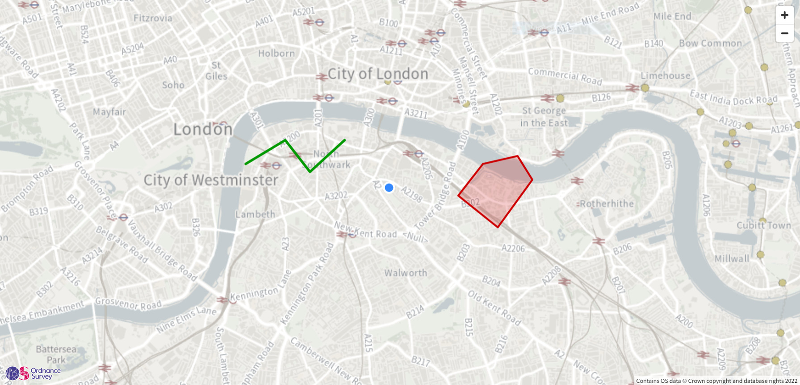
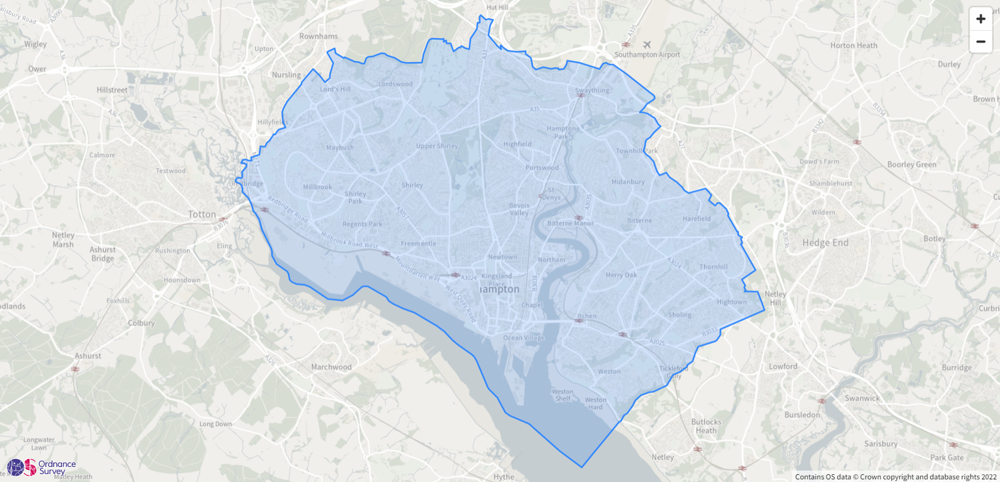
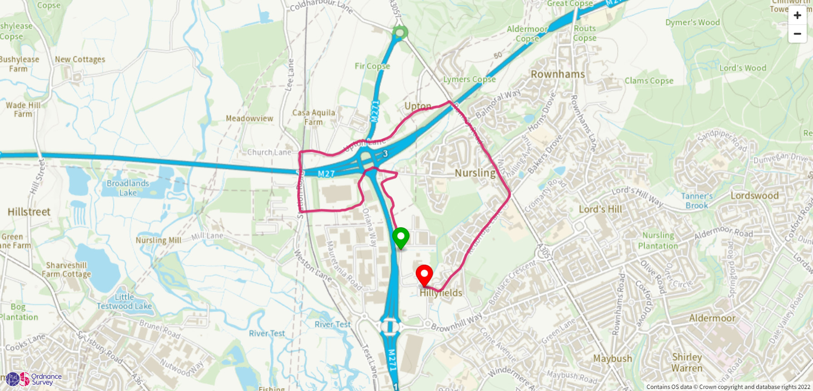

# Quick Start

## Adding overlays

These step-by-step guides will show you how to overlay points, lines and polygons on an OS Maps API backdrop map in various web mapping libraries.

- [MapLibre GL JS](./examples/maplibre-gl-js-adding-overlays.md)
- [Leaflet](./examples/leaflet-adding-overlays.md)
- [OpenLayers](./examples/openlayers-adding-overlays.md)
- [ArcGIS API for JavaScript](./examples/arcgis-javascript-api-adding-overlays.md)

## Adding a GeoJSON file

These step-by-step guides will show you how to overlay a GeoJSON file on an OS Maps API backdrop map in various web mapping libraries.

- [MapLibre GL JS](./examples/maplibre-gl-js-adding-geojson.md)
- [Leaflet](./examples/leaflet-adding-geojson.md)
- [OpenLayers](./examples/openlayers-adding-geojson.md)
- [ArcGIS API for JavaScript](./examples/arcgis-javascript-api-adding-geojson.md)

## Adding a GPX file

These step-by-step guides will show you how to overlay a GPX file on an OS Maps API backdrop map in various web mapping libraries.

- [MapLibre GL JS](./examples/maplibre-gl-js-adding-gpx.md)
- [Leaflet](./examples/leaflet-adding-gpx.md)
- [OpenLayers](./examples/openlayers-adding-gpx.md)
