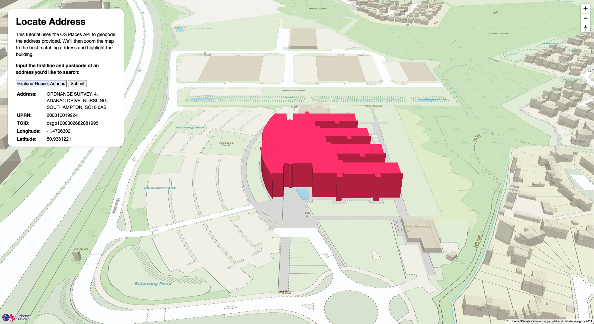

# Locate Address

Many web forms we use online require us to provide an address - for billing or shipping details, routing, to get a ride and so on. It can be quite tricky for developers to create web forms that capture this address accurately. What happens if a road name is misspelled, or in all lowercase? What if there is another road with the same name in a nearby town? Capturing and verifying addresses is a difficult problem to solve. 

The OS Places API is a solution to that problem. With the API, developers get on-demand access to AddressBase Premium, OS's flagship address database. A variety of query options enable devs to match and cleanse addresses based on text, postcode, UPRN and location. 

In this tutorial we let a user type in an address to look up, query the OS Places API, and fly to the location using the Vector Tile API and MapLibre GL JS. We'll describe key code snippets here - to follow along download the directory here, or clone the os-data-hub-tutorials repository. 



## Tools and APIs

We use data from the [OS Places API](https://osdatahub.os.uk/docs/places/overview) and the [OS Vector Tile API](https://osdatahub.os.uk/docs/vts/overview). We also use [MapLibre GL JS](https://github.com/maplibre/maplibre-gl-js), a community-led open source fork of MapLibre GL JS v1.13.

## The HTML and CSS

Overall our HTML document is quite simple. We have a `<div>` element with `id="map"` - this will occupy the entire window and hold our rendered vector tile map. We also have a `<div class="map-overlay">` element, which contains some helper text, our simple form and submit button, and a table where we will visualise the metadata associated with a particular address. 

The CSS sets widths, colors and positions, and styles an animated spinner we'll use as visual feedback while the API request is being processed. 

We also load JavaScript files including an OS branding script and MapLibre GL.

## The JavaScript

In `js/main.js`, we have the code required to: 
1. Instantiate an interactive vector tile basemap with data fetched from the OS Vector Tile API. 
2. Query the OS Places API with a text string - the API will return the closest matching addresses and metadata, in order of relevance. 
3. Animate the camera to fly to the address fetched, and highlight the specific building by TOID. 

Let's look at the code required for each step:

### 1. Instantiate an OS Vector Tile API basemap

Here we copied code from our [OS Code Examples page](https://labs.os.uk/public/os-data-hub-examples/os-vector-tile-api/vts-3857-basic-map). We set `config.apikey` to an OS Data Hub API key copied from a project with the OS Places API added. (Take care to set your project to "Developer Mode" until you push it to production!)

We also set our endpoints.

```javascript
// API Key in config object
var config = {
    apikey: prompt("Please input key", "<KEY HERE>")
};

// Endpoints
const endpoints = {
    places: 'https://api.os.uk/search/places/v1',
    vectorTile: 'https://api.os.uk/maps/vector/v1/vts'
}

```

We then initialise the `map` object with the `maplibregl.Map` constructor, passing in an object literal with our configuration parameters. We'll define the id of the `container` div (`map`, from the HTML), `minZoom` (i.e. how far out the user can zoom), the `style` endpoint with key, the `zoom` and `center` of the viewport and a transformation to apply to the URL, which adds the `srs` so we fetch tiles from the right Spatial Reference System. We also add navigation controls.

```javascript
// Initialise the map object.
var map = new maplibregl.Map({
    container: 'map',
    minZoom: 6,
    // maxZoom: 18,
    style: endpoints.vectorTile + '/resources/styles?key=' + config.apikey,
    center: [-2.968, 54.425],
    zoom: 13,
    transformRequest: url => {
        return {
            url: url + '&srs=3857'
        }
    }
});

// Add navigation control (excluding compass button) to the map.
map.addControl(new maplibregl.NavigationControl());
```

For the last bit of map setup we duplicate the buildings layer. This will let us extrude the footprints based on the `RelHMax`, which represents building height.

We also add a layer highlighted in vivid pink. When we retrieve an address from the OS Places API, the response will have a TOID - we'll use this identifier to filter the highlighted overlay so only the relevant building appears pink. This is possible because the vector building features provided by the Vector Tile API include the TOID.

We have to execute this in response to a `map.on('style.load', function () {...` callback function - otherwise the program will try to duplicate a layer that doesn't exist yet.

```javascript
map.on("style.load", function () {

    // Duplicate 'OS/TopographicArea_1/Building/1' layer to extrude the buildings
    // in 3D using the Building Height Attribute (RelHMax) value.
    map.addLayer({
        "id": "OS/TopographicArea_1/Building/1_3D",
        "type": "fill-extrusion",
        "source": "esri",
        "source-layer": "TopographicArea_1",
        "filter": [
            "==",
            "_symbol",
            33
        ],
        "minzoom": 16,
        "layout": {},
        "paint": {
            "fill-extrusion-color": "#DCD7C6",
            "fill-extrusion-opacity": 0.5,
            "fill-extrusion-height": [
                "interpolate",
                ["linear"],
                ["zoom"],
                16,
                0,
                16.05,
                ["get", "RelHMax"]
            ]
        }
    });

    // Here we add the highlighted layer, with all buildings filtered out. 
    // We'll set the filter to our searched buildings when we actually
    // call the OS Places API and  have a TOID to highlight.
    map.addLayer({
        "id": "OS/TopographicArea_1/Building/1_3D-highlighted",
        "type": "fill-extrusion",
        "source": "esri",
        "source-layer": "TopographicArea_1",
        "filter": ["in", "TOID", ""],
        "minzoom": 16,
        "layout": {},
        "paint": {
            "fill-extrusion-color": "#FF1F5B",
            "fill-extrusion-opacity": 1,
            "fill-extrusion-height": [
                "interpolate",
                ["linear"],
                ["zoom"],
                16,
                0,
                16.05,
                ["get", "RelHMax"]
            ],
        }
    });
});
```

### 2. Querying the OS Places API

Our next step is to write the code we'll need to query the OS Places API when a user inputs an address to look up and clicks "Submit". 

We're going to go through this based on the sequence of events that happens when a user clicks "Submit". Because in JavaScript functions are hoisted, meaning "the variable and function declarations are put into memory during the _compile_ phase" - then the functions are called and the code is executed ([MDN]((https://developer.mozilla.org/en-US/docs/Glossary/Hoisting)). 

#### "Submit" 

We have a form element defined in the HTML - this provides a text box where a user can type an address, and a submit button for them to press. We'll attach a `submit` event listener to the `<form>` element - this means each time "Submit" is pressed and a `submit` event fires, `lookUpAddress` will be called.

```javascript
var form = document.getElementById("the-form");
form.addEventListener('submit', lookUpAddress);
```

So what happens in `lookUpAddress();`? Great question. 
1. We start a spinner in the interface. This is important so users know something is happening in the background, and don't get impatient or worried that the code isn't working. We also clear out any existing data.
2. We grab the text value provided from the `'address-text'` element - i.e. the text input form field.
3. We'll then call `fetchAddressFromPlaces(placesResponse);`, which will call the OS Places API and return the parsed JSON response. 
4. With the result in hand, we'll update the info box, stop the spinner, trigger an animation to fly to the address location, and highlight the building represented in the address as referenced by the Topographic Identifier, or TOID. 

This is a nice way to think of it on an abstract, high level - but we want to go through each of these functions one by one. 

#### `fetchAddressFromPlaces()`

This function accepts the `address` string retrieved from the form input field - with this we construct a URL with `query`, our desired reference system (`output_srs`), a `maxresults` limit of 1 and the API `key` as parameters. 

We then use the JavaScript `fetch` API to send an HTTP request, and parse the response with the `.json()` method. The function simply returns the parsed JSON exactly as received from the API endpoint.

```javascript
async function fetchAddressFromPlaces(address) {

    let url = endpoints.places + `/find?query=${encodeURIComponent(address)}&maxresults=1&output_srs=EPSG:4326&key=${config.apikey}`;

    let res = await fetch(url);
    let json = await res.json()

    return json;
}
```

> NOTE: Here we're simply fetching the first item the OS Places API matches with the query string. In production it might require a bit more user input or other analysis to make sure you actually do have the right address. 
#### Update info box

We'll place values from the retrieved JSON in the information box included in the HTML structure. This is as simple as finding the relevant attributes in the JSON response and setting the `innerText` of the respective HTML elements. 

```javascript
function updateInfoBox(placesResponse) {

    let addressString, UPRN, TOID, longitude, latitude;

    addressString = placesResponse.results[0].DPA.ADDRESS;
    UPRN = placesResponse.results[0].DPA.UPRN;
    TOID = placesResponse.results[0].DPA.TOPOGRAPHY_LAYER_TOID;
    longitude = placesResponse.results[0].DPA.LNG;
    latitude = placesResponse.results[0].DPA.LAT;

    document.getElementById('address').innerText = addressString;
    document.getElementById('uprn').innerText = UPRN;
    document.getElementById('toid').innerText = TOID;
    document.getElementById('longitude').innerHTML = longitude;
    document.getElementById('latitude').innerHTML = latitude;
}
```

#### `flyToCoords(coords)`

Next we want to leverage MapLibre GL's animation capabilities - a powerful feature of vector tile maps. Turns out this is pretty simple - we even added a little `rotateTo` animation so the camera flies around the building when the fly-to finishes: 

```javascript
async function flyToCoords(coords) {

    // @TIM TODO does this need to be set each function call, or just once? 
    map.once('moveend', function () {
        map.rotateTo(0.0, { duration: 7000 });
    });

    map.flyTo({
        center: coords,
        zoom: 17.5,
        pitch: 75,
        bearing: 180
    });
}
```

#### `highlightTOID(toidArray)`

Our last bit of functionality is to visually highlight the 3D building at the address we've looked up. Our response from the OS Places API includes the Topographic Identifier, or TOID, of the building located at the address. TOIDs also are included with each vector feature provided by the Vector Tile API. This means we can easily apply styling to individual features. 

To do this we create another duplicate layer of our 3D buildings, and filter out all the TOIDs besides the one we want to highlight. All other styling parameters are the same, so the highlighted building will behave like the rest of them - it will just be `#FF1F5B` - a vivid pink. 

```javascript
function highlightTOID(toid) {

    let filter = ["in", "TOID", toid];
    map.setFilter("OS/TopographicArea_1/Building/1_3D-highlighted", filter);

}
```

### Conclusion

And that's it! We've built a simple interface with a vector tile map and a form element, queried the OS Places API, and visualised the result on a map. Feel free to adapt this code as you like - one idea is to give users visual validation of their addresses, as it is a best practice to confirm that the right address has been input at the point of capture. 
